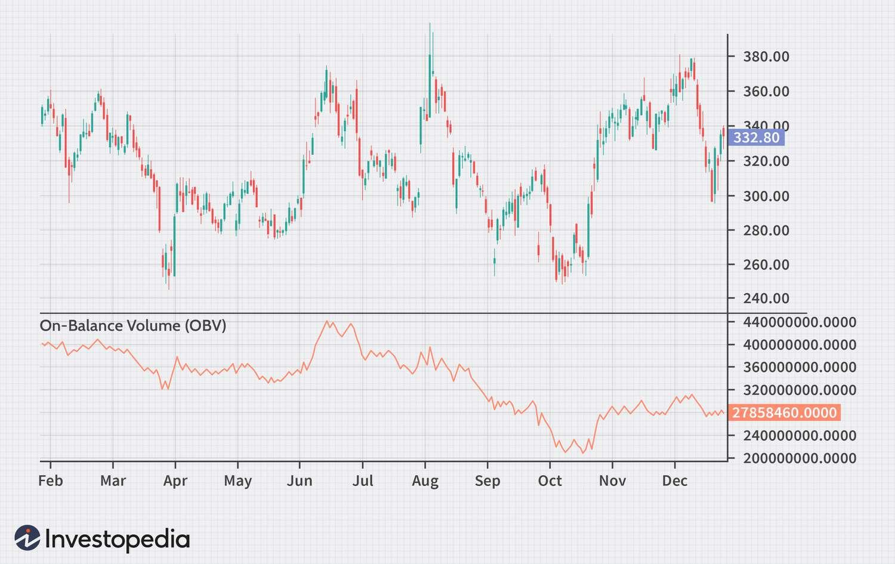

## Table of Contents

## What is the On-Balance Volume (OBV) indicator?

The On-Balance Volume (OBV) indicator is a technical analysis tool used to measure the buying and selling pressure of a security. It does this by adding the volume on days when the price goes up and subtracting the volume on days when the price goes down. The idea behind OBV is that volume precedes price movements, meaning that changes in volume can predict future price changes. If the OBV line is going up, it suggests that the buying pressure is increasing, which could mean the price might go up soon. If the OBV line is going down, it suggests that the selling pressure is increasing, which could mean the price might go down soon.

You can use the OBV indicator to confirm trends or spot potential reversals in the price of a security. For example, if the price of a stock is going up and the OBV is also going up, it confirms that the uptrend is strong. However, if the price is going up but the OBV is going down, it might be a warning sign that the uptrend is weak and could reverse soon. Traders often look for divergences between the OBV and the price to make trading decisions. By understanding the relationship between volume and price, the OBV can be a helpful tool for investors trying to predict future price movements.

## How is the OBV calculated?

The On-Balance Volume (OBV) is calculated by looking at the price and volume of a security each day. If the price of the security goes up from the previous day, you add the volume of that day to the OBV. If the price goes down from the previous day, you subtract the volume of that day from the OBV. If the price stays the same, the OBV doesn't change. You start with an initial OBV value, usually set to zero, and then keep adding or subtracting the volume based on the price changes.

This process continues day after day, creating a running total that reflects the cumulative buying and selling pressure. The OBV line on a chart will move up or down based on these calculations. By tracking these changes, the OBV helps investors see if volume is confirming the price movements or if there might be a divergence that could signal a future price change.

## What does the OBV indicator measure?

The On-Balance Volume (OBV) indicator measures the buying and selling pressure of a security by looking at its volume and price changes. It adds the volume of a day to the OBV if the price goes up from the previous day, and subtracts the volume if the price goes down. If the price stays the same, the OBV doesn't change. This creates a running total that shows how much buying or selling pressure there is over time.

The OBV helps investors understand if the volume is confirming the price movements. If the price is going up and the OBV is also going up, it means the buying pressure is strong, suggesting the price might keep going up. But if the price is going up and the OBV is going down, it could mean the buying pressure is weak, and the price might go down soon. By watching these trends, investors can make better decisions about when to buy or sell a security.

## How can beginners use the OBV to make trading decisions?

Beginners can use the On-Balance Volume (OBV) to make trading decisions by watching how the OBV line moves along with the price of a security. If the price is going up and the OBV is also going up, it's a good sign that the buying pressure is strong. This means the price might keep going up, so it could be a good time to buy. But if the price is going up and the OBV is going down, it's a warning sign that the buying pressure might not be strong enough. This could mean the price might go down soon, so it might be better to wait before buying or even think about selling.

Another way beginners can use the OBV is to spot when the OBV line and the price are moving in opposite directions, which is called a divergence. If the price is going up but the OBV is going down, it might mean the price could go down soon. On the other hand, if the price is going down but the OBV is going up, it might mean the price could start going up soon. By keeping an eye on these divergences, beginners can get a better idea of when to buy or sell a security. Remember, it's always good to use the OBV along with other tools and not rely on it alone when making trading decisions.

## What are the key signals provided by the OBV indicator?

The OBV indicator helps traders see if the buying or selling pressure of a security is strong. When the price goes up and the OBV also goes up, it means there is strong buying pressure. This can be a signal to buy the security because the price might keep going up. On the other hand, if the price goes up but the OBV goes down, it means the buying pressure is weak. This could be a signal to wait before buying or even think about selling, because the price might go down soon.

Another important signal from the OBV is when it moves in the opposite direction of the price, which is called a divergence. If the price is going up but the OBV is going down, it could mean the price might start going down soon. This is a warning sign for traders to be careful. If the price is going down but the OBV is going up, it could mean the price might start going up soon. This could be a signal to get ready to buy. By watching these signals, beginners can make better trading decisions.

## How does the OBV indicator relate to price movements?

The On-Balance Volume (OBV) indicator helps traders understand how volume relates to price movements. It adds the day's volume to the OBV when the price goes up, and subtracts it when the price goes down. If the price stays the same, the OBV doesn't change. This way, the OBV creates a line that shows whether buying or selling pressure is increasing over time. When the OBV line goes up, it means more people are buying the security, which might make the price go up. When the OBV line goes down, it means more people are selling, which might make the price go down.

The OBV can also show something called a divergence, which happens when the OBV and the price move in opposite directions. If the price is going up but the OBV is going down, it could be a warning that the price might start going down soon. This is because even though the price is going up, the buying pressure is getting weaker. On the other hand, if the price is going down but the OBV is going up, it might mean the price could start going up soon because the buying pressure is getting stronger. By watching these signals, traders can make better decisions about when to buy or sell a security.

## Can the OBV be used to predict market trends?

The OBV can help predict market trends by showing how strong the buying and selling pressure is for a security. If the OBV line goes up along with the price, it means more people are buying, which might make the price keep going up. This can be a sign that the market trend might continue to go up. On the other hand, if the OBV line goes down while the price goes up, it means the buying pressure is weak. This could be a warning sign that the price might start going down soon, suggesting a possible change in the market trend.

Another way the OBV can help predict market trends is by showing divergences between the OBV line and the price. If the price is going up but the OBV is going down, it might mean the price could start going down soon. This is because even though the price is going up, the buying pressure is getting weaker. If the price is going down but the OBV is going up, it might mean the price could start going up soon because the buying pressure is getting stronger. By watching these signals, traders can get a better idea of where the market might be headed next.

## What are the limitations of using the OBV indicator?

Using the OBV indicator has some limitations. One big problem is that it can give false signals. For example, if the price goes up and down a lot in a short time, the OBV might go up or down too, but this might not mean anything important for the long-term trend. Also, the OBV doesn't work well for securities that don't have a lot of trading volume. If there's not much volume, small changes in the price can make the OBV move a lot, but these moves might not mean much for the price in the future.

Another limitation is that the OBV doesn't tell you everything about the market. It only looks at volume and price changes, so it misses other important things like news, economic reports, or what other people think about the security. Because of this, it's best to use the OBV with other tools and not just by itself. By combining the OBV with other indicators and information, you can get a better idea of what might happen with the price.

## How can the OBV be combined with other technical indicators for better analysis?

The OBV can be combined with other technical indicators to get a better picture of what might happen with the price of a security. One way to do this is by using the OBV with a moving average. A moving average smooths out the price data over time, which can help you see the overall trend more clearly. If the OBV is going up and it crosses above a moving average, it can be a strong sign that the buying pressure is increasing and the price might go up soon. On the other hand, if the OBV goes down and crosses below a moving average, it might mean the selling pressure is getting stronger and the price could go down.

Another way to use the OBV with other indicators is by looking at it along with the Relative Strength Index (RSI). The RSI measures how fast the price is going up or down and can tell you if a security is overbought or oversold. If the OBV is going up and the RSI is also going up but not yet in the overbought area, it could mean the price might keep going up. But if the OBV is going up and the RSI is already in the overbought area, it might be a warning sign that the price could go down soon. By using the OBV with the RSI, you can get a better idea of whether the current trend is likely to continue or if it might change direction.

## What are some common mistakes traders make when using the OBV?

One common mistake traders make when using the OBV is relying on it too much. The OBV is just one tool, and it doesn't tell you everything about the market. It only looks at volume and price changes, so it misses other important things like news or what other people think about the security. Traders sometimes forget this and make decisions based only on the OBV, which can lead to bad trades. It's better to use the OBV along with other tools and information to get a fuller picture of what might happen with the price.

Another mistake is not understanding that the OBV can give false signals, especially in a market that moves a lot in a short time. If the price goes up and down quickly, the OBV might also move a lot, but these moves might not mean anything important for the long-term trend. Traders might see these moves and think they should buy or sell, but then the price doesn't go the way they expected. It's important to know that the OBV works best when you look at it over a longer time and use it with other indicators to confirm what it's showing.

## How does the OBV perform in different market conditions?

The OBV can work well in different market conditions, but it might be more useful in some than others. In a strong uptrend, the OBV can help confirm that the buying pressure is strong. If the price is going up and the OBV is also going up, it's a good sign that the price might keep going up. This can be helpful for traders who want to buy into a trend that looks like it will continue. In a strong downtrend, the OBV can also help confirm that the selling pressure is strong. If the price is going down and the OBV is also going down, it's a good sign that the price might keep going down. This can help traders decide when to sell or stay out of the market.

In a sideways market, where the price isn't going up or down much, the OBV might not be as helpful. It can move a lot without the price moving much, which can lead to false signals. Traders might see the OBV going up or down and think the price will follow, but in a sideways market, the price might stay the same. In choppy markets, where the price goes up and down a lot in a short time, the OBV can also give false signals. It's important for traders to understand these different market conditions and use the OBV with other tools to make better decisions.

## What advanced techniques can experts use to refine OBV analysis?

Experts can refine OBV analysis by using it with other indicators to get a clearer picture of the market. One way to do this is by using the OBV with a moving average. A moving average helps smooth out the price data over time, making it easier to see the overall trend. If the OBV goes above a moving average, it can be a strong sign that buying pressure is increasing and the price might go up soon. If the OBV goes below a moving average, it might mean selling pressure is getting stronger and the price could go down. By combining the OBV with a moving average, experts can confirm the signals the OBV is giving and make better trading decisions.

Another advanced technique is to look for divergences between the OBV and other indicators like the Relative Strength Index (RSI). The RSI measures how fast the price is going up or down and can tell you if a security is overbought or oversold. If the OBV is going up and the RSI is also going up but not yet overbought, it could mean the price might keep going up. But if the OBV is going up and the RSI is already overbought, it might be a warning sign that the price could go down soon. By watching these divergences, experts can get a better idea of whether the current trend is likely to continue or if it might change direction, helping them make more informed trading choices.

## What is On-Balance Volume (OBV) and how does it work?

On-Balance Volume (OBV) integrates both volume and price data to capture market momentum. It serves as a cumulative indicator that reflects the collective buying and selling pressure, which helps in predicting subsequent price movements. The core principle behind OBV is straightforward: volume often precedes price changes. When significant volume is associated with price movements, it can indicate the strength or weakness of a trend.

The calculation of OBV is cumulative. When the closing price of a security is higher than the previous day's closing price, the entire day's volume is considered positive and added to the OBV. Conversely, if the closing price is lower, the volume is deemed negative and subtracted from the OBV. Hence, the OBV can be expressed through the formula:

$$
\text{OBV}_{\text{today}} = \begin{cases} 
\text{OBV}_{\text{yesterday}} + \text{Volume}_{\text{today}}, & \text{if } \text{Close}_{\text{today}} > \text{Close}_{\text{yesterday}} \\
\text{OBV}_{\text{yesterday}} - \text{Volume}_{\text{today}}, & \text{if } \text{Close}_{\text{today}} < \text{Close}_{\text{yesterday}} \\
\text{OBV}_{\text{yesterday}}, & \text{if } \text{Close}_{\text{today}} = \text{Close}_{\text{yesterday}}
\end{cases}
$$

OBV is particularly useful in confirming existing trends and anticipating potential reversals in the market. A rising OBV suggests an accumulation phase, indicating that [volume](/wiki/volume-trading-strategy) is increasing on upward price movements, generally seen as a bullish signal. Conversely, a declining OBV signals a distribution phase, where volume is swelling during downward price movements, often viewed as a bearish indicator. By tracking these phases, traders can gain valuable insights into the underlying market dynamics and the emotions driving them, which can provide an edge in making more accurate predictions and informed trading decisions.

## What is the Formula and Calculation of OBV?

On-Balance Volume (OBV) is a [momentum](/wiki/momentum) indicator that relies on trading volume to forecast price movements. The calculation of OBV involves taking into account the trading volume on days when the stock price increases and decreases. The underlying principle is straightforward: volume is added to the cumulative OBV on days when the closing price is higher than the previous day's close (an up day), and subtracted on days when the closing price is lower (a down day). This cumulative calculation is represented mathematically as follows:

1. If the closing price today is higher than yesterday's close:
$$
   \text{OBV}_{\text{today}} = \text{OBV}_{\text{yesterday}} + \text{Volume}_{\text{today}}

$$

2. If the closing price today is lower than yesterday's close:
$$
   \text{OBV}_{\text{today}} = \text{OBV}_{\text{yesterday}} - \text{Volume}_{\text{today}}

$$

3. If today's closing price is equal to yesterday's close:
$$
   \text{OBV}_{\text{today}} = \text{OBV}_{\text{yesterday}}

$$

Despite its simplicity, OBV offers significant insights into the market's underlying trend by highlighting the relationship between price movements and volume. Large discrepancies between OBV and price trend can signal potential shifts in market sentiment or reversals, offering traders critical information for decision-making processes.

This formula can be efficiently computed programmatically, with Python being a popular choice due to its extensive libraries for data analysis. Here is a straightforward implementation of OBV in Python:

```python
def calculate_obv(prices, volumes):
    obv = [0]
    for i in range(1, len(prices)):
        if prices[i] > prices[i-1]:
            obv.append(obv[-1] + volumes[i])
        elif prices[i] < prices[i-1]:
            obv.append(obv[-1] - volumes[i])
        else:
            obv.append(obv[-1])
    return obv
```

This code takes lists of daily closing prices and corresponding trading volumes as inputs to calculate the OBV for each day. By applying this calculation, traders can leverage OBV to interpret market trends and potentially enhance their trading strategies.

## References & Further Reading

[1]: Granville, J. (1963). ["Granville's New Key to Stock Market Profits."](https://archive.org/details/newkeytostockmar0000gran)

[2]: Murphy, J.J. (1999). ["Technical Analysis of the Financial Markets: A Comprehensive Guide to Trading Methods and Applications."](https://archive.org/details/technicalanalysi0000murp)

[3]: Achelis, S. B. (2001). ["Technical Analysis from A to Z."](https://archive.org/details/technicalanalysi00ache)

[4]: Schwager, J.D. (1995). ["Getting Started in Technical Analysis."](https://archive.org/details/gettingstartedin00schw)

[5]: Elder, A. (1993). ["Trading for a Living: Psychology, Trading Tactics, Money Management."](https://www.amazon.com/Trading-Living-Psychology-Tactics-Management/dp/0471592242)