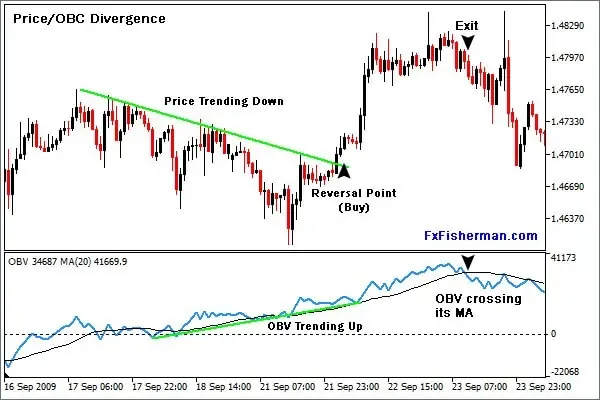

On-Balance Volume (OBV) is a widely recognized momentum indicator in the field of technical analysis. Its primary function is to use volume flow to predict changes in stock prices. This indicator was developed by Joseph Granville in the 1960s and has since evolved into a key tool for traders seeking to capture the dynamics of market trends.

OBV operates on a straightforward principle: volume precedes price movement. By closely monitoring the flow of trading volume, OBV provides insights into whether price levels are likely to continue in their current direction or reverse. This relationship between volume and price allows traders to identify the strength of trends, aiding in decisions about buying and selling.



The focus of this discussion is to dissect the fundamental aspects of OBV, exploring its calculation and deployment in algorithmic trading environments. Moreover, an examination of how OBV can be leveraged to augment trading strategies reveals its potential impact. Challenges associated with OBV are intrinsic, especially when interpreting signals in various market conditions. Understanding these challenges is essential for traders to make well-informed decisions.

This article will provide a comprehensive overview of OBV, shedding light on its integral role in understanding momentum and trend dynamics in trading, while also outlining its limitations and potential areas for strategic application.

## Table of Contents

## Understanding On-Balance Volume (OBV)

On-Balance Volume (OBV) integrates both volume and price data to capture market momentum. It serves as a cumulative indicator that reflects the collective buying and selling pressure, which helps in predicting subsequent price movements. The core principle behind OBV is straightforward: volume often precedes price changes. When significant volume is associated with price movements, it can indicate the strength or weakness of a trend.

The calculation of OBV is cumulative. When the closing price of a security is higher than the previous day's closing price, the entire day's volume is considered positive and added to the OBV. Conversely, if the closing price is lower, the volume is deemed negative and subtracted from the OBV. Hence, the OBV can be expressed through the formula:

$$
\text{OBV}_{\text{today}} = \begin{cases} 
\text{OBV}_{\text{yesterday}} + \text{Volume}_{\text{today}}, & \text{if } \text{Close}_{\text{today}} > \text{Close}_{\text{yesterday}} \\
\text{OBV}_{\text{yesterday}} - \text{Volume}_{\text{today}}, & \text{if } \text{Close}_{\text{today}} < \text{Close}_{\text{yesterday}} \\
\text{OBV}_{\text{yesterday}}, & \text{if } \text{Close}_{\text{today}} = \text{Close}_{\text{yesterday}}
\end{cases}
$$

OBV is particularly useful in confirming existing trends and anticipating potential reversals in the market. A rising OBV suggests an accumulation phase, indicating that [volume](/wiki/volume-trading-strategy) is increasing on upward price movements, generally seen as a bullish signal. Conversely, a declining OBV signals a distribution phase, where volume is swelling during downward price movements, often viewed as a bearish indicator. By tracking these phases, traders can gain valuable insights into the underlying market dynamics and the emotions driving them, which can provide an edge in making more accurate predictions and informed trading decisions.

## Formula and Calculation of OBV

On-Balance Volume (OBV) is a [momentum](/wiki/momentum) indicator that relies on trading volume to forecast price movements. The calculation of OBV involves taking into account the trading volume on days when the stock price increases and decreases. The underlying principle is straightforward: volume is added to the cumulative OBV on days when the closing price is higher than the previous day's close (an up day), and subtracted on days when the closing price is lower (a down day). This cumulative calculation is represented mathematically as follows:

1. If the closing price today is higher than yesterday's close:
$$
   \text{OBV}_{\text{today}} = \text{OBV}_{\text{yesterday}} + \text{Volume}_{\text{today}}

$$

2. If the closing price today is lower than yesterday's close:
$$
   \text{OBV}_{\text{today}} = \text{OBV}_{\text{yesterday}} - \text{Volume}_{\text{today}}

$$

3. If today's closing price is equal to yesterday's close:
$$
   \text{OBV}_{\text{today}} = \text{OBV}_{\text{yesterday}}

$$

Despite its simplicity, OBV offers significant insights into the market's underlying trend by highlighting the relationship between price movements and volume. Large discrepancies between OBV and price trend can signal potential shifts in market sentiment or reversals, offering traders critical information for decision-making processes.

This formula can be efficiently computed programmatically, with Python being a popular choice due to its extensive libraries for data analysis. Here is a straightforward implementation of OBV in Python:

```python
def calculate_obv(prices, volumes):
    obv = [0]
    for i in range(1, len(prices)):
        if prices[i] > prices[i-1]:
            obv.append(obv[-1] + volumes[i])
        elif prices[i] < prices[i-1]:
            obv.append(obv[-1] - volumes[i])
        else:
            obv.append(obv[-1])
    return obv
```

This code takes lists of daily closing prices and corresponding trading volumes as inputs to calculate the OBV for each day. By applying this calculation, traders can leverage OBV to interpret market trends and potentially enhance their trading strategies.

## Application in Algorithmic Trading

On-Balance Volume (OBV) is a pivotal tool in [algorithmic trading](/wiki/algorithmic-trading) for identifying trends driven by volume changes. Its integration in trading algorithms allows for systematic tracking of volume alongside price movements to discern actionable insights. The mechanism behind OBV enables traders to automate the recognition of accumulation and distribution phases, thus refining market entry and [exit](/wiki/exit-strategy) points.

In algorithmic trading, OBV's primary role is to quantify buying and selling pressure in a market. By evaluating the cumulative volume aligned with price changes, OBV verifies bullish or bearish trends. A key aspect is programming algorithms to automatically calculate OBV by summing the volumes of up days and subtracting the volumes of down days. Essentially, if the closing price is above the previous day, the volume is added to the OBV, whereas if it is below, the volume is subtracted.

The use of OBV facilitates the construction of algorithms capable of responding to volume-driven signals in real-time. These algorithms can track OBV trends to determine if the market sentiment aligns with current price movements or if a divergence is present. Divergences occur when the price is rising while OBV is falling, or vice versa, signaling potential reversals. Incorporating OBV in trading strategies can enhance the decision-making process by providing a quantitative basis for identifying when to enter or exit trades.

By employing OBV, algorithmic systems can be developed to recognize patterns that may not be immediately apparent from price data alone. The detailed trend analysis afforded by OBV allows for more refined market positioning. For instance, an algorithm might be programmed to go long if the OBV supports a bullish trend verified by additional metrics like moving averages or other technical indicators.

Here is a basic Python example illustrating how OBV can be calculated and used in an algorithmic strategy:

```python
import pandas as pd

def calculate_obv(data):
    obv = [0]
    for i in range(1, len(data)):
        if data['Close'][i] > data['Close'][i-1]:
            obv.append(obv[-1] + data['Volume'][i])
        elif data['Close'][i] < data['Close'][i-1]:
            obv.append(obv[-1] - data['Volume'][i])
        else:
            obv.append(obv[-1])  # unchanged if close price is constant
    data['OBV'] = obv
    return data

# Example usage
data = pd.DataFrame({
    'Close': [...],  # Insert list of closing prices
    'Volume': [...]  # Insert corresponding list of volumes
})

obv_data = calculate_obv(data)
```

Through integrating OBV into algorithmic frameworks, traders are empowered to implement strategies that capitalize on volume-driven market trends, enhancing the efficacy of trading decisions.

## Backtesting OBV

Backtesting On-Balance Volume (OBV) is an essential process for evaluating its effectiveness in predicting price movements through historical data analysis. This evaluation helps traders understand how well OBV has worked in the past, thereby informing its potential utility in future trading strategies. The fundamental idea is to apply the OBV indicator to historical data to analyze how accurately it predicted market trends and reversals, which are critical for effective trading strategies.

To backtest OBV, the indicator is primarily paired with other technical indicators like the Relative Strength Index (RSI) to enhance the accuracy of trading signals. The combination of OBV with RSI can help confirm trends and identify oversold or overbought conditions, thus making buy or sell signals more reliable. This multi-indicator strategy diminishes the probability of false signals, which can often occur if OBV is used in isolation, especially in markets characterized by consolidation or low volumes.

For instance, a Python script could be implemented to [carry](/wiki/carry-trading) out historical data analysis using OBV and RSI. Here's a simplified code snippet demonstrating a backtest process:

```python
import pandas as pd

def calculate_obv(data):
    obv = [0]
    for i in range(1, len(data)):
        if data['Close'][i] > data['Close'][i - 1]:
            obv.append(obv[-1] + data['Volume'][i])
        elif data['Close'][i] < data['Close'][i - 1]:
            obv.append(obv[-1] - data['Volume'][i])
        else:
            obv.append(obv[-1])
    return obv

def calculate_rsi(data, period=14):
    delta = data['Close'].diff(1)
    gain = delta.where(delta > 0, 0)
    loss = -delta.where(delta < 0, 0)
    average_gain = gain.rolling(window=period).mean()
    average_loss = loss.rolling(window=period).mean()
    rs = average_gain / average_loss
    rsi = 100 - (100 / (1 + rs))
    return rsi

# Example: assuming `data` is a DataFrame with the historical data
data['OBV'] = calculate_obv(data)
data['RSI'] = calculate_rsi(data)

# Adding trading logic and evaluating performance would follow here
```

This script begins by calculating the OBV based on price movements and volumes. Then it computes the RSI to identify overbought or oversold market conditions. These indicators can then be used to develop a comprehensive trading strategy, which is continually refined based on the [backtesting](/wiki/backtesting) results.

Backtesting OBV is not a one-time task. Continuous optimization of trading strategies using OBV, particularly in conjunction with other indicators, is necessary due to the dynamic nature of financial markets. This ongoing refinement is crucial for adapting to varying market conditions and ensuring that trading strategies remain effective over time. By optimizing the indicators' parameters and evaluating their performance against historical data, traders increase the robustness and reliability of their strategies, thereby maximizing the potential for profitable outcomes.

## Effective Trading Strategies Using OBV

On-Balance Volume (OBV) is a widely-used tool in evaluating and formulating effective trading strategies due to its ability to gauge market momentum through volume and price dynamics. When combined with other technical indicators, OBV enhances the accuracy of identifying trends and potential market reversals.

OBV often complements moving averages and the Moving Average Convergence Divergence (MACD) indicator to validate ongoing trends. By examining the cumulative volume in relation to moving averages, traders can corroborate whether the observed price movement aligns with the underlying volume trend. For instance, when OBV is rising alongside an upward-trending moving average, it suggests a strong bullish trend bolstered by substantial buying pressure.

Divergence between OBV and price is another critical component in assessing potential market reversals. Divergence occurs when the price trend contradicts the OBV trend, signaling a possible change in direction. For example, if the security's price is hitting new highs, but OBV fails to do so, this bearish divergence might indicate weakening upward momentum and the potential for a price reversal.

To further refine market sentiment analysis, OBV is often used in conjunction with the Relative Strength Index (RSI). By integrating OBV with RSI, traders can discern whether bullish or bearish signals are supported by volume trends. A bullish signal is reinforced when both RSI indicates oversold conditions and OBV demonstrates accumulation. Conversely, a bearish market sentiment is confirmed when RSI is overbought while OBV shows signs of distribution.

This synergy of OBV with various technical indicators allows traders to construct more robust trading strategies. By validating trends, identifying divergences, and confirming market sentiment, traders can increase the fidelity of their market predictions, ultimately leading to more informed trading decisions.

## Challenges and Limitations of OBV

On-Balance Volume (OBV) is a widely utilized momentum indicator, yet it is not without its challenges and limitations. One of the primary issues with OBV is its susceptibility to producing false signals, particularly during periods of market consolidation or when trading volumes are low. In these situations, OBV might indicate a potential trend or reversal that does not materialize, leading traders to make misguided decisions. This is because OBV relies heavily on volume changes to predict price movements, and when these changes are minimal or erratic, the reliability of the OBV signal diminishes.

To address these limitations, OBV is most effective when used in conjunction with other analytical methods. By pairing OBV with complementary indicators, traders can validate the signals and reduce the likelihood of acting on false information. For example, integrating OBV with indicators such as the Relative Strength Index (RSI) or Moving Average Convergence Divergence (MACD) can provide a more comprehensive view of market trends. This multi-faceted approach helps in distinguishing between genuine signal and market noise, particularly in volatile or consolidating conditions.

Moreover, understanding the limitations of OBV is crucial for traders aiming to balance predictions with informed decisions. It requires acknowledging the indicator's inherent weaknesses and strategically combining it with other tools to bolster decision-making processes. By doing so, traders can enhance the accuracy of their market predictions and avoid potential pitfalls associated with relying solely on OBV. A nuanced approach that recognizes these limitations can lead to more robust trading strategies and improved outcomes.

## Conclusion

On-Balance Volume (OBV) stands as a fundamental component in the toolbox of traders seeking to anticipate market trends and identify potential reversals. The utility of OBV lies in its ability to translate the flow of volume data into actionable insights about the future direction of stock prices. By combining OBV with other technical indicators, such as moving averages or the Relative Strength Index (RSI), traders can significantly enhance the reliability and accuracy of their trading strategies. This integration facilitates a more comprehensive view of market dynamics, allowing for a balanced and informed approach to trading.

The predictive power of OBV emerges most prominently when it is corroborated with supplemental indicators that confirm price movements or highlight divergences. For example, when OBV diverges from the price trend, it may signal an upcoming reversal, serving as an early warning that the current trend might be losing strength. By capturing changes in buying and selling pressure before they manifest in price, OBV provides traders with a critical edge in timing market entries and exits.

Nevertheless, the effectiveness of OBV is maximized when traders remain cognizant of its limitations and contextualize its signals within broader market analysis frameworks. Factors such as market consolidation or varying volume levels can occasionally yield misleading signals, emphasizing the importance of using OBV in conjunction with a diverse array of analytical tools.

Incorporating OBV into trading analyses is indispensable for traders aiming to maximize prediction accuracy. As markets continue to evolve, leveraging this classic indicator can contribute to a more robust strategy, enabling traders to navigate the complexities of market trends with enhanced precision and confidence.

## FAQs

### FAQs

**Why is volume an essential component in technical analysis?**

Volume serves as a critical component in technical analysis because it provides insight into the strength and significance of price movements. High trading volumes often indicate robust interest and investor conviction behind a trend, either confirming or questioning its validity. Essentially, volume acts as a measure of enthusiasm or lack thereof in a market move, making it pivotal in assessing whether price trends are likely to continue.

**How can OBV complement other indicators in trading strategies?**

On-Balance Volume (OBV) can significantly enhance trading strategies when used alongside other technical indicators. By integrating OBV with Moving Averages or the Moving Average Convergence Divergence (MACD), traders can validate trends more reliably. For example, if both OBV and a moving average trend upwards, it signals a strong bullish sentiment. Similarly, a downward OBV trend combined with a bearish MACD crossover can indicate potential downward movements, providing a more robust analysis by cross-verifying signals from different indicators.

**What implications arise from OBV divergence with price movement?**

OBV divergence from price movement is a powerful signal of potential trend reversals. Such divergence occurs when the direction of OBV contradicts the direction of price movement. For instance, if OBV is rising while the price is falling, it suggests that buying pressure is increasing, potentially indicating an upcoming bullish reversal. Conversely, a declining OBV coupled with rising prices may warn of weakening buying pressure and an impending bearish reversal. Identifying these divergences allows traders to anticipate changes and adjust their strategies accordingly.

## References & Further Reading

[1]: Granville, J. (1963). ["Granville's New Key to Stock Market Profits."](https://archive.org/details/newkeytostockmar0000gran)

[2]: Murphy, J.J. (1999). ["Technical Analysis of the Financial Markets: A Comprehensive Guide to Trading Methods and Applications."](https://archive.org/details/technicalanalysi0000murp)

[3]: Achelis, S. B. (2001). ["Technical Analysis from A to Z."](https://archive.org/details/technicalanalysi00ache)

[4]: Schwager, J.D. (1995). ["Getting Started in Technical Analysis."](https://archive.org/details/gettingstartedin00schw)

[5]: Elder, A. (1993). ["Trading for a Living: Psychology, Trading Tactics, Money Management."](https://www.amazon.com/Trading-Living-Psychology-Tactics-Management/dp/0471592242)