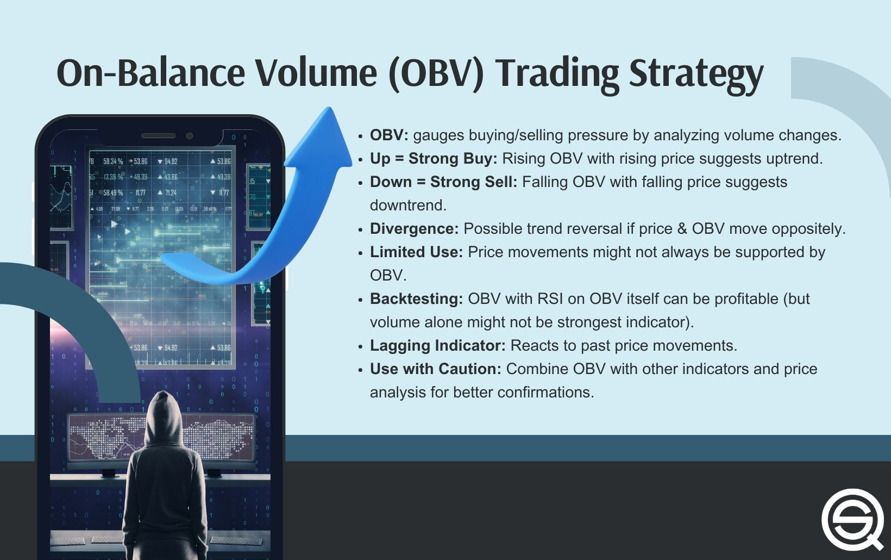

## Table of Contents

## What is On-Balance Volume (OBV) and how is it calculated?

On-Balance Volume (OBV) is a technical analysis tool used to measure the flow of volume in and out of a security. It helps traders and investors understand the strength of a price trend by comparing the volume on up days to the volume on down days. The basic idea behind OBV is that volume precedes price movement, so if a security is seeing more volume on days when the price goes up, it might continue to go up.

To calculate OBV, you start with an initial value, usually zero. Then, for each trading day, you look at the closing price compared to the previous day's closing price. If the current closing price is higher than the previous day's closing price, you add the day's volume to the OBV. If the current closing price is lower, you subtract the day's volume from the OBV. If the closing prices are the same, the OBV remains unchanged. Over time, this running total of volume helps show whether money is flowing into or out of a security.

## How can OBV be used to confirm price trends in the stock market?

OBV helps confirm price trends by showing if volume is supporting the price movement. If a stock's price is going up and the OBV is also going up, it means more people are buying the stock, which supports the idea that the price trend is strong. On the other hand, if the price is going up but the OBV is going down, it might mean the price increase is not supported by strong buying, and the trend could be weak.

Traders often use OBV to spot divergences between the price and the volume. For example, if a stock's price is making new highs but the OBV is not, this could be a warning sign that the price might soon fall. Similarly, if the price is making new lows but the OBV is not, it might suggest the price could start to rise soon. By watching these signals, traders can make better decisions about when to buy or sell a stock.

## What are the basic principles of using OBV for market strategy analysis?

Using On-Balance Volume (OBV) for market strategy analysis involves understanding how volume supports price trends. The main idea is to look at the OBV line and see if it moves in the same direction as the price. If the price of a stock goes up and the OBV also goes up, it means that more people are buying the stock, which supports the price increase. This can give traders confidence that the upward trend is strong and likely to continue. On the other hand, if the price goes up but the OBV goes down, it might mean the price increase is not supported by strong buying, and the trend might be weak.

Another key principle is to watch for divergences between the price and the OBV. A divergence happens when the price moves one way but the OBV moves the opposite way. For example, if the price of a stock keeps making new highs but the OBV does not, it could be a warning sign that the price might soon fall. This is because the volume is not supporting the price increase. Similarly, if the price is making new lows but the OBV is not, it might suggest that the price could start to rise soon. By paying attention to these signals, traders can make better decisions about when to buy or sell a stock.

## Can you explain the significance of divergences between OBV and price?

Divergences between OBV and price are important because they can show when a price trend might be weak or about to change. If a stock's price keeps going up but the OBV is not going up too, it means that not many people are buying the stock even though the price is rising. This is called a bearish divergence. It can be a warning sign that the price might soon go down because the upward trend is not supported by strong buying.

On the other hand, if a stock's price keeps going down but the OBV is not going down too, it's called a bullish divergence. This means that even though the price is falling, people are still buying the stock. It can be a sign that the price might soon start to go up again because there is still interest in the stock. By watching these divergences, traders can get clues about when to buy or sell a stock.

## How does OBV help in identifying potential reversals in market trends?

OBV helps in spotting when a market trend might change by looking at the volume. If the price of a stock keeps going up but the OBV is not going up with it, it means not many people are buying the stock even though the price is rising. This is called a bearish divergence. It's a warning sign that the price might soon start to go down because the upward trend is not strong.

On the other hand, if the price of a stock keeps going down but the OBV is not going down with it, it's called a bullish divergence. This means that even though the price is falling, people are still buying the stock. It's a sign that the price might soon start to go up again because there is still interest in the stock. By watching these signs, traders can guess when a trend might reverse and make better choices about buying or selling.

## What are some common pitfalls to avoid when using OBV for market analysis?

One common pitfall when using OBV for market analysis is relying on it too much by itself. OBV is just one tool and it's best to use it with other indicators and analysis methods. If you only look at OBV, you might miss important information from other parts of the market. For example, you should also look at the price chart, other technical indicators, and even news about the company or the economy.

Another mistake is not understanding that OBV can give false signals sometimes. Just because you see a divergence between the price and OBV doesn't always mean the price will reverse right away. Sometimes, the price can keep going in the same direction even if the OBV suggests a change might happen. It's important to be patient and look for more signs before making a decision based on OBV alone.

## How can OBV be integrated with other technical indicators to enhance market strategy?

OBV can be used with other technical indicators to make better market strategies. For example, you can use OBV with moving averages. If the OBV line crosses above a moving average, it might be a good time to buy because it shows that volume is supporting an upward trend. On the other hand, if the OBV line crosses below a moving average, it might be a good time to sell because it shows that volume is supporting a downward trend. By looking at OBV and moving averages together, you can get a clearer picture of when to buy or sell.

Another way to use OBV is with the Relative Strength Index (RSI). RSI measures how fast a stock's price is changing and if it's overbought or oversold. If you see a bullish divergence on the OBV and the RSI is also showing that the stock is oversold, it might be a strong signal to buy. On the flip side, if you see a bearish divergence on the OBV and the RSI is showing that the stock is overbought, it might be a strong signal to sell. Using OBV with RSI helps you see both the volume and the momentum of the stock, which can lead to better trading decisions.

## What are advanced techniques for interpreting OBV signals in different market conditions?

In different market conditions, OBV can be interpreted in advanced ways to get better insights. In a strong bull market, where prices are going up a lot, it's important to watch if the OBV keeps making new highs along with the price. If it does, it means the trend is strong and likely to keep going up. But if the OBV starts to flatten out or go down while the price is still going up, it might be a sign that the bull market is getting tired and could soon change direction. In this case, traders might want to be careful and think about taking some profits before the market turns.

In a bear market, where prices are going down a lot, OBV can help find when the market might start to go up again. If the price keeps making new lows but the OBV is not going down as much, it's a bullish divergence. This means that even though the price is falling, people are still buying, which could be a sign that the market is about to turn around. Traders can use this signal to start buying stocks at lower prices before the market goes up. By looking at OBV in both bull and bear markets, traders can make better guesses about when to buy or sell.

## How can OBV be used to assess the strength of a breakout or breakdown in stock prices?

OBV can help traders figure out if a breakout or breakdown in stock prices is strong or not. When a stock's price breaks out to a new high, traders look at the OBV to see if the volume is supporting the move. If the OBV also goes up and makes a new high with the price, it means more people are buying the stock, which makes the breakout strong. But if the price goes up to a new high and the OBV doesn't follow, it might mean the breakout is weak because not many people are buying. This can be a warning sign that the price might not keep going up.

In the case of a breakdown, where the stock's price drops to a new low, OBV can also show if the move is strong. If the OBV goes down with the price and makes a new low too, it means more people are selling the stock, which makes the breakdown strong. But if the price goes down to a new low and the OBV doesn't go down as much, it might mean the breakdown is weak because not many people are selling. This can be a sign that the price might not keep going down and could start to go back up soon. By looking at OBV, traders can better understand if a breakout or breakdown is likely to last.

## What role does OBV play in developing a comprehensive trading strategy?

OBV can be a big help when you're making a full trading plan. It's like a tool that shows you if people are really buying or selling a stock. When you see the price of a stock going up and the OBV going up too, it means the price increase is strong because more people are buying. This can give you confidence to buy the stock too. But if the price goes up and the OBV goes down, it might mean the price increase is weak, and you might want to wait before buying.

OBV also helps you spot when a stock's price might change direction. If the price keeps going up but the OBV doesn't, it's a warning that the price might soon go down. This is called a bearish divergence. On the other hand, if the price keeps going down but the OBV stays the same or goes up, it's a sign that the price might soon go up. This is called a bullish divergence. By using OBV with other tools like moving averages or RSI, you can make better guesses about when to buy or sell a stock.

## How can historical OBV data be used to predict future market movements?

Historical OBV data can help traders guess where the market might go next by showing how volume has supported price changes in the past. If a stock's price went up in the past and the OBV also went up, it means that more people were buying the stock, which made the price increase strong. By looking at these patterns, traders can see if the same thing is happening now. If it is, they might think the price will keep going up. But if the price is going up now and the OBV isn't, it might mean the price increase is weak and could soon stop.

Traders also use historical OBV data to spot times when the price and volume didn't match up in the past. For example, if there was a time when the price kept going up but the OBV didn't, and then the price fell soon after, traders might watch for this pattern happening again. If they see it, they might decide to sell the stock before the price goes down. By understanding how OBV and price have moved together in the past, traders can make better guesses about what might happen next in the market.

## What are the limitations of OBV and how can they be mitigated in expert analysis?

One big problem with OBV is that it can give false signals sometimes. Just because the OBV and price don't match up doesn't always mean the price will change right away. The price can keep going in the same direction even if the OBV suggests it might not. This can trick traders into making bad choices. Also, OBV only looks at the closing price of a stock, so it might miss important things that happen during the day. It's also not very good at showing how big the volume changes are, just if they are going up or down.

To fix these problems, experts use OBV with other tools. They look at moving averages, RSI, and other indicators to get a fuller picture of what's happening in the market. By using more than just OBV, they can see if the signals are strong or if they might be false. They also pay attention to what's happening during the whole trading day, not just the closing price. This helps them make better guesses about where the market might go next.

## What is On-Balance Volume (OBV) and how does it work?

On-Balance Volume (OBV) was introduced by Joseph Granville as a fundamental tool in technical analysis. It functions as an accumulation-distribution indicator by adding the volume of up days and subtracting the volume of down days. Mathematically, the OBV is calculated as follows:

$$
\text{OBV} = \begin{cases} 
\text{OBV}_{\text{prev}} + \text{Volume}, & \text{if Price}_{\text{close}} > \text{Price}_{\text{close, prev}} \\
\text{OBV}_{\text{prev}} - \text{Volume}, & \text{if Price}_{\text{close}} < \text{Price}_{\text{close, prev}} \\
\text{OBV}_{\text{prev}}, & \text{if Price}_{\text{close}} = \text{Price}_{\text{close, prev}}
\end{cases}
$$

This calculation is iterative, where $\text{OBV}_{\text{prev}}$ represents the OBV value from the previous period.

OBV serves primarily as a [momentum](/wiki/momentum) indicator. It offers insights into the strength of price trends through the observation of [volume](/wiki/volume-trading-strategy) flow. By calculating volume cumulatively, OBV helps determine whether volume supports price movements, providing traders with vital confirmation signals. 

The primary importance of OBV lies not in its raw numerical value, but in the trajectory of its line on a chart. An ascending OBV line generally suggests that buying pressure prevails, which is typically a bullish sign. Conversely, a descending OBV line can indicate selling pressure, often viewed as bearish. The direction of OBV can thus serve as a predictive tool in anticipating potential market movements, especially when there is a divergence between OBV and price.

For practical coding applications, traders often use platforms like Python to calculate OBV as part of their trading algorithms. Below is a Python snippet illustrating the computation of OBV from a pandas DataFrame containing 'Close' and 'Volume' columns:

```python
import pandas as pd

def calculate_obv(df):
    df['OBV'] = 0
    for i in range(1, len(df)):
        if df['Close'][i] > df['Close'][i - 1]:
            df['OBV'][i] = df['OBV'][i - 1] + df['Volume'][i]
        elif df['Close'][i] < df['Close'][i - 1]:
            df['OBV'][i] = df['OBV'][i - 1] - df['Volume'][i]
        else:
            df['OBV'][i] = df['OBV'][i - 1]
    return df

# Sample DataFrame with 'Close' and 'Volume'
data = {'Close': [101, 102, 100, 104, 103],
        'Volume': [1500, 1600, 1400, 1700, 1650]}
df = pd.DataFrame(data)
df = calculate_obv(df)
print(df)
```

The above code snippet iteratively updates the OBV field based on the closing price and volume data provided, illustrating OBV's reaction to market dynamics.

## References & Further Reading

[1]: Granville, J. E. (1963). "Granville's New Key to Stock Market Profits." Prentice Hall.

[2]: "Technical Analysis of the Financial Markets: A Comprehensive Guide to Trading Methods and Applications" by John J. Murphy. ([Link](https://drive.google.com/file/d/1OcDrGakDhaejT7J7xGEE3HHKy7xmrafy/preview))

[3]: Kirkpatrick II, C. D., & Dahlquist, J. R. (2010). "Technical Analysis: The Complete Resource for Financial Market Technicians." FT Press. ([Link](https://ptgmedia.pearsoncmg.com/images/9780134137049/samplepages/9780134137049.pdf))

[4]: Lo, A. W., & MacKinlay, A. C. (1999). "A Non-Random Walk Down Wall Street." Princeton University Press. ([Link](https://www.jstor.org/stable/j.ctt7tccx))

[5]: "Market Momentum" by Martin J. Pring. ([Link](https://www.amazon.com/Martin-Pring-Market-Momentum-J/dp/0786311762))

[6]: Pring, M. J. (1991). "Technical Analysis Explained: The Successful Investor's Guide to Spotting Investment Trends and Turning Points." McGraw-Hill.