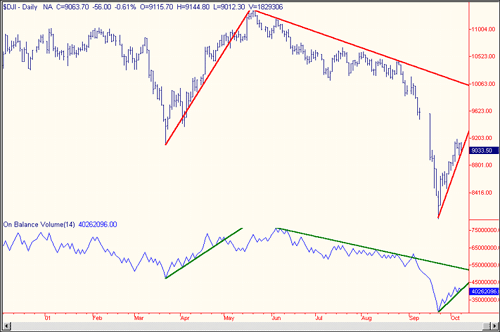

Technical analysis has long been a cornerstone of financial markets, aiding traders and investors in making informed decisions. Within this domain, specific tools and indicators have gained prominence due to their effectiveness in predicting market movements. Among these, On-Balance Volume (OBV) is particularly noteworthy for its ability to integrate momentum and volume flow to provide a clearer picture of potential market trends.

On-Balance Volume was developed by Joseph Granville in the 1960s and offers a distinctive approach to evaluating market dynamics by focusing on the relationship between volume and price changes. By calculating the cumulative total of volume on up days and subtracting volume on down days, OBV encapsulates the notion that volume often precedes price movement. This principle makes OBV an invaluable tool in anticipating stock price shifts.



In this article, we explore the application of OBV in smart money strategies and its integration into algorithmic trading, unlocking its full potential for both novice and experienced traders. Smart money refers to capital controlled by institutional investors or advanced traders armed with insider knowledge and comprehensive market data. Detecting their influence through OBV can illuminate significant entry or exit points, providing a competitive edge.

We will examine how OBV can be utilized in conjunction with algorithmic trading systems. These systems, leveraging computational algorithms, can efficiently execute trades by assessing optimal conditions, thereby enhancing decision accuracy. By integrating OBV, algorithms benefit from a nuanced understanding of market forces, refining trading strategies and filtering out noise to better detect trend continuations or reversals.

Join us as we decode the synergy between OBV and algorithmic trading in the context of smart money moves. This exploration aims to equip traders with enhanced insight into market dynamics, ultimately refining their trading decisions.

## Table of Contents

## Understanding On-Balance Volume (OBV)

Developed by Joseph Granville, On-Balance Volume (OBV) is a methodical tool designed to help traders evaluate market momentum by analyzing volume data instead of merely relying on price movements. The foundation of OBV is the hypothesis that volume changes often precede price shifts, providing traders with potential foresight into future price actions.

OBV is calculated by maintaining a cumulative total of trading volumes, which adjusts depending on whether the price of a security increases or decreases. Specifically, on days when the stock's closing price is higher than its closing price from the previous day, the day's [volume](/wiki/volume-trading-strategy) is added to the cumulative OBV. Conversely, if the stock's closing price is lower than the day before, the volume is subtracted from the cumulative OBV. If the closing price remains unchanged, OBV remains the same. This can be formally represented in the following way:

$$

OBV_t = 
\begin{cases} 
OBV_{t-1} + V_t, & \text{if } \text{Price}_t > \text{Price}_{t-1} \\ 
OBV_{t-1} - V_t, & \text{if } \text{Price}_t < \text{Price}_{t-1} \\ 
OBV_{t-1}, & \text{if } \text{Price}_t = \text{Price}_{t-1} 
\end{cases}
$$

where $OBV_t$ is the OBV at time $t$, $OBV_{t-1}$ is the OBV at the prior time step, $V_t$ is the volume at time $t$, and $\text{Price}_t$ denotes the stock's closing price at time $t$.

The core principle is that OBV acts as a leading indicator. If a stock is experiencing rising prices accompanied by increasing OBV, it suggests strength in the upward trend, as the increased volume is seen as a validation of the price rise. Conversely, if prices are rising but OBV is decreasing or flat, it could signal weakness, as the rally may not be supported by strong underlying demand.

Moreover, OBV can illuminate potential trend reversals or continuations when significant divergences occur between OBV and price movements. For instance, if prices make new highs but OBV fails to do so, it might indicate an impending downturn. Similarly, a bullish divergence happens when OBV makes higher lows while the price continues to decline, suggesting an upcoming price reversal.

Overall, OBV provides a quantitative measure that, when integrated into broader analytical frameworks, can offer substantial insights into market trends, reflecting the underlying sentiment of market participants.

## Role of Smart Money in Market Movements

Smart money refers to the influence and movements of capital controlled by institutional investors or skilled traders, like hedge funds, investment banks, and seasoned market players. These entities wield considerable power in financial markets due to their substantial capital reserves, insider knowledge, and access to extensive analytical resources. As a result, they play a pivotal role in dictating market trends, and their movements often precede significant price changes. 

Understanding when and how smart money engages in market activities can be crucial for individual investors. One effective tool for identifying the subtle cues left by these market titans is On-Balance Volume (OBV). OBV, by calculating the running total of volume changes relative to price movements, provides a lens through which the activities of these influential players might be inferred. The basic premise is that volume changes reflect the intensity and commitment of trading activity, potentially telegraphing the initiation of positions or withdrawals by smart money players before price trends become apparent to the wider market.

For instance, when OBV rises significantly while the price remains relatively stable, it can signal that smart money is buying in anticipation of a future price rise. Conversely, when OBV declines while the price does not exhibit corresponding downward movement, it may indicate distribution or selling by these entities. Such scenarios often provide some of the earliest indications of major trendline turns, effectively serving as a roadmap for smaller investors to navigate the complexities of market changes.

By understanding how OBV can be used to track smart money, traders can attempt to align their strategies with these influential market drivers. Monitoring OBV for divergences, where the volume action (as indicated by OBV) diverges from the price trend, can be particularly revealing. Such divergences often presage significant market reversals or accelerations, enabling informed investors to position themselves advantageously.

The use of OBV in detecting smart money strategies is not without challenges, and sole reliance on this indicator can lead to misinterpretations in certain market conditions, for example in low volume markets where signals may become unreliable. As such, it is often beneficial to combine OBV with other technical indicators or market analysis techniques to enhance accuracy and reliability when deducing smart money activities and making informed trading decisions.

## Examples of OBV in Action

Analyzing historical chart data of major indices, such as the Dow Jones Industrial Average (DJIA), showcases the practical use of On-Balance Volume (OBV) in predicting market movements. OBV has proven to be a potent tool by identifying discrepancies between volume flow and price movements, leading to the prediction of major reversals or sustained trends.

A notable example of OBV's capability occurred during the financial crisis of 2008. As the DJIA began a downward trend, OBV indicated a divergence. While prices kept dropping, OBV showed increasing volume interest, which hinted at a potential reversal. Traders who leveraged this information were able to anticipate the market recovery that began in early 2009. This instance reflected OBV's ability to detect when institutional buyers were entering the market despite ongoing price declines, suggesting a bottoming out and subsequent rally.

Further examples can be observed during the bull market of the 2010s. Throughout this period, OBV consistently confirmed upward trends by aligning with price increases, indicating sustained buying pressure. In particular, during periods of consolidation or minor market pullbacks, OBV maintained an upward trajectory while prices temporarily paused, suggesting continued institutional interest. This pattern allowed traders to remain confident in existing positions or add to them, anticipating further price appreciations.

In addition to market indices, OBV has proven effective in analyzing individual stocks. A case study involving Apple Inc. (AAPL) in mid-2016 demonstrated OBV's predictive power. Price movements stalled in a sideways pattern, causing uncertainty among traders. However, during this stagnation, OBV consistently rose, indicating underlying buying pressure. Subsequently, a significant price [breakout](/wiki/breakout-trading) followed, validating the OBV signals and rewarding traders who had positioned themselves in anticipation of the move.

These historical examples underline the efficacy of OBV as a tool for deciphering market conditions and anticipating changes. By consistently highlighting the flow of "smart money," OBV gives traders an edge in predicting potential market corrections or rallies, offering a strategic advantage in decision-making processes. Integrating OBV with price analysis allows traders to identify critical junctures where volume precedes price changes, providing valuable insights for strategic trading initiatives.

## Leveraging OBV in Algorithmic Trading

Algorithmic trading utilizes sophisticated computational algorithms to operate transactions at ideal conditions, drastically improving decision-making capabilities for traders. One prominent way to enhance these algorithms is by incorporating On-Balance Volume (OBV), a [momentum](/wiki/momentum) indicator that combines price movement with volume flow to provide a more comprehensive analysis of market dynamics.

OBV assists algorithms in identifying potential areas of price reversals or trend continuations by evaluating the pressure exerted by buyers and sellers. This is achieved by calculating the cumulative total of volume based on whether a stock's price closes up or down. For an increase in price, the day's volume is added to the OBV total, whereas for a price decrease, the volume is subtracted. This approach aids in detecting divergence patterns, where price trends might continue or reverse against the volume flow patterns observed.

To implement OBV in [algorithmic trading](/wiki/algorithmic-trading), one can integrate it with other technical indicators to filter out market noise. For example, combining OBV with moving averages may help confirm trends by smoothing short-term fluctuations and identifying long-term trends. Here is a simple Python illustration using popular libraries such as NumPy and Pandas:

```python
import pandas as pd
import numpy as np

def calculate_obv(prices, volumes):
    # Calculate daily price changes
    changes = prices.diff()

    # Initialize OBV and filling in the first value
    obv = np.zeros_like(prices)
    obv[0] = volumes[0]

    # Calculate OBV
    for i in range(1, len(prices)):
        if changes[i] > 0:
            obv[i] = obv[i - 1] + volumes[i]
        elif changes[i] < 0:
            obv[i] = obv[i - 1] - volumes[i]
        else:
            obv[i] = obv[i - 1]

    return obv

# Example DataFrame with pricing and volume data
data = pd.DataFrame({
    'close': [100, 102, 101, 103, 104],
    'volume': [1500, 1800, 1200, 1600, 1300]
})

data['OBV'] = calculate_obv(data['close'], data['volume'])
print(data)
```

Incorporating OBV in algorithmic strategies can also optimize trade executions by reducing false signals prevalent in technical analysis, especially in volatile or low-volume markets. Traders can achieve this by setting thresholds for volume divergence and integrating additional indicators like Relative Strength Index (RSI) or Bollinger Bands to further corroborate trading signals identified by OBV analysis. 

Ultimately, embedding OBV in algorithmic trading models refines their interpretative power, granting traders a tactical edge. As these algorithms increasingly incorporate diverse data sources and advanced analytics, tools like OBV will continue to play a crucial role in discerning market trends with enhanced precision.

## Advantages and Limitations of OBV

On-Balance Volume (OBV) combines price and volume into a single value, offering a straightforward method for traders to anticipate potential price reversals. This accessible indicator becomes particularly valuable because it accounts for the volume changes that often precede price movements, providing a lead rather than a lag in data interpretation. The insight gleaned from OBV is that significant volume increases, either upward or downward, typically anticipate corresponding moves in price, allowing traders to take preemptive measures.

The mathematical calculation of OBV is relatively simple: if the closing price of a security is higher than the previous close, the volume is added to the current OBV. Conversely, if the closing price is lower, the volume is subtracted. Mathematically, it is expressed as:

$$

\text{OBV}_\text{current} = 
\begin{cases} 
\text{OBV}_\text{previous} + \text{Volume}, & \text{if Price}_\text{today} > \text{Price}_\text{yesterday} \\ 
\text{OBV}_\text{previous} - \text{Volume}, & \text{if Price}_\text{today} < \text{Price}_\text{yesterday} \\ 
\text{OBV}_\text{previous}, & \text{if Price}_\text{today} = \text{Price}_\text{yesterday}
\end{cases}
$$

However, OBV is not without its drawbacks. A significant limitation is its susceptibility to false signals, particularly in markets with low trading volume. In such markets, price movements may not be reliable, resulting in misleading OBV readings that can lead traders to incorrect conclusions. This pitfall necessitates a careful approach when interpreting OBV in certain conditions.

To counter these limitations, traders often combine OBV with other technical indicators, enhancing decision-making accuracy. For example, using OBV alongside a moving average can help filter out noise, providing a confirmation signal for potential price action. Another effective strategy is to pair OBV with an indicator like the Relative Strength Index (RSI), which measures the speed and change of price movements, to offer additional context and reduce the likelihood of false signals.

By integrating OBV with complementary indicators, traders can create a more robust analysis framework, compensating for its inherent limitations. This diversified approach enables a clearer understanding of market dynamics, reducing dependency on any single indicator and enhancing overall trading strategies.

## Conclusion

On-Balance Volume (OBV) remains a critical instrument for traders aiming to synchronize their strategies with the movements of smart money. By capturing the flow of volume relative to price changes, OBV provides insights into underlying market dynamics that are not immediately visible through price action alone. This makes OBV a valuable component in both technical trading and algorithmic strategies, enhancing the ability to make informed decisions.

Despite its strengths, OBV is not without its limitations. It can generate false signals, particularly in markets with low trading volume or in cases where external factors abruptly impact price movements without corresponding changes in volume. However, when used as part of a comprehensive analysis framework—alongside indicators like moving averages or Relative Strength Index (RSI)—OBV's predictive power can be significantly augmented, allowing traders to discern genuine trends from potential noise.

As trading technology continues to advance, incorporating OBV and similar volume-based indicators into algorithmic models enhances their sophistication. Future developments in data analytics and [machine learning](/wiki/machine-learning) could further refine the application of OBV, enabling even more precise predictions of market behavior. OBV's integration into evolving trading systems illustrates its enduring relevance in understanding and capitalizing on market trends.

## FAQs

### What is On-Balance Volume (OBV) and how was it developed?

On-Balance Volume (OBV) is a technical analysis indicator that was developed by financial analyst Joseph Granville in 1963. It operates on the principle that volume precedes price movements, providing a way to anticipate potential shifts in market trends. OBV calculates the cumulative total of volume by adding the volume on up days and subtracting it on down days. This cumulative value reflects market momentum, helping traders identify buying or selling pressure.

### How does OBV provide insights into smart money movements?

Smart money refers to the capital controlled by institutional investors, hedge funds, and experienced traders who are often perceived to have an edge in the market, whether through advanced analytical capabilities or insider knowledge. OBV assists in identifying smart money movements by highlighting discrepancies between volume flow and price movements. When OBV rises sharply while the price remains relatively stable, it suggests accumulation by smart money. Conversely, if OBV drops even when the price holds steady, it indicates distribution and potential upcoming price declines.

### Can OBV be used as a standalone indicator in trading strategies?

While OBV can offer valuable insights into market momentum and potential reversals, relying on it as a standalone indicator carries risks. OBV is best used in conjunction with other technical indicators to provide confirmation signals. For instance, combining OBV with trendlines or moving averages can enhance its predictive power. Sole reliance on OBV may lead to false signals, especially in volatile or low-volume markets.

### What are some common strategies to combine OBV with other technical indicators?

A prevalent strategy is the integration of OBV with moving averages. Traders often look for situations where OBV confirms a moving average crossover, strengthening the signal of a trend change. Another approach involves combining OBV with relative strength index (RSI) or MACD (Moving Average Convergence Divergence) to filter false signals. For example, if OBV indicates accumulation while RSI is not in overbought territory, it may still signify a strong buying opportunity.

### What are the potential pitfalls of relying too heavily on OBV in trading?

One significant limitation of OBV is its susceptibility to false signals in low-volume markets or stocks with erratic trading volumes. Price movements in such securities may reflect noise rather than genuine market sentiment, misleading traders. Moreover, OBV does not consider price [volatility](/wiki/volatility-trading-strategies), which means it might overlook crucial fluctuations impacting trading decisions. To mitigate these pitfalls, traders are advised to corroborate OBV signals with additional technical indicators and broader market analysis.

## References & Further Reading

[1]: Granville, J. E. (1963). ["Granville's New Key to Stock Market Profits"](https://archive.org/details/newkeytostockmar0000gran) by Joseph E. Granville

[2]: Aronson, D. (2006). ["Evidence-Based Technical Analysis: Applying the Scientific Method and Statistical Inference to Trading Signals"](https://www.amazon.com/Evidence-Based-Technical-Analysis-Scientific-Statistical/dp/0470008741) by David Aronson

[3]: Kirkpatrick, C. D., & Dahlquist, J. R. (2010). ["Technical Analysis: The Complete Resource for Financial Market Technicians"](https://ptgmedia.pearsoncmg.com/images/9780134137049/samplepages/9780134137049.pdf) by Charles D. Kirkpatrick and Julie R. Dahlquist

[4]: Achelis, S. B. (2000). ["Technical Analysis from A to Z"](https://www.mhebooklibrary.com/doi/book/10.1036/9780071380119) by Steven B. Achelis

[5]: Lopez de Prado, M. (2018). ["Advances in Financial Machine Learning"](https://www.amazon.com/Advances-Financial-Machine-Learning-Marcos/dp/1119482089) by Marcos Lopez de Prado

[6]: Jansen, S. (2020). ["Machine Learning for Algorithmic Trading"](https://github.com/stefan-jansen/machine-learning-for-trading) by Stefan Jansen

[7]: Chan, E. P. (2009). ["Quantitative Trading: How to Build Your Own Algorithmic Trading Business"](https://github.com/ftvision/quant_trading_echan_book) by Ernest P. Chan