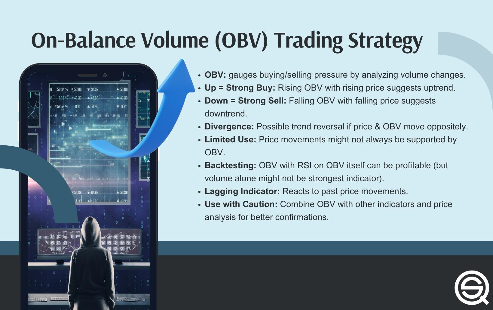

## Table of Contents

## What is On-Balance Volume (OBV) and how is it calculated?

On-Balance Volume (OBV) is a technical indicator used in stock trading to measure the flow of volume in relation to price changes. It helps traders understand whether a stock is being accumulated or distributed by comparing the volume on up days to the volume on down days. The main idea behind OBV is that volume precedes price movement, meaning that if a stock is being bought heavily, its price is likely to go up, and if it's being sold heavily, its price is likely to go down.

To calculate OBV, you start with an initial value, usually set to zero. Then, for each trading day, you look at the closing price of the stock. If the closing price is higher than the previous day's closing price, you add the volume of that day to the OBV. If the closing price is lower than the previous day's closing price, you subtract the volume of that day from the OBV. If the closing price is the same as the previous day's closing price, the OBV remains unchanged. Over time, this running total of volume helps traders see the overall trend in buying and selling pressure.

## Why is OBV important in technical analysis?

OBV is important in technical analysis because it helps traders see if a stock is being bought or sold in large amounts. When the OBV line goes up, it means more people are buying the stock than selling it. This can be a sign that the stock's price might go up too. On the other hand, if the OBV line goes down, it means more people are selling the stock than buying it, which can be a sign that the stock's price might go down.

Traders use OBV to confirm trends and spot possible changes in the market. If the stock price is going up and the OBV is also going up, it's a good sign that the trend is strong. But if the stock price is going up and the OBV is going down, it might mean the trend is weak and could change soon. This helps traders make better decisions about when to buy or sell stocks.

## How can beginners use OBV to identify trends?

Beginners can use OBV to identify trends by looking at the direction of the OBV line. If the OBV line is going up over time, it means more people are buying the stock than selling it. This is a sign that the stock's price might keep going up. On the other hand, if the OBV line is going down, it means more people are selling the stock than buying it, which could mean the stock's price might go down.

To use OBV effectively, beginners should compare the OBV line with the stock's price chart. If both the stock price and the OBV are going up together, it's a strong sign that the upward trend is real and might continue. But if the stock price is going up and the OBV is going down, it might mean the trend is weak and could reverse soon. By watching these patterns, beginners can get a better idea of when to buy or sell a stock.

## What are the key signals that OBV provides to traders?

OBV provides traders with important signals about whether a stock is being bought or sold in large amounts. When the OBV line is going up, it means more people are buying the stock than selling it. This is a good sign that the stock's price might keep going up. Traders look for this signal to decide if they should buy the stock too. If the OBV line is going down, it means more people are selling the stock than buying it. This can be a warning that the stock's price might go down. Traders might use this signal to think about selling their stock before the price drops.

Another important signal from OBV is when it confirms or contradicts the stock's price movement. If the stock price is going up and the OBV is also going up, it's a strong sign that the upward trend is real and might continue. This gives traders more confidence to keep their stock or buy more. But if the stock price is going up and the OBV is going down, it might mean the trend is weak and could reverse soon. Traders might see this as a sign to be careful and maybe sell their stock before the price falls. By watching these signals, traders can make better choices about buying and selling stocks.

## Can OBV be used alone or should it be combined with other indicators?

OBV can be used alone to get a basic idea of whether a stock is being bought or sold more. If the OBV line goes up, it means more people are buying the stock, which might make the price go up too. If the OBV line goes down, it means more people are selling the stock, and the price might go down. But using OBV alone might not give you the full picture because it only looks at volume and price changes.

It's usually better to use OBV with other indicators to get a clearer view of what's happening with a stock. For example, you could use OBV with moving averages to see if the trend is strong or weak. Or you could use it with the Relative Strength Index (RSI) to see if a stock is overbought or oversold. By combining OBV with other tools, you can make smarter decisions about when to buy or sell a stock.

## How does OBV differ from other volume-based indicators like the Accumulation/Distribution Line?

OBV and the Accumulation/Distribution Line are both volume-based indicators, but they measure volume in slightly different ways. OBV looks at whether the stock's closing price is higher or lower than the previous day's closing price. If it's higher, OBV adds the day's volume to the total. If it's lower, OBV subtracts the day's volume. This makes OBV a simple way to see if more people are buying or selling the stock. But, OBV doesn't consider the stock's high and low prices during the day, just the closing price.

The Accumulation/Distribution Line, on the other hand, takes into account the stock's high, low, and closing prices for each day. It calculates a factor called the "Close Location Value" (CLV) which shows where the closing price is compared to the high and low of the day. If the closing price is closer to the high, it means the stock was bought more during the day, and the volume is added to the line. If the closing price is closer to the low, it means the stock was sold more, and the volume is subtracted. This makes the Accumulation/Distribution Line a bit more detailed than OBV because it looks at more parts of the stock's price movement.

## What are some common pitfalls when using OBV for trading?

One common pitfall when using OBV for trading is relying on it too much by itself. OBV can give you a good idea of whether a stock is being bought or sold more, but it doesn't tell you everything. If you only use OBV, you might miss important information from other indicators like the stock's price trends or how much it's being traded compared to its normal amount. It's better to use OBV with other tools to get a fuller picture of what's happening with a stock.

Another problem is that OBV can give false signals sometimes. For example, if there's a big jump in volume one day because of some news or event, it might make the OBV line go up a lot. But that doesn't always mean the stock's price will keep going up. The price could go back down if the news turns out to be not so important. Traders need to be careful and not just follow the OBV line without thinking about why the volume changed.

## How can OBV be applied in different market conditions, such as bull and bear markets?

In a bull market, where stock prices are generally going up, OBV can help traders see if the buying pressure is strong enough to keep the market going up. If the OBV line is also going up along with the stock prices, it's a good sign that the bull market might continue. Traders might feel more confident to buy stocks or hold onto them longer. But if the OBV line starts to go down while stock prices are still going up, it could be a warning that the bull market might be getting weaker. Traders might want to be careful and think about selling some of their stocks before the market turns around.

In a bear market, where stock prices are generally going down, OBV can show if the selling pressure is strong or if there are signs that the market might turn around. If the OBV line is going down along with the stock prices, it means more people are selling their stocks, and the bear market might keep going. Traders might decide to sell their stocks or wait to buy until the market looks better. But if the OBV line starts to go up while stock prices are still going down, it could be a sign that the bear market is losing steam. Traders might see this as a chance to start buying stocks again, hoping that the market will soon start going up.

## What advanced techniques can experts use to refine OBV signals?

Experts can refine OBV signals by using moving averages to smooth out the OBV line. They might use a short-term moving average, like a 5-day average, and a longer-term one, like a 20-day average. When the short-term average crosses above the long-term average, it can be a strong buy signal. When the short-term average crosses below the long-term average, it can be a strong sell signal. This helps experts see the bigger trends in the OBV and make better trading decisions.

Another technique is to look at OBV divergences. If the stock price is making new highs but the OBV is not, it might mean the stock's price is going up without strong buying pressure. This could be a warning that the price might fall soon. On the other hand, if the stock price is making new lows but the OBV is not, it might mean the selling pressure is weakening. This could be a sign that the price might start going up soon. By watching for these divergences, experts can spot potential turning points in the market and adjust their trades accordingly.

## How can OBV be integrated into algorithmic trading strategies?

OBV can be integrated into algorithmic trading strategies by using it as a part of the decision-making process. Traders can program their algorithms to buy a stock when the OBV line is going up and the stock price is also going up. This means more people are buying the stock, which is a good sign that the price might keep going up. On the other hand, the algorithm can be set to sell a stock when the OBV line is going down and the stock price is also going down. This shows more people are selling the stock, and the price might keep going down. By using OBV signals, the algorithm can make trades based on volume trends, helping traders take advantage of market movements.

Another way to use OBV in algorithmic trading is by looking at OBV divergences. An algorithm can be programmed to spot when the stock price is making new highs but the OBV is not. This could be a sign that the price might fall soon, so the algorithm can sell the stock to avoid losses. Similarly, if the stock price is making new lows but the OBV is not, it might mean the price could start going up soon. The algorithm can then buy the stock to take advantage of the potential upward movement. By integrating OBV divergences into the trading strategy, the algorithm can help traders find good entry and exit points based on the relationship between volume and price.

## What are the historical performance metrics of strategies based on OBV?

Strategies based on OBV have been studied to see how well they work over time. In general, research shows that using OBV to decide when to buy or sell stocks can help traders make more money than just guessing. For example, a study might find that if you buy a stock when the OBV line goes up and sell it when the OBV line goes down, you could make a good profit over many years. But, OBV strategies don't always work perfectly. Sometimes, the market can be hard to predict, and even good strategies like OBV can lose money.

One important thing to remember is that OBV works better when used with other tools. When traders combine OBV with other indicators like moving averages or the Relative Strength Index (RSI), the strategy can perform even better. For instance, a study might show that if you use OBV along with a moving average to confirm trends, you can make more money than using OBV alone. So, while OBV can be a helpful tool, it's best used as part of a bigger plan that looks at many parts of the market.

## How have recent market trends and technological advancements affected the effectiveness of OBV?

Recent market trends have made OBV more important for traders. In today's markets, where stocks can move a lot because of news or big trades, OBV helps traders see if these moves are real or just short-term changes. For example, if a stock's price jumps up because of some news but the OBV doesn't go up too, it might mean the price won't keep going up. This helps traders make better choices about buying or selling stocks in a fast-moving market.

Technological advancements have also made OBV easier to use. With new trading platforms and software, traders can see OBV lines on their screens right next to the stock's price chart. This makes it easier to spot trends and make quick decisions. Also, with computers and algorithms, traders can set up their trading plans to use OBV signals automatically. This means they can take advantage of OBV signals without having to watch the market all the time.

## What is On-Balance Volume (OBV)?

On-Balance Volume (OBV) is a volume-based technical indicator that traders utilize to gauge market sentiment. The concept of OBV was introduced by Joseph Granville in the 1960s. It serves as a predictive tool for changes in price trends through the analysis of cumulative volume. The fundamental mechanism of OBV involves adding the day's volume to the indicator if the closing price of a security is higher than the prior day's closing price. Conversely, if the closing price is lower, the volume is subtracted. This process effectively encapsulates the buying and selling pressures within the market. OBV can be mathematically expressed as:

$$

\text{OBV}_\text{today} = 
\begin{cases} 
\text{OBV}_\text{yesterday} + \text{Volume}, & \text{if } \text{Close}_\text{today} > \text{Close}_\text{yesterday}\\ 
\text{OBV}_\text{yesterday} - \text{Volume}, & \text{if } \text{Close}_\text{today} < \text{Close}_\text{yesterday}\\ 
\text{OBV}_\text{yesterday}, & \text{if } \text{Close}_\text{today} = \text{Close}_\text{yesterday}
\end{cases}
$$

This indicator provides valuable insights into whether trading [volume](/wiki/volume-trading-strategy) is flowing into or out of a given security. An increase in OBV indicates that volume is greater on up days, suggesting that more buyers are willing to enter the market. Conversely, a decrease in OBV suggests that volume is stronger on down days, indicating increased selling pressure. The relationship between OBV and price trends is paramount; OBV often moves in parallel with price trends, thus confirming upward or downward market movements. This characteristic allows traders to employ OBV not only to confirm existing trends but also to anticipate potential reversals or continuations, thereby enhancing their trading strategies.

## What is the Formula for OBV?

The On-Balance Volume (OBV) is a straightforward yet powerful technical indicator that offers insights into the market's volume dynamics. To calculate OBV, follow these steps:

1. **Initial OBV Value**: Start with an arbitrary value, typically zero, for a given trading session.

2. **Daily Calculation**: Evaluate the closing price of today in comparison to yesterday:
   - If today's closing price is higher than yesterday's, add today's trading volume to the OBV.
   - If today's closing price is lower, subtract today's trading volume from the OBV.
   - If there is no change in the closing price, the OBV remains unchanged.

This running total of the OBV is expressed mathematically as:

$$

OBV_{\text{today}} = 
\begin{cases} 
OBV_{\text{yesterday}} + \text{Volume}_{\text{today}}, & \text{if today's close} > \text{yesterday's close} \\
OBV_{\text{yesterday}} - \text{Volume}_{\text{today}}, & \text{if today's close} < \text{yesterday's close} \\
OBV_{\text{yesterday}}, & \text{if today's close} = \text{yesterday's close}
\end{cases} 
$$

3. **Importance of Calculation**: This ongoing calculation provides a continuous look at the flow of volume, which is a vital aspect for predicting market trends. By tracking this cumulative volume measure, traders can discern whether the trading volume is predominantly entering or exiting a security, thereby gaining valuable foresight into potential price movements.

In practical applications, traders often implement OBV calculations programmatically to automate their analyses and strategy deployments. Here's an example of a basic Python function to compute OBV from a list of closing prices and volumes:

```python
def calculate_obv(closing_prices, volumes):
    obv = [0]  # Starting OBV value at 0
    for i in range(1, len(closing_prices)):
        if closing_prices[i] > closing_prices[i - 1]:
            obv.append(obv[-1] + volumes[i])
        elif closing_prices[i] < closing_prices[i - 1]:
            obv.append(obv[-1] - volumes[i])
        else:
            obv.append(obv[-1])
    return obv
```

By incorporating OBV into their analyses, traders can more accurately interpret the underlying sentiment and [momentum](/wiki/momentum) of the market, enhancing their ability to forecast potential price changes.

## References & Further Reading

[1]: Granville, J. E. (1963). ["Granville's New Key to Stock Market Profits"](https://books.google.com/books/about/Granville_s_New_Key_to_Stock_Market_Prof.html?id=21ukDwAAQBAJ) Prentice Hall Press.

[2]: Murphy, J. J. (1999). ["Technical Analysis of the Financial Markets: A Comprehensive Guide to Trading Methods and Applications"](https://www.amazon.com/Technical-Analysis-Financial-Markets-Comprehensive/dp/0735200661) New York Institute of Finance.

[3]: Pring, M. J. (1991). ["Technical Analysis Explained: The Successful Investor's Guide to Spotting Investment Trends and Turning Points"](https://www.amazon.com/Technical-Analysis-Explained-Fifth-Successful/dp/0071825177) McGraw-Hill.

[4]: Aronson, D. R. (2007). ["Evidence-Based Technical Analysis: Applying the Scientific Method and Statistical Inference to Trading Signals"](https://onlinelibrary.wiley.com/doi/book/10.1002/9781118268315) Wiley.

[5]: Elder, A. (1993). ["Trading for a Living: Psychology, Trading Tactics, Money Management"](https://www.amazon.com/Trading-Living-Psychology-Tactics-Management/dp/0471592242) John Wiley & Sons.

[6]: Schwager, J. D. (1993). ["The New Market Wizards: Conversations with America's Top Traders"](https://archive.org/details/newmarketwizards00jack) HarperBusiness.