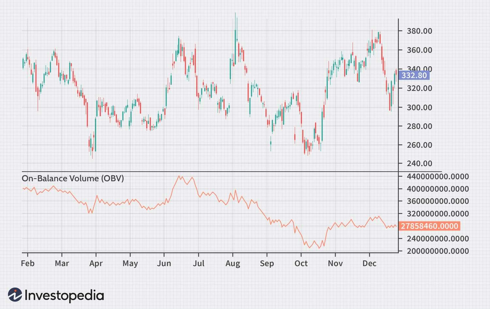

## Table of Contents

## What is On-Balance Volume (OBV)?

On-Balance Volume (OBV) is a technical indicator that uses volume to predict changes in stock prices. It works by adding volume on days when the stock price goes up and subtracting volume on days when the stock price goes down. The idea behind OBV is that volume can be a leading indicator of price movements. If the OBV line is going up, it suggests that buying pressure is increasing, which could mean the stock price might go up soon. If the OBV line is going down, it suggests that selling pressure is increasing, which could mean the stock price might go down soon.

OBV is useful for traders because it helps them see the flow of volume in and out of a stock. For example, if a stock's price is going up but the OBV is going down, it might mean that the price increase is not supported by strong buying volume and could be a false signal. On the other hand, if the stock price and OBV are both going up, it could be a stronger sign that the price increase is real and might continue. Traders use OBV to confirm trends and look for divergences that can signal potential reversals in the stock price.

## Who created the On-Balance Volume indicator?

The On-Balance Volume indicator was created by a man named Joe Granville. He was a stock market analyst who wanted to find a way to use trading volume to predict stock price movements. Joe came up with the idea of OBV in the 1960s, and he wrote about it in his book called "Granville's New Key to Stock Market Profits."

Joe Granville believed that volume was very important in understanding the stock market. He thought that if more people were buying a stock, the price would likely go up, and if more people were selling, the price would go down. By keeping track of volume changes, Joe created the OBV to help traders see these patterns and make better decisions about when to buy or sell stocks.

## How is the On-Balance Volume calculated?

On-Balance Volume, or OBV, is calculated by adding or subtracting the volume of a stock based on whether its price goes up or down from one day to the next. If the closing price of the stock is higher than the previous day's closing price, you add the day's volume to the OBV. If the closing price is lower than the previous day's closing price, you subtract the day's volume from the OBV. If the closing price is the same as the previous day's closing price, the OBV stays the same.

You start with an initial OBV value, which is usually set to zero. Then, each day, you look at the stock's closing price compared to the day before. If the price goes up, you add the volume to the OBV. If the price goes down, you subtract the volume from the OBV. Over time, the OBV line will move up or down, showing whether buying or selling pressure is stronger. This helps traders see if the volume is supporting the price movements of the stock.

## What does the On-Balance Volume indicator tell us about a stock?

The On-Balance Volume (OBV) indicator tells us about the strength of buying and selling pressure in a stock by looking at its trading volume. If the OBV line is going up, it means more people are buying the stock, which could push the price higher. If the OBV line is going down, it means more people are selling the stock, which could push the price lower. This helps traders understand if the volume is supporting the price movements of the stock.

Traders also use OBV to spot trends and possible changes in a stock's direction. If the stock price and OBV are both moving in the same direction, it suggests the trend is strong. But if the stock price is going up and the OBV is going down, or if the stock price is going down and the OBV is going up, it might mean the trend is weak and could change soon. This can help traders decide when to buy or sell a stock.

## How can beginners use OBV to make trading decisions?

Beginners can use the On-Balance Volume (OBV) to help them make trading decisions by looking at whether the OBV line is going up or down. If the OBV line is going up, it means more people are buying the stock, which could be a good sign to buy the stock too. If the OBV line is going down, it means more people are selling the stock, which might be a sign to sell or avoid buying the stock. By watching the OBV, beginners can get a sense of whether the stock's price movement is supported by strong buying or selling volume.

Another way beginners can use OBV is to look for times when the stock price and the OBV are moving in different directions. If the stock price is going up but the OBV is going down, it might mean the price increase is not strong and could change soon. This could be a warning sign to be careful or maybe even sell the stock. On the other hand, if the stock price is going down but the OBV is going up, it might mean the price could start going up soon. This could be a good time to buy the stock. By paying attention to these signals, beginners can make better trading decisions.

## What are the key signals to look for when using OBV?

When using OBV, one key signal to look for is when the OBV line and the stock price are moving in the same direction. If both the stock price and the OBV are going up, it means that the price increase is supported by strong buying volume. This is a good sign that the price might keep going up, and it could be a good time to buy the stock. On the other hand, if both the stock price and the OBV are going down, it means that the price decrease is supported by strong selling volume. This could be a warning to sell the stock or avoid buying it.

Another important signal to watch for is when the stock price and the OBV are moving in different directions. If the stock price is going up but the OBV is going down, it might mean that the price increase is not strong and could change soon. This could be a warning sign to be careful or maybe even sell the stock. If the stock price is going down but the OBV is going up, it might mean that the price could start going up soon. This could be a good time to buy the stock. By looking for these signals, you can use OBV to help make better trading decisions.

## Can OBV be used in conjunction with other technical indicators?

Yes, OBV can be used with other technical indicators to help make better trading decisions. One common way is to use OBV along with moving averages. A moving average is a line that shows the average price of a stock over a certain time period. If the OBV is going up and crosses above a moving average, it could be a strong sign to buy the stock. If the OBV is going down and crosses below a moving average, it might be a good time to sell the stock. By using OBV and moving averages together, traders can see if the volume is supporting the price movements and if there are strong trends happening.

Another way to use OBV is with the Relative Strength Index (RSI). The RSI is an indicator that tells you if a stock is overbought or oversold. If the RSI is above 70, the stock might be overbought, and if it's below 30, the stock might be oversold. When you use OBV with RSI, you can see if the volume is supporting these overbought or oversold conditions. For example, if the RSI is over 70 but the OBV is going down, it might mean the stock's price increase is not strong and could change soon. This can help traders decide when to buy or sell a stock by looking at both the volume and the price [momentum](/wiki/momentum).

## How does OBV perform in different market conditions?

OBV can work well in different market conditions, but it might be more useful in some than others. In a strong bull market, where stock prices are going up a lot, OBV can help you see if the buying volume is strong enough to keep the prices going up. If the OBV line is going up with the stock prices, it's a good sign that the bull market might keep going. But if the OBV line is going down while prices are still going up, it could mean the bull market is getting weak and might not last much longer.

In a bear market, where stock prices are going down a lot, OBV can help you see if the selling volume is strong enough to keep pushing prices down. If the OBV line is going down with the stock prices, it means the bear market is strong and might keep going. But if the OBV line starts going up while prices are still going down, it could be a sign that the bear market is losing steam and might turn around soon. So, OBV can be a helpful tool in both bull and bear markets, but you need to pay attention to how the OBV line is moving compared to the stock prices.

## What are the limitations of using OBV as a trading tool?

One big problem with using OBV is that it can give false signals sometimes. Just because the OBV line is going up or down does not always mean the stock price will follow. For example, the OBV might go up a lot because of a big trade by one big investor, but that might not mean everyone else is buying the stock. So, if you only look at OBV, you might think the stock is going to go up when it might not. That's why it's good to use OBV with other tools like moving averages or the RSI to get a better picture of what's happening.

Another problem with OBV is that it can be hard to use in markets that don't move a lot. If the stock price stays the same for a long time, the OBV won't change much either. This can make it hard to see any useful signals. Also, OBV works best when there is a clear trend in the stock price. If the market is moving up and down a lot without a clear direction, OBV might not be very helpful. So, it's important to understand these limits and use OBV carefully, especially in markets that don't have strong trends.

## How can advanced traders refine OBV signals for better accuracy?

Advanced traders can make OBV signals more accurate by combining OBV with other technical indicators. One way to do this is by using OBV with moving averages. If the OBV line crosses above a moving average, it could be a strong sign to buy the stock. If the OBV line crosses below a moving average, it might be a good time to sell. By looking at both the OBV and the moving average, traders can see if the volume is really supporting the price movements and if there is a strong trend happening. Another helpful indicator to use with OBV is the Relative Strength Index (RSI). If the RSI shows that a stock is overbought or oversold, and the OBV confirms this with its movement, it can give traders a clearer picture of what might happen next with the stock price.

Another way advanced traders can refine OBV signals is by using different time frames. Looking at OBV on both short-term and long-term charts can help traders see if the volume trends are consistent across different periods. If the OBV is going up on both daily and weekly charts, it's a stronger sign that the buying pressure is real and might keep going. Traders can also use volume spikes to their advantage. If there's a big jump in volume and the OBV moves a lot because of it, traders should check if this volume spike is from a big trade by one investor or if it's a sign of many people buying or selling. By using these methods, advanced traders can get more accurate signals from OBV and make better trading decisions.

## What are some real-world examples where OBV successfully predicted market movements?

In 2017, Apple Inc. was going through a big change with the launch of the iPhone X. Before the launch, the stock price of Apple was going up slowly, but the OBV line was going up much faster. This showed that more and more people were buying Apple stock, even if the price wasn't moving much yet. When the iPhone X came out, the stock price jumped up a lot, just like the OBV had been hinting. People who saw the OBV going up and bought Apple stock before the launch made a good choice because the price went up after.

Another time OBV was helpful was with Tesla in 2020. Tesla's stock price was going up, but then it started to go down a bit. The OBV line, however, kept going up even when the stock price was going down. This meant that even though the price was dropping, people were still buying a lot of Tesla stock. Soon after, the stock price started going up again and kept going up for a while. Traders who noticed the OBV going up and bought Tesla stock during the small price drop did well because the price went back up and kept going.

## How can OBV be programmed into trading algorithms for automated trading?

To program OBV into trading algorithms for automated trading, you first need to write code that calculates the OBV. This means you have to tell the computer to start with an initial OBV value, usually zero. Then, for each day, the computer looks at the stock's closing price compared to the day before. If the price goes up, the computer adds the day's volume to the OBV. If the price goes down, the computer subtracts the day's volume from the OBV. If the price stays the same, the OBV doesn't change. This way, the computer can keep track of the OBV line over time and use it to make trading decisions.

Once the OBV is calculated, you can set rules in the trading algorithm to buy or sell stocks based on the OBV signals. For example, you can tell the computer to buy a stock if the OBV line goes above a moving average, or to sell a stock if the OBV line goes below a moving average. You can also use other indicators like the RSI along with OBV to make the trading decisions even better. By setting these rules, the computer can automatically trade stocks based on what the OBV and other indicators are showing, helping you make trades without having to watch the market all the time.

## What is On-Balance Volume (OBV) and how does it work?

The On-Balance Volume (OBV) is a pivotal momentum indicator designed to leverage cumulative volume for predicting stock price changes. This technical analysis tool operates on the principle that volume movements often precede price movements. The core idea is that substantial changes in trading volume, whether upwards or downwards, can act as a precursor to corresponding movements in the price of an asset.

OBV is determined through a simple yet effective calculation method. It involves adding the asset’s volume on days when the closing price rises and subtracting the volume on days when the closing price falls. The resulting figure provides a cumulative total that reflects the prevailing volume trend of the asset. The OBV calculation can be expressed mathematically as:

$$
\text{OBV}_\text{today} = \begin{cases} 
\text{OBV}_\text{previous} + \text{Volume}, & \text{if closing price today} > \text{closing price previous day} \\ 
\text{OBV}_\text{previous} - \text{Volume}, & \text{if closing price today} < \text{closing price previous day} \\ 
\text{OBV}_\text{previous}, & \text{if closing price today} = \text{closing price previous day} 
\end{cases}
$$

In this formula, "Volume" refers to the current day’s trading [volume](/wiki/volume-trading-strategy), and the OBV value is updated continuously based on daily price movements and trading volume. This cumulative nature of OBV offers a running total, providing investors with insights into the trend strength and potential pressure points where significant price movements might occur.

By analyzing these volume trends, traders can gain an understanding of the buying or selling pressure behind a stock, facilitating more informed investment decisions. The alignment or divergence between OBV and price trends can serve as a crucial signal in identifying strong trends or potential reversals, making OBV an advantageous tool for both short-term traders and long-term investors.

## References & Further Reading

[1]: Joseph Granville (1963). ["Granville's New Key to Stock Market Profits."](https://books.google.com/books/about/Granville_s_New_Key_to_Stock_Market_Prof.html?id=21ukDwAAQBAJ) Prentice-Hall.

[2]: Achelis, S. B. (2000). ["Technical Analysis from A to Z"](https://www.mhebooklibrary.com/doi/book/10.1036/9780071380119).

[3]: Murphy, John J. (1999). ["Technical Analysis of the Financial Markets: A Comprehensive Guide to Trading Methods and Applications"](https://www.amazon.com/Technical-Analysis-Financial-Markets-Comprehensive/dp/0735200661) New York Institute of Finance.

[4]: Bulkowski, Thomas N. (2005). ["Encyclopedia of Chart Patterns"](https://www.amazon.com/Encyclopedia-Chart-Patterns-Thomas-Bulkowski/dp/0471668265) Wiley.

[5]: Pring, M. J. (2002). ["Technical Analysis Explained"](https://www.amazon.com/Technical-Analysis-Explained-Fifth-Successful/dp/0071825177) McGraw-Hill.

[6]: Schwager, J. D. (1993). ["The New Market Wizards: Conversations with America's Top Traders"](https://archive.org/details/newmarketwizards00jack) HarperBusiness.

[7]: Lo, Andrew W., Mamaysky, H., & Wang, J. (2000). ["Foundations of Technical Analysis: Computational Algorithms, Statistical Inference, and Empirical Implementation."](https://www.nber.org/papers/w7613) The Journal of Finance, 55(4), 1705-1770.