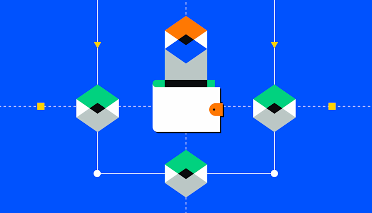

## Table of Contents

## What is an on-chain transaction in cryptocurrency?

An on-chain transaction in cryptocurrency happens when you send or receive digital coins directly on the blockchain. Think of the blockchain like a public record book that keeps track of all transactions. When you make an on-chain transaction, it gets written into this book for everyone to see. This makes it very secure because it's hard to change or fake these records.

On-chain transactions can take a bit longer and might cost more than other types of transactions because they need to be checked and added to the blockchain. This process involves other people on the network, called miners or validators, who make sure everything is correct. Once they agree, the transaction is added to the blockchain and becomes a permanent part of the record.

## How does an on-chain transaction differ from an off-chain transaction?

An on-chain transaction happens directly on the blockchain, which is like a big public record book for cryptocurrencies. When you send or receive coins this way, the transaction gets added to the blockchain for everyone to see. This makes it very secure because it's hard to change or fake these records. But, on-chain transactions can take longer and might cost more because they need to be checked by other people on the network, called miners or validators, before they can be added to the blockchain.

An off-chain transaction, on the other hand, happens outside of the blockchain. This means the transaction doesn't get recorded on the public ledger right away. Instead, it might be handled by a third party or through a different system. Off-chain transactions are usually faster and cheaper because they don't need to go through the same checking process as on-chain transactions. But, they can be less secure because they're not immediately part of the blockchain's permanent record.

In summary, on-chain transactions are more secure but slower and more expensive, while off-chain transactions are faster and cheaper but might be less secure. Both have their uses depending on what you need.

## What are the steps involved in processing an on-chain transaction?

When you want to send cryptocurrency using an on-chain transaction, you start by creating a transaction. You tell the system how much cryptocurrency you want to send and where you want to send it. This information is then broadcast to the network of computers that run the blockchain. These computers, often called nodes, receive your transaction and start to check it to make sure it's valid. They look at things like whether you have enough cryptocurrency to send and if the transaction follows the rules of the blockchain.

Once the nodes agree that your transaction is valid, it gets grouped with other transactions into a block. Miners or validators, special nodes on the network, then work to add this block to the blockchain. They use complex math problems to secure the block and make sure it can't be changed later. When a miner or validator solves the problem, the block is added to the blockchain, and your transaction becomes a permanent part of the record. This whole process can take some time, usually from a few minutes to an hour, depending on the blockchain and how busy it is. Once your transaction is on the blockchain, the recipient can use the cryptocurrency you sent.

## What is the role of miners in on-chain transactions?

Miners play a very important role in on-chain transactions. They are like the security guards of the blockchain. When you send cryptocurrency, miners check your transaction to make sure it's valid. They look at things like whether you have enough cryptocurrency to send and if everything follows the rules. If everything checks out, miners group your transaction with others into a block.

Once the transactions are in a block, miners work to add this block to the blockchain. They do this by solving complex math problems, which is like a puzzle. When a miner solves the puzzle, the block gets added to the blockchain, making your transaction permanent and secure. This process can take some time, but it's what keeps the blockchain safe and trustworthy.

## How are transaction fees determined for on-chain transactions?

Transaction fees for on-chain transactions are determined by how busy the network is and how quickly you want your transaction to be processed. When you send cryptocurrency, you can choose how much of a fee you want to pay. If you pick a higher fee, miners are more likely to pick up your transaction faster because they get paid more for processing it. If you choose a lower fee, your transaction might take longer to go through because miners might work on other transactions that pay more.

The fee also depends on the size of the transaction in terms of data, not just the amount of cryptocurrency you're sending. Each transaction has some data attached to it, like the sender's and receiver's addresses. The more data there is, the bigger the transaction, and the higher the fee might be. So, even if you're sending a small amount of cryptocurrency, if the transaction data is large, you might still have to pay a higher fee.

## What is the impact of blockchain size on on-chain transactions?

As a blockchain grows bigger, it can slow down on-chain transactions. When more and more transactions get added to the blockchain, the whole system has to handle a lot more data. This can make things slower because it takes longer for miners to check and add new transactions. Also, if the blockchain gets too big, it can be hard for new people to join the network because they have to download and store all that data.

The size of the blockchain can also affect how much it costs to send cryptocurrency. Bigger blockchains mean more data to process, which can lead to higher transaction fees. Miners need to be paid for their work, and if the blockchain is very large, they might ask for more money to handle the extra work. So, the size of the blockchain can make on-chain transactions slower and more expensive.

## How does the speed of on-chain transactions compare to traditional banking transactions?

On-chain transactions can take longer than traditional banking transactions. When you send cryptocurrency on the blockchain, it has to be checked by miners or validators. This can take anywhere from a few minutes to an hour, depending on how busy the network is. Traditional bank transfers, on the other hand, can be almost instant if you're using services like direct deposit or online banking. Banks have their own systems that can process transactions quickly within their network.

However, not all traditional bank transfers are fast. If you're sending money between different banks or countries, it can take several days. This is because the banks have to go through multiple steps and sometimes use intermediaries. On-chain transactions, even though they might be slower than instant bank transfers, are usually faster than international bank transfers. Plus, once an on-chain transaction is confirmed on the blockchain, it's final and can't be reversed, which is different from some bank transactions that can be held up or reversed.

## What are the security aspects of on-chain transactions?

On-chain transactions are very secure because they happen on the blockchain, which is like a big public record book. When you send cryptocurrency, the transaction gets checked by many people on the network, called miners or validators. They make sure everything is correct before adding the transaction to the blockchain. Once it's on the blockchain, it's very hard to change or fake because it would need the agreement of most people on the network.

Another part of the security comes from the way transactions are grouped into blocks and added to the blockchain. Miners solve hard math problems to add a new block, and once a block is added, it's locked in place. This makes on-chain transactions safe from being changed or stolen. But, it's still important to keep your private keys safe because if someone gets them, they could take your cryptocurrency.

## How can one verify an on-chain transaction?

To verify an on-chain transaction, you can use a blockchain explorer. This is a tool that lets you look at all the transactions on the blockchain. You just need to know the transaction ID or the address of the person sending or receiving the cryptocurrency. Once you enter this information into the explorer, it will show you details about the transaction, like when it happened, how much was sent, and whether it has been added to the blockchain yet.

Once you find the transaction on the blockchain explorer, you can see if it has enough confirmations. Confirmations are when new blocks are added to the blockchain after your transaction. The more confirmations a transaction has, the more secure it is. Usually, a few confirmations are enough to be sure that the transaction is final and can't be changed. This way, you can be confident that your on-chain transaction went through successfully.

## What are the scalability challenges faced by on-chain transactions?

On-chain transactions face big challenges when it comes to handling a lot of transactions at once. As more people use the blockchain, it can get very crowded. This is because every transaction needs to be checked and added to the blockchain by miners or validators. When there are too many transactions, it can take a long time for them to be processed. This slowdown can make the whole system less useful for people who need quick transactions.

Another problem is that bigger blockchains take up more space and need more power to run. As the blockchain grows, it can be hard for new users to join because they need to download and store all that data. This can make the system less accessible. Also, miners might charge higher fees to handle more transactions, which can make using the blockchain more expensive for everyone.

## How do different cryptocurrencies handle on-chain transactions differently?

Different cryptocurrencies handle on-chain transactions in their own ways, depending on how they were designed. For example, Bitcoin has a limit on how many transactions can be added to the blockchain every ten minutes. This can make transactions slower and more expensive when the network is busy. On the other hand, Ethereum uses a different system where transactions are processed based on how much users are willing to pay in fees. This means that if you pay a higher fee, your transaction might get processed faster.

Some newer cryptocurrencies, like Solana and Cardano, have been built to handle more transactions quickly and cheaply. Solana uses a special way of processing transactions that can handle thousands of them per second, making it much faster than Bitcoin or Ethereum. Cardano, on the other hand, focuses on making sure transactions are secure and can be processed in a way that's easy to scale up as more people use the network. Each of these cryptocurrencies has its own approach to balancing speed, cost, and security for on-chain transactions.

## What future developments could improve the efficiency of on-chain transactions?

In the future, new ways of making on-chain transactions faster and cheaper might come along. One idea is called sharding, which splits the blockchain into smaller pieces so more transactions can be processed at the same time. Another idea is to use better ways of checking transactions, like proof-of-stake instead of proof-of-work. This can make things faster and use less energy. Also, new technologies like layer-two solutions, such as the Lightning Network for Bitcoin, can let people do lots of transactions off the main blockchain and then settle them all at once, making everything quicker and cheaper.

These changes could make on-chain transactions work better for more people. If blockchains can handle more transactions without slowing down, they'll be more useful for everyday things like buying stuff or sending money to friends. Making transactions cheaper will also help, because then more people can use cryptocurrencies without worrying about high fees. As these technologies get better, on-chain transactions could become as fast and easy as using a credit card or a bank transfer.

## References & Further Reading

[1]: Nakamoto, S. (2008). ["Bitcoin: A Peer-to-Peer Electronic Cash System."](https://nakamotoinstitute.org/library/bitcoin/)

[2]: Narayanan, A., Bonneau, J., Felten, E., Miller, A., & Goldfeder, S. (2016). ["Bitcoin and Cryptocurrency Technologies."](https://press.princeton.edu/books/hardcover/9780691171692/bitcoin-and-cryptocurrency-technologies) Princeton University Press.

[3]: Bonneau, J., Miller, A., Clark, J., Narayanan, A., Kroll, J. A., & Felten, E. W. (2015). ["SoK: Research Perspectives and Challenges for Bitcoin and Cryptocurrencies."](https://ieeexplore.ieee.org/document/7163021) 2015 IEEE Symposium on Security and Privacy.

[4]: Gandal, N., & Halaburda, H. (2018). ["Can We Rely on Blockchain Technology?"](https://papers.ssrn.com/sol3/papers.cfm?abstract_id=2506463) National Bureau of Economic Research.

[5]: Lopez de Prado, M. (2018). ["Advances in Financial Machine Learning."](https://www.amazon.com/Advances-Financial-Machine-Learning-Marcos/dp/1119482089) Wiley.

[6]: Harvey, C. R., Ramachandran, A., & Bedi, N. (2021). ["DeFi and The Future of Finance."](https://papers.ssrn.com/sol3/papers.cfm?abstract_id=3711777) Cambridge University Press.

[7]: Antonopoulos, A. M. (2017). ["Mastering Bitcoin: Unlocking Digital Cryptocurrencies."](https://books.google.com/books/about/Mastering_Bitcoin.html?id=IXmrBQAAQBAJ) O'Reilly Media.

[8]: Gomber, P., Arndt, B., Lutat, M., & Uhle, T. (2011). ["High-Frequency Trading."](https://papers.ssrn.com/sol3/papers.cfm?abstract_id=1858626) Business & Information Systems Engineering.