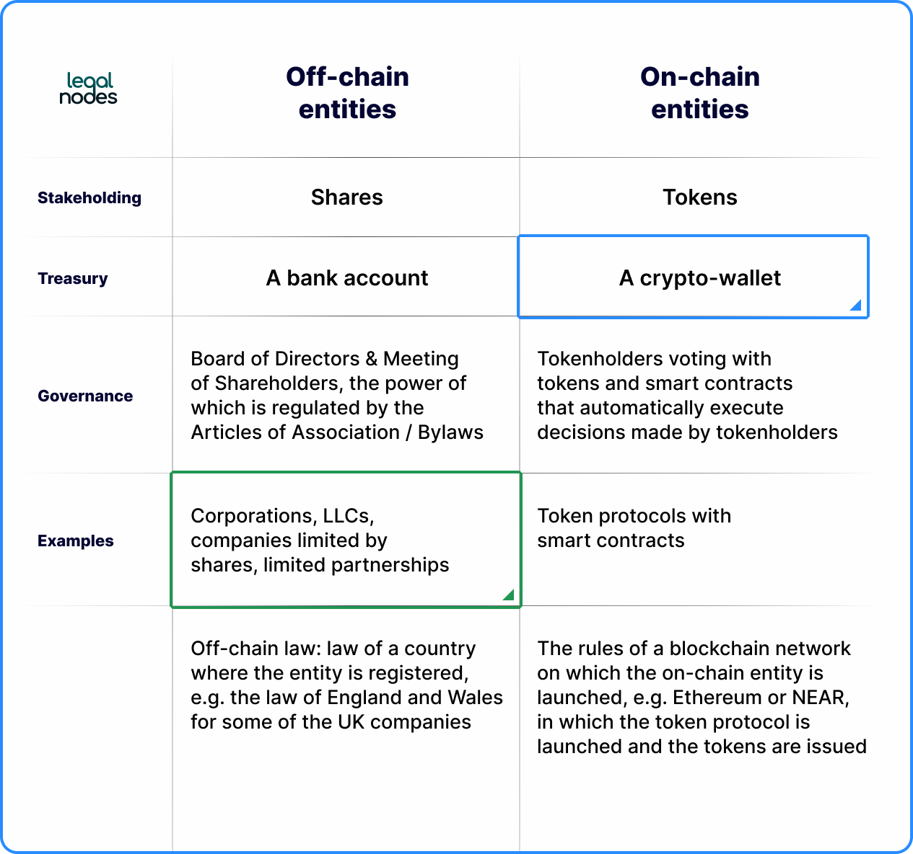

## Table of Contents

## What is blockchain governance?

Blockchain governance refers to the rules, processes, and methods used to manage and make decisions about a blockchain network. It involves how changes are proposed, discussed, and implemented within the system. This is important because it helps keep the blockchain running smoothly and fairly, ensuring that everyone using it agrees on how it should work.

In simpler terms, think of blockchain governance like the rules of a game that everyone playing has to follow. If players want to change the rules, they need to talk about it and agree on the changes. This process can happen in different ways, like voting or discussions among key members of the community. Good governance helps make sure the blockchain stays secure, reliable, and useful for everyone involved.

## What is on-chain governance?

On-chain governance is a way to make decisions about a blockchain where the voting and decision-making happen directly on the blockchain itself. This means that people who hold the blockchain's cryptocurrency can vote on changes or proposals using their digital wallets. It's like having a big online meeting where everyone can see the votes and results right away.

This type of governance is seen as more open and fair because it's hard for a small group of people to control the decisions. It also makes the process faster and more transparent since everything is recorded on the blockchain. However, it can be tricky because not everyone might understand the proposals, and sometimes, big holders of the [cryptocurrency](/wiki/cryptocurrency) can have more say in the decisions.

## What is off-chain governance?

Off-chain governance is when decisions about a blockchain are made outside of the blockchain itself. This means people discuss and vote on changes through forums, social media, or meetings, not directly on the blockchain. It's like having a club where members talk about changes in person or online, then agree on what to do.

This type of governance can be easier for people to understand because they can talk things out and explain ideas in simple ways. But it can also be less open and fair because not everyone might see or join the discussions. Sometimes, a small group of people can make decisions without everyone knowing, which can lead to disagreements within the community.

## How does on-chain governance work in a blockchain?

On-chain governance works by letting people who hold the blockchain's cryptocurrency vote on changes directly on the blockchain. If someone wants to change something, like adding a new feature or fixing a problem, they make a proposal. This proposal is then shared with everyone on the blockchain. People can read the proposal and decide if they like it or not. If they like it, they can vote yes using their cryptocurrency. If they don't like it, they can vote no. The votes are counted automatically on the blockchain, and if enough people vote yes, the change happens.

This way of making decisions is clear and open because everyone can see the votes and results right away. It's also fast because the blockchain does all the counting. But sometimes, people who have a lot of cryptocurrency can have more say in the decisions, which might not be fair to everyone. Also, not everyone might understand the proposals, so they might not vote at all. Even with these challenges, on-chain governance helps keep the blockchain running smoothly by letting the community decide what changes should be made.

## How does off-chain governance function in a blockchain ecosystem?

Off-chain governance in a blockchain ecosystem works by making decisions outside of the blockchain. People who are part of the community, like developers, users, or big investors, talk about changes they want to see. They use places like online forums, social media, or even meetings to discuss ideas. If someone has a new idea or wants to fix something, they share it with the group. Everyone talks about it, and if most people agree, they decide to make the change. This way of making decisions can be easier for people to understand because they can explain things in simple terms and have back-and-forth conversations.

However, off-chain governance can be less open and fair because not everyone might know about the discussions or be able to join them. Sometimes, a small group of people might make decisions without telling everyone, which can cause disagreements in the community. Even though it might not be as clear as on-chain governance, off-chain governance helps the blockchain ecosystem by letting people talk things out and agree on changes before they happen.

## What are the main differences between on-chain and off-chain governance?

On-chain governance means making decisions about a blockchain right on the blockchain itself. People who have the blockchain's cryptocurrency can vote on changes using their digital wallets. This way, everyone can see the votes and results right away, making it clear and fast. But sometimes, people with a lot of cryptocurrency can have more say, which might not be fair. Also, not everyone might understand the proposals, so they might not vote.

Off-chain governance, on the other hand, happens outside of the blockchain. People talk about changes in places like online forums, social media, or meetings. They discuss ideas and vote on them without using the blockchain. This can be easier for people to understand because they can explain things in simple terms and have conversations. But it can be less open because not everyone might know about the discussions or be able to join them. Sometimes, a small group might make decisions without telling everyone, which can cause disagreements.

Both types of governance help keep the blockchain running smoothly, but they do it in different ways. On-chain governance is more transparent and automatic, while off-chain governance relies more on people talking things out and agreeing on changes before they happen.

## Can you provide examples of blockchains that use on-chain governance?

One example of a blockchain that uses on-chain governance is Tezos. In Tezos, if someone wants to change something, they make a proposal and everyone who holds Tezos cryptocurrency can vote on it. The votes are counted right on the blockchain, so it's easy to see what everyone thinks. This way, the community can decide together what changes should happen, making sure the blockchain stays fair and useful for everyone.

Another example is Decred. In Decred, people who hold the cryptocurrency can vote on changes using their digital wallets. They use a system called Politeia to make and vote on proposals. Like Tezos, the votes are clear and open because they happen on the blockchain. This helps keep Decred running smoothly by letting the community have a say in how the blockchain should work.

## Can you provide examples of blockchains that use off-chain governance?

One example of a blockchain that uses off-chain governance is Bitcoin. In Bitcoin, if someone wants to change something, they talk about it on places like online forums or social media. They don't vote on the blockchain itself. Instead, they discuss the idea and if most people agree, they make the change. This way of making decisions can be easier for people to understand because they can explain things in simple terms and have conversations. But sometimes, not everyone might know about the discussions, which can cause disagreements.

Another example is Ethereum. Ethereum also uses off-chain governance. When someone wants to change something, they share their idea on forums or social media. The community talks about it and if they agree, they make the change. This helps keep Ethereum running smoothly by letting people talk things out and agree on changes before they happen. But like Bitcoin, it can be less open because not everyone might join the discussions, and sometimes a small group might make decisions without telling everyone.

## What are the advantages of on-chain governance over off-chain governance?

On-chain governance has some big advantages over off-chain governance. One of the main ones is that it's very clear and open. When people vote on changes, they do it right on the blockchain, so everyone can see the votes and results right away. This makes it hard for a small group to control things without others knowing. It also makes the process faster because the blockchain counts the votes automatically. This way, everyone in the community can have a say in how the blockchain should work, making it more fair and democratic.

Another advantage is that on-chain governance can help keep the blockchain running smoothly. Because everyone can see what's happening, it's easier to agree on changes and make them happen quickly. This can make the blockchain more reliable and useful for everyone. But, it's not perfect. Sometimes, people who have a lot of the blockchain's cryptocurrency can have more say in the decisions, which might not be fair to everyone. Also, not everyone might understand the proposals, so they might not vote. Even with these challenges, on-chain governance helps make sure the blockchain stays secure and works well for the whole community.

## What are the advantages of off-chain governance over on-chain governance?

Off-chain governance has some big advantages over on-chain governance. One of the main ones is that it's easier for people to understand. When people talk about changes in places like online forums or meetings, they can explain things in simple terms and have back-and-forth conversations. This helps everyone understand what's going on and why changes might be good. It also lets people ask questions and get answers, which can make the decision-making process better.

Another advantage is that off-chain governance can be more flexible. Because the discussions happen outside of the blockchain, people can take their time to talk things out and agree on changes before they happen. This can help avoid big disagreements and make sure everyone is happy with the decisions. Even though it might not be as clear as on-chain governance, off-chain governance helps keep the blockchain running smoothly by letting people work together and agree on what's best for the community.

## How do on-chain and off-chain governance impact the scalability and security of a blockchain?

On-chain governance can help make a blockchain more secure because everyone can see the votes and decisions right on the blockchain. This makes it hard for a small group to do things without others knowing, which can keep the blockchain safe. But, on-chain governance can also make it harder for the blockchain to grow big and fast. Every time people vote, it takes up space on the blockchain, and if there are a lot of votes, it can slow things down. So, while on-chain governance is good for security, it might not be the best for making the blockchain bigger and faster.

Off-chain governance can help a blockchain grow bigger and faster because the discussions and votes happen outside of the blockchain. This means the blockchain doesn't get filled up with voting data, so it can handle more transactions and grow more easily. But, off-chain governance might not be as secure because not everyone can see what's happening. Sometimes, a small group might make decisions without telling everyone, which can make the blockchain less safe. So, while off-chain governance is good for making the blockchain bigger and faster, it might not be the best for keeping it secure.

## What future trends can we expect in on-chain and off-chain governance models?

In the future, we might see more blockchains using a mix of on-chain and off-chain governance to get the best of both worlds. This could mean using on-chain voting for big, important changes where everyone needs to see what's happening, and off-chain discussions for smaller changes or ideas that need more talking before voting. By mixing these two ways of making decisions, blockchains could become more fair, secure, and able to grow big and fast at the same time. People might also start using new tools and technology to make voting and discussing easier, like special apps or websites that help everyone join in and understand what's going on.

Another trend we might see is more people wanting to have a say in how blockchains work. As more people use cryptocurrencies and blockchains, they'll want to be part of the decisions that affect them. This could lead to new ways of voting and discussing that are easier for everyone to use, no matter where they are or how much they know about blockchains. Blockchains might also start using smart contracts and other tech to make sure votes are counted fairly and quickly, helping to keep the blockchain running smoothly and safely for everyone.

## References & Further Reading

[1]: Buterin, V. (2014). ["A Next-Generation Smart Contract and Decentralized Application Platform"](https://ethereum.org/content/whitepaper/whitepaper-pdf/Ethereum_Whitepaper_-_Buterin_2014.pdf) Ethereum White Paper.

[2]: Tezos Development Team. ["Tezos: A Self-Amending Crypto-Ledger"](https://tezos.com/whitepaper.pdf) Tezos White Paper.

[3]: De Filippi, P., & Wright, A. (2018). ["Blockchain and the Law: The Rule of Code"](https://www.jstor.org/stable/j.ctv2867sp) Harvard University Press.

[4]: Lacerda, A. B., & Endo, A. T. (2021). ["Comparative Study on Blockchain Governance Models"](https://www.sciencedirect.com/science/article/pii/S0740624X21000617) Journal of Internet Services and Applications. 

[5]: Zhao, L., Xu, X., & Camilleri, P. (2020). ["On-Chain and Off-Chain Governance: Challenges and Opportunities"](https://onlinelibrary.wiley.com/doi/10.1002/adfm.202003619) IEEE Internet of Things Journal.