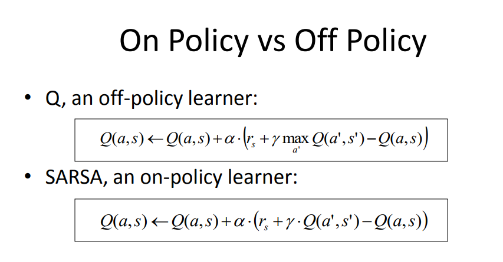

## Table of Contents

## What is On-Policy TD Control in the context of reinforcement learning?

On-Policy TD Control is a method in reinforcement learning where an agent learns to make decisions by directly following the policy it is trying to improve. This means the agent uses the same policy for both choosing actions and for learning from the experiences it gathers. A common algorithm for On-Policy TD Control is SARSA, which stands for State-Action-Reward-State-Action. In SARSA, the agent updates its policy based on the immediate experience it gets from following that policy, using a formula called the TD error. The TD error helps the agent understand how good or bad its prediction was compared to what actually happened.

The TD error in SARSA can be represented as $$ \delta = r + \gamma Q(s', a') - Q(s, a) $$, where $$ r $$ is the reward received, $$ \gamma $$ is the discount factor, $$ Q(s, a) $$ is the current estimate of the value of taking action $$ a $$ in state $$ s $$, and $$ Q(s', a') $$ is the estimate for the next state-action pair. The agent then updates its Q-value using this error, gradually improving its policy. Because the agent learns on-policy, it directly improves the policy it uses, making it practical for real-time learning scenarios where the agent must act and learn simultaneously.

## How does Sarsa work as an On-Policy TD Control method?

SARSA, which stands for State-Action-Reward-State-Action, is an on-policy TD control method used in reinforcement learning. It works by having an agent learn from its own actions and the experiences it gathers while following a specific policy. The agent starts in a state, takes an action according to its current policy, receives a reward, and transitions to a new state. Then, it takes another action from the new state. The key part of SARSA is that it uses these experiences to update its estimate of how good each action is in each state, called the Q-value. The update is based on the immediate experience, which makes it an on-policy method because the agent learns from the policy it is currently using.

The update in SARSA uses something called the TD error, which is the difference between the predicted value and the actual value experienced. The formula for the TD error in SARSA is $$ \delta = r + \gamma Q(s', a') - Q(s, a) $$, where $$ r $$ is the reward received, $$ \gamma $$ is the discount factor, $$ Q(s, a) $$ is the current estimate of the value of taking action $$ a $$ in state $$ s $$, and $$ Q(s', a') $$ is the estimate for the next state-action pair. The agent then updates its Q-value using this TD error, making its predictions more accurate over time. Because SARSA learns from the policy it is following, it directly improves the policy it uses, making it practical for real-time learning scenarios where the agent must act and learn simultaneously.

## What are the main differences between Sarsa and Q-learning?

SARSA and Q-learning are two methods used in reinforcement learning, but they have key differences. SARSA is an on-policy method, which means it learns from the same policy it uses to make decisions. In SARSA, the agent follows a policy, takes actions, and updates its knowledge based on what happens next. The update rule in SARSA uses the next action the agent will take, which is chosen according to the current policy. This is shown in the formula $$ \delta = r + \gamma Q(s', a') - Q(s, a) $$, where $$ r $$ is the reward, $$ \gamma $$ is the discount factor, and $$ Q(s, a) $$ and $$ Q(s', a') $$ are the Q-values for the current and next state-action pairs.

On the other hand, Q-learning is an off-policy method. This means it learns from actions that might not be the ones it would normally take. Q-learning updates its Q-values based on the best possible action in the next state, not necessarily the action it will take. The update rule in Q-learning is $$ \delta = r + \gamma \max_{a'} Q(s', a') - Q(s, a) $$. This difference makes Q-learning potentially more efficient in finding the optimal policy, but it can be less stable in practice because it doesn't learn from the policy it's actually using. SARSA, being on-policy, tends to be more stable and suitable for real-time learning where the agent must act and learn at the same time.

## Can you explain the concept of TD Lambda and its role in On-Policy TD Control?

TD Lambda is a way to make learning in reinforcement learning smarter by looking at different time steps. It's like a mix between learning from immediate experiences (like SARSA) and learning from longer sequences of experiences. In TD Lambda, we use something called the eligibility trace, which keeps track of how important past states and actions were. This helps the learner understand not just what happened right away, but also what happened a bit earlier. The lambda (λ) in TD Lambda is a number between 0 and 1 that decides how much the learner should care about past experiences. If λ is close to 0, the learner mostly cares about what just happened. If λ is close to 1, the learner looks at a longer history.

In On-Policy TD Control, like SARSA, TD Lambda helps by making the updates to the Q-values more accurate. Instead of just updating based on the immediate next step, TD Lambda lets the learner spread out the update over several steps. This can make the learning process smoother and faster. The formula for updating the Q-values with TD Lambda looks like this: $$ \Delta Q(s, a) = \alpha \delta_t e_t(s, a) $$, where $$ \alpha $$ is the learning rate, $$ \delta_t $$ is the TD error at time t, and $$ e_t(s, a) $$ is the eligibility trace for the state-action pair at time t. By using TD Lambda, the agent can learn more effectively from its own actions, making it a powerful tool for on-policy learning where the agent must act and learn at the same time.

## How does Expected Sarsa improve upon traditional Sarsa?

Expected Sarsa improves upon traditional Sarsa by making better use of the information available at each step. In traditional Sarsa, the Q-value update depends on the next action chosen according to the current policy. This can sometimes lead to less stable learning because it relies heavily on the specific action taken next. Expected Sarsa, on the other hand, calculates the expected value of the next state by considering all possible actions and their probabilities under the current policy. This makes the updates smoother and less dependent on the randomness of the next action, leading to more stable and potentially faster learning.

The key difference in the update rule between Sarsa and Expected Sarsa highlights this improvement. In Sarsa, the update rule is $$ \delta = r + \gamma Q(s', a') - Q(s, a) $$, where $$ r $$ is the reward, $$ \gamma $$ is the discount factor, and $$ Q(s', a') $$ is the Q-value for the next state-action pair. Expected Sarsa uses an update rule that looks like this: $$ \delta = r + \gamma \sum_{a'} \pi(a' | s') Q(s', a') - Q(s, a) $$, where $$ \pi(a' | s') $$ is the probability of taking action $$ a' $$ in state $$ s' $$ according to the current policy. By considering the expected value over all possible next actions, Expected Sarsa reduces the variance in the updates, making the learning process more reliable and efficient.

## What is the significance of the lambda parameter in TD Lambda methods?

The lambda parameter in TD Lambda methods is a number between 0 and 1 that helps decide how much the learner should care about past experiences. When lambda is close to 0, the learner mostly focuses on what just happened, making it similar to regular TD learning. This means the updates to the Q-values are based mostly on the immediate next step. On the other hand, when lambda is close to 1, the learner looks at a longer history of experiences. This can make the learning process smoother and faster because it spreads out the updates over several steps, taking into account a broader range of past events.

In practical terms, the lambda parameter affects how the eligibility trace works. The eligibility trace keeps track of how important past states and actions were. When you use TD Lambda, the update to the Q-values is calculated using the formula $$ \Delta Q(s, a) = \alpha \delta_t e_t(s, a) $$, where $$ \alpha $$ is the learning rate, $$ \delta_t $$ is the TD error at time t, and $$ e_t(s, a) $$ is the eligibility trace for the state-action pair at time t. By adjusting lambda, you can control how much the past influences the current updates, making TD Lambda a flexible tool for reinforcement learning that can be tuned to different learning scenarios.

## How does True Online TD Lambda differ from the standard TD Lambda algorithm?

True Online TD Lambda is a special version of the TD Lambda method that tries to fix a problem in the standard TD Lambda algorithm. The standard TD Lambda can sometimes make updates that are not as accurate as they could be because it mixes old and new information in a way that can be confusing. True Online TD Lambda solves this by making sure the updates are more precise. It does this by keeping a separate track of the old information, so it doesn't mix it up with the new information when updating the Q-values.

The main difference between the two methods is how they handle the eligibility trace. In True Online TD Lambda, the update formula is more complicated because it includes an extra term to make sure the updates are correct. The update rule for True Online TD Lambda is $$ \Delta Q(s, a) = \alpha ( \delta_t - \bar{\delta}_t ) e_t(s, a) $$, where $$ \alpha $$ is the learning rate, $$ \delta_t $$ is the TD error at time t, $$ \bar{\delta}_t $$ is an average of past TD errors, and $$ e_t(s, a) $$ is the eligibility trace. This extra term, $$ \bar{\delta}_t $$, helps make sure the updates are more accurate and don't get mixed up with old information, making True Online TD Lambda a more reliable method for learning in reinforcement learning scenarios.

## What are the practical applications of Sarsa Lambda in real-world scenarios?

Sarsa Lambda is a powerful tool used in real-world scenarios where an agent needs to learn how to make good decisions over time. Imagine a robot that needs to navigate through a busy warehouse to pick up and deliver items. Sarsa Lambda helps the robot learn the best paths to take by considering not just what happens right away, but also what has happened before. By using the lambda parameter, the robot can adjust how much it cares about past experiences, making its learning more effective and tailored to the specific environment it's in.

Another practical use of Sarsa Lambda is in game AI, like in video games where characters need to learn strategies to beat opponents. In a game like chess, Sarsa Lambda can help the AI learn the best moves by looking at long sequences of moves and understanding how earlier moves affect later ones. The lambda parameter allows the AI to fine-tune its learning, focusing more on recent moves or taking into account a broader history of the game, depending on what works best. This makes the game AI smarter and more competitive, enhancing the gaming experience for players.

## How do you implement eligibility traces in Sarsa Lambda?

In Sarsa Lambda, eligibility traces help the agent remember past states and actions so it can learn from them over time. Think of it like leaving a trail of breadcrumbs as you walk through a forest. Each breadcrumb represents a state or action you took, and the trail helps you understand how you got to where you are. In Sarsa Lambda, the eligibility trace, often written as $$ e_t(s, a) $$, gets updated every time step. If you take an action in a state, the trace for that state-action pair gets a little boost, and then it slowly fades away over time. This fading is controlled by the lambda parameter, which decides how much the past matters.

Here's how you can implement eligibility traces in Sarsa Lambda in code:

```python
import numpy as np

class SarsaLambda:
    def __init__(self, state_space, action_space, alpha, gamma, lambda_val):
        self.Q = np.zeros((state_space, action_space))
        self.e = np.zeros((state_space, action_space))
        self.alpha = alpha
        self.gamma = gamma
        self.lambda_val = lambda_val

    def choose_action(self, state, epsilon):
        if np.random.random() < epsilon:
            return np.random.randint(self.Q.shape[1])
        else:
            return np.argmax(self.Q[state])

    def update(self, s, a, r, s_next, a_next):
        delta = r + self.gamma * self.Q[s_next, a_next] - self.Q[s, a]

        self.e[s, a] += 1

        self.Q += self.alpha * delta * self.e
        self.e *= self.gamma * self.lambda_val

        # Reset eligibility traces to zero if terminal state is reached
        if s_next == -1:  # Assuming -1 is the terminal state
            self.e = np.zeros_like(self.e)
```

In this code, the eligibility trace `e` is updated every time step. When an action is taken in a state, `e[s, a]` gets set to 1, and then it's scaled down by `gamma * lambda_val` in each subsequent step. This way, the agent can learn from a sequence of actions and states, not just the immediate next step. The lambda parameter lets you control how much the agent should care about past experiences, making Sarsa Lambda a flexible tool for many different learning scenarios.

## What are the convergence properties of On-Policy TD Control methods like Sarsa and Sarsa Lambda?

On-Policy TD Control methods like Sarsa and Sarsa Lambda generally converge to the optimal policy under certain conditions. For Sarsa, it will converge to the optimal policy if you keep exploring all possible actions and if the learning rate decreases over time in the right way. This means that as the agent keeps learning, it will eventually find the best way to act in each situation. The formula for updating the Q-values in Sarsa is $$ \delta = r + \gamma Q(s', a') - Q(s, a) $$, where $$ r $$ is the reward, $$ \gamma $$ is the discount factor, and $$ Q(s, a) $$ and $$ Q(s', a') $$ are the Q-values for the current and next state-action pairs. If you use this update rule correctly, Sarsa will slowly but surely find the best policy.

Sarsa Lambda, which uses eligibility traces, also converges to the optimal policy, but it can do so more efficiently. The lambda parameter in Sarsa Lambda helps the agent learn from a longer sequence of actions and states, making the learning process smoother and faster. The eligibility trace, written as $$ e_t(s, a) $$, keeps track of how important past states and actions were. By adjusting the lambda value, you can control how much the agent should care about past experiences. The update rule for Sarsa Lambda includes the eligibility trace: $$ \Delta Q(s, a) = \alpha \delta_t e_t(s, a) $$, where $$ \alpha $$ is the learning rate and $$ \delta_t $$ is the TD error at time t. With the right settings, Sarsa Lambda can reach the optimal policy more quickly than regular Sarsa.

## How can the performance of On-Policy TD Control methods be optimized for complex environments?

To optimize the performance of On-Policy TD Control methods like Sarsa and Sarsa Lambda in complex environments, it's important to fine-tune the learning parameters. For instance, adjusting the learning rate $$ \alpha $$ and the discount factor $$ \gamma $$ can have a big impact. A good learning rate helps the agent learn quickly but not so fast that it misses important details. The discount factor controls how much the agent cares about future rewards. In complex environments, setting $$ \gamma $$ close to 1 can help the agent think about long-term outcomes, which is often necessary in tasks with many steps.

Another way to boost performance is by using techniques like function approximation. Instead of keeping a separate Q-value for every state and action, you can use a function to estimate these values. This can be especially helpful in environments with a large number of states and actions, where storing all Q-values would be too hard. You can use methods like neural networks to approximate the Q-function. For Sarsa Lambda, using eligibility traces effectively is also key. By carefully choosing the lambda value, you can control how much the agent should focus on recent experiences versus a broader history, which can lead to better learning in complex scenarios.

## What are the latest research developments in On-Policy TD Control and their potential impacts on future applications?

Recent research in On-Policy TD Control has focused on improving the efficiency and stability of learning algorithms like Sarsa and Sarsa Lambda. One notable development is the exploration of adaptive learning rates. Instead of using a fixed learning rate $$ \alpha $$, researchers have proposed methods that adjust $$ \alpha $$ based on the agent's performance. This can help the agent learn faster in the beginning and then fine-tune its knowledge more precisely as it gets closer to the optimal policy. Another exciting area is the use of advanced function approximation techniques, such as deep neural networks, to handle high-dimensional state and action spaces. These techniques allow the agent to learn complex policies in environments that were previously too challenging.

These developments could have a big impact on future applications. For example, in robotics, adaptive learning rates and better function approximation could lead to robots that can learn to navigate and perform tasks in real-world environments more quickly and reliably. In the field of game AI, these improvements could result in more sophisticated and adaptive opponents, enhancing the gaming experience. Overall, the ongoing research in On-Policy TD Control is paving the way for more efficient and effective learning algorithms, which could revolutionize how autonomous systems learn and operate in complex, real-world settings.