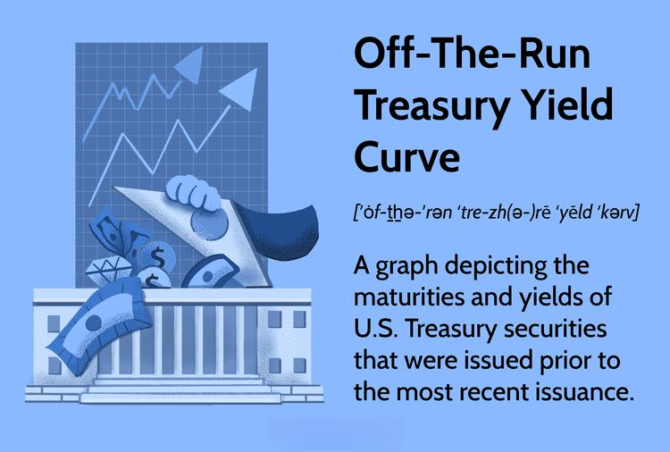

The financial landscape is constantly evolving, offering an array of instruments and strategies for investors and traders to leverage. Among these, Treasury trading stands out, particularly through on-the-run Treasuries. These securities hold significant importance within financial markets due to their role as benchmarks for the most recently issued U.S. Treasury securities across specific maturities. Their high liquidity makes them an attractive choice for those seeking efficient entry and exit strategies, thus becoming a focal point in market commentary and financial analysis.

On-the-run Treasuries are different from their off-the-run counterparts, which consist of older issues continuing to trade after newer releases become available. Despite this distinction, both play vital roles in the broader market dynamics. In the trading of on-the-run Treasuries, a dynamic and liquid market prevails, marked by efficient price discovery mechanisms. These securities often trade at a premium over off-the-run Treasuries due to heightened demand, resulting in slightly lower yields.



Moreover, algorithmic trading has significantly influenced the trading sphere of on-the-run Treasuries. Advanced algorithms facilitate rapid trade execution, responding instantaneously to market shifts and data releases. High-frequency trading (HFT) firms, in particular, utilize sophisticated algorithms to exploit minor price movements, subsequently contributing to narrower bid-ask spreads and improved market efficiency.

The spectrum of advantages associated with on-the-run Treasuries includes unparalleled liquidity and their function as reliable benchmarks. These qualities make them ideal for hedging and rapid trades, although they are typically accompanied by a liquidity premium. However, long-term investors might still gravitate towards off-the-run Treasuries for achieving similar returns at potentially lower costs.

Regulatory frameworks, including the Dodd-Frank Act, underscore the importance of transparency in trading activities, thereby influencing the trading landscape of on-the-run Treasuries. Additionally, the Federal Reserve's open market operations involve these securities, impacting both their yields and pricing, while efforts to maintain market stability enhance the trading environment for all participants.

Understanding on-the-run Treasuries and the evolving technological landscape surrounding their trade is crucial for effective portfolio management and strategic development. These securities not only serve as indispensable market instruments but also act as critical indicators of economic conditions.

## Table of Contents

## Understanding On-The-Run Treasuries

On-the-run Treasuries are the most recently issued U.S. Treasury securities and are recognized as benchmarks for specific maturities. These instruments are pivotal in financial markets due to their high [liquidity](/wiki/liquidity-risk-premium), which attracts investors who prioritize quick entry and [exit](/wiki/exit-strategy) strategies. The liquidity of on-the-run Treasuries is a significant advantage, as these securities are frequently traded, ensuring narrow bid-ask spreads and facilitating efficient price discovery.

In contrast, off-the-run Treasuries refer to older Treasury issues that are still actively traded but have been replaced by more recent on-the-run issues. Despite being less liquid, off-the-run Treasuries are still integral to the market, often appealing to long-term investors seeking potentially higher yields at lower costs.

The preference for on-the-run Treasuries in trading circles is largely attributed to their liquidity and prominence in market commentary and financial analysis. The regular issuance of these securities by the U.S. Treasury provides continuous benchmarks that help investors gauge the overall performance of the bond market and the broader economy. The efficiency and reliability of on-the-run Treasuries make them a focal point for economists and analysts monitoring trends in interest rates and economic stability.

Through regular Treasury auctions, on-the-run securities provide insights into investor demand and risk appetite, influencing macroeconomic indicators and monetary policy considerations. As such, understanding on-the-run Treasuries, alongside their off-the-run counterparts, is essential for market participants aiming to refine their investment strategies and enhance their comprehension of the financial landscape.

## Trading On-The-Run Treasuries

The trading of on-the-run Treasuries is characterized by a highly dynamic market environment, marked by high liquidity and efficient price discovery mechanisms. On-the-run Treasuries represent the most recently issued U.S. government debt securities for specific maturities, making them a focal point for market participants. Their inherent liquidity translates to significant demand, causing these securities to often trade at a premium. This premium results in slightly lower yields compared to their off-the-run counterparts, which are older issues of Treasury securities.

Arbitrage opportunities frequently arise in Treasury markets due to pricing differentials between on-the-run and off-the-run securities. These differentials exist because on-the-run Treasuries are more actively traded and are generally considered more liquid. Traders and investors can capitalize on these opportunities by simultaneously buying and selling on-the-run and off-the-run Treasuries to exploit these small price discrepancies. This strategy relies on the principle that despite the differences in liquidity and demand, both on-the-run and off-the-run Treasuries are fundamentally backed by the U.S. government and should, over time, converge in valuation adjusted for liquidity premium.

The status transition from on-the-run to off-the-run is crucial for traders aiming to optimize their strategies. On-the-run Treasuries eventually become off-the-run when a new issue is released for the same maturity. Understanding the liquidity dynamics and pricing behavior during this transition period can allow traders to anticipate changes in yields and market conditions, offering potential opportunities for informed decision-making.

These dynamics underscore the importance of continuous market analysis and the strategic use of modeling tools to assess potential price movements. For example, quantitative models could be employed to estimate expected price changes based on historical yield spreads between on-the-run and off-the-run issues, using Python libraries like NumPy or pandas to handle large datasets efficiently. By analyzing past performance, traders can formulate more robust strategies and improve their response to market changes.

## Algorithmic Trading and Its Impact

Algorithmic trading has become a cornerstone in the trading of on-the-run Treasuries, significantly enhancing both trading efficiency and market liquidity. Sophisticated trading algorithms enable market participants to execute trades at unprecedented speeds, instantly adapting to market fluctuations and data releases. These algorithms process vast amounts of market data and execute millions of calculations per second, allowing traders to exploit even the slightest movements in Treasury prices.

High-frequency trading ([HFT](/wiki/high-frequency-trading-strategies)) firms are at the forefront of employing intricate algorithms in the Treasury market. These firms utilize complex mathematical models and state-of-the-art technology to predict short-term price changes in on-the-run Treasuries, executing large volumes of trades in fractions of a second. The primary objective of HFT in this context is to profit from bid-ask spread differentials, engaging in what is known as market-making strategies. For instance, consider a Python snippet that illustrates how an algorithm might decide to place a trade based on predicted price movements:

```python
def predict_price_movements(current_data, historical_data):
    # Example of a simple moving average crossover strategy
    short_window = current_data.rolling(window=10).mean()
    long_window = historical_data.rolling(window=50).mean()

    signals = (short_window > long_window).astype(int)
    signals[signals == 0] = -1

    return signals

def trade_on_signal(signal, current_price):
    if signal > 0:  # Buy signal
        return "Buy", current_price
    elif signal < 0:  # Sell signal
        return "Sell", current_price
    else:
        return "Hold", current_price

# Simulation of trading decision
import pandas as pd
current_data = pd.Series([98.50, 99.00, 98.75])  # Current price data
historical_data = pd.Series([100.00, 99.50, 98.75])  # Historical price data

signal = predict_price_movements(current_data, historical_data)
decision, price = trade_on_signal(signal.iloc[-1], current_data.iloc[-1])

print(f"Trade Decision: {decision} at price {price}")
```

The rapid execution of such trading strategies narrows bid-ask spreads, a fundamental measure of market efficiency. Narrower spreads result from the increased competition among trading firms and the speed at which they can update their quotes in response to market dynamics. This enhanced efficiency benefits all market participants by ensuring that prices more accurately reflect the underlying value of on-the-run Treasuries at any given time.

Moreover, [algorithmic trading](/wiki/algorithmic-trading) reduces market impact costs by executing trades in smaller lots, thereby minimizing the shifts that large trades would otherwise impose on the market. In essence, this ensures that the liquidity of on-the-run Treasuries remains robust, with traders enjoying fewer constraints when entering and exiting positions.

In conclusion, algorithmic trading plays a pivotal role in shaping the market for on-the-run Treasuries by promoting liquidity and refining the price discovery process. Its reliance on fast-paced computations and sophisticated algorithms places it at the heart of modern financial markets, continually pushing the boundaries of what is achievable in Treasury trading.

## Advantages and Limitations

On-the-run Treasuries, the most recently issued U.S. Treasury securities, are integral to the smooth functioning of financial markets due to their unparalleled liquidity. This high liquidity makes them exceptionally attractive for investors seeking to execute hedging strategies or engage in quick trades, providing the ability to enter and exit positions swiftly without significant price impact. However, this liquidity advantage often comes at a price; on-the-run Treasuries typically trade at a premium compared to their older counterparts, the off-the-run Treasuries. This premium reflects in their slightly lower yields, leading to a liquidity premium that market participants should consider when assessing investments.

For long-term investors, off-the-run Treasuries might be more appealing as they can potentially offer similar returns at lower prices. The lower demand and reduced liquidity of off-the-run Treasuries can result in higher yields, offering a possible advantage for investors focusing on maximizing returns over a longer horizon. This situation presents a cost-benefit analysis where investors must weigh the advantages of higher liquidity and ease of transactions against the possibility of better returns in the longer term.

Understanding the liquidity premium associated with on-the-run Treasuries is crucial for all market participants. Proper assessment and strategic selection between on-the-run and off-the-run Treasuries can significantly influence investment outcomes. Decision-making should account for factors such as an investor's time horizon, risk tolerance, and specific portfolio requirements. The premium paid for on-the-run securities, justified by their benchmark status and liquidity, needs to be evaluated against an investor's unique financial objectives, ensuring that the choice of Treasury type aligns with their overall strategy. This understanding is central to optimizing investment strategies and achieving desired financial goals within the dynamic Treasury market landscape.

## Regulatory Considerations

The regulatory landscape for on-the-run Treasuries is defined by frameworks that underscore the need for transparency and fair trading practices. The Dodd-Frank Wall Street Reform and Consumer Protection Act, enacted in 2010, plays a critical role in enhancing transparency across financial markets, including the trading of on-the-run Treasuries. This comprehensive legislation mandates more rigorous reporting and record-keeping for derivative transactions, indirectly influencing market practices related to Treasury securities. By imposing stricter oversight, the Dodd-Frank Act aims to prevent systemic risks and ensure stability in financial markets.

Furthermore, the Federal Reserve’s open market operations frequently involve on-the-run Treasuries, significantly impacting their yields and pricing dynamics. These operations are central to the Fed's monetary policy implementation, as they adjust the supply of reserves in the banking system to influence interest rates. For example, when the Federal Reserve buys on-the-run Treasuries, it injects liquidity into the market, which typically results in lower yields due to increased demand. Conversely, selling these securities can absorb liquidity, potentially raising yields.

Regulations concerning on-the-run Treasuries are designed to maintain market stability and ensure that trading practices are both fair and transparent. These regulations necessitate robust disclosure requirements and emphasize the importance of market participants adhering to ethical trading practices. Compliance with these rules is intended to foster investor confidence and maintain orderly market conditions. As regulatory bodies continue to adapt to the evolving financial landscape, the focus remains on balancing innovation with the need to protect market integrity and mitigate risks associated with high-frequency and algorithmic trading activities.

## Conclusion

On-the-run Treasuries play a central role in the financial markets, serving as vital benchmarks for assessing interest rates and market sentiment. Their liquidity ensures that they are a critical tool for hedging and [arbitrage](/wiki/arbitrage) strategies, enabling market participants to manage risk effectively and capitalize on pricing inefficiencies. The high turnover and consistent demand for these securities also mean they are a prime source of insight into broader economic conditions, frequently used to gauge investor expectations and trends.

The rise of algorithmic trading has further transformed the trading landscape for on-the-run Treasuries. By leveraging sophisticated technological solutions, market participants can execute trades with unprecedented speed and precision, enhancing liquidity and narrowing bid-ask spreads. These advancements have not only improved market efficiency but also underscored the importance of on-the-run Treasuries in the financial ecosystem.

For investors and traders, a deep understanding of these securities, including their trading environment and associated dynamics, is essential for crafting effective portfolio management and strategic decision-making. The intricate interplay between market behavior, technological advances, and regulatory frameworks continues to shape the role and utility of on-the-run Treasuries. As such, staying informed about these factors is critical for optimizing investment outcomes and navigating the complexities of contemporary financial markets.

## References & Further Reading

[1]: Fleming, M. J. (2003). ["Measuring Treasury Market Liquidity."](https://www.newyorkfed.org/medialibrary/media/research/epr/03v09n3/0309flempdf.pdf) Federal Reserve Bank of New York Economic Policy Review.

[2]: Hendershott, T., Jones, C. M., & Menkveld, A. J. (2011). ["Does Algorithmic Trading Improve Liquidity?"](https://onlinelibrary.wiley.com/doi/full/10.1111/j.1540-6261.2010.01624.x) The Review of Financial Studies, Volume 24, Issue 8.

[3]: Adrian, T., Boyarchenko, N., & Shachar, O. (2017). ["Dealer Balance Sheets and Bond Liquidity Provision."](https://papers.ssrn.com/sol3/papers.cfm?abstract_id=3028612) National Bureau of Economic Research Working Paper 23521.

[4]: Lopez de Prado, M. (2018). ["Advances in Financial Machine Learning."](https://www.amazon.com/Advances-Financial-Machine-Learning-Marcos/dp/1119482089) Wiley.

[5]: Hendershott, T., & Moulton, P. C. (2011). ["Automation, Speed, and Stock Market Quality: The NYSE's Hybrid."](https://www.sciencedirect.com/science/article/pii/S138641811100005X) The Journal of Finance, Volume 66, Issue 1.