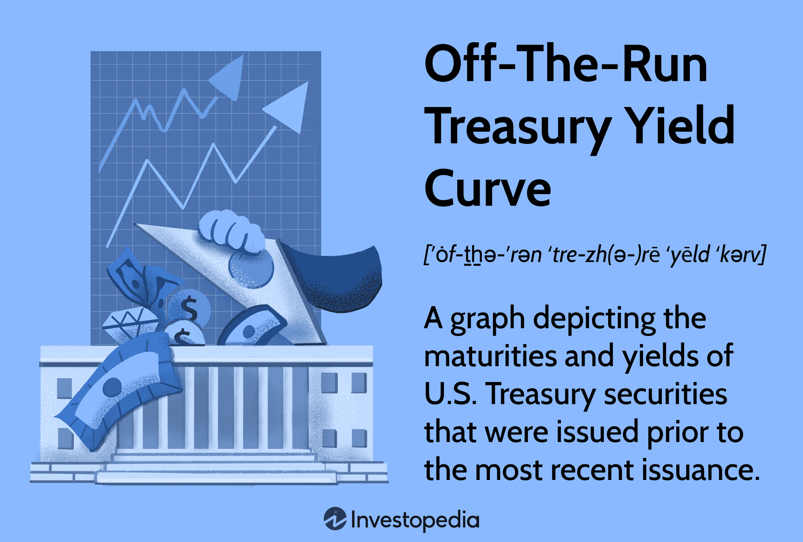

The bond market is a complex and dynamic part of the financial system, offering numerous opportunities and insights for investors. One of its fundamental elements is the on-the-run Treasury yield curve, which serves as a crucial instrument for pricing and trading fixed-income securities. This yield curve represents the yields of the most recently issued U.S. Treasury securities relative to their maturities, thus providing the most current market data available. In parallel, algorithmic trading, often referred to as algo trading, has significantly transformed the approach to bond trading by leveraging computational techniques for enhancing both efficiency and accuracy.

This article aims to explore how the on-the-run Treasury yield curve integrates with algorithmic trading within the bond market. It will discuss the definitions and roles of on-the-run versus off-the-run securities, highlighting their distinctions and implications for trading strategies that employ algorithmic models. By understanding these elements, investors can better navigate the intricacies of bond markets and optimize their trading outcomes. Algorithmic trading strategies that draw on real-time data and sophisticated models have the potential to unlock new opportunities within these markets, moving beyond conventional trading limits and adapting to rapid changes in market conditions.



## Table of Contents

## Understanding On-The-Run Treasury Yield Curve

The on-the-run Treasury yield curve is a vital representation of interest rates for the most recently issued U.S. Treasury securities across varying maturities. This curve is a crucial reference point for pricing a range of fixed-income securities, serving as a barometer for the most up-to-date market conditions. For investors and traders, it provides insights into the current borrowing costs, offering a snapshot of the government's latest borrowing rates.

The primary appeal of the on-the-run yield curve lies in its ability to reflect real-time market dynamics. It adjusts quickly to changing market conditions, making it a favored tool for those seeking the freshest market information. However, this responsiveness can sometimes be a double-edged sword. The curve's accuracy might be compromised by factors such as market volatility and fluctuations in demand. These factors can lead to distortions, affecting the curve's reliability as a benchmark.

Despite these challenges, the on-the-run Treasury yield curve remains an integral element of many trading strategies. To harness its full potential, one must thoroughly understand its shape and applications. The curve often exhibits various forms, such as upward-sloping, flat, or inverted, each indicating different market sentiments and economic outlooks. An upward-sloping curve typically suggests expectations of economic growth and inflation, whereas an inverted curve may signal economic downturns.

In practice, traders use the on-the-run yield curve to inform their decisions on maturity selection, assessing interest rate risks, and determining yield spreads. By analyzing the curve's shifts and its correlation with economic indicators, traders can devise strategies aimed at optimizing trading outcomes. The on-the-run Treasury yield curve, with its immediate reflection of market rates, remains an indispensable tool for those navigating the complexities of the bond market.

## On-The-Run vs. Off-The-Run Treasuries: Key Differences

On-the-run Treasuries represent the most recently issued U.S. Treasury securities. They are favored for their high [liquidity](/wiki/liquidity-risk-premium), making them a central component of many trading strategies. These securities are frequently bought and sold in the market, which contributes to their attractiveness among traders seeking to engage in high-frequency trading or strategies requiring quick entry and [exit](/wiki/exit-strategy).

In contrast, off-the-run Treasuries are older securities that are not part of the most recent issuance. They tend to have lower liquidity, which results in less trading [volume](/wiki/volume-trading-strategy). However, this lack of liquidity often translates to higher yields as compensation for the reduced ease of purchase and sale. This yield differential creates opportunities for investors looking for better returns, albeit with potentially higher risk due to reduced marketability.

The distinct characteristics between on-the-run and off-the-run Treasuries facilitate different bond trading strategies. On-the-run securities are typically used in short-term strategies where liquidity is paramount, whereas off-the-run securities can be advantageous for yield-seeking investors who are willing to withstand lower liquidity. The yield advantage of off-the-run securities often exceeds the contemporaneous yields of their on-the-run counterparts due to the liquidity premium associated with the latter.

Traders leverage these differences by employing strategies such as maturity transformation, where they might short on-the-run Treasuries and simultaneously purchase off-the-run ones to benefit from the yield spread. This strategy attempts to capitalize on the relative liquidity and yield advantages. Calculating the yield spread accurately is essential, and can be represented mathematically as:

$$
\text{Yield Spread} = \text{Yield}_{\text{off-the-run}} - \text{Yield}_{\text{on-the-run}}
$$

Monitoring changes in these spreads can drive strategic decisions, especially in a market environment responsive to demand fluctuations and [interest rate](/wiki/interest-rate-trading-strategies) changes. By understanding these key differences, traders and investors can refine their strategy implementations to maximize potential returns and manage associated risks effectively.

## Algorithmic Trading in the Bond Market

Algorithmic trading, often referred to as algo trading, utilizes computer algorithms to execute trades according to pre-defined criteria such as price, timing, and volume. In the bond market, this form of trading offers distinct advantages, including enhanced efficiency, increased speed, and lower transaction costs. These benefits stem from the algorithms' ability to process vast amounts of data rapidly and execute trades at optimal moments, minimizing market impact and slippage.

In the context of Treasury securities, algo trading enables traders to leverage differences in liquidity and yield between on-the-run and off-the-run securities. On-the-run Treasuries, being the most recently issued bonds, typically exhibit higher liquidity levels, making them attractive for trading strategies seeking to exploit liquidity premiums. In contrast, off-the-run securities, which are older issues, often trade at higher yields due to lower liquidity. This divergence creates [arbitrage](/wiki/arbitrage) opportunities for traders equipped with algorithmic strategies.

By employing algorithms, traders can continuously monitor market conditions and identify moments when price discrepancies between on-the-run and off-the-run securities widen beyond typical levels. These discrepancies allow for the execution of arbitrage trades that can capitalize on the profit potential created by the liquidity and yield differential. The precision and speed of algo trading systems are crucial in executing such trades effectively, as these opportunities often arise and disappear within extremely short timeframes.

In Python, an example of a basic trading algorithm that identifies discrepancies between on-the-run and off-the-run yields could involve continuously retrieving and analyzing yield data:

```python
import numpy as np

def identify_arbitrage_opportunity(on_the_run_yield, off_the_run_yield, threshold=0.05):
    disparity = off_the_run_yield - on_the_run_yield
    if disparity > threshold:
        return "Arbitrage Opportunity Detected"
    return "No Arbitrage Opportunity"

# Example usage
on_the_run_yield = 1.5
off_the_run_yield = 1.7
print(identify_arbitrage_opportunity(on_the_run_yield, off_the_run_yield))
```

In this example, the algorithm evaluates the yield disparity to determine if it exceeds a set threshold, indicating an arbitrage opportunity. More sophisticated algorithms would integrate additional market data and utilize real-time streaming to enhance decision-making and execution processes.

Overall, the application of [algorithmic trading](/wiki/algorithmic-trading) in the bond market, particularly within Treasury securities, provides a mechanism for traders to exploit market inefficiencies and secure competitive trade executions. As technological advancements continue to evolve, the utilization and sophistication of algorithmic strategies in bond trading are likely to expand, offering further opportunities for market participants.

## Trading Strategies Leveraging the On-The-Run Yield Curve

Trading strategies that leverage the on-the-run Treasury yield curve focus on exploiting the liquidity and pricing dynamics between on-the-run and off-the-run securities. A prevalent strategy involves short-selling on-the-run Treasuries and purchasing off-the-run Treasuries to benefit from their price discrepancies. This approach capitalizes on the fact that on-the-run Treasuries typically have lower yields due to higher demand and greater liquidity, whereas off-the-run Treasuries, being older issues, often trade at a discount, providing higher yields.

Algorithmic trading plays a vital role in optimizing these strategies by allowing traders to monitor market conditions continuously and execute trades at moments of peak advantage. Algorithms can analyze a multitude of market factors in real-time, such as changes in yield differentials, Treasury auction results, and macroeconomic data releases, to make informed trading decisions. By employing precise algorithms, traders can reduce response times and enhance execution quality, thus capturing fleeting opportunities that manual trading might miss.

Moreover, advanced algorithms that incorporate [machine learning](/wiki/machine-learning) techniques offer an additional edge by adapting to evolving market environments. Machine learning models can identify complex patterns within vast datasets, providing insights that enhance the predictive accuracy of trading strategies. For instance, by training a machine learning algorithm on historical bond price data and various economic indicators, the model can anticipate shifts in the yield curve that traditional models might overlook.

A basic example of how algorithmic trading might be implemented using Python involves monitoring the yield spreads between on-the-run and off-the-run Treasuries and executing trades when specified conditions are met:

```python
import numpy as np
import pandas as pd

# Assuming data contains historical prices and yields
data = pd.read_csv('treasury_data.csv')

# Define thresholds for executing trades
spread_threshold = 0.05  # Example threshold for yield spread

# Calculate yield spreads
data['yield_spread'] = data['off_the_run_yield'] - data['on_the_run_yield']

# Trading signal generation
data['trade_signal'] = np.where(data['yield_spread'] > spread_threshold, 'sell_on-the-run', 'hold')

# Execute trades based on generated signals
for index, row in data.iterrows():
    if row['trade_signal'] == 'sell_on-the-run':
        # Execute short sell on-the-run and buy off-the-run
        execute_trade(row['on_the_run_price'], row['off_the_run_price'])

def execute_trade(on_the_run_price, off_the_run_price):
    # Example function to simulate trade execution
    print(f"Short selling on-the-run at {on_the_run_price}, buying off-the-run at {off_the_run_price}")

```

Such algorithmic approaches, coupled with the adaptive capabilities of machine learning, allow traders to refine their strategies and remain competitive in fast-paced bond markets. As technology continues to advance, integrating more sophisticated data analysis and predictive modeling into these algorithms will further enhance the effectiveness of trading strategies based on the on-the-run Treasury yield curve.

## The Future of Algo Trading in Bond Markets

The role of algorithmic trading in the bond market is poised for significant growth as advancements in technology continue to reshape the financial landscape. Algorithmic trading platforms are increasingly leveraging data analytics and [artificial intelligence](/wiki/ai-artificial-intelligence) (AI) to enhance trading strategies and execution. These tools allow traders to process vast amounts of market data rapidly, identifying patterns and trends that may be too complex and time-consuming for manual analysis.

Traders utilizing advanced data analytics and AI are positioned to maintain a competitive edge within rapidly changing market environments. By using machine learning algorithms, traders can refine their models continually, improving predictive accuracy and trade execution over time. These technologies enable more precise decision-making, reducing latency and increasing the efficiency of trade executions.

One promising area of development is the integration of macroeconomic indicators and global yield curves into algorithmic trading models. Macroeconomic factors such as interest rates, inflation, and GDP growth significantly influence bond prices and yields. As algo trading techniques evolve, the ability to incorporate these complex variables alongside technical market data becomes increasingly feasible, offering the potential for more robust and holistic trading strategies.

Further sophistication in algorithmic trading may involve the adoption of [deep learning](/wiki/deep-learning) models, which can analyze nonlinear relationships in financial data. By accommodating high-dimensional input spaces, these models can provide deeper insights into market movements. Traders might implement Python libraries like TensorFlow or PyTorch to develop and train these intricate deep learning models.

```python
import tensorflow as tf
from tensorflow.keras.layers import Dense
from tensorflow.keras.models import Sequential

# Simple deep learning model structure
model = Sequential([
    Dense(64, activation='relu', input_shape=(X_train.shape[1],)),
    Dense(64, activation='relu'),
    Dense(1, activation='linear')
])

model.compile(optimizer='adam', loss='mean_squared_error')
model.fit(X_train, y_train, epochs=100, batch_size=32)

# Making predictions
predictions = model.predict(X_test)
```

As this technological transformation continues, algorithmic traders are likely to gain an enhanced understanding of intricate market dynamics, facilitating more informed and agile trading decisions. This trend indicates a future where the bond market becomes ever more efficient, with returns potentially increased through advanced algorithmic techniques.

## Conclusion

The on-the-run Treasury yield curve, representing the most recently issued U.S. Treasury securities, plays a significant role in bond trading. It serves as a benchmark for establishing the pricing of various fixed-income securities. However, this curve is not immune to market distortions, primarily influenced by factors such as demand fluctuations and market [volatility](/wiki/volatility-trading-strategies). These distortions can occasionally limit the curve's reliability, compelling traders to incorporate additional analytical tools or reference points.

Algorithmic trading strategies that focus on the on-the-run Treasury yield curve can significantly enhance trading efficiency and profitability. By processing large volumes of data instantaneously and executing trades based on pre-set criteria, such as yield spreads between on-the-run and off-the-run Treasuries, algorithmic trading optimizes decision-making processes. This allows traders to make real-time adjustments to their strategies, capturing fleeting arbitrage opportunities that may arise due to market inefficiencies or shifts in liquidity.

Understanding the distinctions between on-the-run and off-the-run Treasuries is fundamental for developing effective trading strategies. On-the-run Treasuries, characterized by higher liquidity, often provide narrower yield spreads compared to their off-the-run counterparts. In contrast, off-the-run Treasuries may offer higher yields, reflecting their reduced liquidity and heightened risk premium. Recognizing these nuances enables traders to optimize portfolio construction, balancing liquidity preferences with yield expectations.

As the bond market continues to evolve, the integration of algorithmic trading with a deep understanding of Treasury yield curves will remain a valuable asset. Traders who effectively apply these principles can better navigate complex market conditions, ultimately achieving more favorable trading outcomes.

## References & Further Reading

[1]: ["Trading on the Yield Curve"](https://www.cmegroup.com/education/whitepapers/trading-the-treasury-yield-curve.html) by Martin Pring

[2]: ["Fixed Income Securities: Tools for Today's Markets"](https://www.amazon.com/Fixed-Income-Securities-Markets-Finance/dp/1119835550) by Bruce Tuckman and Angel Serrat

[3]: ["Algorithmic Trading and DMA: An Introduction to Direct Access Trading Strategies"](https://www.amazon.com/Algorithmic-Trading-DMA-introduction-strategies/dp/0956399207) by Barry Johnson

[4]: ["High-Frequency Trading: A Practical Guide to Algorithmic Strategies and Trading Systems"](https://www.ahmetbeyefendi.com/wp-content/uploads/2020/07/High-Frequency-Trading-Irene-Aldridge.pdf) by Irene Aldridge

[5]: ["Principles of Quantitative Equity Investing: A Complete Guide to Creating, Evaluating, and Implementing Trading Strategies"](https://books.google.com/books/about/Principles_of_Quantitative_Equity_Invest.html?id=4YS-CQAAQBAJ) by Sugata Ray