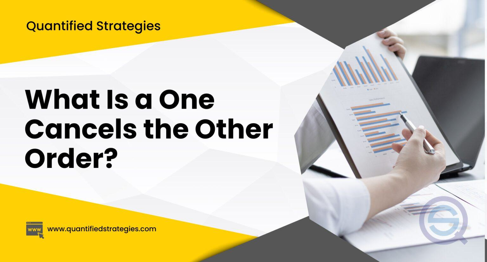

Financial trading is a multifaceted domain characterized by an array of strategies and order types, each designed to enhance trading performance. Among these, the One-Cancels-All (OCA) order stands out as a sophisticated tool tailored for experienced investors. The primary purpose of an OCA order is to effectively manage risk while potentially improving trading outcomes. When employing an OCA order, traders can bundle multiple limit orders, typically three or more, into a single unit. The execution of any one of these orders results in the cancellation of the remaining orders, thereby allowing traders to efficiently target optimal entry prices or stock selections.

This systematic nature of OCA orders makes them particularly suited for algorithmic trading, where the ability to dynamically respond to real-time market conditions is crucial. Algorithmic trading leverages OCA orders to streamline trade execution, manage contingent positions, and mitigate risks inherent in volatile market environments. As a result, OCA orders provide traders with a strategic tool to integrate complex trading strategies, bolstering both the robustness and flexibility essential in modern financial markets. In this article, we will examine the intricacies of OCA orders, elucidate their operational mechanics, and discuss their strategic applications in the context of algorithmic trading.



## Table of Contents

## Understanding One-Cancels-All (OCA) Orders

An OCA (One-Cancels-All) order consists of a group of at least three separate stock or option limit orders. The primary feature of this order type is that once one of the constituent orders is executed, the remaining orders in the group are automatically canceled. This characteristic serves the purpose of preventing multiple order executions that could lead to undesired positions or increased risk.

OCA orders are particularly advantageous for traders looking to optimize entry prices. For instance, when targeting a particular stock, various limit prices can be set; if the market meets the conditions of one order, it is executed while the others are canceled, ensuring the trade occurs at the preferred price without duplication of positions. This functionality is also applicable when a trader is choosing among several stocks. By placing OCA orders with differing stocks, a trader can execute the most favorable order that aligns with their strategy while canceling the others, effectively managing their investment options and resources.

These orders are predominantly available on broker platforms that cater to seasoned investors due to their sophisticated and intricate nature. The complexity of OCA orders requires a comprehensive understanding of market conditions and the strategic setup of orders, often making them suitable for experienced traders who require precision in trading execution and risk management. By enabling precise control over which trades are executed, OCA orders offer a strategic tool for managing trading outcomes efficiently.

## How OCA Orders Operate

OCA (One-Cancels-All) orders are a sophisticated component of trading strategies, offering traders the ability to execute a chosen path while automatically terminating alternative positions. They primarily involve limit, stop, or stop-limit orders, and can span multiple stocks or equity option contracts, providing a wide range of strategic possibilities.

The fundamental operational principle of an OCA order is straightforward: within the group of orders, execution of one triggers the automatic cancellation of the remaining orders. For instance, if a trader sets up an OCA group with three limit orders for different stocks, and one of these orders is fulfilled, the brokerage system will immediately cancel the other two. This mechanism is designed to minimize the risk of multiple fills, which could lead to unintended financial exposure and capital allocation.

Despite their efficiency, OCA orders inherently [carry](/wiki/carry-trading) a minor risk. This risk manifests if there's a delay between the execution of one order and the cancellation of others, a gap during which more than one order could inadvertently be filled. Such scenarios might occur due to latency in the trading system or during periods of high market [volatility](/wiki/volatility-trading-strategies), where order execution times are unpredictable. While brokerage platforms strive to mitigate such risks through advanced technological solutions and speedy order processing protocols, traders must remain aware of this potential limitation.

To illustrate the working of OCA orders with a programming example, consider a Python snippet using a pseudo-library for trading:

```python
# Pseudo-code demonstration of OCA order implementation

def execute_oca_order(order_list):
    for order in order_list:
        if order['status'] == 'FILLED':
            cancel_remaining_orders(order_list, order['id'])
            break

def cancel_remaining_orders(order_list, filled_order_id):
    for order in order_list:
        if order['id'] != filled_order_id:
            # Assume cancel_order is a function that cancels the specified order
            cancel_order(order['id'])

# Example order list
oca_orders = [
    {'id': 1, 'type': 'LIMIT', 'status': 'PENDING'},
    {'id': 2, 'type': 'STOP', 'status': 'PENDING'},
    {'id': 3, 'type': 'LIMIT', 'status': 'FILLED'}  # This order gets filled
]

# Execute OCA logic
execute_oca_order(oca_orders)
```

In this example, when one order is marked as filled, the `execute_oca_order` function proceeds to cancel the rest, emulating the process of OCA order execution in a brokerage platform. Overall, OCA orders enhance strategic trading capabilities through risk management, albeit with a need for cautious implementation to address potential latency challenges.

## Strategies Using OCA Orders

Investors employ One-Cancels-All (OCA) orders to enhance various trading strategies, primarily focusing on optimizing stock selection, improving entry points, and protecting against potential losses. 

### Optimizing Stock Selection
OCA orders enable investors to pinpoint and respond to the most favorable trading opportunities among a group of potential stocks. By placing limit orders on several stocks simultaneously, traders can set specific entry price points deemed optimal for each stock. Once the market reaches the predetermined price of any one of these stocks, that particular order will execute, triggering the automatic cancellation of the other pending orders. This approach allows traders to diversify their interest without committing capital to multiple positions at once, thus capturing potentially lucrative opportunities in a targeted manner.

### Optimizing Entry Points
Traders often face the dilemma of deciding the perfect moment to enter a trade. OCA orders streamline this decision-making process by integrating multiple investment routes into a single cohesive strategy. By placing limit orders at various price levels or for different stocks, traders can let the market dictate the optimal entry point. This flexibility aids in achieving better pricing, as an executed order automatically invalidates alternative scenarios, capturing the best strategic entry as market conditions evolve. Thus, OCA orders offer a systematic approach to entering positions with enhanced precision.

### Protecting Against Losses
Managing risk is a cornerstone of successful trading, and OCA orders provide a mechanism to protect against potential losses while securing profits. Traders can configure OCA orders to bracket their positions by combining sell limits with stop-loss orders. For instance, an investor holding a stock may place a sell limit order at a desired profit level, while simultaneously setting a stop-loss order at a price that limits potential downsides. The execution of one will nullify the other, ensuring that unintended multiple orders do not execute simultaneously. This strategic use of OCA orders not only shields against unfavorable market swings but also locks in gains when the market moves advantageously. 

By employing OCA orders in these strategic ways, traders can significantly enhance their command over market dynamics, allowing for efficient management of diverse market scenarios while optimizing their capital deployment.

## Applications in Algorithmic Trading

Algorithmic trading utilizes One-Cancels-All (OCA) orders to enhance the management of contingent trading positions, particularly in the fast-changing landscape of financial markets. The core strength of OCA orders in [algorithmic trading](/wiki/algorithmic-trading) is their ability to facilitate complex strategies that dynamically adjust to market conditions. 

### Efficient Position Management

In environments characterized by high volatility, algorithmic traders face the challenge of managing multiple trading positions simultaneously. The use of OCA orders allows traders to bundle related trades, ensuring that when one order in a group is executed, the remaining orders are automatically canceled. This mechanism minimizes the risk of multiple orders being filled, which can lead to unwanted exposure and increased risk.

Consider an algorithm designed to trade a portfolio of stocks based on predictive indicators. Each stock could have an associated OCA group containing limit orders at different price points. If one stock's order is fulfilled, the algorithm cancels the other pending orders, thereby optimizing the portfolio allocation without manual intervention.

### Implementation of Dynamic Strategies

The flexibility of OCA orders is particularly advantageous for implementing dynamic strategies in automated trading systems. These orders can integrate into high-frequency trading algorithms that need to adapt instantly to market movements, ensuring that traders capitalize on favorable conditions without delay.

For instance, suppose an algorithm aims to maximize gains by trading multiple technology stocks during earnings season. Using OCA orders, the algorithm can place contingent buy orders across several stocks, reacting quickly to earnings announcements. If the earnings report of one company leads to a significant price movement, the algorithm executes the order for that company, canceling the remaining contingent orders.

### Automation and Risk Mitigation

The automation associated with OCA orders enhances risk management by eliminating the need for manual oversight of each trading decision. Traders can develop algorithms that not only place OCA orders but also continually monitor market data to reassess the conditions and update strategies in real-time.

```python
# Example Python pseudo-code for using OCA orders in a trading algorithm
class OCATradingAlgorithm:
    def __init__(self, market_data, broker_api):
        self.market_data = market_data
        self.broker_api = broker_api

    def create_oca_group(self, stocks, order_params):
        oca_group_id = self.broker_api.create_oca_group()
        for stock in stocks:
            limit_price = self.calculate_limit_price(stock, order_params)
            self.broker_api.create_limit_order(stock, limit_price, oca_group_id)

    def calculate_limit_price(self, stock, order_params):
        # Define logic to calculate limit price based on market data
        return self.market_data.get_current_price(stock) * (1 + order_params['margin'])

# Usage
market_data = MarketData()
broker_api = BrokerAPI()
algorithm = OCATradingAlgorithm(market_data, broker_api)
algorithm.create_oca_group(['AAPL', 'GOOGL', 'MSFT'], {'margin': 0.05})
```

By effectively integrating OCA orders, algorithmic traders can proactively manage their portfolios, ensuring adherence to strategic objectives while minimizing exposure during market shifts. This capability makes OCA orders indispensable in the toolkit of algorithmic traders, providing the requisite control and precision needed in advanced trading scenarios.

## Technical Implementation and Broker Support

Effective implementation of One-Cancels-All (OCA) orders requires robust support from trading platforms and brokers capable of executing advanced order functionalities. These orders necessitate intricate coordination between software tools and brokerage systems to promptly cancel non-triggered orders upon execution of any order in the group.

**Brokers and OCA Orders**

Platforms like [Interactive Brokers](/wiki/interactive-brokers-api) are well-equipped to manage OCA orders, providing extensive support through their sophisticated trading interface and APIs. Interactive Brokers offers features that allow traders to create OCA groups efficiently, either through the platform's native interface or via automated systems using APIs. This functionality is crucial for traders who rely on precise, automated trading strategies to ensure rapid and accurate order management.

**APIs and Platform Features**

Interactive Brokers' API, for instance, supports the creation of OCA groups, facilitating the automation of complex trading strategies. By using the Interactive Brokers API, traders can programmatically define a group of orders, attach them as an OCA group, and submit them to the market. This process helps optimize trade executions and minimizes manual intervention, which is essential in high-frequency and algorithmic trading environments.

A typical Python script using the Interactive Brokers API to create OCA orders might look like this:

```python
from ibapi.client import EClient
from ibapi.wrapper import EWrapper
from ibapi.contract import Contract
from ibapi.order import Order

class IBApp(EWrapper, EClient):
    def __init__(self):
        EClient.__init__(self, self)

    def nextValidId(self, orderId):
        # Definition of an OCA group
        ocaGroup = "MyOCAGroup"

        # Create contract and order
        contract = Contract()
        contract.symbol = "AAPL"
        contract.secType = "STK"
        contract.exchange = "SMART"
        contract.currency = "USD"

        order1 = Order()
        order1.action = "BUY"
        order1.orderType = "LMT"
        order1.totalQuantity = 10
        order1.lmtPrice = 150
        order1.ocaGroup = ocaGroup

        order2 = Order()
        order2.action = "BUY"
        order2.orderType = "LMT"
        order2.totalQuantity = 10
        order2.lmtPrice = 145
        order2.ocaGroup = ocaGroup

        self.placeOrder(orderId, contract, order1)
        self.placeOrder(orderId + 1, contract, order2)

app = IBApp()
app.connect("127.0.0.1", 7497, clientId=1)
app.run()
```

**Challenges and Considerations**

The primary challenge in implementing OCA orders is ensuring swift cancellation of non-executed orders to prevent unintended multiple fills, which could lead to increased risk exposure. Thus, brokers must maintain fast and reliable systems to handle these processes efficiently. Moreover, not all brokerage platforms support OCA orders, and those that do may vary in functionality and user interface design.

Trading platforms must be carefully evaluated for their capability to support OCA orders effectively. Key considerations include the platform's latency, the reliability of its order management system, and the flexibility of its API in accommodating complex order types like OCA.

In summary, the technical implementation of OCA orders necessitates considerable broker support. For traders seeking to leverage these order types, brokers like Interactive Brokers provide the necessary tools and capabilities to manage OCA orders efficiently, thereby enhancing strategic trading endeavors.

## Pros and Cons of OCA Orders

One-Cancels-All (OCA) orders present several advantages that make them a powerful tool for traders, particularly those engaged in sophisticated trading strategies. A primary advantage of OCA orders is efficient risk management. By allowing only one order in an OCA group to be executed and canceling the others automatically, traders can prevent unintended multiple fills. This mechanism is especially useful when deciding between multiple stocks or entry prices, thereby managing the risk associated with excessive exposure.

Strategic flexibility is another benefit afforded by OCA orders. Traders can use these orders to implement complex strategies that would otherwise require multiple separate transactions. This flexibility supports various trading objectives, such as bracketing trades to maximize gain potential while limiting downside risk. Automation is integral to OCA orders, facilitating the execution of contingent strategies without continuous manual supervision. The orders can be set in advance and executed based on pre-determined market conditions, making them suitable for algorithmic trading.

Capital efficiency is also a significant advantage. OCA orders allow traders to deploy capital judiciously by ensuring that investments are only made in the most favorable opportunities available at the time of execution. This selective mechanism aids traders in optimizing their resource allocation in volatile markets.

However, some disadvantages of OCA orders need consideration. The complexity of setting up these orders can be daunting for traders without a deep understanding of the market dynamics and order execution processes. This complexity extends to the structure of the order itself, requiring precise configuration to ensure that the intended execution path is followed. Moreover, there is an inherent execution risk. Although OCA orders are designed to cancel redundant orders immediately after one order is triggered, there is a small chance of delay in cancellation, which could lead to multiple orders being filled unexpectedly.

Limited support by some brokerage platforms is another drawback, as not all brokers offer OCA functionality. Traders must ensure that their chosen platform supports OCA orders, and often this feature is available only through brokerage platforms that cater to advanced or professional traders. Consequently, traders may face limitations in brokerage selection or may incur higher fees associated with platforms that do support OCA orders.

## Conclusion

OCA orders are valuable tools for algorithmic traders aiming to manage complex trades with greater efficiency and precision. These orders provide significant advantages by ensuring that only one trade within an OCA group is executed, thus negating the risks associated with simultaneous fills across multiple orders. This mechanism is particularly beneficial for traders dealing with volatile markets or intricate trading strategies where managing contingent positions is crucial.

Despite their inherent complexity, OCA orders are indispensable for modern trading strategies. They offer enhanced risk management capabilities by allowing traders to set conditional orders that automatically adjust or cancel as market conditions change. This feature not only optimizes trading performance but also frees up capital that might otherwise be tied up in multiple concurrent trades.

For traders to fully capitalize on the benefits of OCA orders, it is essential to use brokerage platforms that support advanced order functionalities. Platforms like Interactive Brokers are renowned for their robust support, enabling traders to implement OCA orders seamlessly. The integration of OCA orders into algorithmic trading systems can automate decision-making processes in response to real-time market data, further optimizing outcomes and minimizing manual intervention.

In summary, while OCA orders do require a deeper understanding of trading mechanics and the right technological infrastructure, their advantages in risk management, automation, and flexibility render them a critical component of advanced trading strategies.

## References & Further Reading

[1]: Bergstra, J., Bardenet, R., Bengio, Y., & Kégl, B. (2011). ["Algorithms for Hyper-Parameter Optimization."](https://dl.acm.org/doi/10.5555/2986459.2986743) Advances in Neural Information Processing Systems 24.

[2]: ["Advances in Financial Machine Learning"](https://www.amazon.com/Advances-Financial-Machine-Learning-Marcos/dp/1119482089) by Marcos Lopez de Prado

[3]: ["Evidence-Based Technical Analysis: Applying the Scientific Method and Statistical Inference to Trading Signals"](https://www.amazon.com/Evidence-Based-Technical-Analysis-Scientific-Statistical/dp/0470008741) by David Aronson

[4]: ["Machine Learning for Algorithmic Trading"](https://github.com/stefan-jansen/machine-learning-for-trading) by Stefan Jansen

[5]: ["Quantitative Trading: How to Build Your Own Algorithmic Trading Business"](https://github.com/LucindaYa/quant-resources/blob/master/Quantitative%20Trading%20How%20to%20Build%20Your%20Own%20Algorithmic%20Trading%20Business.pdf) by Ernest P. Chan

[6]: Aldridge, I. (2013). ["High-Frequency Trading: A Practical Guide to Algorithmic Strategies and Trading Systems"](https://books.google.com/books/about/High_Frequency_Trading.html?id=6l0DDQAAQBAJ) by Irene Aldridge

[7]: Cartea, Á., Jaimungal, S., & Penalva, J. (2015). ["Algorithmic and High-Frequency Trading"](https://assets.cambridge.org/97811070/91146/frontmatter/9781107091146_frontmatter.pdf) by Álvaro Cartea, Sebastian Jaimungal, and José Penalva

[8]: Hasbrouck, J. (2006). ["Empirical Market Microstructure: The Institutions, Economics, and Econometrics of Securities Trading"](https://archive.org/details/empiricalmarketm0000hasb) by Joel Hasbrouck