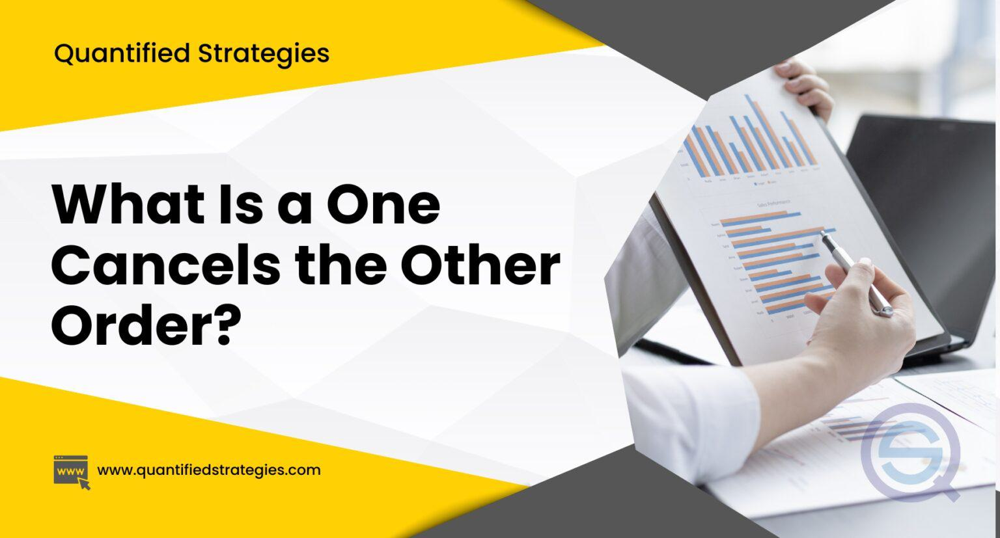

Financial markets are a dynamic environment where trading strategies and tools constantly evolve. One popular tool among traders is the One-Cancels-the-Other (OCO) order, a sophisticated trading mechanism designed to manage risk and automate the trading process. OCO orders involve placing two conditional orders linked together so that executing one automatically cancels the other. This strategic tool can be particularly beneficial in volatile market conditions, reducing the need for constant monitoring and enabling quick adjustments to trading strategies. 

OCO orders are typically used as a combination of a stop order and a limit order, offering efficiency and risk management advantages. In the context of algorithmic trading, where automated systems execute trades based on predefined criteria, OCO orders hold significant promise. This article explores how traders integrate OCO orders into their strategies to enhance performance while also considering the advantages and limitations these orders present. Proper utilization of OCO orders can streamline trading operations and potentially improve market outcomes, making them a valuable tool for both manual and automated trading scenarios.



## Table of Contents

## Understanding OCO Orders

One-Cancels-the-Other (OCO) orders are a critical component in the toolkit of traders who seek both automation and risk management. These orders consist of two linked conditional orders, where the execution of one order automatically cancels the other. Typically, OCO orders integrate a stop order and a limit order. The stop order is activated when a specified price level is breached, prompting the sale or purchase of an asset to exit a position or cut losses. Meanwhile, the limit order is set at a specific price to secure gains or establish a new position. Utilizing this dual approach allows traders to handle unpredictability in the markets effectively.

The principal advantage of OCO orders lies in their ability to perform trades efficiently without needing constant market monitoring. In volatile markets, where swift price movements can occur, OCO orders are invaluable for maintaining dynamic yet controlled trading strategies. By automating the execution of trades based on pre-set conditions, traders can react promptly to market changes, potentially enhancing their profitability while containing risks. This reduces the manual oversight required and lowers the likelihood of emotional trading decisions, which can often lead to suboptimal outcomes.

Python libraries such as `ccxt` and `alpaca-trade-api` enable developers to construct OCO orders programmatically. For example, the following Python code snippet demonstrates how to place an OCO order using a hypothetical trading API:

```python
import trading_api

# Initialize the trading client
client = trading_api.Client(api_key='your_api_key', secret_key='your_secret_key')

# Define the stop and limit prices
stop_price = 105.0
limit_price = 95.0
quantity = 10

# Place the OCO order
oco_order = client.place_oco_order(symbol='AAPL',
                                   side='sell',
                                   stop_price=stop_price,
                                   limit_price=limit_price,
                                   quantity=quantity)
print("OCO order placed:", oco_order)
```

Here, the specified order sells an asset at a stop price of $105 or a limit price of $95, with the execution of one canceling the other. This example illustrates how traders can exploit the automation and efficiency OCO orders provide, enabling more consistent application of trading strategies.

As trading platforms and algorithms become more sophisticated, the ease of implementing OCO orders enhances their appeal to both retail and institutional traders. However, traders should remain aware of the potential risks and intricacies involved, ensuring their trading platforms support these orders effectively to avoid execution issues.

## How OCO Orders Work in Trading Strategies

OCO orders play a critical role in executing trading strategies for various market scenarios, particularly in handling breakouts and retracements. These strategies leverage the automatic execution and risk management benefits that OCO orders provide.

In a [breakout](/wiki/breakout-trading) scenario, traders seek to profit from significant price movement beyond a predefined level of resistance or support. An effective use of an OCO order in this context involves placing a buy stop order above the known resistance level and a sell stop order below the support level. Specifically, a buy stop order becomes active when the stock price surpasses the resistance, indicating a bullish signal. Conversely, a sell stop activates if the price drops below support, suggesting a bearish trend. This setup ensures traders are positioned to capitalize on the market movement irrespective of the direction it takes.

For retracement strategies, where the market is expected to temporarily reverse a portion of its previous movement, traders use OCO orders to capitalize on these corrections. Here, a buy limit order is placed at a support level, where the price is likely to bounce back after a retracement from a high, and a sell limit order is set at the resistance level to capitalize on price drops after the rally. This dual order placement allows traders to potentially gain from buying at lower prices during uptrends and selling at higher prices during downtrends.

The effectiveness of integrating OCO orders in trading strategies is highly contingent on their alignment with broader strategic goals. Effective deployment necessitates a thorough understanding of market conditions, accurate identification of support and resistance levels, and precise calculation of optimal entry and [exit](/wiki/exit-strategy) points. It is also critical for traders to continuously analyze market trends and adjust their OCO orders accordingly to maintain strategic alignment. Such integration ensures that OCO orders enhance trading strategies rather than serving as standalone or isolated tools.

## Integrating OCO Orders in Algorithmic Trading

Algorithmic trading capitalizes on automated systems to execute trades based on predefined criteria. The integration of One-Cancels-the-Other (OCO) orders within these systems provides a significant advantage by automating trade execution and thereby reducing human errors. In a typical algorithmic setup, an OCO order is logically linked to two orders, where executing one leads to the automatic cancellation of the other. This not only manages risk but also ensures swift reaction to market movements without manual intervention.

OCO orders complement [algorithmic trading](/wiki/algorithmic-trading) strategies by enabling rapid adjustment to changing market conditions. Algorithms can be programmed to identify when key support, resistance, or trend lines are breached, triggering the execution or adjustment of OCO orders. For example, a trading algorithm can be designed to place an OCO order where a buy stop order is set slightly above a resistance level, and a sell stop order is positioned just below a support level. If the resistance level is overcome and the buy stop is triggered, the sell stop is automatically canceled.

Algorithms benefit from the flexibility of OCO orders by recalibrating them dynamically based on real-time market data. This responsiveness is crucial during periods of high [volatility](/wiki/volatility-trading-strategies) where market conditions can shift rapidly. By continuously analyzing data inputs, such as price action or [volume](/wiki/volume-trading-strategy) changes, the algorithm can modify the parameters of the OCO order, ensuring that trading strategies remain aligned with the prevailing market scenario.

The precision of execution with OCO orders in algorithmic trading is significantly enhanced due to the speed and accuracy with which algorithms operate. During volatile market periods, the ability to execute trades at the intended price levels is vital. Algorithms can process vast amounts of market data almost instantaneously, enabling the timely execution of OCO orders. This reduces the likelihood of slippage and unfavorable price fills, thereby protecting traders from potential market risks.

To implement OCO orders in an algorithmic trading system using Python, a basic structure can be outlined as follows:

```python
def place_oco_order(buy_stop_price, sell_stop_price, order_quantity):
    # Example pseudo-function to place an OCO order
    buy_order = create_order('buy', buy_stop_price, order_quantity)
    sell_order = create_order('sell', sell_stop_price, order_quantity)

    # Attributes to track the execution status
    buy_executed = False
    sell_executed = False

    # Event loop to check market conditions
    while not buy_executed and not sell_executed:
        current_price = fetch_market_price()

        if current_price >= buy_stop_price and not buy_executed:
            execute_order(buy_order)
            cancel_order(sell_order)
            buy_executed = True
            print("Buy order executed, sell order canceled.")

        elif current_price <= sell_stop_price and not sell_executed:
            execute_order(sell_order)
            cancel_order(buy_order)
            sell_executed = True
            print("Sell order executed, buy order canceled.")
```

In this example, `create_order`, `execute_order`, `cancel_order`, and `fetch_market_price` are hypothetical functions that represent core trading functionalities. The code continuously monitors market conditions to determine which order should be executed while ensuring that the counterpart is canceled automatically.

By integrating OCO orders into algorithmic trading systems, traders can enhance strategy precision and maintain robust risk management practices in fast-moving markets.

## Advantages of Using OCO Orders

OCO orders provide a dual approach to position management, simultaneously aiming to maximize profits and minimize losses. This dual functionality is particularly beneficial in volatile markets where asset prices can fluctuate significantly. By incorporating both a stop order and a limit order, traders can strategically control their positions without constant monitoring. 

Firstly, OCO orders effectively manage unpredictable movements inherent in volatile stocks or assets. By placing an OCO order, traders can set predefined conditions that automatically execute trades when the market reaches specific price points. For instance, if a trader owns a stock trading at $100, they can set a stop-limit order at $95 to limit potential losses while simultaneously placing a limit order at $110 to take profits when the stock rises. This setup aids in capturing upward trends while cushioning against downward risks.

The automation aspect of OCO orders is pivotal in reducing unintended consequences. When one side of the OCO order is executed, the other is instantly canceled, averting scenarios where both orders might unintentionally execute and result in an undesired position. This automated cancellation helps in maintaining the intended trading strategy without needing manual intervention, thus safeguarding against misjudgments during rapid market changes.

Additionally, OCO orders reduce the emotional component of trading by adhering strictly to pre-set conditions. Traders often face emotional stress when manually managing trades, which can lead to impulsive decisions and inconsistent strategies. OCO orders mitigate these emotional biases by executing trades based purely on logic and predetermined criteria. This automates the decision-making process, allowing traders to maintain discipline and consistency in their strategies.

By providing a structured mechanism that handles both market direction possibilities, OCO orders serve as a powerful tool for enhancing trading efficiency. This strategic approach allows traders to engage the market with reduced emotional interference while maintaining robust risk management practices.

## Potential Risks and Limitations

OCO (One-Cancels-the-Other) orders, while strategic, present certain risks and limitations that traders must be aware of. One significant risk is slippage, which can occur in fast-moving markets. Slippage refers to the difference between the expected price of a trade and the price at which it is actually executed. In volatile markets, prices can change quickly, resulting in the execution of orders at less favorable prices than intended. This issue can be further compounded if the OCO order is not executed in a timely manner due to either technical constraints or market [liquidity](/wiki/liquidity-risk-premium).

There is also no guarantee that either part of an OCO order will execute at the precise price targeted by the trader. Market conditions, such as gaps or limited liquidity, can prevent orders from filling at desired levels. Additionally, since OCO orders consist of linked orders, if the initial order is canceled but not executed, the subsequent order will also be canceled. This can lead to missed trading opportunities.

The complexity inherent in setting up OCO orders can pose another risk. Incorrect configuration can lead to unintended consequences, such as executing or cancelling orders inappropriately. This complexity requires traders to have a thorough understanding of not only how OCO orders function but also how to program them accurately within their trading systems.

It is crucial for traders to ensure that their trading platforms offer robust support for OCO orders. Discrepancies between broker offerings can affect order execution. For instance, if a broker's platform does not handle OCO orders efficiently, it could cause delays or errors in order processing. Traders should verify that their chosen platform consistently executes OCO orders as intended and is equipped to handle the trading volumes and market conditions they operate in. 

These potential risks and limitations necessitate a careful approach when using OCO orders to ensure they integrate effectively within a broader trading strategy.

## Conclusion

OCO orders represent a significant tool for traders aiming to enhance both automation and risk management within their trading strategies. By effectively linking two opposing conditional orders, traders can take advantage of market movements while maintaining a defensive posture against potential losses. This dual approach allows traders to not only focus on profit maximization but also on loss minimization, ensuring a balanced approach to trading, irrespective of market volatility. 

Their versatility is evident in their application across both manual and algorithmic trading environments. For manual traders, OCO orders reduce the need for constant market monitoring, thereby enabling traders to stick to their planned strategies without succumbing to emotional biases. In algorithmic trading, the integration of OCO orders can seamlessly execute trades based on pre-defined algorithms, minimizing human error and improving response times during volatile market conditions. Such integration is further enhanced by the ability of algorithms to dynamically adjust OCO parameters as markets fluctuate, ensuring that trading strategies remain efficient and effective.

However, while OCO orders offer considerable advantages, traders must be aware of their limitations. Fast-moving markets may experience slippage, impacting the execution of OCO orders. Moreover, the complexity involved in setting up and managing these orders necessitates a solid understanding to prevent potential setup errors. It's crucial for traders to ensure their trading platforms effectively support OCO orders and to understand the nuances of their implementation to optimize performance.

By incorporating OCO orders into a well-structured trading strategy, traders can significantly improve their trading outcomes and efficiency. Proper use and execution of these orders enable traders to navigate complex trading environments more effectively, capitalizing on opportunities while mitigating risks. These benefits underscore the importance of OCO orders as a fundamental component in modern trading strategies.

## References & Further Reading

[1]: Aldridge, I. (2013). ["High-Frequency Trading: A Practical Guide to Algorithmic Strategies and Trading Systems"](https://www.amazon.com/High-Frequency-Trading-Practical-Algorithmic-Strategies/dp/1118343506). Wiley. 

[2]: Narang, R. K. (2013). ["Inside the Black Box: A Simple Guide to Quantitative and High-Frequency Trading"](https://onlinelibrary.wiley.com/doi/book/10.1002/9781118662717). Wiley.

[3]: Harris, L. (2003). ["Trading and Exchanges: Market Microstructure for Practitioners"](https://www.amazon.com/Trading-Exchanges-Market-Microstructure-Practitioners/dp/0195144708). Oxford University Press.

[4]: Gomber, P., Arndt, B., Lutat, M., & Uhle, T. (2011). ["High-Frequency Trading"](https://papers.ssrn.com/sol3/papers.cfm?abstract_id=1858626). Springer Journal of Business Economics, 81(1), 5–52.

[5]: Chan, E. (2009). ["Quantitative Trading: How to Build Your Own Algorithmic Trading Business"](https://github.com/ftvision/quant_trading_echan_book). Wiley.

[6]: Hull, J. (2018). ["Options, Futures, and Other Derivatives"](https://www.semanticscholar.org/paper/Options%2C-Futures%2C-and-Other-Derivatives-Hull/89bdee500c8623864fc9eb7a471546aa713acc44). Pearson Education.