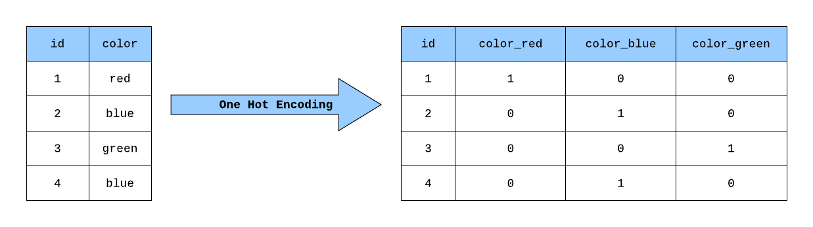

## Table of Contents

## What is One-Hot Encoding in the context of machine learning?

One-Hot Encoding is a way to turn categories into numbers that a computer can understand better. Imagine you have a list of colors like red, blue, and green. Instead of using these words, One-Hot Encoding would turn each color into a series of 0s and 1s. For example, red might be [1, 0, 0], blue could be [0, 1, 0], and green would be [0, 0, 1]. This helps because computers are better at working with numbers than with words.

In machine learning, we use One-Hot Encoding to make sure our models can handle categorical data correctly. If you just give numbers to categories (like 1 for red, 2 for blue, and 3 for green), the computer might think that blue is "between" red and green, which doesn't make sense for colors. By using One-Hot Encoding, we avoid this problem and help our models learn more accurately from the data.

## Why is One-Hot Encoding important for categorical data?

One-Hot Encoding is important for categorical data because it helps computers understand and work with categories better. When you have data like colors, countries, or types of animals, you can't just give them numbers like 1, 2, and 3. If you do that, the computer might think that the numbers have a special order or that one category is "bigger" than another. For example, if you number countries as 1 for USA, 2 for Canada, and 3 for Mexico, the computer might think Canada is "between" USA and Mexico, which doesn't make sense for countries.

By using One-Hot Encoding, each category gets its own column of 0s and 1s. This way, the computer sees each category as separate and equal. For instance, if you have three colors, you can turn them into three columns. Red might be [1, 0, 0], blue could be [0, 1, 0], and green would be [0, 0, 1]. This makes it clear to the computer that these categories are different and don't have any special order. This helps machine learning models learn better from the data and make more accurate predictions.

## How does One-Hot Encoding work?

One-Hot Encoding turns categories into numbers that computers can understand better. Imagine you have different colors like red, blue, and green. Instead of using these words, One-Hot Encoding makes each color into a list of numbers. For example, red might be [1, 0, 0], blue could be [0, 1, 0], and green would be [0, 0, 1]. Each color gets its own spot in the list, and only the spot for that color has a 1, while the others have 0s.

This way, the computer sees each category as separate and equal. It's important because if you just give numbers to categories (like 1 for red, 2 for blue, and 3 for green), the computer might think that blue is "between" red and green, which doesn't make sense for colors. By using One-Hot Encoding, we make sure the computer knows that these categories are different and don't have any special order. This helps [machine learning](/wiki/machine-learning) models learn better from the data and make more accurate predictions.

## What are the steps to implement One-Hot Encoding?

To implement One-Hot Encoding, first, you need to identify all the unique categories in your data. For example, if you have a list of colors like red, blue, and green, you count these as your categories. Then, you create a new column for each category. Each column will represent one category, and you'll fill these columns with zeros and ones. If a row has the color red, you put a 1 in the 'red' column and zeros in the other columns. This way, each row in your data will have a 1 in one column and zeros in all the others, showing which category it belongs to.

Once you have set up your columns, you can start encoding your data. For each row in your original data, look at the category it belongs to and put a 1 in the corresponding column. All other columns for that row will have zeros. This process is straightforward and can be done using different tools or programming languages. For example, in Python, you might use the pandas library to do this easily. By following these steps, you turn your categories into a format that computers can understand and use for machine learning models.

## Can you explain One-Hot Encoding with a simple example?

Let's say you have a list of fruits: apples, bananas, and oranges. You want to use this data in a computer program, but computers understand numbers better than words. So, you use One-Hot Encoding to turn these fruit names into numbers. For apples, you might use [1, 0, 0]. For bananas, you could use [0, 1, 0]. And for oranges, you would use [0, 0, 1]. Each fruit gets its own spot in the list, and only the spot for that fruit has a 1, while the others have 0s.

This way, the computer can see that apples, bananas, and oranges are different and don't have any special order. If you just used numbers like 1 for apples, 2 for bananas, and 3 for oranges, the computer might think that bananas are "between" apples and oranges, which doesn't make sense for fruits. By using One-Hot Encoding, you make sure the computer knows that these fruits are separate and equal, which helps when you're using this data in machine learning models.

## What are the advantages of using One-Hot Encoding?

One-Hot Encoding helps computers understand categories better. When you have different things like colors or fruits, you can turn them into numbers that the computer can work with easily. This way, the computer sees each category as separate and equal. If you just use numbers like 1, 2, and 3 for different categories, the computer might think one category is "bigger" or "between" others, which doesn't make sense for things like colors or fruits. By using One-Hot Encoding, you avoid this problem and make sure the computer understands the data correctly.

Another advantage of One-Hot Encoding is that it helps machine learning models learn better from the data. When you turn categories into numbers using One-Hot Encoding, the models can see the differences between categories clearly. This makes the models more accurate because they don't get confused by thinking that categories have a special order. For example, if you're trying to predict what kind of fruit someone likes, using One-Hot Encoding helps the model understand that apples, bananas, and oranges are different choices, not numbers on a scale. This leads to better predictions and more useful results from your machine learning work.

## What are the potential drawbacks of One-Hot Encoding?

One-Hot Encoding can make your data bigger. If you have a lot of different categories, like many different countries or types of animals, you'll end up with a lot of new columns. Each category gets its own column, so if you have 100 different categories, you'll have 100 new columns. This can make your data harder to work with because it takes up more space and can slow down your computer when you're trying to use it for machine learning.

Another problem with One-Hot Encoding is that it doesn't show any relationships between categories. If you have categories like small, medium, and large, using One-Hot Encoding would treat them as completely separate. But in real life, we know that medium is between small and large. One-Hot Encoding can't show this kind of order or connection, which might make your machine learning models less accurate if knowing the order is important.

## How does One-Hot Encoding affect the performance of machine learning models?

One-Hot Encoding can make your data bigger because it creates a new column for each category. If you have a lot of different categories, like many different types of animals or countries, you'll end up with a lot of new columns. This can slow down your computer when you're trying to use the data for machine learning. A bigger dataset can take more time to process and might need more memory, which can make your machine learning models run slower.

On the other hand, One-Hot Encoding can help your machine learning models learn better if you use it right. It turns categories into numbers in a way that the computer can understand easily. This helps the models see the differences between categories clearly, which can make them more accurate. But, One-Hot Encoding doesn't show any relationships between categories. For example, if you have categories like small, medium, and large, One-Hot Encoding treats them as completely separate. If knowing the order between these categories is important for your model, using One-Hot Encoding might make your predictions less accurate.

## In what scenarios is One-Hot Encoding most effective?

One-Hot Encoding is most effective when you have categories that don't have any special order or relationship between them. For example, if you're working with data about different types of fruits like apples, bananas, and oranges, One-Hot Encoding helps because it treats each fruit as separate and equal. This way, the computer can understand that apples, bananas, and oranges are different choices, not numbers on a scale. Using One-Hot Encoding in this case helps machine learning models learn better from the data and make more accurate predictions.

Another scenario where One-Hot Encoding works well is when you have a small number of categories. If you only have a few different categories, like three or four colors, One-Hot Encoding won't make your data too big. This means your computer can handle the data easily and your machine learning models can run quickly. But if you have too many categories, like hundreds of different countries, One-Hot Encoding might make your data too big and slow down your computer.

## Are there alternatives to One-Hot Encoding for handling categorical data?

Yes, there are other ways to handle categorical data besides One-Hot Encoding. One common method is called Label Encoding. With Label Encoding, you give each category a number, like 1 for red, 2 for blue, and 3 for green. This is simpler than One-Hot Encoding because it doesn't create new columns, but it can cause problems if the computer thinks the numbers have a special order. For example, the computer might think that blue (2) is "between" red (1) and green (3), which doesn't make sense for colors.

Another method is called Ordinal Encoding. This is similar to Label Encoding, but it's used when the categories do have a natural order. For example, if you have sizes like small, medium, and large, you can use numbers like 1 for small, 2 for medium, and 3 for large. This way, the computer can understand that medium is between small and large. But if you use Ordinal Encoding on categories without a natural order, like colors, it can still cause problems because the computer might think the numbers have a special meaning.

There's also a method called Binary Encoding, which is a mix between One-Hot Encoding and Label Encoding. With Binary Encoding, you turn each category into a number and then turn that number into a binary code. For example, if you have three categories, you might number them as 1, 2, and 3. Then, you turn these numbers into binary: 1 becomes [0, 1], 2 becomes [1, 0], and 3 becomes [1, 1]. This way, you don't need as many new columns as with One-Hot Encoding, but the computer can still see the categories as separate and equal.

## How can One-Hot Encoding be optimized for large datasets?

When you have a lot of different categories in a big dataset, One-Hot Encoding can make your data bigger and slower to work with. To make it better, you can use something called dimensionality reduction. This means you find a way to use fewer columns while still keeping the important information. One way to do this is with a technique called Principal Component Analysis (PCA). PCA can help you turn a lot of One-Hot encoded columns into fewer columns that still show the differences between categories. This can make your data smaller and easier for your computer to handle.

Another way to optimize One-Hot Encoding for large datasets is to use sparse matrices. Instead of storing all the zeros in your One-Hot encoded data, a sparse matrix only stores the places where there are ones. This can save a lot of space and make your computer work faster. For example, if you're using Python, you can use the `scipy` library to turn your One-Hot encoded data into a sparse matrix. This way, you can still use One-Hot Encoding but without making your data too big and slow.

## What advanced techniques can be combined with One-Hot Encoding to improve model accuracy?

One advanced technique that can be combined with One-Hot Encoding to improve model accuracy is feature hashing. Feature hashing, also known as the hashing trick, turns categories into numbers using a hash function. This can help reduce the number of columns you need, making your data smaller and easier to work with. For example, if you have a lot of different categories, feature hashing can turn them into a fixed number of columns. This way, you can still use the information from One-Hot Encoding but without making your data too big. This can lead to faster and more accurate machine learning models.

Another technique is to use One-Hot Encoding with embeddings. Embeddings are a way to turn categories into numbers that show how similar or different they are. For example, if you have categories like different types of animals, embeddings can show that a cat and a dog are more similar to each other than a cat and a fish. You can use One-Hot Encoding to start with, and then use a [neural network](/wiki/neural-network) to turn the One-Hot encoded data into embeddings. This can help your machine learning model understand the relationships between categories better, which can make your predictions more accurate.

## References & Further Reading

[1]: Géron, A. (2019). ["Hands-On Machine Learning with Scikit-Learn, Keras, and TensorFlow: Concepts, Tools, and Techniques to Build Intelligent Systems"](https://books.google.com/books/about/Hands_On_Machine_Learning_with_Scikit_Le.html?id=HHetDwAAQBAJ). O'Reilly Media.

[2]: Pedregosa, F., Varoquaux, G., Gramfort, A., Michel, V., Thirion, B., Grisel, O., ... & Duchesnay, É. (2011). ["Scikit-learn: Machine Learning in Python."](https://dl.acm.org/doi/10.5555/1953048.2078195) Journal of Machine Learning Research, 12, 2825-2830.

[3]: ["Feature Engineering for Machine Learning: Principles and Techniques for Data Scientists"](https://www.amazon.com/Feature-Engineering-Machine-Learning-Principles/dp/1491953241) by Alice Zheng and Amanda Casari

[4]: Bishop, C. M. (2006). ["Pattern Recognition and Machine Learning."](https://link.springer.com/book/9780387310732) Springer.

[5]: ["Python for Data Analysis: Data Wrangling with Pandas, NumPy, and IPython"](https://books.google.com/books/about/Python_for_Data_Analysis.html?id=BCc3DwAAQBAJ) by Wes McKinney