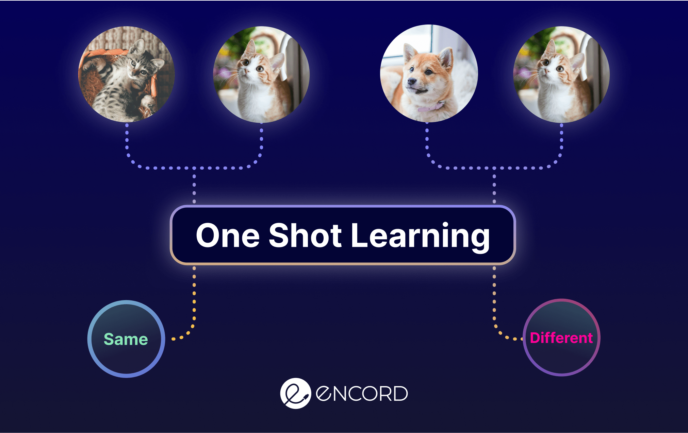

## Table of Contents

## What is One-Shot Learning in the context of machine learning?

One-Shot Learning is a type of machine learning where a model can learn to recognize new objects or categories from just one or a few examples. This is different from traditional machine learning, where models need lots of examples to learn well. One-Shot Learning is useful when you don't have many examples, like when you're trying to identify rare objects or when you're working with limited data.

In real life, people can often recognize new things after seeing them just once. For example, if you see a new type of bird, you might remember it after seeing it just once. One-Shot Learning tries to make computers work the same way. It uses special methods like Siamese networks or memory-augmented neural networks to compare new examples to the ones it has seen before. This way, the computer can learn to recognize new things quickly, even with very little data.

## How does One-Shot Learning differ from traditional machine learning approaches?

One-Shot Learning and traditional machine learning differ mainly in how much data they need to learn something new. Traditional machine learning methods, like those used in image classification or speech recognition, need a lot of examples to train a model. For instance, to recognize different breeds of dogs, a traditional model might need thousands of pictures of each breed. This approach works well when there's plenty of data, but it can struggle when data is scarce.

On the other hand, One-Shot Learning can learn from just one or a few examples. This makes it very useful in situations where data is limited or when you need to recognize new things quickly. For example, if you want to identify a rare type of flower, a One-Shot Learning model could learn to do this after seeing just one picture of that flower. It uses special techniques, like Siamese networks, to compare new examples to the ones it has seen before, allowing it to learn and recognize new objects with very little data.

## What are the main challenges faced in One-Shot Learning?

One main challenge in One-Shot Learning is the problem of overfitting. Since the model is trained on very few examples, it can easily memorize these examples instead of learning general features that can be applied to new examples. This means the model might work well on the examples it has seen but fail when it encounters new ones. To prevent overfitting, techniques like regularization and [data augmentation](/wiki/data-augmentation) are used, but finding the right balance can be tricky.

Another challenge is the difficulty in designing effective algorithms. Traditional [machine learning](/wiki/machine-learning) methods rely on large datasets to find patterns, but One-Shot Learning needs to do this with much less data. This requires special approaches, like Siamese networks or memory-augmented neural networks, which can compare new examples to the ones the model has seen before. Developing these algorithms takes a lot of creativity and experimentation, and there's no one-size-fits-all solution.

Lastly, evaluating the performance of One-Shot Learning models can be hard. Since they are trained on very few examples, it's difficult to know if the model's success is due to real learning or just luck. Researchers often use techniques like cross-validation and different metrics to assess performance, but these methods can be less reliable with such small datasets. This makes it challenging to compare different One-Shot Learning approaches and to know which one works best for a given task.

## Can you explain the concept of few-shot learning and its relation to One-Shot Learning?

Few-shot learning is a type of machine learning where a model can learn to recognize new things from just a few examples. It's like One-Shot Learning, but instead of just one example, the model gets a small number of examples, usually between two and five. This makes few-shot learning a bit easier than One-Shot Learning because the model has a bit more data to work with. Both few-shot learning and One-Shot Learning are useful when you don't have a lot of data, like when you're trying to identify rare objects or when you need to learn something new quickly.

Few-shot learning and One-Shot Learning are closely related because they both aim to solve the same problem: how to learn from very little data. The main difference is the number of examples they use. One-Shot Learning is a special case of few-shot learning, where the model learns from just one example. Both approaches use similar techniques, like Siamese networks or memory-augmented neural networks, to compare new examples to the ones they have seen before. These methods help the models learn and recognize new objects even when they have very little data to work with.

## What are some common applications of One-Shot Learning?

One common application of One-Shot Learning is in facial recognition systems. Imagine you have a security camera that needs to identify people entering a building. With One-Shot Learning, the system can learn to recognize a new person after seeing just one photo of their face. This is really useful because you don't need to take many photos of each person to train the system. It makes the process quick and efficient, especially in places where new people come and go often.

Another application is in the field of document classification. For example, if you work in an office and need to sort different types of documents, One-Shot Learning can help. Let's say you get a new type of form that you've never seen before. With just one example of this new form, the system can learn to recognize and sort it correctly. This saves time and makes the sorting process smoother, especially when new types of documents are introduced regularly.

One-Shot Learning is also used in language translation. If a new word or phrase appears in a language, a One-Shot Learning model can learn to translate it after seeing it just once. This is helpful for languages that change quickly or for translating rare or specialized terms. It makes the translation process more flexible and able to handle new words without needing a lot of examples.

## How do Siamese networks contribute to One-Shot Learning?

Siamese networks are a special type of [neural network](/wiki/neural-network) that helps with One-Shot Learning by comparing things. Imagine you have two pictures, and you want to know if they are of the same thing. A Siamese network takes both pictures and turns them into numbers. It then compares these numbers to see how similar the pictures are. If the numbers are close, the pictures are probably of the same thing. This way, even with just one example, the network can learn to recognize new things by comparing them to what it already knows.

In One-Shot Learning, Siamese networks are really useful because they can learn from very little data. Let's say you want to teach a computer to recognize a new type of flower. You show it one picture of the flower. The Siamese network can then compare any new picture to this one example to see if it's the same flower. This makes it possible for the computer to learn and recognize new things quickly, even when you don't have many examples to show it.

## What role does metric learning play in One-Shot Learning?

Metric learning is a key part of One-Shot Learning. It helps the computer understand how similar or different things are. In One-Shot Learning, you often have just one example to learn from. Metric learning teaches the computer to measure how close new examples are to this one example. It does this by creating a special space where similar things are close together and different things are far apart. This way, even with just one example, the computer can tell if a new thing is similar to what it already knows.

For example, if you want to teach a computer to recognize a new type of bird with just one picture, metric learning helps. It makes the computer compare the new picture to the one example it has. If the new picture is close in the special space created by metric learning, the computer knows it's probably the same type of bird. This makes One-Shot Learning possible because the computer can learn from very little data by understanding how to measure similarity.

## Can you describe a specific algorithm used for One-Shot Learning, such as Matching Networks?

Matching Networks are a specific algorithm used for One-Shot Learning that helps computers learn new things from just one example. Imagine you're trying to teach a computer to recognize a new type of animal. With Matching Networks, the computer looks at the one example you give it and then compares any new pictures to this example. It does this by creating a special space where similar pictures are close together. This way, even if the computer has only seen one picture of the animal, it can figure out if a new picture is of the same animal by seeing how close the new picture is to the one it knows.

The way Matching Networks work is by using something called an attention mechanism. This is like the computer paying more attention to parts of the new picture that are similar to the one example it has. For example, if the one example is a picture of a bird with a red beak, the computer will pay more attention to the beak in new pictures to see if it's red too. By focusing on these important parts, the Matching Networks can learn quickly and accurately, even with just one example. This makes them really useful for One-Shot Learning because they can adapt to new things without needing a lot of data.

## How does memory-augmented neural networks facilitate One-Shot Learning?

Memory-augmented neural networks help with One-Shot Learning by giving the computer a special kind of memory. Imagine you're trying to teach a computer to recognize a new type of flower. With a memory-augmented neural network, the computer can store the one example you show it in its memory. When a new picture comes along, the computer can compare it to the pictures it has saved in its memory. This way, even if it has only seen one picture of the flower, it can remember it and figure out if the new picture is of the same flower.

These networks work by using something called an external memory. This is like a notebook where the computer writes down important things it sees. When it needs to recognize something new, it can look back at its notebook to see if it matches anything it has written down before. This makes One-Shot Learning easier because the computer can learn from just one example and then use its memory to recognize new things quickly and accurately.

## What are the recent advancements in One-Shot Learning research?

Recent advancements in One-Shot Learning have focused on improving the ability of models to learn from even fewer examples. Researchers have been exploring new types of neural networks, like meta-learning algorithms, which help models learn how to learn from just a few examples. For instance, the Model-Agnostic Meta-Learning (MAML) algorithm has gained attention because it can quickly adapt to new tasks with minimal data. MAML works by training a model to find good starting parameters that can be fine-tuned with just a few examples, making it very effective for One-Shot Learning scenarios.

Another exciting development is the use of generative models, like Generative Adversarial Networks (GANs), to create synthetic data for training. By generating new examples that look similar to the real ones, these models can help One-Shot Learning systems get better at recognizing new objects even when real data is scarce. This approach has shown promise in fields like medical imaging, where rare conditions might have very few examples available. Researchers are also combining these techniques with attention mechanisms to make models focus on the most important parts of the images, further enhancing their ability to learn from limited data.

## How can transfer learning be applied to improve One-Shot Learning models?

Transfer learning can help One-Shot Learning models by using knowledge from one task to help with another. Imagine you have a model that's really good at recognizing different types of cats. With transfer learning, you can take what the model already knows about cats and use it to help the model learn about a new type of animal, like dogs, with just one example. The model starts with a good understanding of animal features, so it can learn the new animal quickly, even with very little data. This makes One-Shot Learning easier because the model doesn't have to start from scratch.

Researchers have found that transfer learning can make One-Shot Learning models much better. For example, they might use a model that's been trained on a large dataset of images to recognize general shapes and colors. Then, they fine-tune this model with just one example of a new object. The model can use what it already knows to focus on the important parts of the new example, making it easier to learn and recognize the new object. This approach has been successful in many areas, like recognizing new types of flowers or identifying rare diseases in medical images, where having lots of examples is hard.

## What are the limitations of current One-Shot Learning techniques and potential future directions?

One of the main limitations of current One-Shot Learning techniques is the risk of overfitting. When a model learns from just one or a few examples, it can easily memorize these examples instead of learning general features that apply to new examples. This means the model might work well on the examples it has seen but fail when it encounters new ones. Another limitation is the challenge of designing effective algorithms. Traditional machine learning methods rely on large datasets to find patterns, but One-Shot Learning needs to do this with much less data. This requires special approaches, like Siamese networks or memory-augmented neural networks, which can be complex and hard to optimize.

Future directions in One-Shot Learning research are focused on improving the ability of models to generalize from limited data. One promising area is the development of meta-learning algorithms, like Model-Agnostic Meta-Learning (MAML), which help models learn how to learn from just a few examples. These algorithms train models to find good starting parameters that can be quickly fine-tuned with minimal data. Another exciting direction is the use of generative models, such as Generative Adversarial Networks (GANs), to create synthetic data for training. By generating new examples that look similar to the real ones, these models can help One-Shot Learning systems get better at recognizing new objects even when real data is scarce. Researchers are also exploring ways to combine these techniques with attention mechanisms to make models focus on the most important parts of the images, further enhancing their ability to learn from limited data.

## References & Further Reading

[1]: Koch, G., Zemel, R., & Salakhutdinov, R. (2015). ["Siamese Neural Networks for One-Shot Image Recognition."](https://www.cs.cmu.edu/~rsalakhu/papers/oneshot1.pdf) International Conference on Machine Learning (ICML) Deep Learning Workshop.

[2]: Vinyals, O., Blundell, C., Lillicrap, T., Kavukcuoglu, K., & Wierstra, D. (2016). ["Matching Networks for One Shot Learning."](https://arxiv.org/abs/1606.04080) Advances in Neural Information Processing Systems.

[3]: Snell, J., Swersky, K., & Zemel, R. S. (2017). ["Prototypical Networks for Few-shot Learning."](https://arxiv.org/abs/1703.05175) Advances in Neural Information Processing Systems.

[4]: Finn, C., Abbeel, P., & Levine, S. (2017). ["Model-Agnostic Meta-Learning for Fast Adaptation of Deep Networks."](https://arxiv.org/abs/1703.03400) International Conference on Machine Learning.

[5]: Santoro, A., Bartunov, S., Botvinick, M., Wierstra, D., & Lillicrap, T. (2016). ["Meta-Learning with Memory-Augmented Neural Networks."](http://proceedings.mlr.press/v48/santoro16.html) International Conference on Machine Learning.

[6]: Wang, Y., Yao, Q., Kwok, J. T., & Ni, L. M. (2020). ["Generalizing from a Few Examples: A Survey on Few-shot Learning."](https://arxiv.org/abs/1904.05046) ACM Computing Surveys. 

[7]: Ravi, S., & Larochelle, H. (2017). ["Optimization as a Model for Few-Shot Learning."](https://openreview.net/pdf?id=rJY0-Kcll) International Conference on Learning Representations (ICLR). 

[8]: Antreas, A., & Zisserman, A. (2017). ["The Plant Phenotyping Datasets."](https://www.plant-phenotyping.org/datasets-impact) Computing Research Repository (CoRR).

[9]: Lake, B. M., Salakhutdinov, R., & Tenenbaum, J. B. (2015). ["Human-level concept learning through probabilistic program induction."](https://www.science.org/doi/10.1126/science.aab3050) Science, 350(6266), 1332-1338.