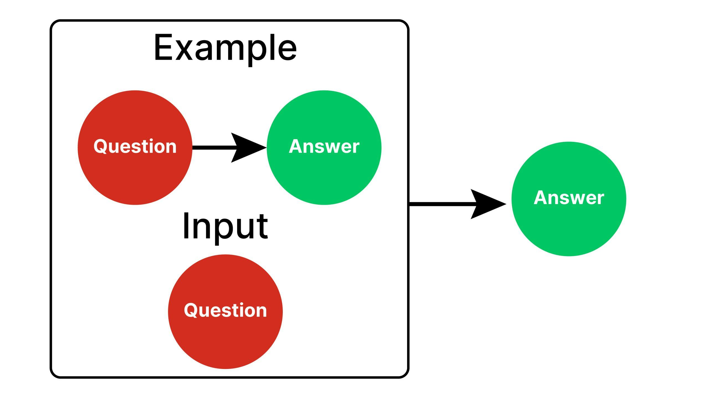

## Table of Contents

## What is one-shot prompting in machine learning?

One-shot prompting in machine learning is a technique where a model is given just one example of a task before it tries to perform that task. Imagine you're teaching someone a new game. Instead of explaining all the rules and showing many examples, you show them how to play once, and then they try to play on their own. In machine learning, this "one example" is called a "prompt." The model uses this single prompt to understand what it needs to do and then applies that understanding to new, similar tasks.

This method is especially useful for models that need to quickly adapt to new tasks without a lot of training data. For instance, if you want a model to translate a rare language, you might not have many examples to train it. With one-shot prompting, you can show the model one translation, and it can then try to translate other sentences in that language. This approach saves time and resources because the model doesn't need to be trained on a large dataset to perform well on new tasks.

## How does one-shot prompting differ from zero-shot and few-shot learning?

One-shot prompting is when you give a machine learning model just one example before it tries to do a task. Imagine teaching a friend a new dance move by showing it once, and then they try to copy it. In machine learning, this one example helps the model understand what to do. For example, if you want the model to recognize different types of dogs, you show it one picture of a dog and tell it what kind it is. Then, the model tries to identify other dogs based on that single example.

Zero-shot learning is different because you don't give the model any examples at all. Instead, you tell it what to do, and it tries to figure it out without seeing any samples. For instance, if you want the model to translate a language it has never seen before, you just tell it to translate, and it uses its general knowledge to try. It's like asking someone to cook a dish they've never tried, just by describing it to them.

Few-shot learning is in between. Here, you give the model a few examples, maybe two or three, before it tries the task. It's like showing your friend a few dance moves before they try to dance on their own. This method gives the model a bit more information to work with than one-shot learning but still doesn't require a lot of training data. For example, if you want the model to identify different types of birds, you might show it two or three pictures of birds and tell it what they are, and then it tries to identify other birds based on those few examples.

## What are the key components of a one-shot learning model?

One-shot learning models rely on a few key components to work well. The first is a good embedding space. This is where the model turns the input data, like images or text, into numbers that it can understand and compare. The model uses these numbers to see how similar different inputs are. For example, if the model is trying to recognize different types of dogs, it will turn pictures of dogs into numbers and then see how close those numbers are to each other. This helps the model understand that different dogs can still be similar even if they look a bit different.

Another important part is the similarity metric. This is how the model decides if two inputs are the same or different. It might use a simple formula like the Euclidean distance, which measures how far apart two points are in the embedding space. If the distance is small, the model thinks the inputs are similar. For example, if the model is trying to match a new picture of a dog to one it has seen before, it will use this metric to see if the new picture is close enough to the old one to be considered the same type of dog. The last key component is the learning algorithm itself, which needs to be good at learning from just one example. This algorithm adjusts the model's understanding based on that single example, helping it make better predictions for new inputs.

These components work together to make one-shot learning possible. The embedding space turns the inputs into numbers, the similarity metric compares those numbers, and the learning algorithm uses the one example to fine-tune the model. Together, they allow the model to learn quickly and accurately from just one example, making it useful for tasks where you don't have a lot of data to train on.

## Can you explain the process of training a model for one-shot prompting?

Training a model for one-shot prompting involves preparing the model to learn from just one example. First, you need to create a good embedding space. This means the model will turn the input data, like pictures or words, into numbers that it can work with. For example, if you're trying to teach the model to recognize different types of dogs, you'll turn pictures of dogs into numbers. The model will use these numbers to understand how similar different dogs are. To do this, you might use a [neural network](/wiki/neural-network) to create the embeddings. The network learns to turn the input data into numbers in a way that keeps similar inputs close together in the embedding space.

Once you have a good embedding space, you need a way to compare these numbers. This is called a similarity metric. A common one is the Euclidean distance, which measures how far apart two points are. If the distance between the numbers for two dogs is small, the model thinks they are similar. The formula for Euclidean distance between two points $$ (x_1, y_1) $$ and $$ (x_2, y_2) $$ is $$ \sqrt{(x_2 - x_1)^2 + (y_2 - y_1)^2} $$. The model uses this to decide if a new picture of a dog is the same type as one it has seen before. Finally, you need a learning algorithm that can adjust the model based on just one example. This algorithm helps the model get better at recognizing new inputs by fine-tuning the embeddings and the similarity metric.

Putting it all together, training a one-shot learning model means teaching it to create good embeddings, use a similarity metric to compare them, and adjust based on one example. You might use a neural network to create the embeddings and then train it on a dataset where you have examples of different types of inputs. The model learns to turn these inputs into numbers and compare them. When you show it one new example, it uses what it has learned to make a prediction about similar new inputs. This way, the model can quickly adapt to new tasks without needing a lot of training data.

## What types of algorithms are commonly used in one-shot learning?

One-shot learning often uses algorithms like Siamese networks and matching networks. A Siamese network is a type of neural network that has two identical sub-networks. Each sub-network turns an input, like a picture, into a number. The network then compares these numbers to see how similar the inputs are. For example, if you want to recognize different types of dogs, the Siamese network turns two pictures of dogs into numbers and then uses a formula like the Euclidean distance $$ \sqrt{(x_2 - x_1)^2 + (y_2 - y_1)^2} $$ to see if they are the same type of dog. This helps the model learn from just one example because it can see how close the numbers are to each other.

Matching networks are another common choice for one-shot learning. These networks learn to match a new input to a set of examples it has seen before. For example, if you show the model one picture of a dog and then a new picture, the matching network tries to see if the new picture matches the old one. It does this by turning the inputs into numbers and then using a method to compare them, like a similarity metric. This way, the model can quickly learn to recognize new types of inputs without needing a lot of training data.

Other algorithms used in one-shot learning include prototypical networks and memory-augmented neural networks. Prototypical networks work by finding a "prototype" or average representation for each class of inputs. For example, if you're trying to recognize different types of birds, the network finds an average number for each type of bird. When you show it a new bird, it compares the new bird's number to these prototypes to see which type it is. Memory-augmented neural networks, on the other hand, use a memory component to store and retrieve information. This helps the model remember the one example it has seen and use it to make predictions about new inputs. These algorithms all help the model learn quickly from just one example, making them useful for tasks where you don't have a lot of data.

## What are some real-world applications of one-shot prompting?

One-shot prompting is used in face recognition systems. Imagine you want to unlock your phone with your face. The phone needs to recognize your face even if it has only seen it once before. One-shot learning helps the phone do this by comparing your face to the one example it has stored. It turns your face into numbers and uses a formula like the Euclidean distance $$ \sqrt{(x_2 - x_1)^2 + (y_2 - y_1)^2} $$ to see if the new picture matches the old one. This way, the phone can quickly learn to recognize your face without needing many pictures to train on.

Another real-world use of one-shot prompting is in language translation. If you want to translate a rare language, you might not have many examples to teach a computer. With one-shot learning, you can show the computer one translation, and it can try to translate other sentences in that language. The computer turns the sentences into numbers and compares them to see if they are similar. This helps the computer learn quickly from just one example, making it useful for tasks where you don't have a lot of data.

## How can one-shot prompting improve the efficiency of machine learning models?

One-shot prompting improves the efficiency of [machine learning](/wiki/machine-learning) models by allowing them to learn new tasks quickly with just one example. Imagine you want to teach a computer to recognize different types of flowers. Instead of showing it many pictures of each type of flower, you can show it just one picture of a rose, and the computer can learn to recognize other roses based on that one example. The computer turns the picture into numbers and uses a formula like the Euclidean distance $$ \sqrt{(x_2 - x_1)^2 + (y_2 - y_1)^2} $$ to see if new pictures are similar to the one it has seen. This saves a lot of time and resources because the computer doesn't need a big dataset to learn from.

This method is especially useful when you don't have a lot of data to train on. For example, if you want to translate a rare language, you might only have one translation to show the computer. With one-shot prompting, the computer can use that one example to try to translate other sentences in that language. It turns the sentences into numbers and compares them to see if they are similar. By learning quickly from just one example, one-shot prompting makes machine learning models more efficient and adaptable to new tasks without needing a lot of training data.

## What are the challenges and limitations of implementing one-shot prompting?

One-shot prompting faces challenges because it relies on just one example to learn a new task. This can make it hard for the model to understand all the different ways something can look or sound. For example, if you show the model one picture of a dog, it might not recognize other dogs that look different. The model uses numbers to compare things, like the Euclidean distance $$ \sqrt{(x_2 - x_1)^2 + (y_2 - y_1)^2} $$, but with only one example, it can be tricky to get this right. Also, the model needs a good way to turn the input into numbers, called an embedding space. If this isn't set up well, the model might not learn well from that one example.

Another limitation is that one-shot prompting can be less accurate than using more examples. When you show the model more pictures or sentences, it can learn better because it sees more of what things can be like. With just one example, the model might make mistakes because it doesn't have enough information to understand the full picture. This can be a problem in important tasks where you need the model to be very accurate, like in medical diagnosis or security systems. Even though one-shot prompting can save time and resources, it might not always be the best choice when you need the model to be very reliable.

## How does one-shot prompting handle variability and noise in data?

One-shot prompting can struggle with variability and noise in data because it only uses one example to learn from. Imagine you're trying to teach a computer to recognize different types of dogs. If you show it just one picture of a dog, it might not understand that dogs can look very different. The computer turns the picture into numbers and uses a formula like the Euclidean distance $$ \sqrt{(x_2 - x_1)^2 + (y_2 - y_1)^2} $$ to compare new pictures to the one it has seen. But if the new pictures have different lighting or angles, the numbers might not match well, and the computer might not recognize the dog.

To handle this, one-shot prompting relies on a good embedding space, which is how the computer turns the input into numbers. If the embedding space is set up well, it can help the computer understand that different pictures of the same thing can still be similar. But if the embedding space isn't good, the computer might get confused by noise or variability in the data. Noise can come from things like shadows or blurry pictures, which can make the numbers different even if the pictures are of the same thing. So, while one-shot prompting can be quick and save resources, it might not always handle variability and noise as well as methods that use more examples.

## What metrics are used to evaluate the performance of one-shot learning models?

One-shot learning models are often evaluated using accuracy, which measures how often the model gets the right answer. For example, if you show the model one picture of a dog and then ask it to recognize other dogs, accuracy tells you how many times it correctly identifies a dog. Another important metric is the F1 score, which balances precision and recall. Precision is about how many of the model's positive predictions are correct, while recall is about how many of the actual positives the model finds. The F1 score is the harmonic mean of precision and recall, calculated as $$ F1 = 2 \times \frac{\text{precision} \times \text{recall}}{\text{precision} + \text{recall}} $$. This score is useful when you want to see how well the model performs overall, especially when the data is imbalanced.

Another metric used is the area under the receiver operating characteristic (ROC) curve, or AUC-ROC. This measures how well the model can distinguish between different classes, like telling dogs from cats. The ROC curve plots the true positive rate against the false positive rate at different thresholds, and the AUC-ROC is the area under this curve. A higher AUC-ROC means the model is better at telling things apart. These metrics help us understand how well one-shot learning models work with just one example, even when the data has variability and noise.

## How can transfer learning be integrated with one-shot prompting techniques?

Transfer learning can be integrated with one-shot prompting to make models learn even better from just one example. Imagine you're teaching someone to recognize different types of birds. If they already know a lot about animals, it's easier for them to learn about birds. Transfer learning is like that; it uses what the model already knows from other tasks to help it learn the new task. For example, a model trained on many pictures of different animals can use that knowledge to quickly learn to recognize birds from just one picture. The model turns the pictures into numbers and uses a formula like the Euclidean distance $$ \sqrt{(x_2 - x_1)^2 + (y_2 - y_1)^2} $$ to see if the new bird is similar to the one it has seen. This way, the model can use what it knows to learn the new task faster and with less data.

To do this, you start with a model that has been trained on a big dataset for a related task. Then, you fine-tune this model with the one example for the new task. This fine-tuning adjusts the model's understanding based on the new example, helping it make better predictions for similar new inputs. For instance, if you want the model to translate a rare language, you can start with a model that already knows how to translate common languages. Showing it one translation of the rare language helps the model use its existing knowledge to learn the new language quickly. By combining transfer learning with one-shot prompting, you can make the model more efficient and adaptable, even when you don't have a lot of data to train on.

## What future developments can we expect in the field of one-shot prompting?

In the future, we can expect one-shot prompting to get even better at learning from just one example. Scientists are working on making the models smarter by improving how they turn pictures and words into numbers. This means the models will be able to understand things like different types of dogs or rare languages even better, even if they've only seen one example. They might use new ways to compare these numbers, like the Euclidean distance $$ \sqrt{(x_2 - x_1)^2 + (y_2 - y_1)^2} $$, to see if things are similar. This will help the models handle variability and noise in the data, making them more reliable and useful in real life.

Another big development will be combining one-shot prompting with other smart techniques, like transfer learning. This means the models will start with knowledge from other tasks and then learn the new task quickly from just one example. For example, a model that knows a lot about animals can use that knowledge to learn about birds from just one picture. By doing this, the models will be able to learn new things faster and with less data. This will make one-shot prompting even more powerful and useful in fields like medicine, where you might not have a lot of data but still need accurate results.

## References & Further Reading

[1]: Brown, T., Mann, B., Ryder, N., Subbiah, M., Kaplan, J., Dhariwal, P., ... & Amodei, D. (2020). ["Language Models are Few-Shot Learners."](https://arxiv.org/abs/2005.14165) arXiv preprint arXiv:2005.14165.

[2]: Snell, J., Swersky, K., & Zemel, R. (2017). ["Prototypical Networks for Few-shot Learning."](https://arxiv.org/abs/1703.05175) Advances in Neural Information Processing Systems 30.

[3]: Koch, G., Zemel, R., & Salakhutdinov, R. (2015). ["Siamese Neural Networks for One-shot Image Recognition."](https://www.cs.cmu.edu/~rsalakhu/papers/oneshot1.pdf) ICML Deep Learning Workshop.

[4]: Vinyals, O., Blundell, C., Lillicrap, T., Wierstra, D., & Kavukcuoglu, K. (2016). ["Matching Networks for One Shot Learning."](https://arxiv.org/abs/1606.04080) Advances in Neural Information Processing Systems 29.

[5]: Ravi, S., & Larochelle, H. (2016). ["Optimization as a Model for Few-Shot Learning."](https://openreview.net/pdf?id=rJY0-Kcll) International Conference on Learning Representations.

[6]: Hochreiter, S., & Schmidhuber, J. (1997). ["Long Short-Term Memory."](https://ieeexplore.ieee.org/abstract/document/6795963) Neural Computation, 9(8), 1735-1780.