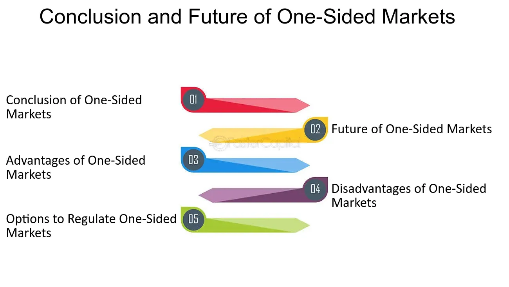

## Table of Contents

## What is a one-sided market?

A one-sided market is when there are more buyers than sellers, or more sellers than buyers, for a particular thing, like a stock or a product. It's like when everyone wants to buy something, but no one wants to sell it, or everyone wants to sell something, but no one wants to buy it. This can make the price of the thing go up or down a lot.

In a stock market, a one-sided market can happen when a lot of people want to buy a certain stock, making its price go up quickly. Or, it can happen when many people want to sell a stock, causing its price to drop fast. This situation can make it hard for the market to work smoothly because there's not a good balance between buying and selling.

## How does a one-sided market differ from a two-sided market?

A one-sided market is when there are a lot more people wanting to buy something than sell it, or a lot more people wanting to sell something than buy it. This makes the price of the thing go up or down a lot because there's not a good balance. For example, if everyone wants to buy a certain stock but no one wants to sell it, the price of that stock will go up quickly.

A two-sided market, on the other hand, is when there are both buyers and sellers for something, and they are more balanced. This means that the price of the thing doesn't change as much because there are people willing to buy and sell at similar prices. It's like having a fair game where both sides have a chance to play, making the market work smoothly.

In simple terms, a one-sided market is like a seesaw with too many people on one side, making it hard to balance. A two-sided market is like a seesaw with people on both sides, making it easier to go up and down smoothly.

## What are the key characteristics of a one-sided market?

A one-sided market is when there are a lot more people wanting to buy something than sell it, or a lot more people wanting to sell something than buy it. This makes the price of the thing go up or down a lot because there's not a good balance. For example, if everyone wants to buy a certain stock but no one wants to sell it, the price of that stock will go up quickly. This can make it hard for people to buy or sell at a fair price because there are too many people on one side.

This situation can happen in many places, like the stock market or even when buying and selling things like houses or cars. When there are too many buyers and not enough sellers, the price goes up because people are willing to pay more to get what they want. On the other hand, when there are too many sellers and not enough buyers, the price goes down because people have to lower their prices to sell their things. This imbalance can make the market feel unstable and unpredictable.

## Can you provide examples of one-sided markets?

One example of a one-sided market is the housing market during a housing boom. Imagine a town where a new factory opens, and a lot of people move there for jobs. Suddenly, there are many more people wanting to buy houses than there are houses for sale. This makes the price of houses go up a lot because people are willing to pay more to get a place to live. It's hard for new buyers to find a house at a fair price because there are too many buyers and not enough sellers.

Another example is the stock market during a stock frenzy. Sometimes, a company's stock becomes really popular, and everyone wants to buy it. This can happen because of good news about the company or because a lot of people think the stock's price will keep going up. When this happens, there are a lot more people wanting to buy the stock than there are people wanting to sell it. This makes the stock's price go up very quickly. It can be hard for people to buy the stock at a good price because there are too many buyers and not enough sellers.

## What are the causes of a one-sided market?

One cause of a one-sided market is a sudden change in demand or supply. For example, if a new technology becomes popular, a lot of people might want to buy it, but there might not be enough of it to go around. This makes the price go up because there are more buyers than sellers. On the other hand, if a company goes bankrupt and a lot of people want to sell its stock, there might be more sellers than buyers, which makes the price go down.

Another cause can be news or events that make people feel strongly about something. For instance, if a company announces a new product that everyone thinks will be great, a lot of people might want to buy its stock, causing a one-sided market with more buyers than sellers. Similarly, bad news like a scandal can make a lot of people want to sell a stock, leading to a one-sided market with more sellers than buyers. These events can create a rush of people all wanting to do the same thing at the same time, which unbalances the market.

## How does a one-sided market impact market efficiency?

A one-sided market can make the market less efficient because it's hard to find a good price when there are too many people wanting to buy or sell the same thing. When there are more buyers than sellers, the price goes up a lot because people are willing to pay more to get what they want. This makes it hard for new buyers to join the market because the price is too high. On the other hand, when there are more sellers than buyers, the price goes down a lot because people have to lower their prices to sell their things. This can make it hard for sellers to get a fair price for what they're selling.

This imbalance can also make the market feel unstable and unpredictable. When the market is one-sided, it's hard for it to find a balance on its own. This can lead to big price swings, which can scare people away from buying or selling. When people are scared, they might not make the best choices, which can make the market even less efficient. In a healthy market, there are enough buyers and sellers to keep the price stable, but in a one-sided market, this balance is missing, making it harder for the market to work smoothly.

## What are the potential benefits of operating in a one-sided market?

Operating in a one-sided market can have some benefits. If you're a seller in a market where there are a lot more buyers than sellers, you can sell your things for a higher price. This is because people are willing to pay more to get what they want when there's not enough to go around. For example, if you own a house in a town where a new factory just opened and a lot of people are moving in, you might be able to sell your house for more money than you expected.

On the other hand, if you're a buyer in a market where there are a lot more sellers than buyers, you can buy things for a lower price. This is because sellers have to lower their prices to get rid of their things when there are too many sellers. For instance, if you want to buy a stock from a company that's not doing well and a lot of people are trying to sell it, you might be able to buy it at a cheaper price. So, being on the right side of a one-sided market can help you make more money or save money.

## What are the risks and challenges associated with one-sided markets?

One-sided markets can be risky and challenging. When there are too many buyers and not enough sellers, prices can go up a lot. This makes it hard for new buyers to join the market because they can't afford the high prices. It's also risky because if the market suddenly changes and everyone decides to sell at the same time, the price can drop very quickly. This can lead to big losses for people who bought at the high prices. It's like being on a roller coaster that can go up and down very fast, making it hard to predict what will happen next.

On the other hand, when there are too many sellers and not enough buyers, prices can go down a lot. This makes it hard for sellers to get a fair price for their things because they have to keep lowering their prices to sell. It's risky because if the market stays one-sided for too long, sellers might end up selling at a loss. It's also challenging because the market can feel unstable and unpredictable, making it hard for people to make good decisions. In both cases, being in a one-sided market can feel like walking on a tightrope, where one wrong step can lead to big problems.

## How do regulatory bodies address issues in one-sided markets?

Regulatory bodies keep an eye on markets to make sure they are fair and work well. When they see a one-sided market, they might step in to help balance things out. For example, they can set rules to stop people from doing things that make the market more one-sided, like spreading false information to make a stock's price go up or down a lot. They can also make sure that big buyers or sellers don't have too much power and mess up the market for everyone else.

Sometimes, regulatory bodies can also help by making it easier for more people to join the market. This can help balance out the number of buyers and sellers. For instance, they might make rules that help new buyers get into the housing market when there are too many sellers, or they might encourage more people to sell when there are too many buyers. By doing these things, regulatory bodies try to make the market more stable and fair for everyone.

## What strategies can businesses employ to succeed in a one-sided market?

In a one-sided market where there are more buyers than sellers, businesses can succeed by carefully managing their inventory and pricing. If a business is selling something that a lot of people want, they can raise their prices a bit to make more money. But they have to be careful not to raise the prices too much, or people might get upset and stop buying. They can also try to get more of the thing people want by working with more suppliers or making more of it themselves. This way, they can sell to more people and make more money.

On the other hand, in a one-sided market where there are more sellers than buyers, businesses need to focus on standing out from the competition. They can do this by lowering their prices a bit to attract more buyers. But they have to be careful not to lower the prices too much, or they might lose money. They can also try to make their product or service better or different from what others are selling. This can make people want to buy from them instead of their competitors. By doing these things, businesses can find success even in a tough market.

## How do one-sided markets influence pricing strategies?

In a one-sided market where there are more buyers than sellers, businesses can charge higher prices because people really want what they're selling. It's like when everyone wants the newest toy, and stores can raise the price because they know people will still buy it. But businesses have to be careful not to make the price too high, or people might get mad and stop buying. They can also try to get more of the thing people want, so they can sell to more people and make more money.

In a one-sided market where there are more sellers than buyers, businesses need to lower their prices to get people to buy. It's like when a lot of people are trying to sell their old bikes, and they have to make the price lower so someone will want to buy one. But they can't make the price too low, or they might lose money. They can also try to make their product or service better or different from what others are selling, so people will want to buy from them instead of their competitors.

## What are the long-term implications of one-sided markets on industry structure?

One-sided markets can change the way an industry works over time. When there are a lot more buyers than sellers, companies that can sell what people want might grow bigger and stronger. They might also start to control more of the market because they can keep selling at higher prices. This can make it hard for new companies to start up because they can't compete with the big companies. Over time, this can lead to fewer companies in the industry, making it less competitive.

On the other hand, when there are a lot more sellers than buyers, companies might have to lower their prices a lot to sell their things. This can make it hard for them to make money, and some might go out of business. Companies that can find a way to stand out, like by making their product better or different, might do better. But overall, the industry might become smaller and weaker because so many companies are struggling. This can also make it harder for new companies to start up because the market is already full of sellers trying to sell at low prices.

## What is the understanding of One-Sided Markets?

A one-sided market can be characterized by a pronounced dominance of either the bid or the ask price, which usually occurs during periods of strong directional price movement or when there is significantly high demand. These conditions often lead to a reduction in market [liquidity](/wiki/liquidity-risk-premium) and an increase in [volatility](/wiki/volatility-trading-strategies). As liquidity thins out, the market’s ability to efficiently match buyers and sellers diminishes, often resulting in wider spreads and less depth in the order book.

Such markets can arise due to various factors, including regulatory changes, technological advancements, and shifts in market sentiment. For example, if regulatory adjustments make it more difficult for market makers to operate effectively, they may reduce their presence in the market, leading to reduced liquidity. Similarly, technological developments, particularly the rise of [algorithmic trading](/wiki/algorithmic-trading), can lead to rapid execution of trades that exacerbate existing market imbalances. Additionally, sentiment shifts, such as sudden increases in buyer interest due to economic news, can also create one-sided market conditions.

Understanding one-sided markets is crucial for effective trading and risk management. Traders must be aware of how these markets operate to avoid abrupt changes in prices or unfavorable trade executions. One-sided markets often provide opportunities for strategic positioning; however, they also introduce significant risks. Effective risk management strategies, including setting appropriate stop-loss orders and recognizing liquidity constraints, are essential tools traders must employ to navigate these markets. Furthermore, for market makers and institutions, comprehending the nuances of one-sided markets allows for better adaptation of trading algorithms and hedging strategies to maintain stability and profitability.

The mathematical representation of a one-sided market can be modeled by analyzing the [order book](/wiki/order-book-trading-strategies) dynamics, where the imbalance $I$ is given by:

$$
I = \frac{|V_{bid} - V_{ask}|}{V_{bid} + V_{ask}}
$$

where $V_{bid}$ and $V_{ask}$ represent the total volume of bids and asks, respectively. A high imbalance score indicates a more one-sided market, which may call for adjustments in trading strategies to efficiently manage the heightened risk and volatility present.

## References & Further Reading

[1]: Kirilenko, A. A., Kyle, A. S., Samadi, M., & Tuzun, T. (2017). ["The Flash Crash: High‐Frequency Trading in an Electronic Market."](https://www.jstor.org/stable/26652722) *The Journal of Finance*, 72(3), 1459–1497.

[2]: Chernov, M., & Sagers, P. (2015). ["The Price of the Swiss Franc De-Peg."](https://www.jstor.org/stable/27027699) *CFA Institute*, 71(3).

[3]: Aldridge, I. (2010). ["High-Frequency Trading: A Practical Guide to Algorithmic Strategies and Trading Systems."](https://www.ahmetbeyefendi.com/wp-content/uploads/2020/07/High-Frequency-Trading-Irene-Aldridge.pdf) Wiley.

[4]: Cartea, Á., Jaimungal, S., & Penalva, J. (2015). ["Algorithmic and High-Frequency Trading."](https://assets.cambridge.org/97811070/91146/frontmatter/9781107091146_frontmatter.pdf) Cambridge University Press.

[5]: Hauptmann, D. (2020). ["Algorithmic Trading and the Decline of the Social Function of Financial Markets."](https://www.researchgate.net/publication/378548435_Algorithmic_Trading_and_AI_A_Review_of_Strategies_and_Market_Impact) *Organization Studies*, 41(12), 1679-1697.