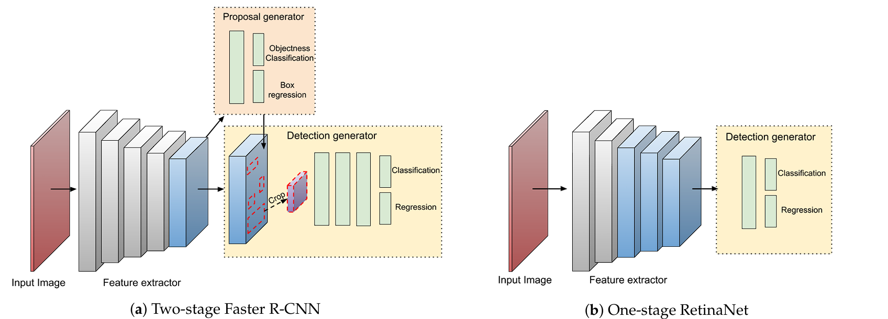

## Table of Contents

## What is object detection in the context of machine learning?

Object detection in machine learning is a technique used to identify and locate objects within an image or a video. It combines two main tasks: classification, which identifies what the objects are, and localization, which determines where the objects are in the image. Imagine you have a photo, and you want to know not just what is in the picture, but also where each item is located. Object detection helps computers do this automatically, making it useful in areas like self-driving cars, security systems, and even in apps on your phone.

To perform object detection, machine learning models are trained on large datasets of images where the objects are already labeled and their locations are marked. These models learn to recognize patterns and features that help them identify and locate objects in new images. A common approach is using convolutional neural networks (CNNs), which are good at processing images. Once trained, these models can draw boxes around objects in new images and label them, like drawing a box around a car and labeling it as "car." This technology continues to improve, making it more accurate and faster over time.

## How do one-stage object detection models differ from two-stage models?

One-stage object detection models and two-stage models are two different approaches to finding objects in images. One-stage models, like YOLO (You Only Look Once) and SSD (Single Shot Detector), do everything in one go. They look at the whole image once and quickly guess where the objects are and what they are. This makes them fast, which is great for things like real-time video processing where you need quick answers.

Two-stage models, like R-CNN (Region-based Convolutional Neural Networks) and its variants, take a bit more time but can be more accurate. They work in two steps. First, they scan the image to find possible areas where objects might be. These areas are called "region proposals." Then, in the second step, they look closely at each of these areas to figure out what the object is and where exactly it is. This two-step process can be slower but often gives better results because it spends more time checking each part of the image carefully.

## What are some common one-stage object detection models?

One popular one-stage object detection model is YOLO, which stands for "You Only Look Once." YOLO is famous for being really fast. It looks at the whole image at once and guesses where objects are and what they are. This makes it great for things like self-driving cars or security cameras where you need quick answers. YOLO works by dividing the image into a grid and predicting bounding boxes and class probabilities for each grid cell. This approach lets YOLO detect multiple objects in real-time, which is why many people use it.

Another common one-stage model is SSD, or "Single Shot Detector." SSD is also fast and works by using a single [neural network](/wiki/neural-network) to predict both the location and the type of objects in the image. It uses different layers of the network to detect objects at different sizes, which helps it find both small and large objects well. SSD is often used in applications where speed and accuracy are both important, like in mobile apps or in systems that need to process a lot of images quickly.

Both YOLO and SSD have been improved over time, with new versions like YOLOv3, YOLOv4, and SSD with additional features that make them even better at detecting objects. These models are widely used because they offer a good balance between speed and accuracy, making them suitable for many real-world applications.

## Can you explain the basic architecture of SSD (Single Shot MultiBox Detector)?

The basic architecture of SSD (Single Shot MultiBox Detector) is designed to detect objects in images quickly and efficiently. It uses a single deep neural network to perform both the tasks of object classification and localization in one go. The network starts with a base network, often a pre-trained model like VGG-16, which extracts feature maps from the input image. These feature maps are then used by additional convolutional layers to predict the presence of objects at different scales and positions. SSD works by applying a set of default boxes (also known as anchor boxes) to different feature maps, each of which predicts the offset to the true object location and the class probabilities for the object within the box.

SSD's architecture is unique because it uses multiple layers to detect objects at different scales. The earlier layers of the network, which have higher resolution feature maps, are good at detecting smaller objects. As you go deeper into the network, the feature maps become smaller but can cover a larger area of the image, making them better at detecting larger objects. This multi-scale approach allows SSD to handle objects of varying sizes within the same image. By predicting the bounding boxes and class scores directly from these feature maps, SSD can achieve fast and accurate object detection without the need for a separate region proposal step, which is why it's called a "single shot" detector.

## How does YOLO (You Only Look Once) work, and what are the key differences between YOLOv1, YOLOv2, and YOLOv3?

YOLO, or "You Only Look Once," works by dividing an image into a grid and guessing where objects are and what they are in one go. It's like looking at a picture and quickly drawing boxes around things you see, like cars or people. YOLO uses a single neural network to do this. It looks at each part of the grid and says if there's an object there, where exactly it is, and what kind of object it is. This makes YOLO fast, which is great for things like video games or self-driving cars where you need quick answers. YOLO predicts bounding boxes and class probabilities for each grid cell, allowing it to detect multiple objects at once.

YOLOv1 was the first version, and it introduced the idea of looking at the whole image once to detect objects. It was fast but not as accurate as some other methods. YOLOv2, also known as YOLO9000, improved on this by being more accurate and able to detect more types of objects. It used techniques like batch normalization and anchor boxes to make better guesses about where objects are. YOLOv3 took things even further by using more layers in the network, which helped it detect objects at different sizes better. It also used something called "feature pyramid networks" to look at the image in more detail, making it even more accurate. Each version of YOLO got better at finding objects quickly and correctly, making it a popular choice for many applications.

## What improvements does YOLOv4 bring over its predecessors?

YOLOv4 brings several important improvements over its predecessors, making it faster and more accurate. One big change is the use of a new backbone network called CSPDarknet53, which helps the model learn better features from the image. YOLOv4 also uses something called "Bag of Freebies," which are tricks that make the model better without slowing it down. These include [data augmentation](/wiki/data-augmentation) techniques and better ways to train the model. Another cool thing is the use of "Bag of Specials," which are methods that make the model more accurate but might slow it a bit. This includes things like using different sizes of the image to find objects of different sizes.

Another key improvement in YOLOv4 is the use of a new method called "Mish" activation function, which helps the model learn more effectively. YOLOv4 also introduces a new way to predict where objects are called "CIoU loss," which makes the model's guesses more accurate. Plus, YOLOv4 uses something called "DropBlock regularization" to prevent the model from overfitting, which means it can work well on new images it hasn't seen before. All these changes together make YOLOv4 a powerful tool for detecting objects quickly and accurately in real-world applications.

## How does RetinaNet address the issue of class imbalance in object detection?

RetinaNet tackles the problem of class imbalance in object detection by using a special technique called Focal Loss. In object detection, class imbalance happens because most parts of an image don't have objects, so the model can get confused and focus too much on the easy, empty parts instead of the harder parts where objects are. Focal Loss helps by making the model pay more attention to the hard, misclassified examples. It does this by lowering the loss for well-classified examples and increasing it for the ones the model gets wrong. This way, the model learns to better detect the objects that are harder to find.

To explain Focal Loss in simple terms, imagine you're trying to find a needle in a haystack. Regular loss functions would make you focus on the whole haystack, but Focal Loss tells you to focus more on the parts where the needle might be hiding. The formula for Focal Loss is $$FL(p_t) = -\alpha_t(1-p_t)^\gamma \log(p_t)$$, where $$p_t$$ is the model's estimated probability for the correct class, $$\alpha_t$$ is a weighting [factor](/wiki/factor-investing), and $$\gamma$$ is a focusing parameter. By adjusting these, Focal Loss helps the model zoom in on the tricky parts of the image, making it better at finding objects even when they're rare or hard to see.

## What is the significance of anchor-free methods like FCOS and CenterNet in one-stage detection?

Anchor-free methods like FCOS (Fully Convolutional One-Stage Object Detection) and CenterNet are important in one-stage detection because they get rid of the need for anchor boxes. In traditional methods, anchor boxes are used as starting points to guess where objects might be in an image. But anchor-free methods make things simpler by directly predicting where objects are without these starting points. This makes the models easier to use and understand because you don't have to set up and tune a bunch of anchor boxes. It also makes the models faster and can sometimes make them more accurate because they focus on the actual objects rather than guessing from a set of boxes.

Both FCOS and CenterNet work by looking at every point in the image and deciding if it's part of an object. FCOS does this by treating each pixel as a potential center of an object and predicting the distance from that pixel to the edges of the object. CenterNet, on the other hand, finds the center point of each object and then predicts the size and shape of the object from there. These methods make object detection more straightforward and efficient, which is why they're becoming more popular in the field of [machine learning](/wiki/machine-learning).

## How does EfficientDet optimize the performance and efficiency of object detection?

EfficientDet optimizes the performance and efficiency of object detection by using a special kind of network called EfficientNet as its backbone. EfficientNet is good at finding important parts of an image without using too much computer power. EfficientDet also uses something called BiFPN (Bidirectional Feature Pyramid Network) to look at the image in different ways and sizes. This helps the model find both big and small objects in the image. By combining these techniques, EfficientDet can detect objects quickly and accurately, making it great for real-world applications where speed and efficiency matter.

Another way EfficientDet improves efficiency is by using compound scaling. This means the model can grow in different ways, like making it deeper, wider, or using bigger images, to get the best performance without wasting resources. The formula for compound scaling is $$depth = \alpha^\phi$$, $$width = \beta^\phi$$, and $$resolution = \gamma^\phi$$, where $$\phi$$ is the compound coefficient, and $$\alpha$$, $$\beta$$, and $$\gamma$$ are constants determined by a grid search. By carefully adjusting these factors, EfficientDet can be fine-tuned to work well on different kinds of hardware, from small devices to powerful computers. This flexibility makes EfficientDet a versatile and efficient tool for object detection.

## What are some advanced techniques used in YOLOX to enhance detection accuracy?

YOLOX uses a few smart tricks to make object detection more accurate. One big change is that it doesn't use anchor boxes like older versions of YOLO did. Instead, YOLOX uses a method called "anchor-free" detection. This means it looks at every part of the image and decides if it's the center of an object. By not using anchor boxes, YOLOX can focus more on the actual objects in the image, making it more accurate. It also uses something called "decoupled head" to separate the tasks of figuring out where the object is and what the object is. This helps the model be better at both jobs.

Another technique YOLOX uses is called "dynamic label assignment." This means the model can change how it decides which parts of the image are important as it learns. It helps the model pay attention to the right places and ignore the wrong ones. YOLOX also uses a strong data augmentation method called "mosaic augmentation," where it mixes different images together to create new training examples. This makes the model better at handling different kinds of images it might see in the real world. All these changes together make YOLOX a powerful tool for detecting objects accurately and quickly.

## How do models like CornerNet and ExtremeNet utilize keypoint estimation for object detection?

CornerNet and ExtremeNet use keypoint estimation to find objects in images in a special way. Instead of using boxes like many other models, they look for important points on the objects. CornerNet finds the top-left and bottom-right corners of an object's bounding box. It treats these corners as keypoints and then connects them to form the box around the object. By focusing on these keypoints, CornerNet can be more accurate, especially for objects that are not in the usual shapes or sizes. It uses a neural network to predict where these corners are and then figures out which corners belong to the same object.

ExtremeNet takes this idea further by finding more keypoints. It looks for the top-most, left-most, bottom-most, and right-most points of an object, plus the center of the object. This gives ExtremeNet more information to work with, making it better at handling objects that are partly hidden or in different positions. ExtremeNet also uses a neural network to predict where these keypoints are and then connects them to form the bounding box. By using more keypoints, ExtremeNet can be more accurate and flexible in detecting objects in various situations.

## What are the latest trends and future directions in one-stage object detection research?

The latest trends in one-stage object detection research focus on making models faster and more accurate without using anchor boxes. Anchor-free methods like YOLOX and FCOS have become popular because they simplify the detection process. These models directly predict object locations without relying on pre-defined anchor boxes, which can be tricky to set up and tune. Another trend is the use of advanced data augmentation techniques, like mosaic augmentation, which helps models learn from a wider variety of images. Researchers are also working on improving the loss functions used in these models, like Focal Loss, to make them better at handling class imbalance and focusing on hard examples.

Future directions in one-stage object detection are likely to involve integrating more advanced neural network architectures, such as transformers, which have shown great promise in other areas of machine learning. Transformers can help models understand the context of an image better, potentially leading to more accurate object detection. Another area of interest is the development of models that can work well on edge devices, like smartphones and drones, which require efficient use of limited computational resources. Researchers are also exploring ways to make these models more adaptable to new types of objects and environments without needing extensive retraining, which could make them more useful in real-world applications.