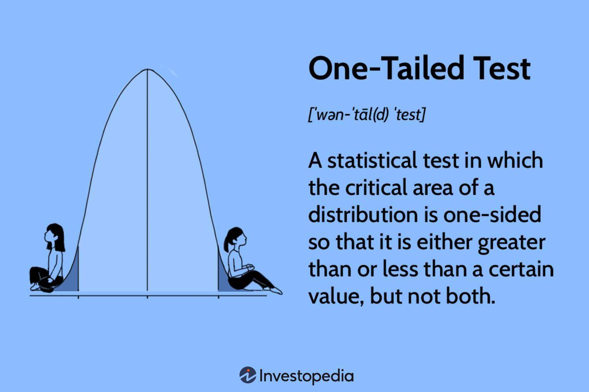

## Table of Contents

## What is a one-tailed statistical test?

A one-tailed statistical test is a method used to determine if there is a significant difference between groups, but it only looks for a change in one direction. For example, if you want to see if a new medicine helps people recover faster, you would use a one-tailed test to check if the recovery time is shorter, but not if it's longer. This type of test is useful when you have a specific prediction about the direction of the effect.

However, one-tailed tests have some limitations. They are less conservative than two-tailed tests, which means they might be more likely to find a significant result even if there isn't a real effect. This can lead to false positives. Because of this, scientists often prefer two-tailed tests, which look for changes in both directions and are more rigorous. But in some situations, like when you have a strong reason to expect an effect in one direction, a one-tailed test can be appropriate.

## How does a one-tailed test differ from a two-tailed test?

A one-tailed test and a two-tailed test are both used to figure out if there's a real difference between groups, but they look at the data in different ways. A one-tailed test checks for a change in just one direction. For example, if you're testing a new fertilizer to see if it makes plants grow taller, a one-tailed test would only look to see if the plants are taller, not shorter. This type of test is useful when you have a good reason to expect the results to go in one specific direction.

On the other hand, a two-tailed test looks for changes in both directions. Using the same fertilizer example, a two-tailed test would check if the plants are either taller or shorter than usual. This makes it more thorough because it can catch any kind of change, not just the one you expected. Two-tailed tests are often preferred in scientific research because they are more conservative and less likely to miss important findings.

The main difference between the two is that a one-tailed test is more focused and can be more powerful in detecting an effect in the predicted direction, but it might miss an effect if it goes the other way. A two-tailed test, while less powerful for detecting an effect in one direction, is better at detecting any effect, making it a safer choice when you're not sure which way the results will go.

## When should you use a one-tailed test?

You should use a one-tailed test when you have a strong reason to expect the results to go in one specific direction. For example, if you're testing a new medicine that you believe will lower blood pressure, a one-tailed test is appropriate because you're only interested in seeing if the medicine makes blood pressure go down, not up. This type of test is more powerful for finding an effect in the direction you expect, which can be helpful when you have a clear prediction.

However, one-tailed tests can be risky because they might miss important effects if they happen in the opposite direction. Because of this, you should only use a one-tailed test when you have strong evidence or a solid theory supporting your prediction. If you're not sure which way the results will go, it's safer to use a two-tailed test, which looks for changes in both directions and is less likely to miss any effects.

## What are the advantages of using a one-tailed test?

Using a one-tailed test can be really helpful when you have a strong guess about which way your results will go. For example, if you think a new diet will make people lose weight, a one-tailed test can focus just on that. This makes the test more powerful at finding an effect in the direction you expect. It's like using a magnifying glass to look closely at one specific thing, which can make it easier to see if your guess is right.

But, one-tailed tests can also be risky. If the effect happens in the opposite direction from what you expected, the test might miss it completely. For instance, if the diet actually makes people gain weight, a one-tailed test looking for weight loss won't notice that. So, you should only use a one-tailed test when you have good reasons to believe your guess is correct. If you're not sure which way things will go, it's safer to use a two-tailed test, which looks at both directions and is less likely to miss important results.

## What are the potential pitfalls of using a one-tailed test?

Using a one-tailed test can be tricky because it only looks for changes in one direction. If the real effect goes the other way, the test might miss it completely. For example, if you're testing a new fertilizer to see if it makes plants grow taller, and it actually makes them grow shorter, a one-tailed test won't notice that. This can lead to wrong conclusions because you might think there's no effect at all, when there actually is one, just in the opposite direction.

Another problem with one-tailed tests is that they can be more likely to find a significant result even if there isn't a real effect. This is because they are less strict than two-tailed tests. Imagine you're looking for a tiny change in one direction, and you find it, but it's just by chance. A one-tailed test might say it's important when it's really not. This can lead to false positives, where you think something works when it doesn't. So, it's important to use one-tailed tests only when you have a strong reason to expect the effect to go in one specific direction.

## How do you set up the null and alternative hypotheses for a one-tailed test?

For a one-tailed test, you start by setting up the null and alternative hypotheses. The null hypothesis (often written as H0) is what you assume to be true at the beginning. It usually says there's no effect or no difference in the direction you're interested in. For example, if you're testing a new medicine to see if it lowers blood pressure, the null hypothesis might say that the medicine doesn't lower blood pressure at all.

The alternative hypothesis (often written as H1 or Ha) is what you're trying to find evidence for. It states that there is an effect, but only in the direction you predicted. Using the same medicine example, the alternative hypothesis would say that the medicine does lower blood pressure. So, in a one-tailed test, you're looking to see if you can reject the null hypothesis in favor of the alternative hypothesis, but only if the effect goes in the direction you expected.

## Can you explain the concept of directional hypotheses in the context of one-tailed tests?

A directional hypothesis is a specific type of prediction used in one-tailed tests. It means you're expecting a change to happen in one particular direction. For example, if you think a new teaching method will improve students' test scores, your directional hypothesis would say that the new method will make scores go up, not down. This kind of hypothesis is useful when you have a good reason to expect the results to go a certain way.

In the context of one-tailed tests, the directional hypothesis is what you're trying to prove. You set up your null hypothesis to say there's no effect in the direction you're interested in, and your alternative hypothesis, which is the directional hypothesis, says there is an effect in that direction. If your data shows a significant change in the direction you predicted, you can reject the null hypothesis and support your directional hypothesis. But remember, if the effect goes the other way, a one-tailed test won't notice it, so you need to be sure about your prediction before using this type of test.

## What is the critical value in a one-tailed test and how is it determined?

The critical value in a one-tailed test is a number that helps you decide if your results are important or just happened by chance. It's like a cutoff point. If your test statistic is bigger than this critical value, you can say your results are significant and reject the null hypothesis. The critical value depends on the type of test you're doing, how many samples you have, and how sure you want to be about your results.

To find the critical value, you need to know the level of significance you're using, usually written as alpha (α). Common levels are 0.05 or 0.01. You also need to know the degrees of freedom, which depends on your sample size. Once you have these, you can look up the critical value in a table for the specific statistical test you're using, like a t-test or z-test. For a one-tailed test, you look in the part of the table that matches the direction you predicted. If your test statistic is beyond this critical value, you've found something important in the direction you expected.

## How do you calculate the p-value for a one-tailed test?

To calculate the p-value for a one-tailed test, you first need to find your test statistic. This could be a t-value, z-value, or another type of statistic depending on your test. Once you have your test statistic, you compare it to the distribution of that statistic under the null hypothesis. For a one-tailed test, you're only interested in the part of the distribution that goes in the direction you predicted. You then find the area under the curve of the distribution that is beyond your test statistic in that direction. This area is your p-value.

The p-value tells you the probability of getting a result as extreme as, or more extreme than, the one you found if the null hypothesis is true. If your p-value is smaller than your chosen level of significance (like 0.05), you can reject the null hypothesis and say your result is statistically significant in the direction you expected. If it's bigger, you don't have enough evidence to reject the null hypothesis. Remember, for a one-tailed test, you only look at one side of the distribution, so the p-value is the area in the tail that matches your prediction.

## What are the implications of choosing the wrong tail for a one-tailed test?

Choosing the wrong tail for a one-tailed test can lead to big problems. If you expect a result to go up but it actually goes down, your test won't see that change. For example, if you think a new medicine will lower blood pressure but it actually raises it, a one-tailed test looking for a decrease won't notice the increase. This means you might think the medicine doesn't work at all, when really it's having an effect, just not the one you expected.

This mistake can make you miss important information and come to the wrong conclusions. If you choose the wrong tail, you could end up saying there's no effect when there actually is one. That's why it's really important to have a strong reason for choosing a one-tailed test and picking the right direction. If you're not sure which way the results will go, it's safer to use a two-tailed test, which looks at changes in both directions and is less likely to miss any effects.

## How does the power of a test change when using a one-tailed versus a two-tailed approach?

When you use a one-tailed test, it can be more powerful than a two-tailed test if the effect goes in the direction you predicted. This is because a one-tailed test only looks for changes in one direction, so all of its power is focused on finding that specific change. Imagine you're looking for a tiny increase in plant height with a new fertilizer. A one-tailed test will be better at spotting that small increase than a two-tailed test, which spreads its power across both directions.

However, if the real effect goes the other way, a one-tailed test loses all its power because it won't notice changes in the opposite direction. For example, if the fertilizer actually makes plants shorter, a one-tailed test looking for taller plants won't see that. A two-tailed test, on the other hand, looks for changes in both directions, so it's less likely to miss important effects. It's like using a wider net to catch any kind of change, but it might not be as good at catching very small changes in one specific direction.

## Can you discuss any advanced applications or considerations of one-tailed tests in specific fields like psychology or medicine?

In psychology, one-tailed tests can be useful when researchers have a strong theory about how a certain intervention will affect behavior. For example, if a psychologist is testing a new therapy to see if it reduces anxiety, they might use a one-tailed test because they expect the therapy to lower anxiety levels, not raise them. This approach can make the study more powerful at detecting small but meaningful improvements in anxiety. However, psychologists need to be careful because if the therapy unexpectedly increases anxiety, a one-tailed test won't notice that. This could lead to missing important information about the therapy's effects, so it's important to have solid reasons for expecting the results to go one way before choosing a one-tailed test.

In medicine, one-tailed tests are often used when testing new drugs or treatments where the expected effect is very clear. For instance, if a new drug is designed to lower cholesterol levels, a one-tailed test can be more effective at detecting whether the drug works as intended. This is because the test focuses only on the possibility that the drug will lower cholesterol, making it more sensitive to small but significant reductions. Yet, doctors and researchers must be cautious because if the drug has an unexpected side effect, like raising cholesterol, a one-tailed test won't catch that. Therefore, using a one-tailed test in medicine requires strong evidence that the drug will work in the predicted direction, and it's often safer to use a two-tailed test to ensure no important effects are missed.

## How do you conduct a One-Tailed Test in Algorithmic Trading?

Conducting a one-tailed test in algorithmic trading involves careful planning and precise execution to derive meaningful conclusions about trading strategies. The initial step requires defining the null hypothesis ($H_0$) and the alternative hypothesis ($H_a$). The null hypothesis posits no effect or a baseline performance, whereas the alternative hypothesis suggests a specific direction of effect, either an increase or decrease in a financial metric such as mean returns or [volatility](/wiki/volatility-trading-strategies).

Next, determining the direction of the test—upper or lower-tailed—is crucial. An upper-tailed test might examine whether a new algorithm achieves returns greater than a benchmark, while a lower-tailed test might assess adverse impacts, like increased risk.

Selection of a proper significance level, often set at 5% (0.05), is essential to balance the risks of Type I and Type II errors. A Type I error involves incorrectly rejecting the null hypothesis, while a Type II error entails failing to reject a false null hypothesis.

Calculating the test statistic forms the analysis's core. Tools like Python, equipped with libraries such as SciPy and NumPy, facilitate this calculation. Assuming normally distributed returns, the test statistic $t$ can be calculated as:

$$

t = \frac{\bar{x} - \mu_0}{\frac{s}{\sqrt{n}}} 
$$

where $\bar{x}$ is the sample mean, $\mu_0$ is the population mean under the null hypothesis, $s$ is the sample standard deviation, and $n$ is the sample size.

Once the test statistic is computed, traders compare it to the critical value corresponding to the chosen significance level. If the test statistic is beyond the critical value, they reject the null hypothesis, indicating the trading strategy's statistical significance in outperforming the benchmark.

One-tailed tests are particularly beneficial in various applications, such as evaluating new algorithmic models against existing strategies or adjusting portfolios based on statistical evidence of performance enhancement. For instance, in validating algorithmic improvements, a trader might apply a one-tailed test to examine whether the algorithm delivers significantly higher returns compared to a historical average.

Real-world applications provide concrete examples of the utility of one-tailed tests. Traders often implement such tests when exploring modifications to existing strategies or developing entirely new algorithms, using historical data to substantiate claims of enhanced performance. These applications demonstrate the practicality of hypothesis testing in refining and validating trading strategies, leading to informed decision-making and potential competitive advantages in the market.

## References & Further Reading

[1]: Investopedia and various educational resources provide in-depth insights into hypothesis testing and one-tailed tests. These platforms feature articles and tutorials that break down the concepts of p-values, significance levels, and testing procedures, making them accessible to both novice and experienced traders. For a comprehensive overview, readers can visit the Investopedia website and access their educational content.

[2]: Explore academic papers and books on advanced financial machine learning and algorithmic trading for comprehensive understanding. Notable publications include "Advances in Financial Machine Learning" by Marcos López de Prado, which provides detailed methodologies and strategies relevant to algorithmic trading. Additionally, the Journal of Computational Finance and similar scholarly journals offer articles that cover the mathematical and statistical underpinnings of trading innovations.

[3]: Utilize online courses and webinars to deepen proficiency in statistical analysis for trading. Platforms like Coursera, edX, and Khan Academy offer courses specifically focused on statistical hypothesis testing, algorithmic trading, and one-tailed tests. These courses often include video lectures, quizzes, and practical assignments to reinforce learning and application of concepts.

Further reading on statistical software libraries in Python, R, and other platforms is recommended for practical application. Python libraries such as SciPy and StatsModels provide functions for conducting hypothesis tests, including one-tailed tests. R, with packages like 'stats' and Tidyverse, similarly offers robust tools for statistical analysis. Familiarity with these libraries allows traders to implement statistical techniques effectively within their algorithms.

For those interested in code implementation, the following Python example demonstrates conducting a one-tailed test using SciPy:

```python
from scipy import stats

# Sample data
sample_data = [5.1, 5.8, 6.5, 5.2, 6.1]
population_mean = 5.0

# Conduct a one-tailed t-test
t_stat, p_value = stats.ttest_1samp(sample_data, population_mean)

# Adjust p-value for a one-tailed test
one_tailed_p_value = p_value / 2 if t_stat > 0 else 1 - (p_value / 2)

print(f"One-tailed p-value: {one_tailed_p_value}")
```

This code snippet performs a one-tailed t-test to determine if the sample mean is significantly greater than the population mean. It highlights practical application using Python libraries, which is essential for traders looking to incorporate statistical testing into their strategies.

