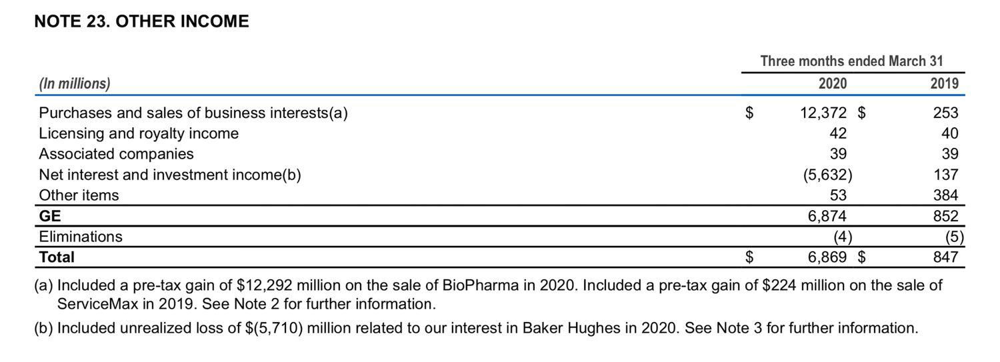

## Table of Contents

## What are one-time items in financial statements?

One-time items in financial statements are unusual or non-recurring expenses or revenues that a company might experience. These items are not expected to happen again in the future and can include things like restructuring costs, legal settlements, or gains from selling assets. They are important to identify because they can significantly affect a company's reported earnings for a particular period, but they do not reflect the company's ongoing financial performance.

When looking at a company's financial statements, it's helpful to separate these one-time items from regular operating results. This helps investors and analysts get a clearer picture of the company's true financial health and performance. For example, if a company reports a large profit due to a one-time gain from selling a piece of property, it might look like the company is doing very well. However, if you take away that one-time gain, the company's regular operations might not be as profitable. By understanding and adjusting for one-time items, you can make better decisions about the company's future.

## How do one-time items affect a company's financial performance?

One-time items can make a big difference in how a company's financial performance looks for a certain period. These items are things that don't happen often, like selling a big piece of property or paying for a lawsuit. When these one-time items show up on the financial statements, they can make the company's profits or losses look much bigger or smaller than they really are. For example, if a company sells a building and makes a lot of money from it, their profits for that year might look really high. But that money isn't from their regular business, so it doesn't show how well the company is doing day to day.

Because one-time items can change how a company's financial performance looks, it's important for people who look at these statements to know about them. If someone is thinking about investing in the company, they need to see past these one-time items to understand the company's true financial health. By taking out these unusual costs or gains, investors can get a better idea of how the company is doing over time. This helps them make smarter choices about whether to buy, sell, or hold onto the company's stock.

## Can you provide examples of common one-time items?

One-time items are things that happen once and don't usually happen again. A common example is when a company sells a big piece of property or equipment. This can make their profits look really high for that year, but it's not money they make from selling their usual products or services. Another example is when a company has to pay a lot of money because of a lawsuit. This can make their profits look lower for that year, but it's not something that happens every year.

Another type of one-time item is when a company has to pay for restructuring. This means they might have to pay to close down some offices or lay off workers. It's a big cost, but it's not something they do all the time. Sometimes, a company might also get money from insurance if something bad happens, like a fire. This money can make their profits look better for that year, but it's not from their regular business.

These one-time items can make a company's financial statements look different from what they usually are. That's why it's important for people who look at these statements to know about them. By understanding these one-time items, they can see the real financial health of the company and make better decisions.

## Why is it important to identify one-time items when analyzing financial statements?

It's really important to spot one-time items when you're looking at a company's financial statements because these items can make the company's profits or losses look different from what they usually are. One-time items are things that don't happen often, like selling a big piece of property or paying for a lawsuit. If you don't know about these one-time items, you might think the company is doing much better or worse than it really is. For example, if a company sells a building and makes a lot of money from it, their profits for that year might look really high. But that money isn't from their regular business, so it doesn't show how well the company is doing day to day.

By understanding and taking out these one-time items, you can get a clearer picture of the company's true financial health. This is really helpful for people who are thinking about investing in the company. They need to see past these unusual costs or gains to understand how the company is doing over time. This helps them make smarter choices about whether to buy, sell, or hold onto the company's stock. So, knowing about one-time items helps everyone get a better idea of the company's real performance and make better decisions.

## How are one-time items reported in financial statements?

One-time items are reported in a company's financial statements, usually in the income statement. They are listed separately from the regular operating income and expenses so that people can see them clearly. For example, if a company sells a big piece of property, the money they get from that sale would be shown as a one-time gain. Or if they have to pay a lot of money because of a lawsuit, that would be shown as a one-time expense. This way, anyone looking at the financial statements can see these unusual items and understand that they are not part of the company's regular business.

These one-time items are often explained in more detail in the notes to the financial statements. The notes give more information about what the one-time items are and why they happened. This helps people understand the impact of these items on the company's financial performance. By looking at both the income statement and the notes, someone can get a full picture of the company's financial health, without being confused by these unusual events.

## What is the difference between one-time items and recurring items?

One-time items are things that happen just once and don't usually happen again. They can be things like selling a big piece of property, paying for a lawsuit, or getting money from insurance after a fire. These items can make a company's profits or losses look different for a certain period, but they don't show how the company is doing in its regular business. For example, if a company sells a building and makes a lot of money from it, their profits for that year might look really high. But that money isn't from their usual products or services, so it doesn't reflect their day-to-day performance.

Recurring items, on the other hand, are the regular costs and revenues that a company has all the time. These are things like the money they make from selling their products or services, and the costs they have for things like salaries, rent, and supplies. Recurring items show how the company is doing in its normal operations. They help people understand the company's ongoing financial health and performance. By looking at recurring items, investors and analysts can get a better idea of how the company is doing over time, without being confused by unusual one-time events.

## How can one-time items impact investment decisions?

One-time items can really change how investors see a company's financial health. If a company has a big one-time gain, like selling a building, it might look like they're doing really well. But that money isn't from their regular business, so it doesn't show how they're doing day to day. Investors need to know about these one-time items so they don't think the company is doing better than it really is. If they don't know about these items, they might make a bad decision, like buying the company's stock when it's actually not a good investment.

On the other hand, one-time items can also make a company look worse than it really is. For example, if a company has to pay a lot of money because of a lawsuit, their profits for that year might look really low. But that cost isn't something that happens every year, so it doesn't show how the company usually does. By understanding these one-time items, investors can see past them and make better decisions. They can look at the company's regular business to see if it's a good investment, instead of being fooled by unusual events.

## What are some strategies companies use to manage one-time items?

Companies sometimes use different ways to handle one-time items so they don't mess up how their financial performance looks. One way they do this is by spreading out the cost of a one-time item over several years. For example, if a company has to pay a lot of money for a lawsuit, they might decide to show a little bit of that cost each year instead of all at once. This makes their profits look more stable and helps investors see how the company is doing in its regular business.

Another strategy is to be very clear about one-time items in their financial statements. Companies will often put these items in a separate part of the income statement and explain them in the notes. This way, anyone looking at the financial statements can see these unusual items and understand that they are not part of the company's regular business. By being open about one-time items, companies help investors get a true picture of their financial health and make better decisions.

## How do accounting standards treat one-time items?

Accounting standards have rules about how to show one-time items in financial statements. These rules make sure that companies are clear about these unusual costs or gains. One-time items are usually shown separately on the income statement, so people can see them easily. This helps everyone understand that these items are not part of the company's regular business. For example, if a company sells a big piece of property, the money they get from that sale would be shown as a one-time gain. Or if they have to pay a lot of money because of a lawsuit, that would be shown as a one-time expense.

The notes to the financial statements also give more details about one-time items. They explain what these items are and why they happened. This extra information helps people understand the impact of these items on the company's financial performance. By following these accounting standards, companies make sure that their financial statements are clear and honest. This helps investors and analysts get a true picture of the company's financial health, without being confused by unusual events.

## Can one-time items be manipulated, and if so, how?

Yes, one-time items can be manipulated by companies to make their financial statements look better or worse than they really are. One way they might do this is by moving regular costs into one-time items. For example, a company might say that some of their regular expenses, like fixing up their offices, are part of a one-time restructuring cost. This makes their regular profits look higher because those costs are not shown as part of their day-to-day business.

Another way companies can manipulate one-time items is by choosing when to report them. They might wait to report a one-time gain until a year when their regular profits are low, to make that year look better. Or they might report a one-time loss in a year when their profits are high, to make it look like their regular business is doing even better than it is. By doing these things, companies can try to fool investors into thinking their financial health is different from what it really is.

## What are the long-term effects of frequent one-time items on a company's financial health?

When a company has a lot of one-time items, it can make it hard for people to see how the company is really doing. If a company keeps having big one-time gains or losses, it can make their financial statements look very different from one year to the next. This can confuse investors and make it hard for them to trust the company's financial reports. Over time, if investors can't tell what the company's regular business is like, they might decide not to invest in the company. This can hurt the company's stock price and make it harder for them to get money they need to grow.

Also, if a company keeps using one-time items to make their financial statements look better, it can be a sign that their regular business is not doing well. For example, if a company keeps selling off assets to show big profits, it might mean they are not making enough money from their regular products or services. Over time, this can lead to the company running out of assets to sell, and their financial health can get worse. So, having too many one-time items can be a warning sign that the company needs to fix problems in its regular business to stay healthy in the long run.

## How do analysts adjust financial metrics to account for one-time items?

Analysts adjust financial metrics to account for one-time items by taking these unusual costs or gains out of the company's regular earnings. They do this to get a clearer picture of how the company is doing in its day-to-day business. For example, if a company reports a big profit because they sold a building, an analyst would take that profit out of the earnings to see what the company's regular business is like. This helps them understand the company's true financial health without being confused by one-time events.

By making these adjustments, analysts can calculate more accurate financial ratios and metrics. For instance, they might look at the company's earnings before interest, taxes, depreciation, and amortization (EBITDA) and adjust it to exclude one-time items. This gives them a better idea of the company's operating performance. These adjusted metrics help investors make smarter decisions about whether to buy, sell, or hold onto the company's stock, based on a more reliable view of the company's ongoing financial health.

## References & Further Reading

[1]: ["Advances in Financial Machine Learning"](https://www.amazon.com/Advances-Financial-Machine-Learning-Marcos/dp/1119482089) by Marcos Lopez de Prado

[2]: ["Evidence-Based Technical Analysis: Applying the Scientific Method and Statistical Inference to Trading Signals"](https://www.amazon.com/Evidence-Based-Technical-Analysis-Scientific-Statistical/dp/0470008741) by David Aronson

[3]: ["Machine Learning for Algorithmic Trading"](https://github.com/stefan-jansen/machine-learning-for-trading) by Stefan Jansen

[4]: ["Quantitative Trading: How to Build Your Own Algorithmic Trading Business"](https://www.amazon.com/Quantitative-Trading-Build-Algorithmic-Business/dp/1119800064) by Ernest P. Chan

[5]: ["Financial Statement Analysis and Security Valuation"](https://www.mheducation.com/highered/product/Financial-Statement-Analysis-and-Security-Valuation-Penman.html) by Stephen H. Penman

[6]: ["Algorithmic Trading: Winning Strategies and Their Rationale"](https://books.google.com/books/about/Algorithmic_Trading.html?id=WAlFDwAAQBAJ) by Ernest P. Chan

[7]: ["Trading and Exchanges: Market Microstructure for Practitioners"](https://www.amazon.com/Trading-Exchanges-Market-Microstructure-Practitioners/dp/0195144708) by Larry Harris