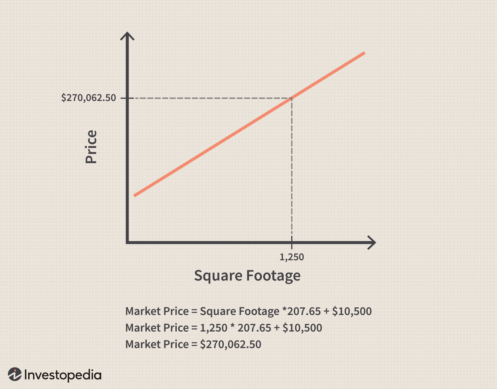

In the ever-evolving world of algorithmic trading, data organization plays a crucial role in decision-making processes. Algorithmic trading involves using computer algorithms to automatically make trading decisions based on quantitative data analysis and pre-defined criteria. One key factor that determines the success of these systems is the efficient handling and organization of data, as poor data management can lead to suboptimal trading strategies and missed opportunities.

Relational databases are commonly employed in algorithmic trading for their efficiency in managing structured data. These databases utilize tables to store data, where each table consists of rows and columns akin to a spreadsheet structure. Data relationships across tables are used to maintain organization and enable complex querying. A well-structured relational database system can provide the accurate and timely data retrieval necessary for high-frequency trading operations.



This article explores the concept of one-to-many database relationships, a fundamental aspect of relational databases, and their application within algorithmic trading platforms. One-to-many relationships occur when a single record in one table is associated with multiple records in another table. Such relationships are essential for organizing and accessing complex datasets in a coherent manner, which can be leveraged to generate actionable insights.

By examining these relationships, traders can gain a deeper understanding of their data, enabling them to recognize patterns and make better-informed decisions. The subsequent sections will provide examples of one-to-many relationships in algo trading, and discuss best practices in managing these relationships to optimize trading strategies effectively. Understanding these fundamental principles can help traders enhance their competitive edge and execute more precise, data-driven decisions in the fast-paced trading environment.

## Table of Contents

## Understanding Relational Database Relationships

Relational databases are essential tools for organizing and managing data across various domains. They allow for efficient data storage and retrieval by establishing structured relationships between tables. There are three primary types of relationships in these databases: one-to-one, one-to-many, and many-to-many.

In a one-to-one relationship, each record in one table corresponds to a single record in another table. This type of relationship is less common in financial database systems because it often involves redundant data [dispersion](/wiki/dispersion-trading) across tables. An example might include a table holding employee details linked to a table with employee authentication information, where each employee has only one set of authentication credentials.

Conversely, one-to-many relationships are integral to financial database systems. These relationships are characterized by a single record in one table being associated with multiple records in another table. For instance, a single customer record in a database may link to multiple order records, reflecting all the purchases made by that customer. This structure is particularly useful in [algorithmic trading](/wiki/algorithmic-trading), where a single asset can relate to numerous transactions over time. Efficient management of such relationships is crucial for detailed data analysis and decision-making.

Finally, many-to-many relationships involve multiple records in one table being associated with multiple records in another. This complexity is typically resolved with a junction table that breaks the many-to-many relationship into two one-to-many relationships. An example can be seen in a trading database where multiple traders are associated with multiple trading accounts, which necessitates an intermediary table to connect traders and accounts efficiently.

Understanding these database relationships is vital for effectively organizing complex datasets. Mastery of these concepts enables database designers and users to optimize query performance, maintain data integrity, and support scalability, especially in high-frequency trading environments where rapid decision-making is paramount. Properly designed relationships ensure seamless data communication across different database components, facilitating sophisticated analyses that can enhance trading outcomes.

## One-to-Many Relationships: Definition and Key Features

A one-to-many relationship in a database context emerges when a single record in one table (Table A) associates with several records in another table (Table B). This type of relationship is foundational in organizing and structuring datasets effectively, especially within algorithmic trading.

The management of one-to-many relationships typically involves the use of foreign keys. A foreign key is a column or set of columns in Table B that references the primary key in Table A. This connection ensures that each record in Table B has a valid association with a record in Table A, thereby maintaining logical consistency and enforcing referential integrity.

In algorithmic trading platforms, one-to-many relationships are particularly useful. For instance, a single stock symbol in a database might be linked to numerous transactional records, reflecting each buy or sell order made over time. This setup allows traders to conduct exhaustive reviews and analyses of trading activities related to a specific stock. An example schema could look like this in SQL:

```sql
CREATE TABLE Stocks (
    stock_id INT PRIMARY KEY,
    symbol VARCHAR(10),
    company_name VARCHAR(255)
);

CREATE TABLE Transactions (
    transaction_id INT PRIMARY KEY,
    stock_id INT,
    transaction_date DATE,
    transaction_type VARCHAR(10),
    amount INT,
    FOREIGN KEY (stock_id) REFERENCES Stocks(stock_id)
);
```

Key features of one-to-many relationships include:

1. **Efficient Data Retrieval**: Utilizing foreign keys, databases can quickly join tables, enabling rapid access to associated records across tables. This efficiency is crucial in high-frequency trading systems where swift decision-making is essential.

2. **Data Integrity**: By enforcing referential integrity through foreign keys, databases ensure that the relationships between tables remain consistent. Such consistency is vital for maintaining accuracy and reliability in financial analyses.

3. **Handling Large Datasets**: One-to-many relationships proficiently manage large volumes of data with complex interrelations. This capability supports algorithmic traders who require real-time data feeds and extensive historical data analysis to devise informed strategies.

Ultimately, the proper design and management of one-to-many relationships in relational databases contribute significantly to the operational efficiency and strategic capacities of algorithmic trading systems.

## Application of One-to-Many Relationships in Algo Trading

In algorithmic trading systems, one-to-many relationships are crucial for effectively managing and analyzing complex datasets that involve assets, transactions, and market data. These relationships enable traders to maintain a structured and interconnected database, optimizing trading strategies through thorough data organization and analysis.

An asset in the master table often relates to multiple transaction records in a child table. This linkage allows traders to conduct detailed analysis, leveraging historical transaction data linked to individual assets. For instance, an equity asset listed in a primary table could connect to numerous transaction entries, each detailing separate instances of trade for that particular equity. This setup enables comprehensive analysis by examining trends, [volume](/wiki/volume-trading-strategy) changes, and price fluctuations associated with the asset.

The seamless association within one-to-many relationships also facilitates real-time data analysis, which is critical for executing high-frequency trading strategies. In algo trading, the ability to process and analyze large volumes of data swiftly can provide significant advantages. One-to-many relationships support this by ensuring that the relational database can efficiently manage and retrieve interconnected data without compromising speed, a crucial requirement for minimizing latency in trading operations.

By employing efficient query handling mechanisms, rapid decision-making becomes achievable. Indexing strategies, such as B-trees or hash indexes, are often used to optimize the retrieval speeds of related data. For example, by indexing the foreign keys that establish one-to-many relationships, databases can perform lookups and joins more efficiently, significantly reducing the time required for query processing.

In Python, libraries like SQLAlchemy or Django ORM can be employed to manage these relationships within databases. A simplified example can involve setting up a one-to-many relationship between an `Asset` and `Transaction` model:

```python
from sqlalchemy import create_engine, ForeignKey, Column, Integer, String
from sqlalchemy.ext.declarative import declarative_base
from sqlalchemy.orm import relationship, sessionmaker

Base = declarative_base()

class Asset(Base):
    __tablename__ = 'assets'
    id = Column(Integer, primary_key=True)
    name = Column(String)
    transactions = relationship("Transaction", back_populates="asset")

class Transaction(Base):
    __tablename__ = 'transactions'
    id = Column(Integer, primary_key=True)
    asset_id = Column(Integer, ForeignKey('assets.id'))
    amount = Column(Integer)
    asset = relationship("Asset", back_populates="transactions")

engine = create_engine('sqlite:///trading.db')
Base.metadata.create_all(engine)
Session = sessionmaker(bind=engine)
session = Session()
```

This setup outlines how one-to-many relationships are established programmatically, providing a structured approach to manage assets and their associated transactions. Through such relationships, algorithmic trading platforms can achieve large-scale data association and processing, imperative for maintaining a competitive edge in fast-paced financial markets.

## Best Practices in Managing One-to-Many Relationships

In managing one-to-many relationships within algorithmic trading databases, it is essential to implement strategies that optimize performance, maintain data integrity, and ensure the reliability of trading systems. The use of indexes on foreign keys is a primary best practice for enhancing query performance. Indexes allow faster searches and retrievals by efficiently locating the rows associated with a given foreign key value. This is particularly significant in high-frequency trading environments, where rapid access to data is crucial. By indexing foreign keys, databases can quickly navigate the relationship paths, reducing the response time for complex queries.

Data normalization is another critical practice that helps reduce redundancy, thereby enhancing data integrity and consistency. Normalization involves organizing data into tables and establishing relationships according to rules that minimize duplication. A well-normalized database structure ensures that each fact is stored only once, which prevents anomalies during data operations like insertions, deletions, and updates. In algorithmic trading, where data accuracy is paramount, maintaining a normalized database layout can significantly reduce the risk of costly errors.

Transaction management techniques are vital to handle data modifications without disrupting existing data relationships. Using transactions ensures that a sequence of operations either fully completes or fully fails, maintaining the database's consistent state. In the context of managing one-to-many relationships, transactions guarantee that all associated records in the subordinate tables are correctly updated or rolled back in case of an error. For example, implementing a transaction in Python could look like this:

```python
import sqlite3

connection = sqlite3.connect('trading.db')
cursor = connection.cursor()

try:
    cursor.execute("BEGIN TRANSACTION")
    cursor.execute("UPDATE assets SET value = ? WHERE asset_id = ?", (new_value, asset_id))
    cursor.execute("UPDATE transactions SET status = ? WHERE asset_id = ?", (new_status, asset_id))
    connection.commit()
except sqlite3.Error as e:
    connection.rollback()
    print(f"Transaction failed: {e}")
finally:
    connection.close()
```

Regularly backing up databases is another best practice to mitigate the risk of data loss, which can have catastrophic consequences in trading platforms. Routine backups ensure that a recovery point is available in the event of hardware failure, software errors, or data corruption. Moreover, having a reliable backup strategy, which includes both full and incremental backups, allows for the restoration of databases to a consistent state, preserving the integrity of one-to-many relationships.

By rigorously applying these best practices, algorithmic trading systems can achieve reliable, high-performance data management, thereby supporting robust and effective trading strategies.

## Challenges and Solutions in Algo Trading Databases

Ensuring data integrity in algorithmic trading platforms is a complex task due to the dynamic and fast-paced nature of the financial markets. One of the critical challenges is maintaining data accuracy and consistency as transactions occur rapidly across various market environments. Implementing rigorous data validation rules is essential for safeguarding data integrity. These rules can include checks for data type, format validation, and constraints that ensure all inter-table relationships remain intact. Advanced database management tools can facilitate these validations, offering automated processes that detect anomalies and rectify them promptly.

Data processing latency is another significant challenge in these settings, where even microseconds can influence trading decisions and outcomes. Latency often results from inefficient data retrieval procedures and suboptimal database architectures. To mitigate latency, optimizing database designs becomes imperative. Techniques such as indexing, partitioning, and denormalization can be employed to enhance query speed and efficiency. For instance, ensuring that foreign keys in one-to-many relationships are well-indexed can significantly reduce the time required for data retrieval.

Moreover, leveraging scalable architectures can address latency issues effectively. Cloud-based platforms and distributed databases offer the flexibility and computational power needed to manage large volumes of data in real-time. They can handle load variations and provide a seamless trading experience even during peak market activities. Implementing horizontal scaling, where additional nodes can be added to handle increasing demands, is another solution to maintain performance levels.

Incorporating these strategies ensures that algorithmic trading systems operate efficiently and reliably, providing traders with the ability to make informed, timely decisions based on accurate and readily available data.

## Conclusion

Successfully implementing one-to-many relationships within relational databases is essential for developing efficient algorithmic trading systems. By structuring data to reflect these relationships, traders can harness sophisticated data analysis capabilities that are invaluable for making informed trading decisions swiftly. A carefully constructed database allows for efficient queries that enable real-time insights, an indispensable [factor](/wiki/factor-investing) in high-frequency trading. As trading strategies become more complex and data-driven, the ability to process vast amounts of data with rapid precision becomes critical.

Adhering to best practices such as index optimization, data normalization, and robust transaction management ensures that these database relationships remain efficient and reliable. These practices not only maintain data integrity and consistency but also enhance query performance, critical factors in minimizing latency and ensuring rapid execution of strategies. Additionally, consistent database backups and rigorous testing frameworks mitigate risks associated with potential data loss or corruption, thus preserving the integrity of trading systems.

Addressing the challenges associated with processing real-time data involves deploying scalable database solutions capable of handling high throughput. Employing advanced database management tools and frameworks can alleviate the latency and data integrity issues that often pose significant obstacles in fast-paced trading environments. By understanding and surmounting these challenges, traders can significantly boost their strategic operations.

In the competitive landscape of algorithmic trading, a robust database strategy is a pivotal asset. Well-managed one-to-many relationships not only facilitate comprehensive data analysis but also empower traders with the agility to adapt to rapidly changing market conditions. As technological advancements continue shaping financial markets, the strategic deployment of relational databases will undeniably provide a competitive edge essential for sustained success.

## References & Further Reading

[1]: Ullman, J. D., & Widom, J. (1997). ["A First Course in Database Systems"](https://archive.org/details/firstcourseindat0000ullm). Prentice Hall.

[2]: Date, C. J. (2003). ["An Introduction to Database Systems"](https://docs.google.com/file/d/0B9aJA_iV4kHYR1I1Q1MxQ2VzX0U/edit). Addison-Wesley.

[3]: ["Advances in Financial Machine Learning"](https://www.amazon.com/Advances-Financial-Machine-Learning-Marcos/dp/1119482089) by Marcos Lopez de Prado

[4]: Elmasri, R., & Navathe, S. B. (2015). ["Fundamentals of Database Systems"](http://debracollege.dspaces.org/bitstream/123456789/168/1/Fundamentals-of-Database-Systems-Pearson-2015-Ramez-Elmasri-Shamkant-B.-Navathe.pdf), 7th Edition. Pearson.

[5]: ["Quantitative Trading: How to Build Your Own Algorithmic Trading Business"](https://www.amazon.com/Quantitative-Trading-Build-Algorithmic-Business/dp/1119800064) by Ernest P. Chan

[6]: Kid, J. (2018). ["Financial Databases: Enhancing Trading Strategies with Data"](https://ijcsrr.org/wp-content/uploads/2024/01/07-0501-2024.pdf). Journal of Financial Data Management.