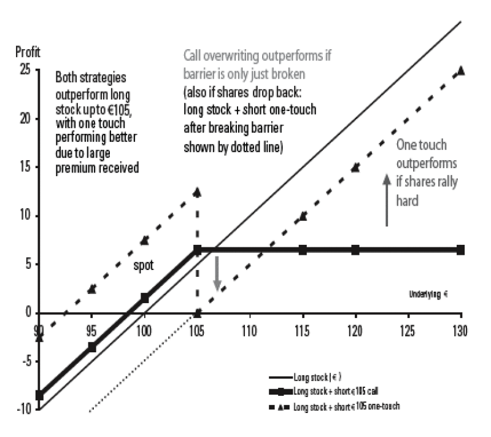

## Table of Contents

## What is a one-touch option?

A one-touch option is a type of financial contract used in trading. It pays out if the price of an asset reaches a certain level at any time before the option expires. Traders use it to bet on whether a stock, currency, or other asset will hit a specific price.

These options are popular in forex trading. They are called "one-touch" because the asset only needs to touch the target price once for the trader to win. If the price never reaches the target before the option's expiration date, the trader loses the money they paid for the option.

## How does a one-touch option work?

A one-touch option is a type of trading contract where you bet on whether a stock, currency, or another asset will reach a specific price before the option expires. You pay a certain amount of money to buy the option. If the price of the asset touches the target level at any time before the expiration date, you win and get a payout. If the price never reaches the target, you lose the money you paid for the option.

These options are often used in [forex](/wiki/forex-system) trading, where people trade different currencies. They are called "one-touch" because the asset only needs to touch the target price once for you to win. This makes them different from other types of options that might need the price to stay at the target level for a certain time. One-touch options can be a way to make money if you think a big price movement is coming, but they are also risky because you can lose your investment if the price doesn't move as expected.

## What are the key features of a one-touch option?

A one-touch option is a type of trading contract where you bet on whether the price of an asset, like a stock or currency, will reach a certain level before the option expires. You pay a fee to buy the option. If the price hits the target even once before the expiration date, you win and get a payout. This is why it's called a "one-touch" option – the price only needs to touch the target once for you to win.

These options are popular in forex trading where people trade different currencies. They are different from other options because the price doesn't need to stay at the target level for a certain time. One-touch options can be a good way to make money if you think a big price movement is coming. But they are also risky because if the price doesn't reach the target before the option expires, you lose the money you paid for the option.

## Who typically uses one-touch options?

One-touch options are mostly used by traders who want to make money from big moves in the price of assets like stocks or currencies. These traders often have a good understanding of the market and think they can predict when a price will reach a certain level. They use one-touch options to bet on these price movements.

These options are popular among forex traders, who trade different currencies. Forex traders use one-touch options because they are good for betting on big changes in currency prices. But these options are risky, so they are usually used by people who are willing to take chances and have some experience in trading.

## What are the benefits of trading one-touch options?

One benefit of trading one-touch options is that they can give you big profits if you guess right. If the price of the asset hits the target even once before the option expires, you win and get a payout. This means you don't need the price to stay at the target level for a long time, like with some other types of options. This can be good if you think the price will move a lot but not stay at the new level.

Another benefit is that one-touch options can help you make money from big price movements. If you think a stock or currency will go up or down a lot, you can use a one-touch option to bet on that. This can be especially useful in forex trading, where currency prices can change a lot. But remember, these options are risky, so it's important to understand the market well before you start trading them.

## What are the risks associated with one-touch options?

One big risk with one-touch options is that you can lose all the money you paid for the option if the price doesn't reach the target before it expires. This means if you guess wrong, you lose everything you bet. It's like gambling, and it can be very risky because you need the price to move exactly how you think it will.

Another risk is that one-touch options can be hard to understand and predict. The market can be unpredictable, and even if you think you know what will happen, the price might not move the way you expect. This can make it hard to make good guesses and can lead to losing money. It's important to be careful and maybe not use all your money on one bet.

## How do one-touch options differ from standard options?

One-touch options and standard options are different in how they work and what you need to win. With a one-touch option, you win if the price of an asset touches a certain level just once before the option expires. You don't need the price to stay at that level for a long time. This is good if you think the price will move a lot but not stay there. On the other hand, standard options, like call or put options, usually need the price to be at or above/below a certain level when the option expires. You have to wait until the end to see if you win.

Another difference is how risky they are. One-touch options can be very risky because if the price doesn't reach the target even once, you lose all the money you paid for the option. It's like betting on a big move that might not happen. Standard options can also be risky, but they give you more ways to win. For example, with a call option, you can win if the price goes up and stays up until the end, which might be easier to predict than a one-touch option. So, one-touch options are good for big moves but come with bigger risks.

## What are the common strategies for trading one-touch options?

One common strategy for trading one-touch options is to use them when you think there will be a big move in the price of an asset. For example, if you think a company will release good news that will make its stock price jump, you can buy a one-touch option that pays out if the stock hits a certain high price. This way, you can make money if the stock price goes up a lot, even if it doesn't stay up. But this strategy is risky because if the stock doesn't hit the target price, you lose the money you paid for the option.

Another strategy is to use one-touch options to bet on big moves in currency prices, which is popular in forex trading. If you think one currency will get a lot stronger compared to another, you can buy a one-touch option that pays out if the exchange rate hits a certain level. This can be a good way to make money if you're right about the big move. But again, it's risky because if the exchange rate doesn't reach the target, you lose your investment. So, it's important to have a good understanding of the market and be ready to take chances.

## How are one-touch options priced?

One-touch options are priced based on how likely it is that the price of an asset will hit the target before the option expires. The price, or premium, you pay for the option depends on things like how far away the target price is from the current price, how much time is left until the option expires, and how much the price of the asset usually moves around. If the target price is far away from the current price, the option will be cheaper because it's less likely to hit the target. But if the target is close, the option will be more expensive because it's more likely to pay out.

Another thing that affects the price of a one-touch option is how much the price of the asset moves around, which is called volatility. If the price of the asset moves a lot, the option will be more expensive because there's a bigger chance it will hit the target. Also, the more time left until the option expires, the more expensive it will be because there's more time for the price to reach the target. So, the price of a one-touch option is a mix of how likely it is to win and how much time is left to do it.

## What are the historical performance trends of one-touch options?

One-touch options can be hard to predict because they depend on big moves in the price of an asset. If you look at the past, you can see that one-touch options do well when the market is moving a lot. For example, during times when there is a lot of news or events that make prices go up and down, one-touch options can be more likely to hit their target prices. This means that traders who use one-touch options during these times might have a better chance of making money.

But one-touch options are also risky. If the market stays calm and doesn't move much, one-touch options are less likely to reach their targets. In the past, traders have lost money on one-touch options when the market didn't move as much as they expected. So, while one-touch options can give big profits during times of big price changes, they can also lead to big losses if the price doesn't move the way you think it will. It's important to understand these trends and be careful when trading one-touch options.

## How can one mitigate risks when trading one-touch options?

To lower the risks when trading one-touch options, it's important to do a lot of research and understand the market well. Before you buy a one-touch option, look at the news and events that might affect the price of the asset. This can help you guess better if the price will hit the target. Also, don't put all your money into one option. Spread your money across different options or other types of investments. This way, if one option doesn't work out, you won't lose everything.

Another way to reduce risk is to use stop-loss orders. A stop-loss order can help you limit your losses by automatically selling the option if the price moves against you. It's also a good idea to set clear goals for how much you want to make and how much you're willing to lose. Stick to these goals and don't let emotions make you take bigger risks. By being careful and planning ahead, you can make trading one-touch options less risky.

## What advanced techniques can be used to maximize returns with one-touch options?

One advanced technique to maximize returns with one-touch options is to use technical analysis to find the best times to buy. Technical analysis means looking at charts and patterns to guess where the price of an asset might go next. By studying these patterns, you can pick a target price that has a good chance of being reached before the option expires. This can help you make better guesses and increase your chances of winning. Another part of this technique is to watch for big news or events that might make the price move a lot. If you know a big event is coming, you can buy a one-touch option that will pay out if the price hits the target after the event.

Another technique is to use a strategy called hedging. Hedging means buying different options or investments that can help protect you from losing money. For example, you can buy a one-touch option and also buy a standard option that will pay out if the price goes the other way. This way, if the one-touch option doesn't work out, the standard option might still make you some money. Hedging can be complicated, but it can help you lower the risks and keep more of your money safe. By using these advanced techniques, you can try to make more money with one-touch options while also being careful about the risks.

## What are the trading outcomes of one-touch options?

One-touch options are financial instruments that present a binary outcome, providing traders with a precise risk-reward profile. These options yield profit if the predetermined target price, or strike price, is attained within a designated time frame before the option expires. Conversely, failing to reach this target price results in no payout, and the trader incurs a loss equivalent to the premium paid for the option. The appeal of one-touch options lies in their simplicity: traders need only to predict whether the underlying asset's price will hit a specific level at any point during the option's life.

This type of option allows traders to speculate on price movements without requiring the asset to maintain the target level. For example, consider a trader who purchases a one-touch option with a strike price set at $100. If the underlying asset's price touches or exceeds $100 at any moment prior to expiry, the option is considered "in the money," and the trader receives the payout. If the price does not reach this level, the option expires worthless.

Mathematically, the payoff of a one-touch option can be expressed as:

$$
\text{Payoff} = 
  \begin{cases} 
   \text{Payout,} & \text{if}\ \max(S_t) \geq K \\
   0, & \text{otherwise}
  \end{cases} 
$$

where $S_t$ is the price of the underlying asset over the option's life, and $K$ is the strike price.

One-touch options are particularly valuable in scenarios involving significant news events or economic reports that can trigger abrupt price movements. Traders may leverage these options when they predict that such events will cause the asset's price to spike to the strike price. However, the binary nature of the one-touch option also imposes a considerable speculative risk, as the option expires worthless if the target price is not reached, regardless of any subsequent price movements.

This offers a straightforward method for hedging or leveraging perceived market opportunities, while also necessitating careful consideration due to their all-or-nothing payout structure. Therefore, thorough market analysis and understanding of [volatility](/wiki/volatility-trading-strategies) are crucial for traders engaging with one-touch options.

## References & Further Reading

[1]: ["Options, Futures, and Other Derivatives"](https://www.amazon.com/Options-Futures-Other-Derivatives-10th/dp/013447208X) by John C. Hull

[2]: ["Algorithmic Trading: Winning Strategies and Their Rationale"](https://www.wiley.com/en-us/Algorithmic+Trading%3A+Winning+Strategies+and+Their+Rationale-p-9781118746912) by Ernest P. Chan

[3]: ["The Concepts and Practice of Mathematical Finance"](https://archive.org/download/quant_books/Concepts%20_%20Practice%20of%20Mathematical%20Finance%20-%20M.%20S.%20Joshi.pdf) by Mark S. Joshi

[4]: Carr, P. & Jarrow, R. A. (1990). ["The Stop-Loss Start-Gain Paradox and Option Valuation: A New Decomposition into Intrinsic and Time Value."](https://www.jstor.org/stable/2962078) The Review of Financial Studies, 3(3), 469-492. 

[5]: ["Trading and Exchanges: Market Microstructure for Practitioners"](https://wclc2018.iaslc.org/public/virtual-library/Documents/Trading_And_Exchanges_Market_Microstructure_For_Practitioners.pdf) by Larry Harris