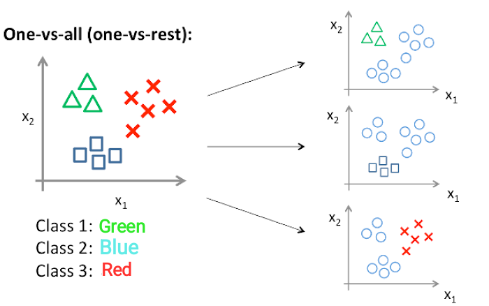

## Table of Contents

## What is One-Vs.-All in machine learning?

One-vs.-All, also known as One-vs.-Rest, is a strategy used in machine learning for multi-class classification problems. In this approach, if you have a problem with N different classes, you train N separate binary classifiers. Each classifier is trained to distinguish one class from all the others combined. For example, if you're classifying types of fruits like apples, oranges, and bananas, you would train three classifiers: one to separate apples from non-apples, another for oranges from non-oranges, and a third for bananas from non-bananas.

When it comes time to make a prediction on new data, you run the data through all N classifiers. The classifier that produces the highest output (which could be a probability or a score) determines the class of the new data. If the classifier for apples gives the highest score, then the new data is classified as an apple. This method is simple and effective, especially when dealing with a large number of classes, but it can be less accurate than some other methods if the classes are not well-separated.

## How does One-Vs.-All differ from other multi-class classification techniques?

One-vs.-All is different from other multi-class classification methods because it breaks down the problem into multiple binary classification tasks. In One-vs.-All, you create a separate classifier for each class, where each classifier tries to separate its class from all other classes combined. This means if you have three classes, you'll train three different models. When you want to classify a new item, you run it through all three models and pick the class of the model that gives the highest score. This approach is straightforward and works well with many classes, but it might not be the best if the classes are very similar to each other.

Other methods, like One-vs.-One, work differently. In One-vs.-One, you train a separate binary classifier for every pair of classes. So, if you have three classes, you'll train three classifiers: one for class 1 vs. class 2, another for class 1 vs. class 3, and a third for class 2 vs. class 3. When classifying a new item, you run it through all these classifiers and count the votes for each class. The class with the most votes wins. This method can be more accurate than One-vs.-All when classes are hard to separate, but it requires training more models, which can be time-consuming and computationally expensive.

Another approach is to use algorithms that can handle multi-class classification directly, like decision trees or neural networks. These methods don't break the problem into smaller parts but instead try to find the best way to separate all classes at once. They can be more powerful and sometimes more accurate than One-vs.-All or One-vs.-One, but they can also be more complex to train and tune. Each method has its own strengths and weaknesses, so the best choice depends on the specific problem and the data you're working with.

## What are the key steps involved in implementing a One-Vs.-All classifier?

To implement a One-Vs.-All classifier, you first need to understand your data and how many classes you have. Let's say you have three classes: apples, oranges, and bananas. You would train three separate binary classifiers. The first classifier would be trained to tell apples apart from everything else, the second would separate oranges from everything else, and the third would do the same for bananas. Each classifier is trained using the data from its specific class as positive examples, and the data from all other classes as negative examples. You can use any binary classification algorithm you like, such as logistic regression, support vector machines, or decision trees.

Once you have trained all your classifiers, you can use them to classify new data. When a new piece of data comes in, you run it through all three classifiers. Each classifier will give you a score or probability that the data belongs to its class. You then choose the class of the classifier that gives the highest score. For example, if the classifier for apples gives a score of 0.8, the one for oranges gives 0.6, and the one for bananas gives 0.4, you would classify the new data as an apple because 0.8 is the highest score. This method is simple to implement and works well for many types of data, but it might not be the best if your classes are very similar to each other.

## Can you explain how One-Vs.-All uses binary classification for multi-class problems?

One-Vs.-All uses binary classification to solve multi-class problems by training a separate binary classifier for each class. Imagine you have three classes: apples, oranges, and bananas. You would train three different classifiers. The first classifier would learn to tell apples apart from everything else, the second would learn to separate oranges from everything else, and the third would do the same for bananas. Each classifier only needs to know if a piece of data belongs to its class or not. This makes the problem easier because binary classification is simpler than multi-class classification.

When you want to classify a new piece of data, you run it through all three classifiers. Each classifier will give you a score or probability that the data belongs to its class. You then choose the class of the classifier that gives the highest score. For example, if the classifier for apples gives a score of 0.8, the one for oranges gives 0.6, and the one for bananas gives 0.4, you would classify the new data as an apple because 0.8 is the highest score. This method is simple and works well for many types of data, but it might not be the best if your classes are very similar to each other.

## What are the advantages of using One-Vs.-All for classification tasks?

One-Vs.-All is a good way to handle multi-class classification because it breaks the problem into smaller, easier parts. Instead of trying to separate all classes at once, you train a separate classifier for each class. This means you only need to focus on telling one class apart from everything else. This can be easier for the computer to learn, especially if you have a lot of different classes. It also means you can use any binary classification algorithm you like, such as logistic regression or decision trees, which gives you a lot of flexibility.

Another advantage of One-Vs.-All is that it's simple to understand and use. When you want to classify a new piece of data, you just run it through all your classifiers and pick the one with the highest score. This makes it easy to implement and explain to others. It also works well with many types of data and can be very accurate if your classes are different enough from each other. However, if your classes are very similar, you might need to try a different method.

## What are the potential drawbacks or limitations of the One-Vs.-All approach?

One-Vs.-All can have some problems. If your classes are very similar to each other, this method might not work well. Each classifier tries to separate one class from all the others, but if the classes are hard to tell apart, the classifiers might get confused. This can lead to mistakes when you're trying to classify new data. Also, if you have a lot of classes, you need to train a lot of classifiers. This can take a long time and use a lot of computer power.

Another issue is that One-Vs.-All might not use all the information in your data as well as other methods. For example, some other methods like decision trees or neural networks can look at all the classes at once and find patterns that help them tell the classes apart better. One-Vs.-All breaks the problem into smaller pieces, which can make it easier to solve, but it might miss some important relationships between the classes. So, while One-Vs.-All is simple and works well for many problems, it might not be the best choice for every situation.

## How do you select the best model in a One-Vs.-All strategy?

To select the best model in a One-Vs.-All strategy, you need to train a separate binary classifier for each class. Each classifier is trained to distinguish its class from all other classes combined. For example, if you have three classes like apples, oranges, and bananas, you would train three classifiers: one to separate apples from non-apples, another for oranges from non-oranges, and a third for bananas from non-bananas. You can use any binary classification algorithm you like, such as logistic regression or decision trees. Once you have trained all your classifiers, you can use them to classify new data by running the data through all the classifiers and choosing the class of the classifier that gives the highest score.

The best model in a One-Vs.-All strategy is determined by how well it performs on a separate set of data called the validation set. You run your data through all the classifiers and see which one gives the highest score. The class of the classifier with the highest score is the predicted class for that piece of data. You then compare these predictions to the actual classes in the validation set to see how accurate each classifier is. The model that gives the most correct predictions overall is considered the best. If the classes are very similar, One-Vs.-All might not work as well as other methods, but it's a good choice when the classes are different enough from each other.

## What types of algorithms are commonly used within the One-Vs.-All framework?

One-Vs.-All uses different types of binary classification algorithms to tell one class apart from all the others. Some common algorithms used in this framework include logistic regression, support vector machines (SVM), and decision trees. Logistic regression is popular because it gives you probabilities, which makes it easy to compare the scores from different classifiers. SVMs are good at finding the best way to separate classes, especially when the data is hard to separate. Decision trees are simple to understand and can work well with different types of data.

Each of these algorithms has its own strengths and weaknesses. Logistic regression is simple and works well with many types of data, but it might not be the best if your classes are very similar. SVMs can be very accurate, but they can take a long time to train, especially if you have a lot of data. Decision trees are easy to explain and can handle different types of data, but they might not be as accurate as other methods if your data is complex. The best algorithm for your One-Vs.-All framework depends on your specific problem and the data you're working with.

## How does One-Vs.-All handle imbalanced datasets?

One-Vs.-All can have a hard time with imbalanced datasets, where some classes have a lot more examples than others. When you train a classifier to tell one class apart from all the others, it might focus too much on the bigger classes and not learn enough about the smaller ones. This can lead to the classifier making a lot of mistakes when trying to predict the smaller classes. To help with this problem, you can use techniques like oversampling the smaller classes or undersampling the bigger ones. Oversampling means you make more copies of the examples from the smaller classes, while undersampling means you use fewer examples from the bigger classes. This can help the classifier learn more about the smaller classes and make better predictions.

Another way to handle imbalanced datasets in One-Vs.-All is to use different weights for different classes. You can give more weight to the examples from the smaller classes, so the classifier pays more attention to them. This can help the classifier learn more about the smaller classes and make better predictions. For example, if you're using logistic regression, you can use a parameter called `class_weight` to give more weight to the smaller classes. This can help balance out the dataset and make the classifier more accurate.

## Can you provide an example of a real-world application where One-Vs.-All is used effectively?

One-Vs.-All is used effectively in email spam filtering. Imagine you have an email service that wants to separate spam emails from regular ones. You can use One-Vs.-All to train a classifier that tells spam apart from non-spam. This classifier learns from examples of spam emails and examples of regular emails. When a new email comes in, the classifier looks at it and decides if it's spam or not. This helps keep your inbox clean and free from unwanted messages.

Another real-world application is in medical diagnosis, where doctors want to identify different diseases from patient data. For example, if doctors want to diagnose three diseases: flu, pneumonia, and bronchitis, they can use One-Vs.-All to train three classifiers. The first classifier learns to tell flu apart from non-flu, the second learns to separate pneumonia from non-pneumonia, and the third does the same for bronchitis. When a new patient comes in, the doctors run the patient's data through all three classifiers and choose the disease with the highest score. This helps doctors make better and faster diagnoses, which can save lives.

## How can the performance of a One-Vs.-All classifier be evaluated and optimized?

To evaluate the performance of a One-Vs.-All classifier, you can use a separate set of data called the validation set. You run your data through all the classifiers and see which one gives the highest score. The class of the classifier with the highest score is the predicted class for that piece of data. You then compare these predictions to the actual classes in the validation set to see how accurate each classifier is. Common metrics for this include accuracy, precision, recall, and F1 score. Accuracy tells you the percentage of correct predictions, while precision and recall give you more detailed information about how well the classifier is doing for each class. The F1 score is a combination of precision and recall that gives you a single number to compare different classifiers.

To optimize the performance of a One-Vs.-All classifier, you can try different binary classification algorithms like logistic regression, support vector machines, or decision trees. Each algorithm has its own strengths and weaknesses, so you might need to experiment to find the best one for your data. You can also use techniques like cross-validation to make sure your classifier is working well on different parts of your data. Cross-validation involves splitting your data into several parts, training your classifier on some of the parts, and testing it on the others. This helps you see if your classifier is overfitting, which means it's doing well on the data it was trained on but not as well on new data. If you find that your classifier is overfitting, you can try techniques like regularization to make it simpler and more likely to work well on new data.

## What advanced techniques can be applied to enhance the effectiveness of One-Vs.-All classifiers?

To enhance the effectiveness of One-Vs.-All classifiers, you can use advanced techniques like ensemble methods. Ensemble methods combine the predictions from multiple classifiers to make a final prediction. For example, you can use a method called bagging, where you train many different classifiers on different parts of your data and then take a vote to decide the final class. Another ensemble method is boosting, where you train classifiers one after the other, with each new classifier focusing on the examples that the previous ones got wrong. These methods can make your One-Vs.-All classifier more accurate by using the strengths of different classifiers to cover each other's weaknesses.

Another technique to improve One-Vs.-All classifiers is to use feature selection and engineering. Feature selection involves choosing the most important parts of your data to use in your classifiers. This can help your classifiers focus on the most useful information and ignore the rest. Feature engineering means creating new parts of your data that might help your classifiers do a better job. For example, if you're classifying fruits, you might create a new feature that measures the ratio of the fruit's width to its height. This can help your classifiers tell different fruits apart more easily. By using these techniques, you can make your One-Vs.-All classifiers more effective and accurate.