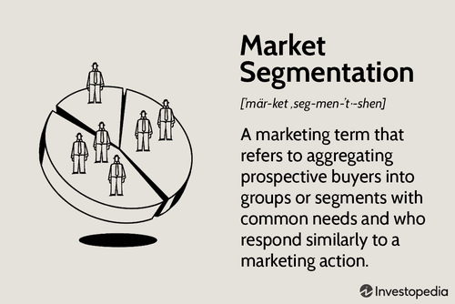

The world of economics is characterized by intricate interactions and dynamics that define how goods and services are priced and move through markets. These interactions encompass a range of phenomena, from market participants' collective behaviors to the sophisticated models and technologies increasingly employed in financial decision-making. Understanding these concepts is crucial for investors, traders, and analysts operating in today's rapidly evolving markets.

One of the key phenomena in financial markets is the occurrence of one-way market trends, where market participants predominantly engage in either buying or selling activities. Such trends can significantly influence market stability and require careful analysis to understand their root causes and effects. Economic models serve as vital tools in this context, providing theoretical constructs and quantitative data to explain and predict market behaviors. These models incorporate the fundamental principles of supply and demand while also considering factors like market sentiment, investor psychology, and external events.



The introduction of algorithmic trading marks a significant evolution in market dynamics. Using state-of-the-art computer algorithms, algorithmic trading executes trades at speeds and volumes beyond human capability, altering aspects of market efficiency, liquidity, and volatility. While these algorithms bring many advantages, they also pose potential ethical and risk-related challenges that need to be addressed.

In today's financial landscape, it is evident that the dynamics of markets are not merely shaped by traditional economic factors but are increasingly influenced by sophisticated models and trading algorithms. This convergence of conventional and modern methodologies underscores the importance of continuous learning and adaptation for market participants. As markets continue to evolve, staying informed about these driving forces is essential for making strategic and informed financial decisions.

## Table of Contents

## Understanding One-Way Market Phenomena

One-way markets describe situations where the majority of market participants act in a unified direction, whether predominantly buying or predominantly selling. This type of market behavior arises from a variety of conditions, including investor psychology, market sentiment, and significant external events.

Several factors contribute to the emergence of one-way markets. Investor psychology plays a central role, as the collective emotions and behaviors of market participants often drive market dynamics. For instance, the "herd mentality" can cause investors to mimic the actions of others, thus leading to self-reinforcing trends. Market sentiment, which reflects the overall attitude of investors toward a particular market or asset, often swings between extremes of optimism and pessimism, further exacerbating one-way market moves.

External events such as economic announcements, geopolitical developments, or technological innovations can also trigger one-way market trends. These events can lead to sudden changes in fundamental valuations or risk perceptions, prompting a unified response from market participants.

One classic example of a one-way market phenomenon is the dot-com bubble of the late 1990s and early 2000s. During this period, the rapid rise in internet-related stocks was driven by speculative investor behavior, excessive optimism about future technological growth, and a rush to invest in emerging tech companies despite their lack of profitability. This resulted in a massive inflation of stock prices, followed by a sharp market correction as the bubble burst.

Behavioral economics provides insight into the forces behind one-way market trends. Concepts such as overconfidence, representativeness, and availability heuristics can lead investors to overreact to new information or follow trends without thorough evaluation of underlying fundamentals. As a result, markets can experience prolonged periods of mispricing, contributing to one-way movement.

Understanding the conditions and psychological factors that lead to one-way markets is crucial for predicting and managing such phenomena. Investors and analysts must remain vigilant in their assessment of market sentiment and external influences to anticipate potential shifts in market direction. By recognizing the signs of a developing one-way market, they can better position themselves to mitigate risks or capitalize on emerging opportunities.

## Economic Models and Market Dynamics

Economic models are crucial tools used to both explain and predict the behaviors observed in markets, drawing upon theoretical constructs and quantitative data. At the core of these models lies the interplay of supply and demand, which fundamentally influences pricing and market equilibrium. When supply meets demand, a state of equilibrium is achieved, dictating the price level at which transactions occur without surplus or deficit in the market.

Supply and demand, invariably, are subject to numerous factors that disturb this equilibrium. Among these are government policies, which can alter market conditions through regulations, subsidies, and taxes. For instance, a government may implement a tax on imports, which increases costs for consumers and reduces the quantity of goods demanded. Moreover, global events, such as economic crises or geopolitical tensions, can have far-reaching impacts on supply chains and consumer confidence, thereby influencing market dynamics. 

Technological advancements are another significant [factor](/wiki/factor-investing) affecting market dynamics. The rapid development and integration of technology in markets have led to increased efficiency and access to information, fostering more informed decision-making by investors. These technological shifts can impact the speed and nature of transactions, introducing novel trading mechanisms like [algorithmic trading](/wiki/algorithmic-trading).

Different economic models attempt to capture these dynamics. Classical economic models, such as the supply and demand model, form the foundation of economic theory by explaining how prices adjust to changes in market conditions. These models often rely on assumptions like perfect competition and rational behavior.

On the other hand, modern economic models increasingly incorporate algorithms and computational techniques to better accommodate real-world complexities and idiosyncrasies. These models use advanced statistical methods to analyze vast amounts of data, revealing patterns and predicting future trends. For example, agent-based models simulate interactions of [agents](/wiki/agents) to assess their effects on the economic system as a whole.

The evolution from classical to algorithmic models reflects the growing sophistication in understanding and predicting market behavior. By employing techniques such as [machine learning](/wiki/machine-learning), modern models enhance the accuracy of forecasts and provide deeper insights into market dynamics. For instance, these models can process real-time data to predict market shifts, offering traders and analysts an edge in decision-making.

Python, with its extensive libraries like NumPy, SciPy, and pandas, serves as an excellent tool for implementing and testing these models. Here is a simple illustration of how a basic supply and demand model might be coded in Python:

```python
import numpy as np
import matplotlib.pyplot as plt

# Define supply and demand functions
def demand(price):
    return 100 - 2 * price

def supply(price):
    return 10 + 3 * price

# Price range
prices = np.linspace(0, 50, 200)

# Compute quantities
demand_quantities = demand(prices)
supply_quantities = supply(prices)

# Plot supply and demand curves
plt.figure(figsize=(10, 5))
plt.plot(prices, demand_quantities, label='Demand')
plt.plot(prices, supply_quantities, label='Supply')
plt.xlabel('Price')
plt.ylabel('Quantity')
plt.title('Supply and Demand Curves')
plt.axvline(x=20, color='grey', linestyle='--', label='Equilibrium Price')
plt.axhline(y=60, color='grey', linestyle='--', label='Equilibrium Quantity')
plt.legend()
plt.grid(True)
plt.show()
```

This code snippet demonstrates the graphical interpretation of supply and demand curves, where the intersection denotes the market equilibrium. Such models, when scaled with actual market data, can provide valuable insights into current market trends and future predictions.

In sum, economic models ranging from classical to modern algorithms play key roles in shaping and understanding market dynamics. As the landscape of global commerce continues to evolve, these models will remain pivotal in equipping analysts, traders, and policymakers with the tools necessary to navigate complex economic environments.

## Algorithmic Trading and Its Impact

Algorithmic trading involves the use of sophisticated computer algorithms to execute trades at speeds and frequencies beyond human capability. This trading method has become prevalent due to its significant impact on market efficiency, [liquidity](/wiki/liquidity-risk-premium), and [volatility](/wiki/volatility-trading-strategies).

The rapid rise of algorithmic trading can be attributed to its ability to increase market efficiency. By processing a vast amount of information in real-time, algorithms help minimize price discrepancies, ensuring that security prices reflect all available information. This continuous balancing act enables more accurate pricing and reduces [arbitrage](/wiki/arbitrage) opportunities. As a result, markets tend to become more efficient and reflect fundamental values more closely, benefiting both traders and investors.

Liquidity is another crucial aspect affected by algorithmic trading. Algorithms rapidly execute small-size trades, ensuring higher market participation, which leads to increased liquidity. This liquidity, in turn, tightens bid-ask spreads, making it easier for market participants to buy or sell securities without causing significant price changes. However, this added liquidity is often questioned regarding its stability, especially during periods of market stress. While algorithmic trading generally enhances liquidity, it can also lead to abrupt withdrawls during volatile periods, exacerbating market swings.

Volatility, a measure of price fluctuations, is significantly influenced by the proliferation of algorithmic trading. Although algorithms can dampen volatility by smoothing out abrupt price changes, the opposite effect can occur when many algorithms react simultaneously to market events, leading to increased and rapid price swings. This phenomenon was evident during the 'Flash Crash' of May 6, 2010, when major U.S. stock indices plummeted and rebounded within minutes, highlighting the potential volatility risks associated with heavily algorithm-driven markets.

Beyond market dynamics, the ethical implications and potential risks associated with algorithmic trading are contentious. The reliance on automated systems raises questions about market manipulation, unfair trading practices, and the possibility of systemic risks. Algorithmic trading can lead to scenarios where algorithms, following predefined logic, might engage in practices such as quote stuffing or manipulative trading, which compromise the fairness of markets. Regulators continue to develop frameworks to ensure that markets remain fair and orderly, balancing innovation with risk management.

Several case studies demonstrate both successful implementation and challenges faced by algorithmic trading systems. High-frequency trading firms successfully capitalize on minute price discrepancies across different markets, showcasing the prowess of algorithms in generating consistent returns. Conversely, the 'Knight Capital' incident in 2012 exemplifies the risks inherent in this trading strategy. A software glitch led Knight Capital to incur a loss of approximately $440 million in just 45 minutes, demonstrating the potential for catastrophic errors. This case underscores the need for robust risk management practices and comprehensive testing of algorithms before deployment.

In conclusion, algorithmic trading has significantly transformed financial markets by improving efficiency and liquidity. However, it also introduces complexity and potential risks that must be carefully managed. Ensuring the stability and fairness of markets requires continuous monitoring and adaptability to evolving technologies and market conditions.

## Risk Management in One-Way Markets

One-way markets pose significant risks due to inherent characteristics such as volatility amplification, overvaluation, and liquidity issues. Managing these risks effectively requires strategic planning and an understanding of market dynamics.

Volatility in one-way markets often arises from herding behavior, where investors collectively move in a single direction, potentially causing drastic fluctuations in asset prices. This can be further exacerbated by external events or sudden shifts in market sentiment. To mitigate these risks, diversification remains a key strategy. By spreading investments across a variety of asset classes, sectors, or geographical regions, investors can reduce their exposure to idiosyncratic risks. Diversification decreases the overall risk because the positive performance of some assets can offset the negative performance of others. For example, investing in a portfolio comprising equities, bonds, and commodities can stabilize returns during volatile periods.

Hedging is another effective tool for risk management in one-way markets. It involves taking investment positions that will offset potential losses in another asset. Common hedging techniques include using derivatives such as options, futures, and swaps. Options allow investors to protect against downside risks by giving them the right, but not the obligation, to buy or sell an asset at a predetermined price. For instance, purchasing put options can offer a safety net for stock investments, limiting potential losses during sharp market downturns.

Strategic asset allocation plays a crucial role in navigating one-way markets by adjusting the composition of a portfolio based on expected market conditions and investor risk tolerance. This involves setting target allocations for different asset classes and periodically rebalancing the portfolio to maintain these targets. A dynamic approach to asset allocation, which considers changing market conditions, can enhance portfolio resilience. Python can be utilized to implement a dynamic rebalancing strategy as follows:

```python
import numpy as np

def rebalance_portfolio(current_allocation, target_allocation, market_values):
    total_value = np.sum(market_values)
    target_values = total_value * target_allocation

    rebalancing_amounts = target_values - market_values
    return rebalancing_amounts

# Example usage
current_allocation = np.array([0.5, 0.3, 0.2])  # 50% equities, 30% bonds, 20% commodities
target_allocation = np.array([0.4, 0.4, 0.2])  # Rebalanced to 40% equities, 40% bonds, 20% commodities
market_values = np.array([100000, 60000, 40000])

rebalance_amounts = rebalance_portfolio(current_allocation, target_allocation, market_values)
print(rebalance_amounts)
```

Behavioral finance is vital in understanding investor decision-making during one-way market conditions. Psychological biases such as overconfidence, loss aversion, and herd behavior can lead to suboptimal investment choices. Overconfidence might cause investors to underestimate risks, while loss aversion can lead to the reluctance to cut losing positions, exacerbating potential losses. Herd behavior can drive bubble formations, contributing to overvaluation. Education and awareness of these biases can improve investment outcomes. Decision-making frameworks that incorporate behavioral insights can assist investors in maintaining discipline and avoiding emotional reactions to market volatility. 

In summary, effective risk management in one-way markets requires a combination of diversification, hedging, and strategic asset allocation, supplemented by an understanding of behavioral finance. These strategies not only mitigate risks but also provide a foundation for informed decision-making under challenging market conditions.

## Strategic Insights and Future Outlook

Strategic insights into one-way markets and algorithmic trading necessitate an understanding of the evolving financial landscape. As markets become more interlinked and complex, continuous learning and integration of new technologies are crucial for investors seeking to maintain a competitive edge. The propensity of one-way markets to disrupt traditional trading practices cannot be underestimated, as investor psychology and sentiment increasingly tie into rapid, technology-driven market shifts. Thus, strategic agility, informed by both historical data and advanced analytics, remains essential.

Algorithmic trading's rise underscores the significant role technology plays in modern financial markets. Traders can benefit from developing adaptive strategies that utilize machine learning and [artificial intelligence](/wiki/ai-artificial-intelligence) to predict investor behavior and market movements effectively. Algorithmic systems capable of processing vast amounts of data at lightning speed can provide a strategic advantage, capturing inefficiencies in one-way market scenarios that might elude conventional approaches.

Regulatory considerations are another pivotal factor. As algorithmic trading grows in prevalence, regulators worldwide are grappling with how best to ensure market fairness and stability. Balancing innovation with risk management, therefore, necessitates ongoing collaboration between industry participants and regulators. Policymakers are likely to focus on developing frameworks that facilitate technological advancements without compromising the integrity of financial systems.

Looking at future market trends, investors can anticipate increased integration of blockchain technology, which promises to further transform trading processes. Blockchain's decentralized nature offers transparency and security, potentially reducing some risks associated with one-way markets. Similarly, the application of quantum computing in trading algorithms could revolutionize the speed and accuracy of data processing, opening new horizons for strategic market analysis.

In conclusion, the landscape of financial markets is set for continued evolution influenced by technological integration and regulatory developments. By embracing adaptability, leveraging technology, and remaining mindful of regulatory shifts, investors can position themselves strategically for the opportunities and challenges posed by one-way markets and algorithmic trading. This dynamic interplay between technology and market theory will shape the future of trading, necessitating an ongoing commitment to innovation and learning.

## References & Further Reading

[1]: Lo, A. W. (2005). ["Reconciling Efficient Markets with Behavioral Finance: The Adaptive Markets Hypothesis."](https://papers.ssrn.com/sol3/papers.cfm?abstract_id=1702447) Journal of Investment Management. 

[2]: Johnson, B., & Lopez de Prado, M. (2013). ["The Price Impact of Algorithmic Trading."](https://www.semanticscholar.org/paper/Flow-Toxicity-and-Liquidity-in-a-High-Frequency-Easley-Prado/9369430bd005d194f9332ae7cbd5a57ace5e9ab3) The Journal of Portfolio Management.

[3]: Kirby, C., & Ostdiek, B. (2012). ["The Impact of High-Frequency Trading on Market Volatility."](https://www.cambridge.org/core/journals/journal-of-financial-and-quantitative-analysis/article/abs/its-all-in-the-timing-simple-active-portfolio-strategies-that-outperform-naive-diversification/05D18E04B226C6E9B8441482CC92F943) Financial Analysts Journal.

[4]: Thaler, R. H. (1994). ["Quasi Rational Economics"](https://www.russellsage.org/publications/quasi-rational-economics-1) by Richard H. Thaler

[5]: Aldridge, I. (2013). ["High-Frequency Trading: A Practical Guide to Algorithmic Strategies and Trading Systems"](https://books.google.com/books/about/High_Frequency_Trading.html?id=6l0DDQAAQBAJ) by Irene Aldridge