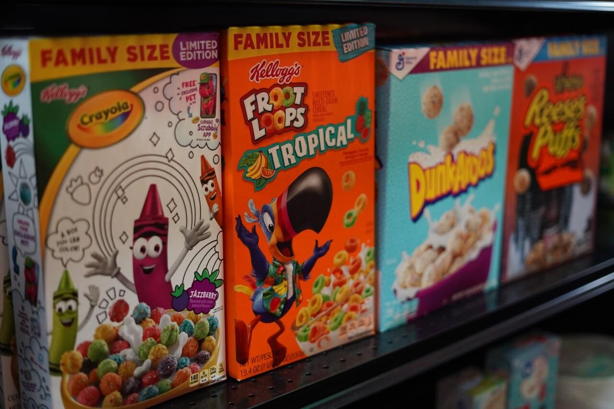

## Table of Contents

## What is a one-way market?

A one-way market is a situation in the stock market where prices are only moving in one direction, either up or down, without much change. This usually happens when there is a lot of buying or selling happening at the same time. For example, if everyone wants to buy a certain stock, the price will keep going up because there are more buyers than sellers.

This kind of market can be risky for traders because it can be hard to predict when the trend will change. If the market is going up, people might keep buying hoping the price will keep rising. But if it suddenly starts to go down, those who bought at high prices could lose money. It's important for investors to be careful and watch the market closely during these times.

## How does a one-way market differ from a two-way market?

A one-way market is when the prices of stocks or other things you can trade only go in one direction, either up or down. It's like everyone is either buying or selling at the same time. For example, if a lot of people want to buy a stock, the price will keep going up because there are more buyers than sellers. This can make it hard for traders because it's tough to know when the price will stop going in that one direction.

On the other hand, a two-way market is when there is both buying and selling happening, so the prices can go up or down. It's more balanced because there are people who want to buy and people who want to sell. This makes it easier for traders to predict what might happen next because the market is not stuck going in just one direction. In a two-way market, it's easier to find someone to trade with, whether you want to buy or sell.

## What are the common causes of a one-way market?

A one-way market often happens because of big news or events that make a lot of people want to buy or sell at the same time. For example, if a company announces really good news, like a new product that everyone wants, many people might rush to buy the stock, pushing the price up. On the other hand, if there's bad news, like a company losing a lot of money, people might want to sell their stocks quickly, causing the price to go down.

Another reason for a one-way market can be when everyone starts thinking the same way about the market. This can happen because of trends or what other people are doing. If people see that a stock's price is going up, they might think it will keep going up and buy more, which makes the price go up even more. This kind of thinking can create a one-way market where everyone is either buying or selling, and it can be hard to stop until something changes people's minds.

## Can you give examples of one-way markets in history?

One famous example of a one-way market happened in the late 1990s during the dot-com bubble. A lot of people got excited about internet companies and started buying their stocks. They thought these companies would make a lot of money, so the prices of their stocks kept going up and up. But then, in 2000, people realized that many of these companies weren't making as much money as they thought. So, everyone started selling their stocks at the same time, and the prices crashed. This is a classic case of a one-way market going up and then suddenly going down.

Another example is the housing market in the United States before the 2008 financial crisis. For a few years, a lot of people wanted to buy houses, and they thought the prices would keep going up. Banks were giving out loans easily, so more people could buy homes. This made the prices of houses go up a lot. But then, in 2007 and 2008, people started realizing that many couldn't pay back their loans. So, everyone started selling their houses at the same time, and the prices fell a lot. This was another one-way market that went up and then crashed down.

## How does a one-way market affect investors?

A one-way market can be tricky for investors. When the market is going up, it might seem like a good time to buy because everyone else is buying and the prices are rising. Investors might feel excited and want to join in, hoping to make money as the prices keep going up. But if the market suddenly changes direction and starts going down, those who bought at high prices could lose a lot of money. It's like trying to catch a ball that's rolling fast; if you miss it, you could get hurt.

When the market is going down, it can be scary for investors. They might see the prices falling and feel like they need to sell their stocks quickly to avoid losing more money. This can make the prices fall even faster because everyone is selling at the same time. Investors who hold onto their stocks hoping the market will turn around might end up losing money if the downward trend continues. It's important for investors to stay calm and think carefully about their choices during these times, rather than just following what everyone else is doing.

## What are the risks associated with trading in a one-way market?

Trading in a one-way market can be risky because it's hard to predict when the trend will change. If the market is going up, everyone might be buying and pushing the prices higher. But if the trend suddenly reverses, people who bought at high prices could lose a lot of money. It's like riding a bike downhill really fast; it's fun until you hit a bump and can't stop in time.

On the other hand, if the market is going down, everyone might be selling, and the prices could keep falling. Investors might panic and sell their stocks quickly to avoid losing more money, which can make the prices drop even faster. Holding onto stocks hoping the market will turn around can be risky because if the downward trend continues, investors could lose a lot. It's important for traders to be careful and not just follow the crowd without thinking.

## How can traders identify a one-way market?

Traders can spot a one-way market by watching how prices are moving. If prices are only going up or only going down for a long time, that's a sign of a one-way market. For example, if a stock's price keeps going up every day without much change, it might mean a lot of people are buying and pushing the price higher. On the other hand, if the price keeps dropping every day, it could mean a lot of people are selling and making the price go down.

Another way to identify a one-way market is by looking at the trading [volume](/wiki/volume-trading-strategy). If there's a lot of buying or selling happening at the same time, it can create a one-way market. For example, if everyone is excited about a company's new product and starts buying the stock, the trading volume will be high, and the price will go up. If bad news comes out and everyone starts selling, the trading volume will also be high, but the price will go down. By watching these signs, traders can figure out if they're in a one-way market.

## What strategies can be used to trade effectively in a one-way market?

When trading in a one-way market, it's important to be careful and not just follow what everyone else is doing. If the market is going up, you might want to buy, but make sure you do your research first. Look at why the prices are going up and think about how long it might last. It can be helpful to set a price where you'll sell to make sure you don't lose money if the market suddenly changes direction. This way, you can enjoy the ride up but be ready to jump off if things start going down.

On the other hand, if the market is going down, it can be scary, but don't panic. Think about why the prices are falling and decide if it's a good time to sell or if you should hold on. Sometimes, buying when prices are low can be a good strategy if you believe the market will go back up. But be careful not to buy too much, because if the market keeps going down, you could lose money. The key is to stay calm, do your homework, and have a plan for what you'll do if the market changes.

## How do regulatory bodies respond to one-way markets?

Regulatory bodies keep a close eye on one-way markets because they can be risky for investors. When they see that prices are only going up or down for a long time, they might step in to make sure everything is fair. They might look at why the market is moving in one direction and check if anyone is doing anything wrong, like spreading false information to make people buy or sell. If they find problems, they can make new rules or take action against people who are breaking the law.

Sometimes, regulatory bodies might also warn investors about the risks of trading in a one-way market. They can put out alerts or reports to help people understand what's happening and what they should watch out for. This way, investors can make better choices and not just follow the crowd without thinking. By doing these things, regulatory bodies try to keep the market safe and fair for everyone.

## What impact does a one-way market have on market liquidity?

A one-way market can affect market [liquidity](/wiki/liquidity-risk-premium) in a big way. Liquidity means how easy it is to buy or sell something without changing its price too much. In a one-way market, everyone is either buying or selling at the same time. If everyone wants to buy, there might not be enough people selling, so it can be hard to find someone to trade with. This can make it harder to buy or sell quickly, which means the market is less liquid.

On the other hand, if everyone is selling, there might be too many sellers and not enough buyers. This can also make it hard to find someone to trade with, because there are more people trying to sell than people wanting to buy. When this happens, the market can become less liquid, and it might take longer to complete trades. So, a one-way market can make it tougher for traders to do business smoothly.

## How do one-way markets influence overall market stability?

One-way markets can make the whole market less stable. When everyone is buying or selling at the same time, it can create big swings in prices. If the market is going up, people might keep buying because they think the prices will keep rising. But if something changes and everyone starts selling at once, the prices can drop a lot very quickly. This can scare investors and make them lose trust in the market, which can lead to more selling and even bigger price drops.

Regulators and market watchers worry about one-way markets because they can lead to bubbles and crashes. A bubble happens when prices go up too high because of too much buying, and a crash happens when prices fall a lot because of too much selling. Both of these can hurt the economy and make it hard for people to plan their investments. So, keeping an eye on one-way markets and trying to stop them from getting out of control is important for keeping the market stable and safe for everyone.

## What advanced analytical tools are used to predict and analyze one-way markets?

To predict and analyze one-way markets, traders and analysts use advanced tools like technical analysis software. This software looks at past price movements and trading volumes to find patterns that might show if a one-way market is starting. For example, it can use charts and graphs to show if prices are going up or down in a way that suggests a one-way market. It can also use indicators like moving averages and the Relative Strength Index (RSI) to help traders see if the market is overbought or oversold, which can be a sign that a one-way market might be about to change direction.

Another tool is [algorithmic trading](/wiki/algorithmic-trading), which uses computer programs to buy and sell based on set rules. These programs can be set up to look for signs of a one-way market and trade automatically to take advantage of it or to avoid losing money. For example, if the program sees that prices are going up a lot and the trading volume is high, it might start selling to lock in profits before the market changes. Also, big data and [machine learning](/wiki/machine-learning) are used to analyze lots of information from the market and news to predict what might happen next. These tools can help traders understand if a one-way market is likely to keep going or if it's about to end.

## References & Further Reading

[1]: Lo, A. W. (2005). ["Reconciling Efficient Markets with Behavioral Finance: The Adaptive Markets Hypothesis."](https://papers.ssrn.com/sol3/papers.cfm?abstract_id=1702447) Journal of Investment Management. 

[2]: Johnson, B., & Lopez de Prado, M. (2013). ["The Price Impact of Algorithmic Trading."](https://www.semanticscholar.org/paper/Flow-Toxicity-and-Liquidity-in-a-High-Frequency-Easley-Prado/9369430bd005d194f9332ae7cbd5a57ace5e9ab3) The Journal of Portfolio Management.

[3]: Kirby, C., & Ostdiek, B. (2012). ["The Impact of High-Frequency Trading on Market Volatility."](https://www.cambridge.org/core/journals/journal-of-financial-and-quantitative-analysis/article/abs/its-all-in-the-timing-simple-active-portfolio-strategies-that-outperform-naive-diversification/05D18E04B226C6E9B8441482CC92F943) Financial Analysts Journal.

[4]: Thaler, R. H. (1994). ["Quasi Rational Economics"](https://www.russellsage.org/publications/quasi-rational-economics-1) by Richard H. Thaler

[5]: Aldridge, I. (2013). ["High-Frequency Trading: A Practical Guide to Algorithmic Strategies and Trading Systems"](https://books.google.com/books/about/High_Frequency_Trading.html?id=6l0DDQAAQBAJ) by Irene Aldridge