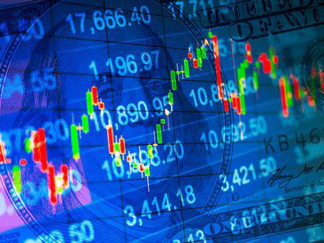

In the rapidly evolving financial landscape, understanding the interplay between various financial instruments is crucial for effective investment strategies. Treasury notes, government bonds, and algorithmic trading stand as pivotal components in financial markets. These elements are integral to both traditional and modern investment techniques, influencing how investors approach portfolio management and asset allocation.

Treasury notes and government bonds serve as fundamental debt securities issued by governments to finance public projects and manage fiscal policies. They represent different maturities and risk profiles, offering investors options tailored to their income needs and risk tolerance. Treasury notes are mid-term investments that provide regular interest payments, balancing liquidity and stability between short-term Treasury bills and long-term bonds.



Algorithmic trading, on the other hand, represents a technological advancement in trading strategies, allowing for the automated execution of trades based on predefined criteria. This method enhances market efficiency and liquidity, reducing transaction costs and the potential for human error. With the growth of algorithmic trading, investors can better navigate the complexities of the bond market, optimizing trade execution and portfolio diversification.

By integrating finance and technology, new insights emerge, allowing investors to optimize their investment portfolios. The roles these financial instruments play in both individual and institutional strategies are significant, influencing decision-making processes and outcomes. Understanding these elements aids in building resilient and profitable investment portfolios, ensuring that investors can adapt to changing market conditions and leverage technological advancements for potential gains. Embracing this integration of finance and technology will be crucial for future financial success, as it not only enhances current investment strategies but also prepares investors for emerging trends and challenges in the financial markets.

## Table of Contents

## Understanding Financial Instruments

Financial instruments represent tradable assets that play a crucial role in the global economy by linking savers and investors. Typically, these instruments are standardized contracts agreed upon by parties involved, offering a spectrum of investment possibilities and financial strategies. Among these instruments, Treasury notes and government bonds hold significant importance due to their distinct functionalities and benefits.

Treasury notes and government bonds are both forms of debt securities issued by governments, designed to raise essential capital for funding public expenditures and infrastructural projects. By purchasing these securities, investors are essentially lending money to the government, expecting a return on their investment in the form of fixed income payments.

**Treasury Notes**: Treasury notes are medium-term investments with maturity periods ranging from two to ten years. They are particularly appealing to investors due to their offer of periodic interest payments, also known as coupon rates. These payments provide a consistent income stream, enhancing their attractiveness as a financial instrument. Treasury notes are crucial for portfolio diversification, balancing the risks and rewards between the short-term Treasury bills and the long-term Treasury bonds.

**Government Bonds**: On the other hand, government bonds are typically long-term securities with maturities that may extend beyond ten years. They are backed by the full faith and credit of the issuing government, which translates to a low-risk profile for investors. Government bonds are critical for those in pursuit of long-term income stability through semi-annual interest payments. Additionally, these bonds are instrumental for governments in managing their budgetary requirements and financing extensive public projects.

Understanding these financial instruments involves recognizing their potential to provide stable, fixed returns, which can be particularly advantageous during periods of economic uncertainty. Investments in Treasury notes and government bonds also present varying opportunities depending on individual risk tolerance and investment horizons. By thoroughly examining the specific characteristics and advantages of these instruments, investors can make informed decisions that align with their financial goals.

## Treasury Notes: Mid-term Investment

Treasury notes, often referred to simply as T-notes, are vital financial instruments within the category of mid-term debt securities. These government-issued securities have maturities that range from two to ten years, making them a preferred investment for those seeking a balance between short and long-term commitments. A distinctive feature of Treasury notes is their offering of periodic interest payments, commonly known as coupon rates, which are typically paid semi-annually. This regular income stream makes them an attractive choice for investors desiring a steady income, while still allowing some flexibility with a moderate maturity period.

To comprehend the investment potential of Treasury notes, it is crucial to analyze their yield characteristics. The yield of a Treasury note can be influenced by various factors including prevailing market interest rates, inflation expectations, and the credit rating of the issuing government. The yield is calculated as follows:

$$
\text{Yield} = \frac{\text{Coupon Payment}}{\text{Purchase Price}} \times 100
$$

Understanding these yield dynamics aids investors in tailoring portfolio diversification strategies. T-notes serve as a vital tool for spreading investment risk and stabilizing returns, because they generally offer a higher yield compared to short-term securities like Treasury bills, while not binding capital for extended periods, which is a typical characteristic of Treasury bonds.

Additionally, Treasury notes are considered lower-risk investments due to being backed by the full faith and credit of the U.S. government. This backing reassures investors of reliability and help in minimizing the risk associated with default. Consequently, Treasury notes provide a more stable investment compared to many corporate counterparts.

In conclusion, Treasury notes offer a strategic investment avenue, balancing the short-term benefits of Treasury bills and the extended yield potential of Treasury bonds. These mid-term debt securities are essential for investors aiming to maintain [liquidity](/wiki/liquidity-risk-premium) while still achieving favorable income and diversification benefits.

## Government Bonds: Long-term Stability

Government bonds are long-term debt securities issued by national governments, typically used to finance state expenditures and manage public debt. These instruments provide a reliable income stream for investors through semiannual interest payments, also known as coupons. The predictable nature of these payments, coupled with the backing of the issuing government, renders government bonds one of the lowest-risk investment options available. This inherent stability makes them an attractive choice for investors seeking preservation of capital and predictable returns over extended periods.

The security of government bonds is primarily attributed to the creditworthiness of the issuing government. Investors generally perceive sovereign governments as highly reliable borrowers, often considering their bonds as benchmark risk-free investments. This is especially true for countries with strong economies and robust fiscal policies, where the likelihood of default is minimal. The global demand for government bonds underscores their importance in the investment landscape, offering a benchmark for other interest rates and serving as a crucial component in diversified portfolios.

Government bonds play a pivotal role in public finance. They enable governments to fund infrastructure projects, social programs, and other expenditures that contribute to economic growth. By issuing bonds, governments can raise immediate capital without resorting to tax increments, thereby balancing fiscal needs with long-term financial strategies. The funds raised through bond issuance also assist in managing budgetary deficits, making government bonds indispensable tools for economic stability and planning.

For individual and institutional investors, government bonds provide an attractive option for long-term investment strategies. The fixed nature of the interest payments helps to buffer portfolios against market [volatility](/wiki/volatility-trading-strategies), ensuring a layer of income stability. Additionally, government bonds are instrumental in laddering strategies, where investors hold bonds of varying maturities to manage [interest rate](/wiki/interest-rate-trading-strategies) risk and liquidity needs effectively.

In summary, the appeal of government bonds lies in their ability to provide low-risk, stable returns while serving as vital instruments for government financing. Their unique characteristics solidify their role as key components in the global financial system, benefiting both issuers and investors through predictable, secure investment opportunities.

## Algorithmic Trading: Revolutionizing Finance

Algorithmic trading is transforming the financial landscape through the use of sophisticated computer algorithms designed to execute trades automatically based on predefined criteria. These algorithms can analyze vast amounts of data within seconds, making decisions that enhance market efficiency, reduce transaction costs, and minimize human errors. By pre-programming these trading strategies, market participants can capitalize on opportunities with speed and precision unattainable by human traders.

In the bond market, [algorithmic trading](/wiki/algorithmic-trading) is particularly advantageous as it increases liquidity—making it easier for participants to buy and sell large volumes of bonds without causing significant price fluctuations. The use of algorithms optimizes trade execution by determining the best times to enter or [exit](/wiki/exit-strategy) positions based on current market conditions and historical data patterns.

Advancements in technology continue to push the boundaries of what algorithmic trading can achieve, especially in the context of government securities. The increased use of big data analytics, [artificial intelligence](/wiki/ai-artificial-intelligence), and [machine learning](/wiki/machine-learning) techniques aids in developing more refined and adaptive strategies, leading to improved predictive models and trade outcomes. Moreover, high-frequency trading ([HFT](/wiki/high-frequency-trading-strategies)), a subset of algorithmic trading, leverages these technologies to execute a large number of orders at incredibly fast speeds, further contributing to market liquidity and price discovery.

A basic example of a simple algorithmic trading strategy in Python might include using moving averages to determine buy and sell signals:

```python
import numpy as np
import pandas as pd

# Sample data
data = pd.DataFrame({'price': [100, 102, 105, 107, 106, 110, 108, 111]})

# Simple moving average calculation
data['SMA_3'] = data['price'].rolling(window=3).mean()

# Generate signals
data['signal'] = 0
data.loc[data['price'] > data['SMA_3'], 'signal'] = 1

print(data)
```

This simple script calculates a 3-day simple moving average (SMA) for a series of prices and generates a buy signal (represented by 1) when the current price exceeds the SMA. Though rudimentary, this example illustrates the programmability and adaptability of algorithmic trading systems. As technology evolves, more complex models incorporating a wide range of quantitative and qualitative data are continuously developed, redefining trading strategies across various asset classes.

## Challenges and Opportunities in Algo Trading

Algorithmic trading, despite its numerous advantages, is not without its challenges. One of the primary concerns is the potential for increased market volatility. High-frequency trading, a subset of algorithmic trading, can lead to rapid fluctuations in stock prices due to its ability to execute a vast number of transactions in a very short timeframe. This can result in flash crashes, where assets' prices plummet and recover quickly, potentially causing significant disruptions in the markets.

Technical failures also pose a significant risk to algorithmic trading. These failures can occur due to software bugs, hardware malfunctions, or network connectivity issues, potentially leading to erroneous trades and substantial financial losses. As algorithms are designed to operate at incredible speeds, even a minor glitch can have far-reaching consequences before human intervention is possible.

Regulatory oversight is crucial to mitigate these risks and ensure market stability. Regulatory bodies, such as the Securities and Exchange Commission (SEC) in the United States, have established guidelines and frameworks to monitor algorithmic trading activities. This includes requirements for firms to implement effective risk management systems, maintain audit trails, and ensure algorithms undergo rigorous testing before deployment. 

On the opportunity side, algorithmic trading can be a powerful tool for both institutional and individual investors aiming to enhance their decision-making processes. By utilizing complex algorithms that analyze various data points, investors can execute trades based on quantitative models that remove human emotion from the equation. This can lead to more accurate forecasting and better investment strategies. 

To fully leverage algorithmic trading's potential, continuous adaptation and a thorough understanding of technology and market conditions are essential. Developing more sophisticated algorithms can help in accurately predicting market trends while robust risk management strategies can mitigate potential downsides. Furthermore, staying informed about regulatory changes and technological advancements can ensure that trading strategies remain compliant and effective. 

In conclusion, while algorithmic trading offers significant opportunities, being cognizant of its challenges is essential for effective adoption and risk management. Striking a balance between leveraging technological advancements and adhering to regulatory requirements can unlock new potentials for market participants.

## Conclusion

Treasury notes, government bonds, and algorithmic trading collectively provide a multifaceted approach to investment strategies, each contributing unique advantages that can enhance portfolio performance. Understanding how these instruments function and integrate with one another is paramount for constructing resilient and profitable investment portfolios. For instance, Treasury notes offer mid-term investment opportunities with regular income through coupon payments, balancing the short-term liquidity of Treasury bills with the long-term stability of bonds. Government bonds, on the other hand, provide a platform for long-term stability, offering predictable returns backed by government assurances.

Algorithmic trading introduces a transformation in trading dynamics, leveraging computational power to enable swift execution of trades according to specific criteria, thereby improving market efficiency and reducing costs. The ability of algorithms to process vast amounts of data in real time offers investors the potential to optimize their trading strategies and capitalize on opportunities that human traders might overlook.

The integration of technology and traditional financial instruments unlocks potential gains by enhancing decision-making processes and risk management. For investors, staying informed about regulatory changes and technological advancements is essential. As financial markets evolve, adapting to these changes ensures alignment with the latest practices and innovations, maintaining a competitive edge. By comprehensively understanding and leveraging the intricate dynamics between Treasury notes, government bonds, and algorithmic trading, investors can achieve robust financial success.

## References & Further Reading

[1]: Bergstra, J., Bardenet, R., Bengio, Y., & Kégl, B. (2011). ["Algorithms for Hyper-Parameter Optimization."](https://dl.acm.org/doi/10.5555/2986459.2986743) Advances in Neural Information Processing Systems 24.

[2]: ["Advances in Financial Machine Learning"](https://www.amazon.com/Advances-Financial-Machine-Learning-Marcos/dp/1119482089) by Marcos Lopez de Prado.

[3]: ["Evidence-Based Technical Analysis: Applying the Scientific Method and Statistical Inference to Trading Signals"](https://www.amazon.com/Evidence-Based-Technical-Analysis-Scientific-Statistical/dp/0470008741) by David Aronson.

[4]: ["Machine Learning for Algorithmic Trading"](https://github.com/stefan-jansen/machine-learning-for-trading) by Stefan Jansen.

[5]: ["Quantitative Trading: How to Build Your Own Algorithmic Trading Business"](https://www.amazon.com/Quantitative-Trading-Build-Algorithmic-Business/dp/1119800064) by Ernest P. Chan.

[6]: Fabozzi, F. J. (2001). ["Bond Markets, Analysis, and Strategies,"](https://books.google.com/books/about/Fabozzi_Bond_Markets_Analysis_and_Strate.html?id=9JupBwAAQBAJ) 7th Edition. Pearson.

[7]: Hasbrouck, J., & Saar, G. (2013). ["Low-latency trading."](https://www.sciencedirect.com/science/article/abs/pii/S1386418113000165) Journal of Financial Markets, 16(4), 646-679.

[8]: Knight, J. L., & Satchell, S. (2007). ["Forecasting Volatility in the Financial Markets."](https://www.sciencedirect.com/book/9780750669429/forecasting-volatility-in-the-financial-markets) Elsevier.