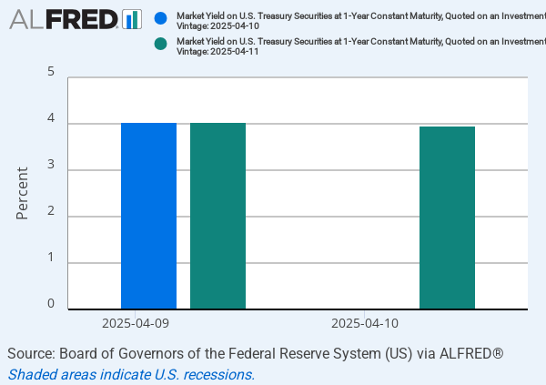

## Table of Contents

## What is a One-Year Constant Maturity Treasury (CMT)?

A One-Year Constant Maturity Treasury (CMT) is a type of interest rate that the U.S. Treasury calculates every day. It represents the yield, or return, you would get if you bought a one-year Treasury security. Treasury securities are like loans you give to the government, and they are considered very safe investments. The one-year CMT is useful because it gives a quick snapshot of what short-term interest rates are doing.

The CMT is called "constant maturity" because it always looks at the yield of a security with a one-year term, even though the actual securities used to calculate it might have different lengths. The Treasury takes the yields of many different Treasury securities and uses a special formula to figure out what the one-year rate would be. This rate is important for banks, investors, and anyone who wants to understand or predict how interest rates might change in the near future.

## How is the One-Year CMT rate determined?

The One-Year Constant Maturity Treasury (CMT) rate is figured out by the U.S. Treasury every day. They look at the yields, or returns, of many different Treasury securities that are being sold. These securities can have different lengths of time until they mature, but the Treasury uses a special math formula to figure out what the yield would be if you bought a security that matures in exactly one year. This way, they can give a consistent rate that always represents a one-year term.

The process involves taking the yields of Treasury securities with different maturities and using a method called interpolation. This means they estimate what the yield would be for a one-year term by looking at securities that mature just before and just after one year. By doing this, the Treasury can provide a smooth and reliable rate that reflects current market conditions for short-term investments. This rate is important for banks, investors, and anyone who needs to understand short-term [interest rate](/wiki/interest-rate-trading-strategies) trends.

## What is the purpose of the One-Year CMT?

The One-Year Constant Maturity Treasury (CMT) rate helps people understand what short-term interest rates are doing. It's like a daily report card for the interest you would get if you bought a one-year Treasury security. This rate is important because it gives everyone a clear and consistent way to see how short-term borrowing and lending costs are changing.

Banks, investors, and even regular people use the One-Year CMT rate to make decisions. For example, banks might use it to set interest rates on loans or savings accounts. Investors might look at it to guess where interest rates are heading and plan their investments accordingly. It's a useful tool because it's easy to understand and it's updated every day, so it keeps everyone in the loop about short-term interest rates.

## How does the One-Year CMT rate affect other interest rates?

The One-Year CMT rate is like a guide for other interest rates. When the One-Year CMT rate goes up, it usually means that other short-term interest rates, like those on savings accounts or short-term loans, will go up too. Banks and lenders look at the One-Year CMT rate to decide what interest rates they should charge or offer. If the CMT rate is high, they might charge more for loans or offer higher rates on savings to stay competitive.

On the other hand, when the One-Year CMT rate goes down, other short-term interest rates tend to follow. This can make borrowing cheaper because banks might lower the rates on loans. It can also mean lower returns on savings accounts. The One-Year CMT rate is important because it helps everyone from banks to regular people understand and predict how interest rates might change in the near future.

## Where can one find the current One-Year CMT rate?

You can find the current One-Year CMT rate on the U.S. Department of the Treasury's website. They update it every day, so you can always see the most recent rate. Just go to their website, look for the section about interest rates, and you'll find the One-Year CMT rate listed there.

It's also available on financial news websites and through financial data services. These places often show the current rate along with other important interest rates. So, if you're interested in keeping up with short-term interest rates, checking these sources regularly can be really helpful.

## How often is the One-Year CMT rate updated?

The One-Year CMT rate is updated every day by the U.S. Department of the Treasury. They calculate it using the yields of different Treasury securities and make sure it's available for everyone to see on their website.

Because it's updated daily, people like banks, investors, and anyone interested in short-term interest rates can always have the latest information. This helps them make better decisions about loans, savings, and investments based on the most current rates.

## What are the historical trends of the One-Year CMT rate?

The One-Year CMT rate has gone up and down over the years, following changes in the economy and what the Federal Reserve does with interest rates. For example, during times when the economy was growing fast, like in the late 1990s and early 2000s, the One-Year CMT rate was often higher because people were borrowing more and inflation was a concern. On the other hand, during the financial crisis in 2008, the rate dropped a lot because the Federal Reserve cut rates to help the economy recover.

In more recent years, the One-Year CMT rate has stayed pretty low. After the financial crisis, the Federal Reserve kept interest rates low for a long time to help the economy get back on its feet. Even when they started raising rates again around 2015, the One-Year CMT rate didn't go up as much as it did in earlier times. Then, when the COVID-19 pandemic hit in 2020, the rate dropped again as the Federal Reserve took steps to support the economy. Overall, the One-Year CMT rate shows how the economy and Federal Reserve actions affect short-term interest rates.

## How can investors use the One-Year CMT rate in their investment strategies?

Investors can use the One-Year CMT rate to help them make smart choices about their money. If the One-Year CMT rate is going up, it might mean that short-term interest rates are going to rise too. This can be good news for people who have money in savings accounts or short-term bonds because they might earn more interest. But it can be bad news for people who want to borrow money because loans might get more expensive. So, investors might decide to put more money into things that benefit from higher interest rates, like certain types of bonds or savings accounts.

On the other hand, if the One-Year CMT rate is going down, it could mean that short-term interest rates are going to fall. This might be a good time for investors to borrow money because loans could be cheaper. It might also be a good time to invest in things that do well when interest rates are low, like stocks or real estate. By keeping an eye on the One-Year CMT rate, investors can get a sense of where the economy is headed and adjust their investment strategies to take advantage of these changes.

## What are the differences between the One-Year CMT and other Treasury securities?

The One-Year Constant Maturity Treasury (CMT) rate is different from other Treasury securities because it's not a security you can buy. Instead, it's a daily calculation that shows what the yield would be if you bought a one-year Treasury security. Other Treasury securities, like T-bills, T-notes, and T-bonds, are actual investments you can buy. They have different lengths of time until they mature, like a few months for T-bills, or up to 30 years for T-bonds. The One-Year CMT rate is like a report card that uses the yields of these different securities to give a snapshot of what a one-year investment would look like.

Another difference is that the One-Year CMT rate is always looking at a one-year term, no matter what. This means it's very consistent and easy to use for understanding short-term interest rates. Other Treasury securities, on the other hand, have fixed terms that don't change. If you buy a 10-year T-note, it will always be a 10-year investment until it matures. The One-Year CMT rate helps investors, banks, and others predict where short-term interest rates might be going, while other Treasury securities are more about locking in a rate for a specific period of time.

## How does the One-Year CMT rate correlate with economic indicators?

The One-Year CMT rate often moves along with other important economic indicators, like inflation and the Federal Reserve's interest rate decisions. When inflation goes up, the Federal Reserve might raise interest rates to slow down the economy. This usually makes the One-Year CMT rate go up too, because it reflects the cost of borrowing money for a short time. On the other hand, if the economy is slowing down and the Federal Reserve lowers interest rates to help it grow, the One-Year CMT rate will likely go down as well.

Another economic indicator that the One-Year CMT rate can connect with is the unemployment rate. When unemployment is low, people have more money to spend, which can drive up inflation and push the Federal Reserve to raise interest rates. This often leads to a higher One-Year CMT rate. But if unemployment is high, the Federal Reserve might lower interest rates to encourage more spending and investment, which would bring the One-Year CMT rate down. By watching these connections, people can get a better idea of where the economy might be headed and how it might affect their money.

## What are the risks associated with investing based on the One-Year CMT rate?

Investing based on the One-Year CMT rate can be risky because it's just one piece of the puzzle. The rate can change every day, and if you make big decisions based on it, you might end up losing money if the rate moves in a way you didn't expect. For example, if you think the rate will go up and you put a lot of money into savings accounts or short-term bonds, but then the rate goes down instead, you might not earn as much interest as you hoped.

Another risk is that the One-Year CMT rate doesn't tell the whole story about the economy. It's influenced by things like inflation and what the Federal Reserve does, but there are other factors at play too. If you focus too much on the One-Year CMT rate, you might miss out on other important signs that could affect your investments. It's important to look at a lot of different information and not just rely on one rate to make your investment choices.

## How do global economic events influence the One-Year CMT rate?

Global economic events can have a big impact on the One-Year CMT rate. If something big happens in another country, like a financial crisis or a big change in their economy, it can affect the whole world's economy. This might make people move their money around to different countries, which can change interest rates everywhere. For example, if there's a crisis in Europe, investors might pull their money out of Europe and put it into U.S. Treasury securities, which can push down the One-Year CMT rate because more people want to buy them.

Also, things like changes in oil prices or trade policies can influence the One-Year CMT rate. If oil prices go way up, it can make inflation go up too, and the Federal Reserve might raise interest rates to cool things down. This would make the One-Year CMT rate go up. On the other hand, if countries start fighting over trade and put up tariffs, it can slow down the economy and make the Federal Reserve lower interest rates, which would bring the One-Year CMT rate down. So, what happens around the world can really affect the One-Year CMT rate, even though it's set by the U.S. Treasury.

## What are Treasury Notes as a Mid-term Investment?

Treasury notes, often referred to simply as T-notes, are vital financial instruments within the category of mid-term debt securities. These government-issued securities have maturities that range from two to ten years, making them a preferred investment for those seeking a balance between short and long-term commitments. A distinctive feature of Treasury notes is their offering of periodic interest payments, commonly known as coupon rates, which are typically paid semi-annually. This regular income stream makes them an attractive choice for investors desiring a steady income, while still allowing some flexibility with a moderate maturity period.

To comprehend the investment potential of Treasury notes, it is crucial to analyze their yield characteristics. The yield of a Treasury note can be influenced by various factors including prevailing market interest rates, inflation expectations, and the credit rating of the issuing government. The yield is calculated as follows:

$$
\text{Yield} = \frac{\text{Coupon Payment}}{\text{Purchase Price}} \times 100
$$

Understanding these yield dynamics aids investors in tailoring portfolio diversification strategies. T-notes serve as a vital tool for spreading investment risk and stabilizing returns, because they generally offer a higher yield compared to short-term securities like Treasury bills, while not binding capital for extended periods, which is a typical characteristic of Treasury bonds.

Additionally, Treasury notes are considered lower-risk investments due to being backed by the full faith and credit of the U.S. government. This backing reassures investors of reliability and help in minimizing the risk associated with default. Consequently, Treasury notes provide a more stable investment compared to many corporate counterparts.

In conclusion, Treasury notes offer a strategic investment avenue, balancing the short-term benefits of Treasury bills and the extended yield potential of Treasury bonds. These mid-term debt securities are essential for investors aiming to maintain [liquidity](/wiki/liquidity-risk-premium) while still achieving favorable income and diversification benefits.

## References & Further Reading

[1]: Bergstra, J., Bardenet, R., Bengio, Y., & Kégl, B. (2011). ["Algorithms for Hyper-Parameter Optimization."](https://dl.acm.org/doi/10.5555/2986459.2986743) Advances in Neural Information Processing Systems 24.

[2]: ["Advances in Financial Machine Learning"](https://www.amazon.com/Advances-Financial-Machine-Learning-Marcos/dp/1119482089) by Marcos Lopez de Prado.

[3]: ["Evidence-Based Technical Analysis: Applying the Scientific Method and Statistical Inference to Trading Signals"](https://www.amazon.com/Evidence-Based-Technical-Analysis-Scientific-Statistical/dp/0470008741) by David Aronson.

[4]: ["Machine Learning for Algorithmic Trading"](https://github.com/stefan-jansen/machine-learning-for-trading) by Stefan Jansen.

[5]: ["Quantitative Trading: How to Build Your Own Algorithmic Trading Business"](https://www.amazon.com/Quantitative-Trading-Build-Algorithmic-Business/dp/1119800064) by Ernest P. Chan.

[6]: Fabozzi, F. J. (2001). ["Bond Markets, Analysis, and Strategies,"](https://books.google.com/books/about/Fabozzi_Bond_Markets_Analysis_and_Strate.html?id=9JupBwAAQBAJ) 7th Edition. Pearson.

[7]: Hasbrouck, J., & Saar, G. (2013). ["Low-latency trading."](https://www.sciencedirect.com/science/article/abs/pii/S1386418113000165) Journal of Financial Markets, 16(4), 646-679.

[8]: Knight, J. L., & Satchell, S. (2007). ["Forecasting Volatility in the Financial Markets."](https://www.sciencedirect.com/book/9780750669429/forecasting-volatility-in-the-financial-markets) Elsevier.