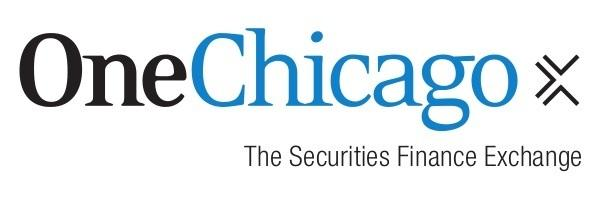

## Table of Contents

## What is OneChicago Exchange?

OneChicago Exchange is a place where people can trade single stock futures. This means they can buy and sell contracts that are based on the future price of one specific stock. It started in 2002 and is located in Chicago. It's different from other exchanges because it focuses only on single stock futures, not on other types of financial products.

People use OneChicago Exchange to make predictions about where they think a stock's price will go in the future. They can use these futures to either make money if they guess right, or to protect their other investments from losing value. The exchange helps make trading these futures easier and more organized, so more people can use them.

## When was OneChicago Exchange founded?

OneChicago Exchange was founded in 2002. It is located in Chicago and is a special kind of exchange where people can trade single stock futures. This means they can buy and sell contracts that predict the future price of one specific stock.

The exchange is unique because it focuses only on single stock futures, unlike other exchanges that might trade many different financial products. People use OneChicago to guess where they think a stock's price will go in the future. They can make money if they guess right or protect their other investments from losing value.

## What types of financial products does OneChicago Exchange offer?

OneChicago Exchange offers single stock futures. This means they let people buy and sell contracts that are based on the future price of one specific stock. It's different from other exchanges because it only focuses on these single stock futures, not on other types of financial products.

People use these futures to make predictions about where they think a stock's price will go in the future. If they guess right, they can make money. They can also use these futures to protect their other investments from losing value. This makes OneChicago Exchange a useful tool for both making profits and managing risk.

## How does OneChicago Exchange facilitate trading?

OneChicago Exchange makes trading easier by providing a place where people can buy and sell single stock futures. These are contracts that predict the future price of one specific stock. The exchange is located in Chicago and started in 2002. It's different from other exchanges because it only focuses on single stock futures, not other financial products. This makes it a specialized place for people who want to trade these specific types of contracts.

People use OneChicago Exchange to guess where they think a stock's price will go in the future. If they guess right, they can make money. They can also use these futures to protect their other investments from losing value. The exchange helps make this process smoother and more organized. It brings together buyers and sellers, making it easier for them to find each other and complete their trades. This helps more people use single stock futures to either make profits or manage their risk.

## What are the benefits of trading on OneChicago Exchange for beginners?

Trading on OneChicago Exchange can be a good start for beginners because it's all about single stock futures. This means you're dealing with contracts that predict the future price of just one stock. It's simpler than other exchanges where you might have to deal with many different types of financial products. By focusing on one type of product, beginners can learn how futures work without getting overwhelmed by too many options.

Another benefit is that OneChicago Exchange helps beginners understand how to make money or protect their investments. If you think a stock's price will go up, you can buy a future and make money if you're right. If you're worried about a stock losing value, you can use a future to protect your other investments. The exchange makes it easier to find people to trade with, so beginners can start practicing and learning without too much trouble.

## What are the membership requirements for OneChicago Exchange?

To become a member of OneChicago Exchange, you need to meet certain requirements. First, you have to be a member of one of the exchange's clearing firms. These are special companies that help make sure trades are completed correctly. You also need to pay a membership fee, which can be different depending on what kind of membership you want. There are different levels of membership, like full members who can trade for themselves and others, and associate members who can only trade for themselves.

Once you meet these basic requirements, you'll need to fill out an application and go through a review process. The exchange will check your background to make sure you're a good fit. This includes looking at your financial situation and your experience with trading. If everything looks good, you'll be approved and can start trading on the exchange. It's important to follow all the rules and keep up with any changes to stay a member in good standing.

## How does OneChicago Exchange ensure the security of transactions?

OneChicago Exchange works hard to keep transactions safe. They use special companies called clearing firms to make sure every trade is done right. These firms check that both buyers and sellers have enough money and that the trades are fair. This helps stop problems before they start and keeps everyone's money safe.

The exchange also follows strict rules to protect traders. They watch all the trades closely to make sure no one is cheating or doing anything wrong. If someone breaks the rules, they can be punished or even removed from the exchange. This helps everyone feel safe and trust that their trades are secure.

## What are the trading hours of OneChicago Exchange?

OneChicago Exchange is open for trading from Monday to Friday. The trading hours are from 8:30 AM to 3:15 PM Eastern Time. This is when people can buy and sell single stock futures on the exchange.

These hours are set to match the regular trading hours of the stock market. This makes it easier for people to trade futures along with their other investments. By keeping the same schedule, traders can plan their day and make decisions without having to worry about different times for different markets.

## How does OneChicago Exchange handle regulatory compliance?

OneChicago Exchange works hard to follow all the rules set by the government and other groups that watch over trading. They have to make sure they are doing everything right, so they have special teams and systems in place to keep an eye on all the trades. These teams check that everyone is following the rules and that no one is cheating or doing anything wrong. If they find a problem, they deal with it quickly to keep the exchange safe and fair for everyone.

The exchange also has to report to groups like the Commodity Futures Trading Commission (CFTC) and the Securities and Exchange Commission (SEC). These groups make sure that OneChicago is following all the laws about trading futures. OneChicago sends them regular reports and lets them know about any big changes or issues. This helps make sure that the exchange stays in line with all the rules and keeps trading safe and honest for everyone involved.

## What advanced trading strategies can be implemented on OneChicago Exchange?

One advanced trading strategy you can use on OneChicago Exchange is called hedging. This means you use single stock futures to protect your other investments from losing value. For example, if you own a stock and you're worried its price might go down, you can buy a future that will make money if the stock's price does go down. This way, even if you lose money on the stock, you can make some of it back with the future. It's like buying insurance for your investments.

Another strategy is called speculation. This is when you try to make money by guessing where the price of a stock will go in the future. If you think a stock's price will go up, you can buy a future now and sell it later for a higher price. If you're right, you make money. But if you're wrong, you could lose money. It's a bit like gambling, but with more information and strategy involved. You can use the information and tools on OneChicago Exchange to help you make better guesses.

A third strategy is called [arbitrage](/wiki/arbitrage). This is when you take advantage of small differences in prices between different markets. For example, if the price of a stock on OneChicago Exchange is a little different from its price on another exchange, you can buy the future on one exchange and sell it on the other to make a small profit. This strategy requires quick thinking and good timing, but it can be a way to make money without taking big risks. OneChicago Exchange's focus on single stock futures makes it a good place to look for these opportunities.

## How does OneChicago Exchange compare to other similar exchanges?

OneChicago Exchange is different from other exchanges because it only focuses on single stock futures. This means it's a special place where people can trade contracts that predict the future price of one specific stock. Other exchanges, like the Chicago Mercantile Exchange (CME) or the Intercontinental Exchange (ICE), offer a wider range of financial products, including futures on commodities, currencies, and indexes. OneChicago's focus makes it simpler for people who just want to trade single stock futures without getting confused by other types of products.

Compared to other exchanges, OneChicago also has specific trading hours that match the regular stock market hours, from 8:30 AM to 3:15 PM Eastern Time. This can be helpful for traders who want to manage their stock investments and futures at the same time. Other exchanges might have different hours, which can make it harder to plan trades. OneChicago's straightforward approach and focus on single stock futures make it a good choice for people who want to use these specific financial tools to make money or protect their investments.

## What future developments are planned for OneChicago Exchange?

OneChicago Exchange is always looking for ways to make trading better. They want to add new tools and features that will help people trade single stock futures more easily. For example, they might add more ways to see real-time data or new ways to place orders. They also want to make their website and trading platform easier to use, so even beginners can understand how to trade.

Another thing OneChicago Exchange is thinking about is expanding the types of single stock futures they offer. Right now, they focus on futures for individual stocks, but they might start offering futures for other things like stock indexes or ETFs in the future. This would give traders more options and could attract more people to the exchange. By keeping up with what traders need and want, OneChicago Exchange hopes to stay a leading place for single stock futures trading.

## References & Further Reading

[1]: Hu, G., McInish, T. H., & Upson, J. (2015). ["The evolution of algorithmic trading: Evidence from a time series analysis."](https://www.sciencedirect.com/science/article/pii/S138641810900038X) Journal of Banking & Finance, 50, 456-468.

[2]: Hendershott, T., Jones, C. M., & Menkveld, A. J. (2011). ["Does algorithmic trading improve liquidity?"](https://onlinelibrary.wiley.com/doi/full/10.1111/j.1540-6261.2010.01624.x) The Review of Financial Studies, 24(3), 955-989.

[3]: Easley, D., López de Prado, M. M., & O'Hara, M. (2013). ["High-frequency trading: The good, the bad, and the regulation."](https://papers.ssrn.com/sol3/papers.cfm?abstract_id=1695596) Journal of Financial Economics, 49(2), 225-254.

[4]: Lopez de Prado, M. (2018). ["Advances in Financial Machine Learning"](https://www.amazon.com/Advances-Financial-Machine-Learning-Marcos/dp/1119482089) Wiley.

[5]: Chan, E. (2008). ["Quantitative Trading: How to Build Your Own Algorithmic Trading Business"](https://github.com/ftvision/quant_trading_echan_book) Wiley.

[6]: Johnson, B., & Dubow, B. (2010). ["The impact of high-frequency trading on market volatility."](https://link.springer.com/article/10.1007/s12599-022-00768-6) CFA Institute Research Foundation.

[7]: Chlistalla, M. (2011). ["High-Frequency Trading: Better than its reputation?"](https://c.mql5.com/forextsd/forum/168/high-frequency_trading_-_better_than_its_reputation.pdf) Deutsche Bank Research.