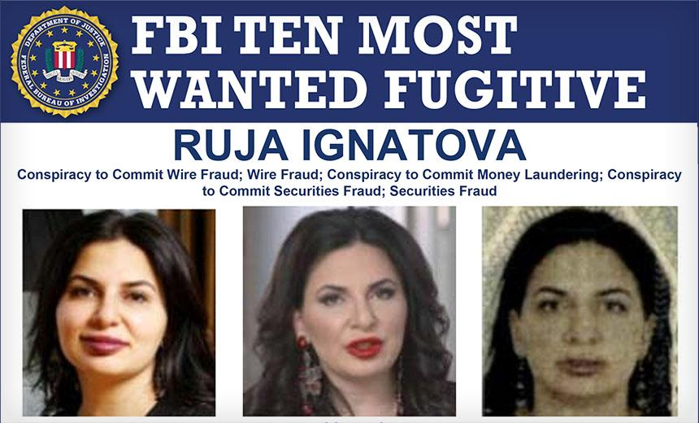

## Table of Contents

## What is OneCoin?

OneCoin was a cryptocurrency that started in 2014. It was created by a woman named Ruja Ignatova. People were told that they could buy OneCoin and it would become more valuable over time, like Bitcoin. However, OneCoin was not a real cryptocurrency. It was a scam that tricked people into giving their money to the people running OneCoin.

Many people lost a lot of money because of OneCoin. The people who ran OneCoin said it was a good investment, but it was not. They used the money people gave them for themselves instead of making OneCoin better. In 2017, Ruja Ignatova disappeared and is still missing. The people who were tricked by OneCoin are still trying to get their money back.

## Who founded OneCoin and when was it launched?

OneCoin was founded by a woman named Ruja Ignatova. She started OneCoin in 2014. Ruja told people that OneCoin was a new kind of money that they could buy and it would grow in value, just like Bitcoin.

However, OneCoin was not a real [cryptocurrency](/wiki/cryptocurrency). It was a scam that tricked many people into giving their money to Ruja and her team. They promised that OneCoin would be a good investment, but it was not. In 2017, Ruja disappeared and is still missing today.

## How did OneCoin operate as a cryptocurrency?

OneCoin pretended to be a real cryptocurrency like Bitcoin. People could buy OneCoin with regular money, like dollars or euros. They were told that OneCoin would become more valuable over time, so they could sell it later for more money. To buy OneCoin, people had to join a special website and use a special program to see their OneCoins. The people running OneCoin said they were working on making it better and more popular, but they were not.

In reality, OneCoin was not a real cryptocurrency. It did not have a public record of all the transactions like Bitcoin does. Instead, the people running OneCoin controlled everything and could make new OneCoins whenever they wanted. They used the money people gave them to live fancy lives instead of making OneCoin better. Many people lost their money because they believed the promises about OneCoin, but it was all a big trick.

## What made OneCoin attractive to investors?

OneCoin seemed attractive to investors because it promised big profits. The people running OneCoin said it was like Bitcoin, a new kind of money that would grow in value over time. They told people they could buy OneCoins and then sell them later for more money. This idea of making easy money sounded good to many people, so they invested in OneCoin hoping to get rich.

Another reason OneCoin was attractive was because it was easy to join and buy. People could sign up on a special website and use a program to see their OneCoins. The people running OneCoin also used big events and fancy marketing to make it look like a good investment. They made it seem like everyone was joining and making money, which made more people want to be part of it. But in the end, it was all a trick, and many people lost their money.

## How was OneCoin marketed and promoted?

OneCoin was marketed and promoted through big events and fancy marketing. The people running OneCoin held big meetings and conferences where they talked about how great OneCoin was. They used videos and presentations to make it look like a good investment. They also used social media and the internet to spread the word about OneCoin. They made it seem like everyone was joining and making money, which made more people want to be part of it.

Another way OneCoin was promoted was through a special program called the OneCoin Education Package. People had to buy this package to learn about OneCoin and how to use it. The package made it seem like OneCoin was a real cryptocurrency and that people needed to learn a lot to use it. This made OneCoin look more professional and trustworthy. But in the end, it was all just a way to trick people into giving their money to the people running OneCoin.

## When did suspicions about OneCoin being a scam begin to surface?

Suspicions about OneCoin being a scam started to surface around late 2015 and early 2016. People who knew about real cryptocurrencies like Bitcoin noticed that OneCoin did not have a public record of all the transactions, which is a key part of real cryptocurrencies. They also saw that the people running OneCoin were making big promises about how much money people could make, which seemed too good to be true.

By 2016, more people were talking about their doubts on the internet and in the news. Some people who had invested in OneCoin started to realize that they could not sell their OneCoins for real money like they were promised. As more stories came out about people losing money, it became clear that OneCoin was not a real cryptocurrency and was likely a scam.

## What were the key red flags that indicated OneCoin was a Ponzi scheme?

One big red flag that OneCoin was a Ponzi scheme was that it did not have a real blockchain. A blockchain is like a public record that shows all the transactions in a cryptocurrency. Real cryptocurrencies like Bitcoin have a blockchain that anyone can see, but OneCoin did not. This meant that the people running OneCoin could control everything and make new OneCoins whenever they wanted, which is not how real cryptocurrencies work.

Another red flag was that OneCoin promised big profits with little risk. The people running OneCoin said that if you bought OneCoins, you could sell them later for a lot more money. This sounded too good to be true, and it was. In a Ponzi scheme, the money from new investors is used to pay off earlier investors, making it seem like the investment is working. But when there are not enough new investors, the scheme falls apart, and people lose their money. Many people realized this was happening with OneCoin when they could not sell their OneCoins for real money.

## How did the OneCoin scheme unravel and what were the consequences for its founders?

The OneCoin scheme started to unravel in 2016 when more people began to question it. They noticed that OneCoin did not have a real blockchain, which is a big part of real cryptocurrencies like Bitcoin. People who had invested in OneCoin also found out they could not sell their OneCoins for real money like they were promised. As more stories came out about people losing money, it became clear that OneCoin was a scam. By 2017, the scheme was fully exposed, and many investors realized they had been tricked.

The consequences for the founders were severe. Ruja Ignatova, the main person behind OneCoin, disappeared in 2017 and is still missing. She is wanted by the FBI and other law enforcement agencies around the world. Other people involved in OneCoin, like Sebastian Greenwood, were arrested and faced legal action. They were charged with fraud and other crimes. Many investors lost a lot of money and are still trying to get it back, but it has been very hard because OneCoin was a big scam.

## What was the estimated total amount of money defrauded by OneCoin?

OneCoin is believed to have defrauded people out of billions of dollars. The exact amount is hard to know for sure because OneCoin did not keep real records of its transactions. But many people think that the total amount of money taken by OneCoin could be as much as $4 billion.

This money came from people all over the world who bought OneCoins hoping to make a profit. They were told that OneCoin would grow in value just like Bitcoin, but it was all a big trick. The people running OneCoin used the money for themselves instead of making OneCoin a real cryptocurrency. Many investors lost their savings and are still trying to get their money back.

## How did OneCoin impact the victims and what legal actions were taken against it?

OneCoin had a big impact on the people who invested in it. Many people lost a lot of money because they believed the promises about OneCoin. They thought they were buying a new kind of money that would grow in value, but it was all a trick. Some people lost their savings and had a hard time paying for things they needed. It was very upsetting for them to find out that OneCoin was a scam. They felt tricked and angry, and many are still trying to get their money back, but it's very hard because the people running OneCoin took the money and used it for themselves.

Legal actions were taken against OneCoin and the people who ran it. Ruja Ignatova, the main person behind OneCoin, disappeared in 2017 and is still missing. She is wanted by the FBI and other law enforcement agencies around the world. Other people involved in OneCoin, like Sebastian Greenwood, were arrested and faced charges of fraud and other crimes. They are being punished for tricking people out of their money. Many countries are also working together to help the victims of OneCoin and to stop other scams like it from happening again.

## What lessons can be learned from the OneCoin scam to prevent future cryptocurrency frauds?

The OneCoin scam teaches us to be careful when investing in new cryptocurrencies. We need to look for a real blockchain, which is like a public record that shows all the transactions. If a cryptocurrency does not have a blockchain that anyone can see, it might be a scam. We should also be wary of investments that promise big profits with little risk. If something sounds too good to be true, it probably is. It's important to do our own research and not just trust what people say at big events or on fancy websites.

Another lesson from OneCoin is the importance of regulation and education. Governments and other organizations need to keep a close eye on new cryptocurrencies to make sure they are not scams. They can create rules to protect people from losing their money. At the same time, people need to learn more about how cryptocurrencies work and how to spot a scam. By being more informed and cautious, we can help prevent future frauds like OneCoin from happening.

## How has the OneCoin case influenced regulatory approaches to cryptocurrencies?

The OneCoin case showed governments and other groups that they need to be careful about new cryptocurrencies. They learned that some people might try to trick others with fake cryptocurrencies. Because of OneCoin, many countries started making new rules to check if new cryptocurrencies are real or not. These rules help make sure that people are not tricked into giving their money to scammers. The rules also help to keep the cryptocurrency market safe for everyone.

OneCoin also made people more aware of the need to learn about cryptocurrencies. People realized that they need to know how to tell if a cryptocurrency is real or a scam. This has led to more education programs about cryptocurrencies. These programs teach people how to spot the signs of a scam, like promises of big profits with little risk or a lack of a real blockchain. By learning more, people can protect themselves and their money from future scams like OneCoin.

## References & Further Reading

[1]: ["Ponzi Schemes in the Cryptocurrency Space: A Within-Group Enquiry into Identifying Characteristics"](https://www.coindesk.com/learn/crypto-ponzi-schemes-how-to-identify-and-protect-yourself-from-these-scams) 

[2]: Zohar, A. (2015). ["Bitcoin: under the hood."](https://dl.acm.org/doi/10.1145/2701411) *Communications of the ACM*, 58(9), 104-113.

[3]: Lewis, R. (2018). ["The Crypto Queen: How Ruja Ignatova Scammed the World, then Vanished."](https://www.bbc.com/news/stories-50435014) BBC News.

[4]: "United States v. Mark S. Scott: Prosecutor's Sentencing Memorandum" from the U.S. Attorney's Office, detailing legal actions against figures involved with OneCoin.

[5]: Das, S., & Teng, F. (2021). ["Profiling Cryptocurrency MLM Scams: An Exploratory Investigation."](https://squ.elsevierpure.com/en/publications/nutrition-and-physical-activity-interventions-to-ameliorate-postp) In *Artificial Intelligence and Soft Computing*.