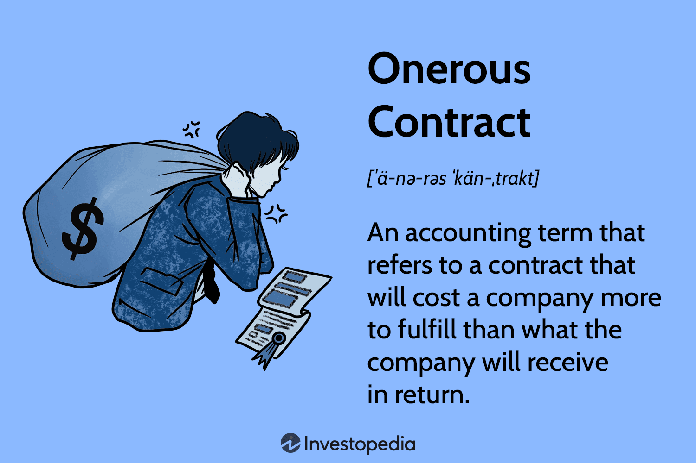

The financial landscape is a multifaceted and dynamic domain characterized by diverse strategies and practices that guide actions and decision-making processes. In an era where global markets are intricately connected and continuously subject to fluctuations, maintaining an understanding of the foundational components of finance is essential. This article focuses on several key elements that are critical in grasping the breadth of modern financial and accounting practices: accounting rules, financial examples, onerous contracts, and algorithmic trading. 

Accounting rules serve as the backbone of financial reporting, providing the guidelines and standards necessary for the recording and communication of financial transactions. These rules ensure that financial information is consistent, reliable, and transparent, enabling stakeholders to make informed decisions. In a globalized economy, understanding the nuances of these accounting standards, such as Generally Accepted Accounting Principles (GAAP) and International Financial Reporting Standards (IFRS), becomes increasingly pertinent.



Onerous contracts, on the other hand, represent a significant financial challenge wherein the cost of fulfilling a financial agreement exceeds the benefits gained. Recognized as liabilities on financial statements, they underscore the importance of meticulous financial scrutiny and risk management.

Additionally, algorithmic trading, commonly referred to as algo trading, exemplifies the intersection of finance and technology, leveraging computer algorithms to execute trades with speed and precision. The integration of technological advancements into financial practices has not only optimized trading strategies but also transformed the landscape of financial decision-making.

In exploring these components, this article aims to illuminate the interactions between these elements, examine their implications, and highlight their significance within the financial world, fostering a comprehensive understanding of the evolving financial ecosystem.

## Table of Contents

## Understanding Accounting Rules and Their Importance

Accounting rules form the backbone of financial reporting, establishing the framework that dictates how financial transactions should be recorded and reported. These rules are essential for ensuring that financial statements are consistent, reliable, and transparent, allowing stakeholders such as investors, regulators, and management to make informed decisions.

Two predominant sets of accounting standards underpin financial reporting worldwide: the Generally Accepted Accounting Principles (GAAP) and the International Financial Reporting Standards (IFRS).

### Generally Accepted Accounting Principles (GAAP)

GAAP is the standard framework of guidelines for financial accounting used primarily in the United States. Established by the Financial Accounting Standards Board (FASB), GAAP encompasses a set of rules and practices that companies must follow when compiling their financial statements. This set of principles includes the recognition, measurement, presentation, and disclosure aspects of financial reporting. Key features of GAAP include:

- **Consistency**: Provides a uniform way of handling accounting tasks, which helps compare financial reports over periods and across entities.
- **Relevance**: Ensures that the information provided in financial statements is pertinent to the decision-making needs of users.
- **Reliability**: Guarantees that the information is accurate and capable of being validated.
- **Comparability**: Facilitates comparisons between different financial periods or entities, enhancing the decision-making process for investors and analysts.

### International Financial Reporting Standards (IFRS)

IFRS is designed as a common global language for business affairs, hence ensuring that company accounts are understandable and comparable across international boundaries. These standards are issued by the International Accounting Standards Board (IASB), and they are being adopted by companies in over 140 jurisdictions. IFRS aims to bring consistency, transparency, and efficiency to financial markets across the globe, enabling investors and other market participants to make informed economic decisions.

Key distinctions of IFRS include:

- **Principle-based approach**: Unlike the rules-based approach of GAAP, IFRS adopts a principles-based methodology, allowing more flexibility in certain situations but also requiring higher judgment.
- **Fair value measurement**: IFRS often utilizes fair value accounting for measuring and reporting the value of assets and liabilities, reflecting their current market conditions rather than historical costs.
- **Global comparability**: Simplifies the cross-border activities of international companies, reducing costs for preparing multiple sets of financial reports under different national standards.

### Impact on Global Financial Practices

The application of GAAP and IFRS significantly impacts global financial practices by enhancing the quality and comparability of financial information. This, in turn, facilitates cross-border mergers and acquisitions, foreign investments, and global market integration. The convergence of GAAP and IFRS continues to be a work in progress, with discussions and collaborative efforts by standard-setting boards to harmonize these two frameworks further.

The harmonization aims to minimize the differences between GAAP and IFRS, streamlining financial reporting for multinational corporations and reducing the complexity faced by analysts and investors in interpreting reports from different jurisdictions. However, challenges remain, such as differing views on specific standards, national interests, and the adaptability of smaller entities.

In summary, accounting rules such as GAAP and IFRS play a crucial role in molding the financial landscape, ensuring that financial statements are a reliable source of information for decision-making, and promoting consistency and transparency in global financial dealings.

## Onerous Contracts: Definition and Financial Implications

An onerous contract is a financial agreement wherein the costs required to fulfill the obligations exceed the expected economic benefits. This situation alters the perception of such contracts from assets to liabilities, impacting financial statements significantly. Under International Financial Reporting Standards (IFRS), an onerous contract is recognized as a liability and necessitates the identification and recording of the contract's burdensome nature. The treatment involves measuring the present obligation under the contract, which is typically quantified as the lower cost of fulfilling the contract obligations or the penalty for not fulfilling them.

Under IFRS 37, Provisions, Contingent Liabilities, and Contingent Assets, companies must identify if a contract has become onerous. This means that a charge is made to the income statement as soon as an onerous contract is identified. The measurement of the liability is based on the best estimate of the cost of fulfilling the contract. If it is more economical to [exit](/wiki/exit-strategy) the contract than to fulfill it, then the cost associated with exiting is measured and reported. 

Conversely, under U.S. Generally Accepted Accounting Principles (GAAP), onerous contracts do not have a distinct definition or treatment. Instead, similar concepts may be addressed under other provisions like the guidance for loss contracts, which can involve recognizing a provision for expected losses specifically in sectors like construction services using percentage-of-completion accounting methodologies. Comparatively, this results in divergence between IFRS and U.S. GAAP in handling such liabilities.

Understanding the implications of onerous contracts is crucial for accurate financial reporting. Businesses need to proactively manage such contracts, as they can result in substantial financial liabilities if market conditions unfavorably shift. These liabilities alter perceived profitability and financial stability, impacting stakeholder decision-making. As a strategy for risk management, companies frequently review their contractual obligations to identify potential onerous contracts early. It's essential for financial managers to keep abreast of evolving standards and market conditions to expertly navigate these challenges, ensuring resilient financial operations.

## Examples of Onerous Contracts in Real-World Scenarios

Onerous contracts occur across various industries when shifts in market conditions render agreements more costly to uphold than the benefits they yield. This phenomenon poses significant challenges for businesses, compelling them to re-evaluate their strategic positions and financial reporting. 

In the real estate sector, onerous contracts have surfaced when property developers or landlords commit to long-term leases at fixed rates, yet face declining rental markets or increased maintenance costs. For example, during economic downturns, the reduced property values and rental income can turn once-profitable lease agreements into burdens. As market conditions fluctuate, agreements that once seemed advantageous can quickly become financial liabilities. Companies are often compelled to reassess these contracts’ valuations, affecting their balance sheets and income statements as stipulated under accounting standards like IFRS 16 for leases.

Similarly, the logistics industry frequently encounters onerous contracts, notably when fuel prices surge or regulatory changes inflate the costs of shipping and delivery services. A logistics firm might enter into a fixed-rate delivery contract, expecting stable fuel costs. However, sudden spikes in fuel prices or new environmental regulations demanding costly compliance measures can transform these contracts into onerous commitments. To mitigate such situations, companies are inclined to renegotiate terms, seek financial hedges, or diversify operational routes to buffer against cost fluctuations.

Managing onerous contracts involves both immediate and long-term strategies. In the short term, firms may renegotiate contract terms, seek cancellation clauses, or engage in buyout discussions where feasible. They may also implement cost-cutting measures in other operations to offset the incurred losses. Over the long term, companies focus on more flexible contract structuring that accounts for potential market [volatility](/wiki/volatility-trading-strategies), integrating clauses that allow adjustments based on indices or specific economic indicators. Additionally, rigorous forecasting and risk management practices become integral to prevent future occurrences. 

By adapting financial strategies and leveraging accounting standards effectively, companies aim to navigate the complexities of onerous contracts, ultimately striving to maintain financial stability and strategic agility amidst shifting economic landscapes.

## Algo Trading: The Intersection of Finance and Technology

Algorithmic trading, commonly referred to as algo trading, entails the use of computer algorithms to automate trading activities. This practice leverages high-speed and high-[volume](/wiki/volume-trading-strategy) transactions, capitalizing on the computational power of modern technology to make trades at speeds and frequencies that surpass human capabilities. The core of algo trading lies in its ability to analyze vast arrays of market data, identify trading opportunities based on predefined criteria, and execute orders efficiently.

**Understanding Algorithms in Trading:**

At the heart of algo trading are sophisticated algorithms. These algorithms are designed to process real-time financial data, evaluate market conditions, and determine optimal trading strategies. They employ various mathematical models and statistical techniques to forecast price movements and assess risk levels. This predictive capability enables traders to enter or exit positions swiftly, minimizing the risk associated with human error and emotion-driven decisions.

For instance, some algorithms utilize moving averages as signals for trading actions. The formula for a simple moving average (SMA) over a period $n$ is:

$$
\text{SMA} = \frac{P_1 + P_2 + \cdots + P_n}{n}
$$

where $P$ represents the price of an asset at a specific time. By monitoring the SMA, algorithms can automatically trigger buy or sell orders when the price crosses certain thresholds.

**Integration with Accounting Practices:**

Algo trading significantly integrates with current accounting practices, primarily through the need for accurate and timely financial data. Accounting systems provide vital input for trading algorithms, such as real-time profit and loss (P&L) statements, tax implications, and compliance with financial regulations. The precision of algorithms in handling data aligns closely with the meticulous nature of accounting, ensuring transparency and accountability in financial reporting.

Algorithmic trading also has the potential to transform financial strategies. By utilizing investment algorithms, firms can optimize their portfolios, considering factors like asset allocation and diversification, to enhance returns and manage risk effectively. The data-driven insights generated by algorithmic models facilitate more informed decision-making, enabling businesses to refine their financial strategies continuously.

Moreover, as financial markets evolve, the synergy between accounting and algo trading is expected to deepen. Advanced algorithms may incorporate real-time accounting data into trading decisions, adjusting strategies based on the latest financial information. This tightening integration paves the way for more dynamic financial management and could redefine the methodologies underlying both trading and accounting practices.

In conclusion, [algorithmic trading](/wiki/algorithmic-trading) stands at the convergence of finance and technology, reshaping how trades are executed and financial decisions are made. By marrying the computational power of algorithms with robust accounting frameworks, organizations can leverage these systems to gain competitive edges in the fast-paced world of financial markets.

## The Synergy Between Accounting and Algorithmic Trading

The integration of accounting rules and algorithmic trading represents a profound shift in financial decision-making processes. At the core of this synergy is the utilization of precise and reliable data, which is the cornerstone of effective algorithmic trading. Accounting records, governed by standards such as Generally Accepted Accounting Principles (GAAP) and International Financial Reporting Standards (IFRS), ensure that financial data is both accurate and consistent. These records provide the historical data and metrics necessary to develop algorithms that can predict market trends, optimize trading strategies, and manage risks effectively.

The data requirements for algorithmic trading are extensive, often involving high-frequency data points across multiple financial indicators. These include, but are not limited to, revenue figures, profit margins, asset turnover ratios, and historical price data. Accurate accounting records supply these data points, enabling algorithms to discern patterns and anomalies that might be indicative of future market movements. This precision in data gathering and analysis helps minimize risks and enhances the decision-making process.

Furthermore, algorithmic trading platforms rely heavily on real-time data to make instantaneous decisions. The integration of these platforms with accounting systems can facilitate more dynamic risk assessments and financial forecasting. Enhanced data integrity through detailed accounting records reduces discrepancies, leading to more reliable algorithmic outputs. For example, a Python-based algorithm might use accounting data to adjust trading strategies dynamically based on an entity's [liquidity](/wiki/liquidity-risk-premium) ratios or debt levels.

```python
# Example of a simple Python algorithm using accounting data for trading decisions

def evaluate_trading_strategy(accounting_data):
    liquidity_ratio = accounting_data['current_assets'] / accounting_data['current_liabilities']
    debt_to_equity_ratio = accounting_data['total_liabilities'] / accounting_data['shareholders_equity']

    if liquidity_ratio > 1.5 and debt_to_equity_ratio < 0.5:
        return "Buy"
    else:
        return "Sell"

accounting_data_example = {
    'current_assets': 150000,
    'current_liabilities': 90000,
    'total_liabilities': 300000,
    'shareholders_equity': 800000
}

decision = evaluate_trading_strategy(accounting_data_example)
print(decision)
```

Potential future developments in this domain may see a deeper integration of digital trading technologies with accounting practices. As blockchain technology and [artificial intelligence](/wiki/ai-artificial-intelligence) continue to evolve, they can further enhance the accuracy and speed of data transactions between accounting systems and trading platforms. Blockchain, by ensuring immutable and transparent records, coupled with real-time AI analytics, could facilitate more robust and secure financial reporting frameworks. This, in turn, can support more advanced algorithmic trading strategies that adjust and execute trades with minimal human intervention.

In conclusion, the convergence of accounting rules and algorithmic trading leverages rigorous financial data for improved strategic outcomes. As technology progresses, accounting practices are poised to become increasingly digitized, offering unprecedented opportunities for innovation in financial markets and trading systems.

## Conclusion

The intertwined nature of accounting rules, onerous contracts, financial examples, and algorithmic trading reflects the complexity and dynamism of modern financial systems. Accounting rules, such as GAAP and IFRS, serve as the backbone for ensuring transparent and consistent financial reporting, which is essential for sustainable decision-making. These frameworks facilitate the identification and management of onerous contracts, recognizing them as liabilities that affect financial health and necessitate strategic management to mitigate adverse impacts. 

Algorithmic trading represents a sophisticated blend of finance and technology, automating and optimizing trading activities by analyzing vast datasets with speed and precision. Proper accounting practices ensure that the data feeding these algorithms is accurate, thereby enhancing the effectiveness and reliability of algorithmic trading strategies. This synergy underscores the importance of maintaining rigorous accounting standards to support technological advancements in trading.

The necessity of adopting integrated approaches is apparent in the need to harmonize these elements for improved financial stability and optimization. By combining robust accounting principles with the technological prowess of algorithmic trading, organizations can better manage risks and capitalize on opportunities. Accounting ensures data integrity while algorithmic trading provides the tools for rapid and optimal decision-making, together forming a resilient financial strategy.

Looking ahead, emerging trends such as the integration of artificial intelligence and blockchain in accounting and trading are poised to further revolutionize these practices. Artificial intelligence can enhance predictive analytics, allowing for more informed decision-making. Meanwhile, blockchain technology promises greater transparency and security in transaction recording and reporting. These advancements hold the potential to refine the synergy between accounting practices and trading technologies, driving efficiency and innovation in financial management. Embracing these developments will be crucial for organizations striving to remain competitive and resilient in an ever-evolving financial landscape.

## References & Further Reading

[1]: FASB. (n.d.). ["Generally Accepted Accounting Principles (GAAP)."](https://fasb.org/standards)

[2]: IFRS Foundation. (n.d.). ["International Financial Reporting Standards (IFRS)."](https://www.ifrs.org/sustainability/knowledge-hub/introduction-to-the-ifrs-foundation/)

[3]: Kaplan, R. S., & Atkinson, A. A. (1998). ["Advanced Management Accounting"](https://archive.org/details/advancedmanageme0000kapl_u5x7) (3rd ed.). Pearson Education.

[4]: Hull, J. C. (2015). ["Risk Management and Financial Institutions"](https://books.google.com/books/about/Risk_Management_and_Financial_Institutio.html?id=1J1QDwAAQBAJ) (4th ed.). John Wiley & Sons.

[5]: Chan, E. P. (2017). ["Algorithmic Trading: Winning Strategies and Their Rationale"](https://github.com/ftvision/quant_trading_echan_book) (2nd ed.). Wiley Trading.