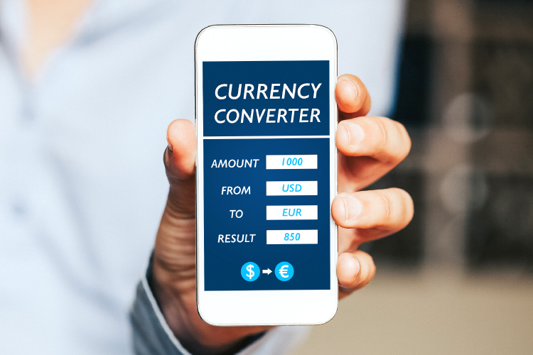

The emergence of online platforms has fundamentally transformed the landscape of financial markets, particularly in currency exchange and trading. Online systems have simplified access to financial markets, enabling individuals from various backgrounds and expertise levels to participate. These platforms are pivotal in currency exchange, online trading, digital currencies, and algorithmic trading.

Currency exchange traditionally involved physical transactions and banking institutions, but the advent of online platforms has changed this paradigm. Online exchanges offer seamless processes for trading one currency for another, enhancing transparency, reducing costs, and improving security when compared to their traditional counterparts. The decentralized nature of these platforms minimizes intermediaries, ultimately benefiting both novice and professional traders.



The rise of digital currencies, particularly cryptocurrencies like Bitcoin and Ethereum, has added another layer to currency exchange. Digital currency exchanges provide an environment for trading these cryptocurrencies for fiat money or other digital assets, capitalizing on the growing acceptance and investment interest in digital currencies. This shift towards digital transactions reflects the increasing reliance on technology within financial markets.

Another key development is algorithmic trading, where computer algorithms are programmed to execute trades at high speeds and accuracy. This advancement in technology reduces the potential for human error, optimizes trading strategies, and captures market opportunities efficiently. Algorithmic trading is a cornerstone of high-frequency trading, where thousands of trades can be executed in seconds, highlighting the potential for advanced technology to reshape trading activities.

These components have collectively revolutionized trading, offering unprecedented accessibility and efficiency. By leveraging online exchanges, digital currencies, and advanced trading algorithms, traders can navigate and capitalize on the complexities of modern financial markets. These developments underscore an ongoing digital transformation, fostering a more inclusive environment for trading and expanding opportunities for both emerging and seasoned traders.

## Table of Contents

## Understanding Online Currency Exchange

An online currency exchange serves as a centralized platform where participants can trade one currency for another, fundamentally transforming the way currencies are exchanged compared to traditional methods. These platforms enhance the transparency and efficiency of currency trading processes by providing real-time data and facilitating direct interactions among market participants. This transparency means traders can access current exchange rates and execute transactions without intermediaries, reducing misinformation and potential manipulation, which were more prevalent in older systems reliant on third-party brokers.

In terms of cost, online currency exchanges often present lower transaction fees than conventional exchanges. By cutting down on intermediaries and automating transaction processes, these platforms significantly reduce overhead costs. As a result, both individual and institutional traders benefit financially from lower fees, which in turn can enhance overall market [liquidity](/wiki/liquidity-risk-premium) and competition.

Security is another critical advantage of online currency exchanges. With advancements in digital encryption and cybersecurity measures, these platforms have developed robust systems to protect user data and funds. Many online exchanges employ two-[factor](/wiki/factor-investing) authentication, encryption protocols, and cold storage methods to safeguard assets against cyber threats, thereby building trust among users.

These exchanges typically operate through platforms provided by [forex](/wiki/forex-system) brokers. Forex brokers act as intermediaries that connect traders to the larger foreign exchange market, providing necessary tools and platforms for trading. By offering online platforms, forex brokers have made it more accessible for individuals to engage in currency trading. Users can execute trades, access analytical tools, and use educational resources to improve their trading skills all from a single platform. This accessibility has democratized currency trading, allowing people from diverse backgrounds and with varying levels of experience to participate in the forex market.

Overall, the transition to online currency exchanges marks a significant progression in how global currency trading is conducted, offering more transparency, efficiency, security, and cost-effectiveness than traditional methods. This development has broadened access to the forex market, attracting a wider audience and assisting both novice and professional traders in capitalizing on the benefits of digital trading platforms.

## The Role of Digital Currency Exchanges

Digital currency exchanges have become integral to the [cryptocurrency](/wiki/cryptocurrency) ecosystem, facilitating the trade of digital assets and enhancing their accessibility to a broader audience. These platforms allow users to trade cryptocurrencies such as Bitcoin and Ethereum against fiat currencies like the US dollar or other digital currencies. The rise in popularity of digital currencies has propelled these exchanges to the forefront of financial innovation.

Digital currency platforms operate on blockchain technology, which is inherently decentralized. This decentralization enhances the resilience and security of transactions, reducing the likelihood of a single point of failure common in centralized systems. Consequently, exchanges are often less susceptible to hacking and fraud, providing users with an increased level of trust and security.

Despite these advantages, the decentralized nature of digital currency exchanges introduces several regulatory challenges. Unlike traditional exchanges operating under stringent regulatory frameworks, digital exchanges often navigate unclear or evolving legal landscapes. This ambiguity can lead to potential risks for investors, including [volatility](/wiki/volatility-trading-strategies) in regulatory policies, potential tax implications, and the risk of trading on unregulated platforms that might not offer sufficient investor protection.

Furthermore, digital currency exchanges must contend with issues such as market manipulation and anti-money laundering (AML) requirements. While blockchain technology ensures transparency, the pseudonymous nature of cryptocurrencies means additional measures must be implemented to comply with regulatory standards and ensure market integrity.

In conclusion, digital currency exchanges are pivotal in bridging the gap between traditional currencies and cryptocurrencies. Their decentralized structure offers enhanced security and resilience, but also necessitates careful navigation of regulatory landscapes to protect investors and ensure market stability. As cryptocurrencies continue to gain mainstream acceptance, the evolution of these exchanges will play a crucial role in shaping the future of digital finance.

 to Algorithmic Trading

Algorithmic trading represents a modern approach to executing trades within financial markets using advanced computer algorithms. These algorithms analyze market data and make trading decisions, automatically executing trade orders with optimal speed and precision. One of the primary advantages of [algorithmic trading](/wiki/algorithmic-trading) is its ability to minimize human error. Unlike manual trading, which is susceptible to emotional decision-making and oversight, algorithms operate based on data, predefined criteria, and mathematical models, ensuring consistency and efficiency.

Algorithmic trading capitalizes on market opportunities by analyzing real-time data and identifying favorable trading conditions that might be missed by human traders. For instance, algorithms can monitor price movements, trading volumes, and market trends across multiple markets simultaneously, allowing them to exploit even the smallest price discrepancies or [arbitrage](/wiki/arbitrage) opportunities. This capability is particularly valuable in volatile markets, where rapid price shifts can present profitable opportunities for those able to act swiftly.

Moreover, algorithmic trading optimizes trading strategies by testing and refining them using historical data. Through [backtesting](/wiki/backtesting), traders can evaluate the potential effectiveness of their strategies in different market conditions, enhancing their robustness and reliability. This process also allows traders to continuously improve their algorithms by incorporating [machine learning](/wiki/machine-learning) techniques that adapt to changing market dynamics.

High-frequency trading ([HFT](/wiki/high-frequency-trading-strategies)), a subset of algorithmic trading, takes this approach to an extreme by executing a vast number of orders in fractions of a second. HFT relies on cutting-edge technology and sophisticated algorithms to achieve extremely low latency—crucial for gaining an edge in modern markets. The ability to execute thousands of orders per second enables HFT firms to quickly respond to market signals, capturing tiny price movements that accumulate into significant profits over time.

Here's an example of a simple algorithmic trading strategy implemented in Python:

```python
import numpy as np
import pandas as pd

# Generate synthetic price data
np.random.seed(42)  # For reproducibility
price_data = np.random.normal(loc=100, scale=1, size=1000)  # Simulated price data

# Calculate moving averages
short_window = 20
long_window = 50
short_mavg = pd.Series(price_data).rolling(window=short_window).mean()
long_mavg = pd.Series(price_data).rolling(window=long_window).mean()

# Generate trading signals
signals = short_mavg - long_mavg
buy_signals = signals > 0
sell_signals = signals < 0

# Backtest strategy
initial_capital = 10000
positions = np.where(buy_signals, 1, np.where(sell_signals, -1, 0))
portfolio_returns = np.cumsum(positions * np.diff(price_data, prepend=price_data[0]))
final_portfolio_value = initial_capital + portfolio_returns[-1]

print(f"Final Portfolio Value: ${final_portfolio_value:.2f}")
```

In this example, a basic moving average crossover strategy is used to generate buy and sell signals based on short and long-term moving averages of simulated price data. This type of strategy is fundamental in algorithmic trading and illustrates how algorithms can systematically identify trading conditions.

Overall, algorithmic trading is a transformative force in financial markets, optimizing execution, reducing costs, and unlocking new opportunities for profit. Its continued evolution promises to further enhance the efficacy and accessibility of trading activities for both institutional and retail traders.

## Algorithmic Trading in Currency Markets

Algorithmic trading has brought about significant transformations in the forex market, providing heightened efficiency and reducing transactional costs. Through sophisticated algorithms, currency prices on electronic platforms are updated swiftly, allowing for real-time trading activities that require minimal manual intervention. This automation not only streamlines processes but also enables traders and financial institutions to operate more effectively by reallocating resources and focusing on strategic decision-making rather than routine tasks.

The utilization of algorithms in forex markets facilitates risk management by enabling traders to execute hedging strategies. For instance, if a trader anticipates a potential adverse movement in currency pair prices, algorithmic trading systems can automatically execute trades that offset potential losses, thereby minimizing risk exposure. This capability to hedge efficiently is crucial in forex markets, which are known for their volatility and rapid price fluctuations.

In addition to risk management, algorithmic trading platforms provide avenues for traders to exploit arbitrage opportunities. Arbitrage involves taking advantage of price discrepancies of the same currency pair across different markets or exchanges. Algorithms, with their capacity to process data and execute trades at incredible speeds, can capitalize on these discrepancies, yielding profits with minimal risk. An example of an algorithmic strategy used for arbitrage is triangular arbitrage, which involves three different currency pairs and ensures no risk and net zero investment, all while making a profit from pricing inefficiencies.

```python
# Example of a simple triangular arbitrage strategy
def triangular_arbitrage(exchange_rate1, exchange_rate2, exchange_rate3, investment):
    # Assume initial investment in currency A
    currency_a = investment

    # Exchange A to B
    currency_b = currency_a * exchange_rate1

    # Exchange B to C
    currency_c = currency_b * exchange_rate2

    # Exchange C back to A
    currency_a_final = currency_c * exchange_rate3

    # Calculate arbitrage profit
    profit = currency_a_final - investment
    return profit

# Sample exchange rates
exchange_rate_ab = 1.2 # A to B
exchange_rate_bc = 0.9 # B to C
exchange_rate_ca = 1.15 # C back to A

# Initial investment in currency A
investment_amount = 1000

# Calculate the profit from triangular arbitrage
profit = triangular_arbitrage(exchange_rate_ab, exchange_rate_bc, exchange_rate_ca, investment_amount)
print(f"Arbitrage Profit: {profit}")
```

Overall, algorithmic trading has optimized the manner in which forex markets operate by facilitating rapid updates of currency prices, efficient risk management, and the exploitation of arbitrage opportunities. This technological leap has minimized superfluous manual efforts and enhanced the ability of traders to make calculated and timely decisions, thus reshaping the forex landscape.

## Challenges and Risks of Algorithmic Trading

Algorithmic trading, while offering increased speed and efficiency, presents several challenges and risks in financial markets. One primary concern is market fragmentation, which occurs when the same stocks or currencies are traded on multiple exchanges. This [dispersion](/wiki/dispersion-trading) can lead to discrepancies in pricing and liquidity. Liquidity shortages, particularly in times of market stress, can result in significant price swings. 

Algorithms that drive high-frequency trading often operate on assumptions derived from historical data and statistical models. However, these models may not account for unforeseen market shifts, leading to increased volatility. For instance, during sudden market events, algorithms might amplify fluctuations by executing numerous trades in a short timeframe. This phenomenon was illustrated during the 2010 Flash Crash when rapid, automated trades led to a temporary market collapse [1].

Adjusting algorithmic strategies to unpredictable market changes is complex. Algorithms rely on pre-defined parameters and can struggle when conditions deviate from expected patterns. As a result, they may execute trades that are not optimal, further exacerbating volatility.

To address these risks, market participants must implement robust fail-safe mechanisms. These may include circuit breakers, which pause trading temporarily when large price movements occur, thus allowing human intervention. Additionally, strategies such as redundancy through diversified trading algorithms can help mitigate risk. Programmers can also incorporate anomaly detection systems that alert traders to unexpected market conditions, triggering manual review or algorithm adjustment.

In conclusion, while algorithmic trading enhances market efficiency, it also introduces significant risks that require careful management. Advanced risk mitigation strategies are essential to safeguard against potential chaos in increasingly automated trading environments.

[1] Kirilenko, A., Kyle, A. S., Samadi, M., & Tuzun, T. (2017). The Flash Crash: High-Frequency Trading in an Electronic Market. The Journal of Finance, 72(3), 967-998.

## The Future of Trading Platforms

The integration of online currency exchanges with algorithmic trading platforms is transforming trading activities by emphasizing automation and improving accessibility. Modern trading platforms are continually evolving with technological advances, leading to the development of more sophisticated tools and strategies. These enhancements cater to a wide array of trader needs, from novice market entrants to seasoned professionals.

As technology progresses, certain key advancements are poised to shape the future of trading platforms significantly. Artificial intelligence (AI) and machine learning (ML), for example, are being increasingly employed to create predictive models that can analyze vast datasets and identify trading opportunities with high precision. Such technologies allow traders to anticipate market trends and make informed trading decisions. The deployment of AI in trading algorithms enhances their ability to process information adaptively, learning from historical data to improve decision-making capabilities.

Moreover, blockchain technology is also entering the trading domain, promising heightened security and transparency. As blockchain ensures that trades are immutable and publicly verifiable, it builds trust and reduces transactional friction. This is particularly relevant in digital currency exchanges, where the integrity of transactions is paramount.

Despite these technological advancements, there is a critical necessity for regulatory frameworks to evolve concurrently. As trading platforms integrate more complex technologies, regulators must ensure that adequate measures are in place to maintain market stability and protect investors. The rapid pace of innovation poses unique challenges for regulation, requiring a delicate balance between fostering innovation and preventing systemic risks.

Regulators are also tasked with addressing concerns around data privacy and cybersecurity. With trading platforms increasingly relying on vast amounts of personal and transactional data, robust safeguards must be implemented to protect against breaches and misuse. Failure to address these regulatory and security concerns could undermine trust in digital trading platforms.

In conclusion, the future of trading platforms is set to be heavily influenced by technological advancements and regulatory developments. Traders and institutions must remain agile, embracing new tools and strategies while navigating a landscape of evolving rules and regulations. By doing so, they can effectively capitalize on the opportunities that this dynamic environment presents.

## Conclusion

The digital transformation of trading platforms marks a significant shift in currency trading, catalyzed by the rise of online exchanges, digital currencies, and algorithmic trading methods. By leveraging these modern tools, traders can gain access to a range of new opportunities that were previously inaccessible. Online exchanges have democratized currency trading, allowing individuals and institutions to participate in a global market with greater transparency and lower costs than traditional methods. The advent of digital currencies like Bitcoin and Ethereum adds another layer of accessibility, enabling trading beyond the constraints of conventional fiat currencies.

Algorithmic trading platforms further enhance this transformation by enabling high-speed, accurate trade execution. These systems reduce human error and allow traders to capitalize on fleeting market opportunities, thereby optimizing their strategies in real-time. Despite the clear advantages, these innovations also present challenges. The complexity of algorithmic systems and digital currencies necessitates a comprehensive understanding and a cautious approach to mitigate risks such as market volatility and regulatory uncertainties.

To effectively navigate this dynamic landscape, traders must remain informed and adaptable. Keeping abreast of technological advancements and regulatory developments is crucial for maintaining a competitive edge. Ultimately, the evolution of trading platforms offers a fruitful horizon for those willing to embrace change and innovation in the currency trading arena.

## References & Further Reading

[1]: Kirilenko, A., Kyle, A. S., Samadi, M., & Tuzun, T. (2017). ["The Flash Crash: High-Frequency Trading in an Electronic Market."](https://www.jstor.org/stable/26652722) The Journal of Finance, 72(3), 967-998.

[2]: Narang, R. K. (2013). ["Inside the Black Box: A Simple Guide to Quantitative and High-Frequency Trading."](https://onlinelibrary.wiley.com/doi/book/10.1002/9781118662717) Wiley Finance.

[3]: Derman, E. (2016). ["Models Behaving Badly: Why Confusing Illusion with Reality Can Lead to Disasters, on Wall Street and in Life."](https://www.amazon.com/Models-Behaving-Badly-Confusing-Illusion-Reality-Disaster/dp/1439164983) Free Press.

[4]: Lewis, M. (2015). ["Flash Boys: A Wall Street Revolt."](https://en.wikipedia.org/wiki/Flash_Boys) W.W. Norton & Company.

[5]: Hull, J. C. (2017). ["Options, Futures, and Other Derivatives."](https://www.semanticscholar.org/paper/Options%2C-Futures%2C-and-Other-Derivatives-Hull/89bdee500c8623864fc9eb7a471546aa713acc44) Pearson.

[6]: Vigna, P., & Casey, M. J. (2016). ["The Age of Cryptocurrency: How Bitcoin and the Blockchain Are Challenging the Global Economic Order."](https://dl.acm.org/doi/10.5555/2717097) St. Martin's Press.

[7]: Wilmott, P. (2006). ["Paul Wilmott Introduces Quantitative Finance."](https://www.amazon.com/Paul-Wilmott-Introduces-Quantitative-Finance/dp/0470319585) Wiley.