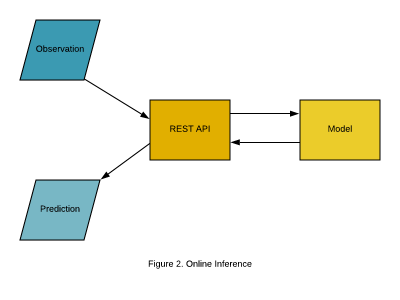

## Table of Contents

## What is online inference in machine learning?

Online inference in machine learning refers to the process of using a trained machine learning model to make predictions on new data in real-time. Imagine you have a model that predicts whether an email is spam or not. Once the model is trained, online inference is what happens when you use this model to classify new emails as they arrive. This is different from batch inference, where you process a large set of data all at once. Online inference is crucial for applications that require immediate responses, like fraud detection in credit card transactions or real-time recommendations on a streaming service.

The process of online inference involves feeding new data into the model and getting a prediction almost instantly. For example, if you have a model that predicts house prices based on features like size and location, you can input the details of a new house and get an estimated price right away. This real-time aspect is what makes online inference powerful and necessary for many modern applications. It allows systems to adapt and respond quickly to new information, making it an essential part of dynamic and interactive environments.

## How does online inference differ from batch inference?

Online inference and batch inference are two different ways to use a machine learning model to make predictions. Online inference is when you use the model to make predictions one at a time, as soon as new data comes in. This is useful for things like predicting if a new email is spam or not, or deciding if a credit card transaction might be fraudulent. The model gives you an answer right away, so it's perfect for situations where you need quick decisions.

Batch inference, on the other hand, is when you collect a bunch of data and then process it all at once. Instead of making predictions one by one, you wait until you have a lot of data and then run it through the model in one go. This is good for things like generating monthly reports or analyzing a large dataset of customer behavior over time. Batch inference can be more efficient for big data because you can use powerful computers to process everything at once, but it's not as fast as online inference for real-time needs.

## What are the benefits of using online inference in real-time applications?

Using online inference in real-time applications offers the big advantage of making quick decisions. Imagine you're using a [machine learning](/wiki/machine-learning) model to check if a credit card transaction is safe. With online inference, the model can look at the transaction details right away and tell you if it thinks it's fraud or not. This fast response time is really important for things like online shopping or banking, where you need to know if something is safe before you go ahead with it.

Another benefit is that online inference can help systems adapt to new information on the fly. Let's say you're using a model to suggest what movie to watch next on a streaming service. As you watch more movies, the model can use online inference to update its suggestions in real time. This makes the recommendations more accurate and personalized, which can make the experience better for users. So, online inference helps keep things up-to-date and relevant, which is great for any app that needs to stay current with what users are doing.

## What are the challenges associated with online inference?

One of the main challenges with online inference is the need for fast processing. When you use online inference, you want the model to give you an answer right away. This means the computer has to work quickly, which can be hard if the model is big or if there's a lot of data to look at. If the model takes too long to process the new data, it might not be useful for real-time applications like fraud detection or live recommendations.

Another challenge is keeping the model up to date. When you use online inference, the world around the model keeps changing. New patterns in data might appear, and the model needs to learn from these new patterns to stay accurate. This is called model drift, and it can be tough to manage. You might need to retrain the model or update it while it's still being used, which can be tricky to do without causing problems.

Lastly, online inference can be sensitive to the quality of the incoming data. If the data coming in is messy or incomplete, the model might make bad predictions. For example, if a credit card transaction comes in with missing information, the model might not be able to decide if it's fraud or not. This means you need good ways to check and clean the data before it goes into the model, which adds more work to the process.

## How can model updates be managed during online inference?

Managing model updates during online inference can be tricky but important. One way to do this is through a technique called online learning. With online learning, the model keeps learning from new data as it comes in. This means the model can change a little bit each time it sees new information, helping it stay up to date without needing to stop and retrain completely. For example, if the model is used to predict stock prices, it can adjust its predictions as new stock data comes in, making it more accurate over time.

Another way to manage model updates is by using a shadow model approach. In this method, you have two models running at the same time: the main model that's doing the online inference and a shadow model that's being trained on new data. When the shadow model is ready, you can switch it with the main model without interrupting the online inference. This way, you can update the model without causing any downtime. It's like having a backup dancer ready to step in and keep the show going smoothly.

## What are some common algorithms used for online inference?

Some common algorithms for online inference include linear regression, logistic regression, and decision trees. Linear regression is often used for predicting numbers, like house prices or stock prices. It works by finding a line that best fits the data, and then uses that line to make predictions on new data. Logistic regression is great for making yes or no decisions, like whether an email is spam or not. It works by finding a way to separate the data into two groups and then deciding which group new data belongs to. Decision trees are like a series of questions that help the model make a decision. They're easy to understand and can be used for many types of predictions.

Another algorithm used for online inference is the k-nearest neighbors (k-NN) algorithm. This method looks at the new data and finds the most similar examples from the past to make a prediction. For example, if you want to predict what kind of movie someone might like, k-NN would look at the movies they've enjoyed before and find other movies that are similar to those. Neural networks can also be used for online inference, especially for more complex tasks like image or speech recognition. They work by passing data through layers of connected nodes, each of which processes the data a little bit before passing it on to the next layer. This allows neural networks to learn very detailed patterns in the data, making them powerful tools for online inference.

## How does online inference handle data drift and concept drift?

Online inference faces challenges like data drift and concept drift, which can make the model's predictions less accurate over time. Data drift happens when the data the model sees changes in a way that's different from what it was trained on. For example, if a model was trained to predict house prices using data from 2010, but now it's 2023 and the housing market has changed, the model might not work as well. To handle data drift, online inference can use techniques like online learning, where the model keeps learning from new data as it comes in. This helps the model adjust to changes in the data over time.

Concept drift is a bit different. It happens when the thing the model is trying to predict changes its behavior. For instance, if a model predicts whether an email is spam or not, and spammers start using new tricks, the model needs to learn these new patterns to stay accurate. Online inference can handle concept drift by continuously updating the model. One way to do this is by using a shadow model approach, where a new model is trained in the background and then swapped with the old model without interrupting the online inference. This way, the model can adapt to new concepts without losing performance.

## What infrastructure is required to support online inference at scale?

To support online inference at scale, you need strong computer systems that can handle a lot of work quickly. This usually means using powerful servers with lots of processing power and memory. These servers need to be set up in a way that they can work together smoothly, often using a system called a cloud. The cloud lets you use many computers at the same time, which helps with handling lots of data and making predictions fast. You also need good software to manage all these computers and make sure they're working well together. This software can help balance the work so no single computer gets too busy, and it can also help keep the system running smoothly even if one part breaks down.

Another important part of the infrastructure is how you store and move data. You need fast storage systems that can quickly get the data the model needs to make predictions. This might mean using special types of storage like SSDs, which are faster than regular hard drives. You also need a good way to move data around, often using networks that are fast and reliable. This helps make sure that the data gets to the model quickly so it can make predictions in real time. Finally, you need to think about how to keep everything safe and running well. This means having good security to protect your data and models, and having ways to check and fix problems if something goes wrong.

## How can the performance of online inference systems be monitored and optimized?

To keep an eye on how well online inference systems are doing, you need to watch things like how fast the system makes predictions, how accurate those predictions are, and how much of the computer's resources it's using. You can do this by setting up tools that track these things in real time. For example, you might use a dashboard that shows you the average time it takes to make a prediction, the error rate of the predictions, and how much memory or processing power the system is using. By keeping an eye on these metrics, you can spot problems early, like if the system starts getting slower or if the predictions start being less accurate. This helps you fix issues before they get too big.

To make online inference systems work better, you can try different things based on what you see in the monitoring. If the system is too slow, you might need to add more computers to share the work, or you might need to make the model smaller so it can work faster. If the predictions are not accurate enough, you might need to update the model more often or use better data to train it. Sometimes, you can also change how the system works, like by using a better way to send data around or by making the software that manages the computers more efficient. By trying these different ideas and watching how they affect the system's performance, you can keep making it better over time.

## What are the security considerations when deploying online inference models?

When you deploy online inference models, keeping them safe is really important. One big thing to watch out for is making sure that the data going into the model is safe. If someone can mess with the data, they could make the model give wrong answers on purpose. This is called data poisoning. Another thing to think about is keeping the model itself safe. If someone can get into the model and change it, they could make it do bad things. This is called model tampering. You also need to make sure that the predictions the model makes are kept private, especially if they have personal information in them. This means using good ways to keep data secure, like encryption, to stop people from stealing or changing the predictions.

Another part of keeping online inference models safe is making sure the computer systems they run on are secure. This means using strong passwords, keeping the software up to date, and watching for any strange activity that might mean someone is trying to break in. It's also important to have a plan for what to do if something goes wrong, like if the system gets hacked. This plan should include ways to fix the problem quickly and get the system back to working safely. By thinking about these security things from the start, you can help keep your online inference models safe and working well.

## How do you ensure the accuracy and reliability of predictions in an online inference setting?

To make sure the predictions from online inference are accurate and reliable, you need to keep the model up to date with the latest data. This means using techniques like online learning, where the model learns from new data as it comes in. This helps the model adjust to changes in the world, like new trends or behaviors. You also need to check the model's performance regularly. You can do this by comparing its predictions to what actually happens, and if the model starts making more mistakes, you know it's time to update it or retrain it with new data. This way, the model stays accurate and can give reliable predictions.

Another way to ensure accuracy and reliability is by making sure the data going into the model is good quality. If the data is messy or missing important information, the model's predictions won't be as good. You can use data cleaning and validation techniques to make sure the data is in good shape before it goes into the model. Also, having a backup plan, like using a shadow model that's being trained in the background, can help. If the main model starts to fail, you can switch to the shadow model without stopping the online inference. This keeps the system running smoothly and the predictions reliable.

## What advanced techniques can be applied to enhance the efficiency of online inference?

To make online inference more efficient, you can use a technique called model quantization. This means making the model smaller by using fewer bits to store its numbers. For example, instead of using 32 bits for each number, you might use only 8 bits. This makes the model take up less space and work faster, but it can still give good predictions. Another way to boost efficiency is by using model pruning. This is like trimming a tree to make it smaller. You remove parts of the model that don't help much with predictions, which makes the model faster and use less computer power.

You can also use something called knowledge distillation to make online inference more efficient. This is when you take a big, complicated model and use it to teach a smaller, simpler model. The smaller model learns to make predictions almost as well as the big one, but it's much faster and uses less memory. This is great for online inference because it lets you get quick, accurate predictions without needing a lot of computer power. By using these techniques, you can make your online inference system work better and handle more data in real time.

## References & Further Reading

[1]: Gama, J., Žliobaitė, I., Bifet, A., Pechenizkiy, M., & Bouchachia, A. (2014). ["A Survey on Concept Drift Adaptation."](https://dl.acm.org/doi/10.1145/2523813) Data Mining and Knowledge Discovery, 28(3), 645-685.

[2]: Widmer, G., & Kubat, M. (1996). ["Learning in the Presence of Concept Drift and Hidden Contexts."](https://link.springer.com/article/10.1007/BF00116900) Machine Learning, 23(1), 69-101.

[3]: Dean, J., & Ghemawat, S. (2008). ["MapReduce: Simplified Data Processing on Large Clusters."](https://dl.acm.org/doi/10.1145/1327452.1327492) Communications of the ACM, 51(1), 107-113.

[4]: Quinlan, J.R. (1986). ["Induction of Decision Trees."](https://link.springer.com/article/10.1007/BF00116251) Machine Learning, 1(1), 81-106.

[5]: Alpaydin, E. (2020). ["Introduction to Machine Learning"](https://mitpress.mit.edu/9780262043793/introduction-to-machine-learning/) (4th ed.). MIT Press.

[6]: Goodfellow, I., Bengio, Y., & Courville, A. (2016). ["Deep Learning."](https://www.deeplearningbook.org/) MIT Press.

[7]: LeCun, Y., Bengio, Y., & Hinton, G. (2015). ["Deep Learning."](https://www.nature.com/articles/nature14539) Nature, 521(7553), 436-444.

[8]: Hinton, G.E., Vinyals, O., & Dean, J. (2015). ["Distilling the Knowledge in a Neural Network."](https://arxiv.org/abs/1503.02531) ArXiv Preprint ArXiv:1503.02531.