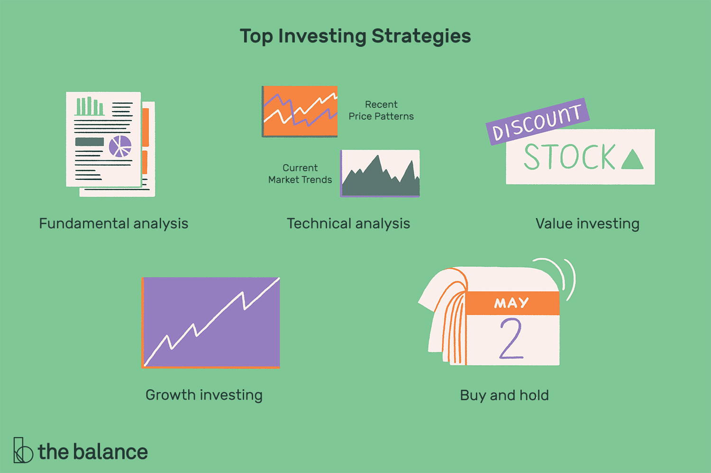

## Table of Contents

## What are the basic principles of online investing for beginners?

Online investing for beginners starts with understanding the basics of how it works. You need to pick a good online platform or brokerage where you can buy and sell stocks, bonds, or other investments. These platforms usually have tools and resources to help you learn. It's important to start with a clear plan. Decide how much money you can afford to invest and what your goals are. Are you saving for retirement, a house, or just looking to grow your money? Knowing this will guide your investment choices.

Once you have a plan, you should learn about different types of investments. Stocks are pieces of a company that you can buy. If the company does well, the value of the stock can go up. Bonds are like loans you give to a company or government, and they pay you back with interest. There are also funds, which are collections of stocks or bonds managed by professionals. It's wise to spread your money across different types of investments to reduce risk. This is called diversification. Remember, investing always has risks, so only invest money you can afford to lose.

As you start investing, keep an eye on your investments but don't check them every day. The stock market can go up and down a lot in the short term, but it tends to grow over the long term. It's a good idea to think long-term and not make quick decisions based on short-term changes. Also, keep learning. The more you know, the better decisions you can make. Online courses, books, and financial news can help you stay informed and improve your investing skills.

## How can a beginner start investing online with a small budget?

Starting to invest online with a small budget is easier than you might think. You can begin with as little as $100 or even less, depending on the platform you choose. Many online brokerages now offer low or no minimum deposit requirements, making it accessible for beginners. Look for platforms that have low fees, as these can eat into your small investment. Some popular choices include apps like Robinhood, which has no minimum balance and no commission fees, or platforms like E*TRADE and TD Ameritrade, which offer fractional shares. This means you can buy a piece of a stock instead of having to buy a whole share, which can be expensive.

Once you've chosen a platform, decide how you want to invest your money. For a small budget, consider starting with a robo-advisor, which automatically manages your investments for a low fee. These are good for beginners because they create a diversified portfolio for you based on your risk tolerance and goals. Another option is to invest in exchange-traded funds (ETFs), which are baskets of stocks that you can buy and sell like a single stock. ETFs often track an index, like the S&P 500, and they can be a cost-effective way to invest in a broad range of companies. Remember, the key is to start small, learn as you go, and gradually increase your investments as you become more comfortable and your budget allows.

## What are the different types of online investment platforms available?

There are several types of online investment platforms that cater to different needs and preferences. One common type is the traditional online brokerage, like E*TRADE or Charles Schwab. These platforms let you buy and sell stocks, bonds, ETFs, and mutual funds. They often have tools and research to help you make decisions. Another type is the discount brokerage, like Robinhood or Webull, which usually have lower fees and are simpler to use. They're good for beginners or people who want to trade often without paying a lot in fees.

Another popular option is robo-advisors, like Betterment or Wealthfront. These platforms use computer algorithms to manage your investments for you. You answer some questions about your goals and risk tolerance, and the robo-advisor builds a diversified portfolio. They're great for people who want a hands-off approach. Lastly, there are investment apps that focus on specific types of investments, like real estate crowdfunding platforms or apps that let you invest in cryptocurrencies. Each type of platform has its own features and benefits, so it's important to choose one that fits your investment goals and comfort level.

## What are the risks associated with online investing and how can they be mitigated?

Online investing comes with risks that you should know about. One big risk is losing money. The value of stocks, bonds, and other investments can go up and down a lot. If you need to sell your investments when the market is down, you might lose money. Another risk is fraud and scams. There are people out there who might try to trick you into giving them your money or personal information. Also, some online platforms might not be as safe as others, so your money could be at risk if the platform has problems.

To lower these risks, you can take a few steps. First, only invest money you can afford to lose. This way, if the market goes down, it won't hurt you too much. Second, do your homework before you invest. Learn about the companies or funds you're investing in and make sure you understand them. It's also a good idea to spread your money across different types of investments. This is called diversification, and it can help reduce your risk. Finally, choose a reputable online platform. Look for one that is well-known and has good security measures in place. By being careful and doing your research, you can make smarter investment choices and keep your money safer.

## How should one diversify their online investment portfolio?

Diversifying your online investment portfolio means spreading your money across different types of investments. This helps lower your risk because if one investment goes down, others might go up or stay the same. You can diversify by investing in different industries, like technology, healthcare, and energy. You can also invest in different types of assets, like stocks, bonds, and real estate. Another way to diversify is by investing in different countries or regions. This way, if one part of the world has economic problems, your whole portfolio won't be affected.

To start diversifying, you can look at exchange-traded funds (ETFs) or mutual funds. These funds hold a mix of different investments, so by buying one fund, you're already spreading your money across many assets. For example, an S&P 500 ETF gives you a piece of 500 big companies in the U.S. You can also add some bonds to your portfolio, which are usually less risky than stocks. Over time, as you learn more and your budget grows, you can add more types of investments to keep your portfolio balanced and diversified.

## What are the key factors to consider when choosing an online broker?

When choosing an online broker, it's important to look at the fees they charge. Some brokers have no fees for trading, while others might charge you every time you buy or sell a stock. You should also check if there's a minimum amount of money you need to start investing. Some brokers let you start with any amount, while others require you to have a certain amount before you can open an account. Another thing to consider is the types of investments they offer. Make sure the broker has the stocks, ETFs, mutual funds, or other investments you're interested in.

Also, think about the tools and resources the broker provides. Good brokers often have tools to help you research investments and make smart decisions. They might also offer educational materials to help you learn more about investing. Customer service is another key factor. If you have questions or run into problems, you want a broker with good support that can help you out. Lastly, consider the platform's safety and reputation. Look for brokers that are well-known and have strong security measures to protect your money and personal information.

## How can advanced investors use technical analysis in online investing?

Advanced investors use technical analysis to predict how the price of an investment might move in the future. They look at charts and patterns to find signals that tell them when to buy or sell. For example, they might use moving averages, which show the average price of a stock over a certain time. If the stock price goes above the moving average, it might be a good time to buy. If it goes below, it could be a sign to sell. They also look at other indicators like the Relative Strength Index (RSI), which can show if a stock is overbought or oversold. This helps them make decisions based on what the market is doing right now, rather than just what the company is doing.

Technical analysis can be very helpful, but it's not perfect. The market can be unpredictable, and sometimes the signals from technical analysis can be wrong. That's why many advanced investors use it along with other methods, like looking at a company's financial health or news about the industry. By combining different types of analysis, they can make more informed decisions. It's also important for investors to keep learning and adapting their strategies as the market changes.

## What role does fundamental analysis play in online investment strategies?

Fundamental analysis is a way for investors to look at a company's real value by checking its financial health and future growth. They look at things like the company's earnings, how much it owes, and how much money it makes from its products or services. This helps them decide if the stock is a good buy or if it's overpriced. By understanding these details, investors can make smarter choices about which companies to invest in.

Many investors use fundamental analysis along with other methods like technical analysis. While technical analysis looks at price patterns and market trends, fundamental analysis focuses on the company itself. This gives investors a fuller picture of what's going on. For example, if a company's stock price is low but its fundamentals are strong, it might be a good time to buy. By combining both types of analysis, investors can make more informed decisions and hopefully see better returns on their investments.

## How can investors utilize algorithmic trading in their online investment strategies?

Algorithmic trading, or algo trading, is when computers use math formulas to buy and sell investments automatically. Investors can use this to make their trading faster and more efficient. They can set up rules for the computer to follow, like buying a stock when it reaches a certain price or selling it when it goes up by a certain amount. This can help them take advantage of small changes in the market that might be hard to spot or act on quickly enough if they were doing it by hand.

Using algorithmic trading can also help investors stick to their plan without letting emotions get in the way. Sometimes, people might feel scared or excited and make quick decisions that aren't good for their investments. With algo trading, the computer follows the rules no matter what, which can lead to more consistent results. However, it's important for investors to keep an eye on their algorithms and make sure they're working well, because the market can change and what worked before might not work in the future.

## What are the tax implications of online investing and how can they be optimized?

When you invest online, you need to think about taxes. If you make money from your investments, like selling a stock for more than you paid for it, you might have to pay capital gains tax. How much you pay depends on how long you held the investment. If you held it for less than a year, it's a short-term gain and you pay your regular income tax rate. If you held it for more than a year, it's a long-term gain and the tax rate is usually lower. Also, if you get dividends from stocks or interest from bonds, you might have to pay taxes on that income too.

To make the most of your taxes, you can use some smart strategies. One way is to hold onto your investments for more than a year to get the lower long-term capital gains tax rate. Another way is to use tax-advantaged accounts like an IRA or a 401(k). These accounts let your investments grow without paying taxes on the gains until you take the money out, which can be a big help. You can also use a strategy called tax-loss harvesting, where you sell investments that have lost value to offset the taxes on your gains. By planning ahead and using these strategies, you can keep more of your investment earnings.

## How can expert investors leverage options and futures in their online investment strategies?

Expert investors can use options and futures to make their investment strategies more advanced. Options give investors the right, but not the obligation, to buy or sell an asset at a certain price before a certain date. They can use options to bet on whether a stock will go up or down without having to buy the stock itself. This can be a way to make money from small changes in the market or to protect their other investments from big losses. Futures are agreements to buy or sell an asset at a future date for a price agreed on today. Investors can use futures to guess where the market is going or to lock in prices for things like oil or wheat, which can be helpful if they work in those industries.

Using options and futures can be risky because they can lead to big losses if the market moves the wrong way. But expert investors can manage these risks by using strategies like hedging, where they use options or futures to protect against losses in their other investments. They can also use these tools to make their portfolio more diverse, which can help spread out their risk. By understanding how options and futures work and using them carefully, expert investors can add more tools to their investment toolkit and possibly make more money.

## What advanced risk management techniques should be employed in online investing?

Advanced risk management in online investing involves using different strategies to protect your money from big losses. One important technique is called stop-loss orders. This means setting a rule that automatically sells your investment if it drops to a certain price. This can help you limit how much money you lose if the market goes down. Another technique is diversification, which means spreading your money across different types of investments. This way, if one investment goes down, others might go up or stay the same, which can help balance out your losses.

Another advanced technique is hedging, where you use other investments to protect against losses in your main investments. For example, you might buy options that go up in value if your stocks go down. This can help you make money or at least lose less if the market moves against you. It's also important to keep an eye on your portfolio and adjust it as needed. This means selling investments that are doing badly and buying ones that might do better in the future. By using these techniques, you can manage your risks better and keep your investments safer.

## References & Further Reading

[1]: Bergstra, J., Bardenet, R., Bengio, Y., & Kégl, B. (2011). ["Algorithms for Hyper-Parameter Optimization."](https://dl.acm.org/doi/10.5555/2986459.2986743) Advances in Neural Information Processing Systems 24.

[2]: ["Advances in Financial Machine Learning"](https://www.amazon.com/Advances-Financial-Machine-Learning-Marcos/dp/1119482089) by Marcos Lopez de Prado

[3]: ["Evidence-Based Technical Analysis: Applying the Scientific Method and Statistical Inference to Trading Signals"](https://www.amazon.com/Evidence-Based-Technical-Analysis-Scientific-Statistical/dp/0470008741) by David Aronson

[4]: ["Machine Learning for Algorithmic Trading"](https://github.com/stefan-jansen/machine-learning-for-trading) by Stefan Jansen

[5]: ["Quantitative Trading: How to Build Your Own Algorithmic Trading Business"](https://www.amazon.com/Quantitative-Trading-Build-Algorithmic-Business/dp/1119800064) by Ernest P. Chan