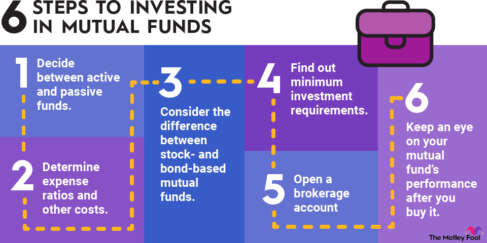

## Table of Contents

## What are mutual funds and how do they work?

Mutual funds are a type of investment where many people pool their money together to buy a variety of stocks, bonds, or other assets. This is managed by a professional who decides what to buy and sell. When you invest in a mutual fund, you're buying shares of the fund, not the individual stocks or bonds it holds. This makes it easier for you to diversify your investments without having to buy each stock or bond yourself.

The value of your investment in a mutual fund goes up or down based on how well the assets in the fund perform. If the stocks or bonds in the fund do well, the value of your shares will likely increase. If they don't do well, the value might go down. You can make money from mutual funds in two ways: by selling your shares for more than you paid for them, or through dividends, which are payments made from the fund's earnings. Mutual funds are popular because they offer a simple way to invest in a broad range of assets, which can help reduce risk.

## What are the benefits of investing in mutual funds?

Investing in mutual funds has many benefits. One big benefit is diversification. When you put your money into a mutual fund, you're not just buying one stock or bond. You're buying a little bit of many different ones. This can help lower your risk because if one stock does badly, it won't hurt your whole investment as much. It's like not putting all your eggs in one basket.

Another benefit is that mutual funds are managed by professionals. These people know a lot about investing and they make the decisions about what to buy and sell. This can save you time and effort because you don't have to do all the research and decision-making yourself. Plus, it can be a good way to learn about investing because you can see what the pros are doing.

Lastly, mutual funds are easy to buy and sell. You can usually get in or out of a fund quickly, which is handy if you need your money back or want to change your investments. They also come in many different types, so you can find one that fits your goals and how much risk you're willing to take. This makes mutual funds a flexible choice for many people.

## How can I start investing in mutual funds online?

Starting to invest in mutual funds online is pretty easy. First, you need to pick a good online broker or investment platform. There are lots of them out there, like Vanguard, Fidelity, or Charles Schwab. You should look for one that doesn't charge too much in fees and has the kinds of mutual funds you want. Once you've chosen a platform, you'll need to open an account. This usually involves filling out some forms online and maybe sending in some ID to prove who you are. After your account is set up, you can put money into it, usually by linking your bank account.

Once your account is funded, you can start buying mutual funds. Most platforms have a search tool where you can look for the funds you're interested in. You can read about each fund to see what it invests in and how it's been doing. When you find one you like, you can decide how much money to invest. Then, you just click a button to buy the shares. After that, you can keep an eye on your investment through the platform, and you can buy more shares or sell them whenever you want. It's a simple way to start building your investment portfolio.

## What are the different types of mutual funds available for online purchase?

There are several types of mutual funds you can buy online. One type is stock funds, which mainly invest in stocks. They can be focused on big companies, small companies, or companies in certain areas like technology or health care. Another type is bond funds, which invest in bonds. These are usually less risky than stock funds but might not grow as much. There are also balanced funds, which mix stocks and bonds to try to balance risk and growth.

Another kind of mutual fund is index funds, which aim to match the performance of a specific market index, like the S&P 500. They're popular because they usually have lower fees and can be a good way to invest in the whole market. Then there are sector funds, which focus on specific parts of the economy, like energy or real estate. These can be riskier because they depend a lot on how well that one sector does.

Finally, there are target-date funds, which are designed to change over time to match your retirement date. They start out more aggressive and then get more conservative as you get closer to retiring. There are also money market funds, which are very safe and invest in short-term debt. They're a good place to park your money if you want to keep it safe but still earn a little interest.

## What should I consider when choosing a mutual fund to invest in online?

When picking a mutual fund to invest in online, you should think about a few important things. First, look at the fund's goal and what it invests in. Some funds focus on stocks, others on bonds, and some mix both. You need to pick one that matches what you want to achieve with your money. Also, think about how much risk you're okay with. Some funds can be pretty safe, while others might go up and down a lot. Your age, when you'll need the money, and how you feel about risk can help you decide.

Another thing to consider is the fees you'll have to pay. Mutual funds charge fees for managing your money, and these can add up over time. Look for funds with low fees because they can help you keep more of your money. It's also smart to check the fund's past performance, but remember, past results don't guarantee future wins. Finally, think about how easy it is to buy and sell the fund on the platform you're using. You want a platform that's easy to use and lets you manage your investments without hassle.

## How do I compare the performance of different mutual funds?

To compare the performance of different mutual funds, you need to look at a few key things. First, check the fund's total return, which shows how much the fund has grown over time. You can find this on the fund's fact sheet or on the website of the platform where you're investing. It's good to compare the total return over different periods, like one year, three years, or five years, to see how the fund has done in the short and long term. Another thing to look at is how the fund compares to a benchmark, like the S&P 500 for stock funds. If the fund is doing better than the benchmark, it's a good sign.

Also, think about the risk the fund is taking to get its returns. You can do this by looking at something called standard deviation, which shows how much the fund's returns go up and down. A fund with a high standard deviation is riskier than one with a low standard deviation. Finally, consider the fund's expense ratio, which is the fee you pay for the fund's management. Lower fees can mean more money in your pocket over time. By looking at all these things, you can get a good idea of which mutual funds might be the best fit for you.

## What are the fees and expenses associated with online mutual fund investments?

When you invest in mutual funds online, you'll come across a few different fees and expenses. One of the main fees is the expense ratio, which is a yearly fee that covers the cost of managing the fund. This fee is taken out of the fund's assets, so it reduces the return you get. The expense ratio is shown as a percentage, and lower percentages mean you keep more of your money. Another fee you might see is the sales load, which is a commission you pay when you buy or sell shares of the fund. Some funds have a front-end load, which you pay when you buy, and others have a back-end load, which you pay when you sell.

There are also other smaller fees you might run into, like redemption fees, which you pay if you sell your shares too soon after buying them. These fees are meant to stop people from quickly buying and selling, which can hurt long-term investors. Account fees are another type of fee you might see. Some platforms charge for things like setting up your account or keeping it open. It's important to read the fine print and understand all the fees you might have to pay because they can add up and eat into your investment returns over time.

## How can I set up automatic investments in mutual funds online?

Setting up automatic investments in mutual funds online is easy and can help you save without thinking about it too much. First, you need to log into your account on the investment platform you're using, like Vanguard or Fidelity. Look for an option that says something like "automatic investments" or "set up a plan." You'll need to pick the mutual fund you want to invest in and decide how much money you want to put in each time. You can usually choose to invest a set amount every week, every two weeks, or every month. Once you've made your choices, you'll link your bank account so the platform can take the money automatically.

After you've set everything up, the platform will take money from your bank account on the schedule you chose and use it to buy shares of the mutual fund. This is called dollar-cost averaging, which means you're buying more shares when the price is low and fewer when the price is high. It's a good way to smooth out the ups and downs of the market. Plus, it's a simple way to keep investing regularly without having to remember to do it yourself. Just make sure you have enough money in your bank account to cover the automatic withdrawals, or you might get hit with fees.

## What are the tax implications of investing in mutual funds through an online platform?

When you invest in mutual funds through an online platform, you need to think about taxes. If you make money from your mutual funds, you might have to pay taxes on it. There are two main ways you can make money from mutual funds: capital gains and dividends. Capital gains happen when you sell your shares for more than you paid for them. If you hold the shares for more than a year, it's called a long-term capital gain, and the tax rate is usually lower. If you sell them in less than a year, it's a short-term capital gain, and you'll pay your regular income tax rate on it. Dividends are payments the fund makes from its earnings, and you'll have to pay taxes on them too, usually at your regular income tax rate.

Another thing to think about is that mutual funds can also create taxable events even if you don't sell your shares. If the fund manager sells stocks or bonds inside the fund and makes a profit, those profits are called capital gains distributions, and they get passed on to you. You'll have to pay taxes on these distributions, even if you reinvest them back into the fund. To make things easier, some people choose to invest in mutual funds through tax-advantaged accounts like IRAs or 401(k)s. These accounts can help you lower your taxes now or when you retire, depending on the type of account you choose. Always talk to a tax professional to understand how your investments will affect your taxes.

## How do I monitor and manage my mutual fund investments online?

To monitor and manage your mutual fund investments online, you need to log into your account on the investment platform you're using. Once you're in, you can see how your funds are doing by looking at the current value of your investments. Most platforms have a dashboard that shows you the performance of each fund over time, like daily, weekly, or monthly. You can also see if you've made or lost money since you started investing. If you want more details, you can usually click on a fund to see its holdings, fees, and recent news or updates about it. This helps you keep track of how your money is working for you.

Managing your investments means making decisions about buying more shares, selling some, or changing your strategy. If you want to buy more shares, you can do it right from your account by choosing the fund and entering the amount you want to invest. Selling works the same way; you pick the fund and the number of shares you want to sell. Some platforms also let you set up automatic investments or withdrawals, which can help you stick to a regular investing plan. It's important to check your investments regularly and make changes if your goals or the market changes. Remember, keeping an eye on your investments and making smart moves can help you reach your financial goals.

## What advanced strategies can I use to optimize my mutual fund portfolio online?

One advanced strategy to optimize your mutual fund portfolio online is to use asset allocation and rebalancing. Asset allocation means deciding how much of your money to put into different types of investments, like stocks, bonds, or cash. You want to spread your money around to balance risk and growth. Over time, the value of your investments will change, and your portfolio might not match your original plan anymore. That's when you rebalance, which means selling some investments and buying others to get back to your target mix. Many online platforms have tools that can help you figure out the best way to allocate your assets and remind you when it's time to rebalance.

Another strategy is to use tax-efficient investing. This means picking mutual funds and strategies that help you keep more of your money by lowering your taxes. For example, you can put funds that pay a lot of dividends into tax-advantaged accounts like IRAs or 401(k)s. You can also look for funds with low turnover, which means the fund manager doesn't buy and sell stocks as often, so you won't have as many taxable events. Some platforms let you see the tax impact of your investments and suggest ways to make your portfolio more tax-efficient. By thinking about taxes when you invest, you can keep more of your returns and grow your wealth faster.

## How can I use online tools and resources to enhance my mutual fund investment decisions?

Online tools and resources can really help you make better choices about your mutual fund investments. Many investment platforms have tools that let you compare different funds side by side. You can see things like past performance, fees, and what the fund invests in. This helps you pick the funds that fit your goals and how much risk you're okay with. Some platforms also have calculators that can show you how much your investments might grow over time, which can help you plan for the future. Plus, there are often educational resources like articles, videos, and webinars that can teach you more about investing and how to do it smarter.

Another way online tools can help is by giving you real-time data and alerts. You can set up alerts to let you know when a fund's price goes up or down a lot, or when there's news that might affect your investments. This can help you make quick decisions if you need to. Some platforms also have features that suggest funds based on your goals and how long you plan to invest. They might even let you try out different scenarios to see how your portfolio might do under different market conditions. By using these tools and staying informed, you can make smarter choices and keep your mutual fund investments on track.

## What is Algorithmic Trading in Mutual Funds?

Algorithmic trading leverages sophisticated computer algorithms to execute trading decisions at lightning speed, surpassing human capabilities in precision and timing. It operates on pre-defined parameters or sets of rules that determine when to buy or sell assets, enabling rapid responses to market conditions and potentially improving returns for investors. In mutual funds, this form of trading can significantly enhance portfolio management efficiency and lower trading costs.

### Optimization of Portfolio Management

Algorithmic trading optimizes portfolio management by employing strategies such as mean-variance optimization, which balances returns against risk. This is represented mathematically by:

$$

\min_{w} \left( w^T \Sigma w - \lambda w^T \mu \right)
$$

Where $w$ is the weight vector of portfolio assets, $\Sigma$ the covariance matrix of asset returns, $\mu$ the expected returns, and $\lambda$ a parameter reflecting risk preference. Algorithms can adjust weights dynamically in response to changes in asset performance or [volatility](/wiki/volatility-trading-strategies), thereby maintaining the desired risk-return profile of a mutual fund.

### Reduction of Trading Costs

By automating the trading process, algorithmic systems reduce the impact of human errors and emotions, minimizing slippage — the difference between the expected price of a trade and the actual price. They can also split large orders into smaller, more manageable trades, executed over time to avoid market impact costs, further driving down expenses associated with trading.

### Leveraging Platforms with Algorithmic Capabilities

Investors can utilize brokerage platforms that integrate [algorithmic trading](/wiki/algorithmic-trading) tools, democratizing access to more effective fund management techniques. Platforms like MetaTrader and Robinhood now offer features that allow individual investors to harness algorithms previously reserved for large institutional traders. These tools often come with customizable scripts or application programming interfaces (APIs) for deploying personalized trading strategies.

### Advantages and Potential Drawbacks

Advantages of algorithmic trading in mutual funds include enhanced precision, reduced transaction times, and a disciplined approach less prone to emotional interference. However, there are drawbacks. The reliance on historical data can lead to model risks where unexpected events or "black swans" disrupt modeled predictions. Moreover, technical failures or bugs within an algorithm can lead to significant financial losses.

Before implementing algorithmic trading, investors should consider these factors carefully and potentially consult with financial analysts or use [backtesting](/wiki/backtesting) strategies to assess the reliability and performance of their chosen algorithms. Continuous monitoring and updates of these algorithms are critical to adapting to the ever-evolving market landscapes.

## References & Further Reading

[1]: ["The Bogleheads' Guide to Investing"](https://www.amazon.com/Bogleheads-Guide-Investing-Mel-Lindauer/dp/1119847672) by Taylor Larimore, Mel Lindauer, and Michael LeBoeuf

[2]: ["Mutual Funds For Dummies"](https://www.dummies.com/article/business-careers-money/personal-finance/investing/investment-vehicles/funds/mutual-funds-for-dummies-cheat-sheet-209064/) by Eric Tyson

[3]: ["Algorithmic Trading: Winning Strategies and Their Rationale"](https://www.amazon.com/Algorithmic-Trading-Winning-Strategies-Rationale-ebook/dp/B00CY5HC0U) by Ernest P. Chan

[4]: Hasanhodzic, J., & Lo, A. W. (2007). ["Can Hedge-Fund Returns Be Replicated?: The Linear Case"](http://web.mit.edu/~alo/www/Papers/replicate.pdf). Financial Analysts Journal, 63(5), 69-74.

[5]: Poterba, J. M., & Shoven, J. B. (2002). ["Exchange-Traded Funds: A New Investment Option for Taxable Investors"](https://www.nber.org/papers/w8781). National Bureau of Economic Research.