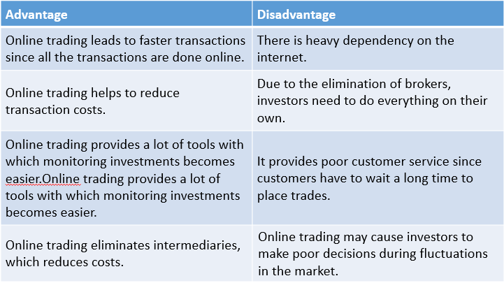

## Table of Contents

## What is Online Trading Academy and what is its mission?

Online Trading Academy is a school that teaches people how to trade in financial markets. They offer classes on trading stocks, forex, futures, and options. The school has centers all over the world where students can learn in person, but they also have online classes for people who can't go to a center.

The mission of Online Trading Academy is to help people become better traders and investors. They want to give people the skills and knowledge they need to make smart choices with their money. By teaching people how to trade, they hope to help them reach their financial goals and live better lives.

## How does Online Trading Academy help beginners get started with trading?

Online Trading Academy helps beginners get started with trading by offering special classes just for them. These classes are called Core Strategy and they teach the basics of trading. In these classes, beginners learn how to read charts, understand the markets, and make trading plans. The school also gives students a chance to practice trading in a safe way, using simulators that mimic real market conditions without risking real money.

After the Core Strategy class, beginners can join more advanced classes to learn even more. Online Trading Academy also has mentors who help students along the way. These mentors are experienced traders who can answer questions and give advice. This support makes it easier for beginners to feel confident as they start trading on their own.

## What are the core courses offered by Online Trading Academy?

Online Trading Academy offers a few main courses to help people learn about trading. The first one is called Core Strategy. This course is for beginners and it teaches the basics of trading. Students learn how to read charts, understand the markets, and make trading plans. They also get to practice trading using simulators, which are like games that let them trade without using real money.

After Core Strategy, students can take more advanced courses. One of these is called Professional Trader. This course goes deeper into trading strategies and helps students become better traders. Another course is called Wealth Management, which teaches students how to manage their money and investments over the long term. These courses help students build on what they learned in Core Strategy and become more skilled traders.

Online Trading Academy also offers specialized courses for different types of trading. For example, there are courses on Forex Trading, which focuses on trading currencies, and Options Trading, which teaches about trading options contracts. These courses help students learn about specific areas of the market and how to trade them effectively.

## What are the advantages of enrolling in Online Trading Academy?

Enrolling in Online Trading Academy has many benefits. One big advantage is that they have classes for everyone, from beginners to advanced traders. If you are new to trading, you can start with their Core Strategy course. This course teaches you the basics in a way that is easy to understand. You get to practice trading without risking real money, which helps you learn without worrying about losing money. The school also has experienced teachers who can answer your questions and help you improve.

Another advantage is that Online Trading Academy offers many different courses. After you finish the Core Strategy course, you can take more advanced classes like Professional Trader or Wealth Management. These courses help you become a better trader and manage your money well. The school also has special courses for different types of trading, like Forex Trading and Options Trading. This means you can learn about the areas of the market that interest you the most. With all these options, you can keep learning and growing as a trader.

## What are the potential disadvantages of Online Trading Academy?

One potential disadvantage of Online Trading Academy is the cost. The courses can be expensive, and not everyone can afford them. This might make it hard for some people to join the school, even if they really want to learn about trading. Also, while the school offers a lot of classes, you might need to take many of them to become a good trader. This means you will have to spend more money and time, which can be a big commitment.

Another thing to think about is that the success of the students can vary a lot. Just because you take the courses does not mean you will make a lot of money from trading. Trading is risky, and even with good training, you can still lose money. Some people might expect to become rich quickly after taking the courses, but this is not always the case. It's important to have realistic expectations and understand that trading takes a lot of practice and hard work.

## How does Online Trading Academy's pricing compare to other trading education platforms?

Online Trading Academy's courses can be more expensive than some other trading education platforms. For example, their Core Strategy course, which is for beginners, can cost a few thousand dollars. Other platforms might offer similar beginner courses for less money, sometimes even for free. This means that if you are on a tight budget, you might find cheaper options elsewhere.

However, Online Trading Academy also offers a lot of value for the price. They have in-person classes at many locations around the world, which can be a big plus for people who like to learn in a classroom setting. They also have experienced mentors who can help you along the way. While the cost might be higher, the extra support and resources could be worth it for some people who are serious about learning to trade.

## What kind of support and resources does Online Trading Academy provide to its students?

Online Trading Academy gives its students a lot of help and tools to learn trading. They have experienced teachers who guide students through the courses. These teachers are also traders who can answer questions and give advice. The school also has mentors who work with students one-on-one. This means students can get personal help and support as they learn. There are also trading simulators, which are like games that let students practice trading without using real money. This helps them learn without risking any money.

The school also offers many resources to help students keep learning. They have online videos and articles that explain more about trading. Students can use these to learn at their own pace. There are also trading labs where students can practice trading in a real-time setting with other students and teachers. This helps them see how trading works in the real world. Plus, Online Trading Academy has a community of students and alumni who can share tips and experiences. This community support can be very helpful for new traders.

## Can you describe the teaching methodology used by Online Trading Academy?

Online Trading Academy uses a hands-on teaching method to help students learn about trading. They believe that the best way to learn is by doing, so they have students practice trading using simulators. These simulators are like games that let students trade without using real money. This way, students can try out different strategies and see what works without risking any money. The school also has experienced teachers who guide students through the courses. These teachers are traders themselves, so they can share real-life tips and advice.

The school also focuses on giving students a lot of support. They have mentors who work with students one-on-one. This means students can get personal help and ask questions as they learn. Online Trading Academy also offers many resources, like online videos and articles, so students can keep learning on their own. They have trading labs where students can practice trading in real-time with other students and teachers. This helps students see how trading works in the real world. Plus, the school has a community of students and alumni who can share tips and experiences, making it easier for new traders to learn and grow.

## What are some success stories or testimonials from Online Trading Academy graduates?

Many people who went to Online Trading Academy have shared their success stories. One student, John, said that before he took the courses, he didn't know much about trading. After taking the Core Strategy class and practicing with the simulators, he felt more confident. Now, he trades every day and makes enough money to support his family. He says the mentors at the school were a big help and always answered his questions.

Another graduate, Sarah, shared that she was able to quit her job and trade full-time after finishing the Professional Trader course. She learned a lot about different trading strategies and how to manage her money. Sarah says the trading labs were very helpful because she could practice in real-time with other students. She is thankful for the support from the Online Trading Academy community and feels like she has found a new career that she loves.

## How does Online Trading Academy adapt its courses for different levels of trading expertise?

Online Trading Academy has courses for everyone, no matter if you are just starting or if you have been trading for a long time. If you are new to trading, you can begin with the Core Strategy course. This course teaches you the basics in a simple way. You will learn how to read charts, understand the markets, and make trading plans. You get to practice trading using simulators, which are like games that let you trade without using real money. This helps you learn without worrying about losing money. The school also has experienced teachers who can answer your questions and help you improve.

As you get better at trading, you can take more advanced courses. The Professional Trader course goes deeper into trading strategies and helps you become a better trader. The Wealth Management course teaches you how to manage your money and investments over the long term. Online Trading Academy also has special courses for different types of trading, like Forex Trading and Options Trading. These courses help you learn about specific areas of the market that interest you. With all these options, you can keep learning and growing as a trader, no matter your level of expertise.

## What are some reputable alternatives to Online Trading Academy for trading education?

One good alternative to Online Trading Academy is Investopedia Academy. They have courses for people who are just starting to learn about trading and for those who already know a lot. Their courses are cheaper than Online Trading Academy's, and you can learn at your own pace online. Investopedia Academy also has practice tests and quizzes to help you see how much you are learning. They cover topics like stock trading, forex trading, and options trading, so you can pick the course that fits what you want to learn.

Another option is Warrior Trading. They focus a lot on day trading, which means buying and selling stocks quickly in one day. Warrior Trading has courses for beginners and more advanced traders. They also have a community where you can talk to other traders and learn from them. Their courses are not as expensive as Online Trading Academy's, and they offer a lot of support to help you become a better trader. If you are interested in day trading, Warrior Trading could be a good choice for you.

## How does Online Trading Academy stay updated with the latest trading strategies and market changes?

Online Trading Academy keeps up with the latest trading strategies and market changes by having a team of experienced traders who are always learning and sharing new ideas. These traders work in the markets every day, so they know what is happening and can see new trends as they start. They use this knowledge to update the courses and make sure students are learning the most current ways to trade. The school also listens to feedback from students and alumni, which helps them know what is working and what needs to change.

The school also uses technology to stay updated. They have online resources like videos and articles that are always being added to and changed. This means students can learn about new strategies and market changes as soon as they happen. Online Trading Academy also has trading labs where students can practice trading in real-time. This helps them see how the markets are changing and try out new strategies in a safe way. By combining the knowledge of their traders, feedback from students, and the latest technology, Online Trading Academy makes sure their courses are always up-to-date.

## References & Further Reading

[1]: Bergstra, J., Bardenet, R., Bengio, Y., & Kégl, B. (2011). ["Algorithms for Hyper-Parameter Optimization."](https://dl.acm.org/doi/10.5555/2986459.2986743) Advances in Neural Information Processing Systems 24.

[2]: ["Advances in Financial Machine Learning"](https://www.amazon.com/Advances-Financial-Machine-Learning-Marcos/dp/1119482089) by Marcos Lopez de Prado

[3]: ["Evidence-Based Technical Analysis: Applying the Scientific Method and Statistical Inference to Trading Signals"](https://www.amazon.com/Evidence-Based-Technical-Analysis-Scientific-Statistical/dp/0470008741) by David Aronson

[4]: ["Machine Learning for Algorithmic Trading"](https://github.com/stefan-jansen/machine-learning-for-trading) by Stefan Jansen

[5]: ["Quantitative Trading: How to Build Your Own Algorithmic Trading Business"](https://www.amazon.com/Quantitative-Trading-Build-Algorithmic-Business/dp/1119800064) by Ernest P. Chan