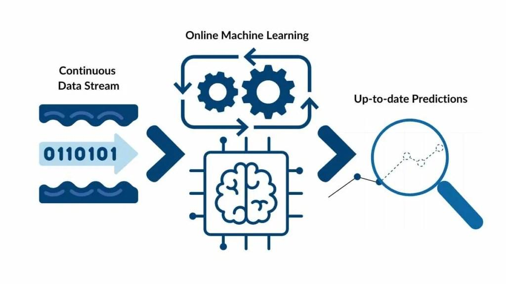

## Table of Contents

## What is online machine learning and how does it differ from batch learning?

Online machine learning is a method where a model learns from data as it comes in, one piece at a time. Imagine you're teaching a robot to recognize apples. Every time you show it an apple, it learns a little bit more about what an apple looks like. This way, the model can start making predictions right away and keep improving over time. It's useful when you have data coming in constantly, like in real-time applications such as fraud detection or stock market predictions.

Batch learning, on the other hand, is like studying for a test by reading an entire textbook at once. In batch learning, the model waits until it has all the data before it starts learning. Once it has learned from the data, it makes predictions until new data comes in, at which point you would need to retrain the model with all the data again. This method is good when you have a fixed dataset and don't need to update the model frequently, like in image recognition where you might have a large set of images to train on before using the model.

The key difference between online and batch learning is how they handle data. Online learning can adapt quickly to new information because it learns from each new piece of data as it arrives. Batch learning, however, might be more accurate if you have a complete dataset, but it can't adapt to new data without retraining, which can be time-consuming and resource-intensive.

## What are the main advantages of using online machine learning?

One of the main advantages of using online machine learning is its ability to adapt quickly to new data. Imagine you're using a model to predict the weather. With online learning, as soon as new weather data comes in, the model can update itself and improve its predictions right away. This is really helpful in situations where things change a lot, like in stock market predictions or detecting fraud in credit card transactions. You don't have to wait to gather all the data before you start making predictions, which means you can start using the model much sooner.

Another big advantage is that online [machine learning](/wiki/machine-learning) can be more efficient in terms of resources. Instead of needing to store and process a huge amount of data all at once, the model only needs to look at one piece of data at a time. This can save a lot of memory and computing power, especially when dealing with large datasets that keep growing. For example, if you're running a website and want to recommend products to users based on their behavior, online learning can help you do this without needing a lot of extra resources.

## Can you explain the concept of incremental learning in the context of online machine learning?

Incremental learning is a type of online machine learning where the model learns from new data bit by bit. Imagine you're teaching a friend to cook. Instead of giving them a whole cookbook at once, you show them one recipe at a time. Each time they try a new recipe, they get a little better at cooking. In the same way, an incremental learning model updates itself every time it sees a new piece of data, slowly getting better at its job without needing to start over.

This approach is really useful when the data you're working with keeps changing or growing. For example, if you're using a model to predict the weather, new weather data comes in all the time. With incremental learning, the model can adjust its predictions as soon as it gets new information, without having to wait for a big batch of data. This makes it perfect for real-time applications where you need to make quick decisions based on the latest data.

## What types of algorithms are commonly used in online machine learning?

In online machine learning, some common algorithms include stochastic gradient descent (SGD) and its variations like mini-batch gradient descent. SGD is like a hiker trying to find the lowest point in a valley by taking one step at a time. Each step is guided by the gradient of the current location, which tells the hiker which way to go to get lower. In SGD, the model updates itself after seeing each new piece of data, which makes it great for online learning because it can quickly adjust to new information. A simple update rule for SGD can be written as $$ \theta = \theta - \eta \nabla J(\theta, x_i, y_i) $$, where $$\theta$$ is the model's parameters, $$\eta$$ is the learning rate, and $$\nabla J(\theta, x_i, y_i)$$ is the gradient of the loss function with respect to the parameters for the current data point $$(x_i, y_i)$$.

Another popular algorithm is the Perceptron, which is like a simple decision maker. It tries to separate different types of data by drawing a line through them. When it sees a new piece of data, it adjusts the line a little bit to make the separation better. This makes it a good fit for online learning because it can keep improving its decision boundary as new data comes in. The Perceptron update rule can be expressed as $$ w = w + \eta (y_i - \hat{y_i}) x_i $$, where $$w$$ are the weights of the Perceptron, $$\eta$$ is the learning rate, $$y_i$$ is the true label, $$\hat{y_i}$$ is the predicted label, and $$x_i$$ is the input data.

Other algorithms used in online machine learning include online versions of decision trees and Naive Bayes classifiers. These algorithms are adapted to work with one piece of data at a time, allowing them to update their models incrementally. For example, an online decision tree might adjust its branches based on new data, while an online Naive Bayes classifier might update its probabilities as it sees new examples. These methods help the model to stay current and improve its performance over time without needing to start from scratch.

## How does online learning handle data that arrives in a stream?

Online learning is perfect for handling data that comes in a stream because it learns from each piece of data as it arrives. Imagine you're using a model to predict the weather. Every hour, new weather data comes in. With online learning, the model can update itself right away with this new information. This means it can start making predictions and keep improving them without waiting for all the data to come in at once. It's like learning a little bit at a time, which is really helpful when you need to make quick decisions based on the latest information.

One common way to do this is with an algorithm called Stochastic Gradient Descent (SGD). SGD updates the model after seeing each new piece of data. It's like a hiker trying to find the lowest point in a valley by taking one step at a time. The update rule for SGD can be written as $$ \theta = \theta - \eta \nabla J(\theta, x_i, y_i) $$, where $$\theta$$ is the model's parameters, $$\eta$$ is the learning rate, and $$\nabla J(\theta, x_i, y_i)$$ is the gradient of the loss function with respect to the parameters for the current data point $$(x_i, y_i)$$. This way, the model can adjust to new data quickly and keep getting better over time.

## What are the challenges associated with online machine learning?

One challenge with online machine learning is dealing with data that might not be perfect or complete. Imagine you're trying to learn a new language by listening to people speak. Sometimes, you might hear words or sentences that are not clear or correct. In online learning, the model can get confused by such noisy or incomplete data. It needs to figure out how to learn from this imperfect information without making too many mistakes. This can be tricky because the model has to keep updating itself with each new piece of data, and if the data is bad, it might lead the model down the wrong path.

Another challenge is keeping the model stable over time. Think of it like trying to balance on a moving skateboard. As new data comes in, the model has to adjust, but if it adjusts too much, it might fall off balance. This is known as the "concept drift" problem, where the underlying patterns in the data might change over time. The model needs to adapt to these changes without forgetting what it learned before. This can be hard because the model has to find the right balance between learning new things and remembering old ones. For example, if you're using a model to predict stock prices, the market can change in ways that the model hasn't seen before, making it hard to keep up.

## How can one evaluate the performance of an online learning model?

Evaluating the performance of an online learning model can be tricky because it's always learning from new data. One way to do this is by using a technique called "holdout validation." Imagine you're playing a game where you need to guess the next number in a sequence. You could keep some of the numbers secret and use them to test how well you're guessing. In holdout validation, you set aside some of the data as it comes in and don't use it for learning. Later, you can use this data to see how well the model is doing. For example, if you're using the model to predict stock prices, you could keep some of the latest stock data secret and then check how close the model's predictions are to the actual prices.

Another way to evaluate online learning models is by using "online metrics." These are measures that you can calculate as the model learns from new data. For instance, you could keep track of the average error the model makes on each new piece of data it sees. This can be done using a simple formula like $$ \text{Average Error} = \frac{1}{n} \sum_{i=1}^{n} |y_i - \hat{y_i}| $$, where $$ n $$ is the number of data points, $$ y_i $$ is the actual value, and $$ \hat{y_i} $$ is the predicted value. By monitoring this average error over time, you can see if the model is getting better or worse at its job. If the error goes down, it means the model is learning well from the new data.

## What is the role of concept drift in online machine learning and how is it managed?

Concept drift is a big challenge in online machine learning. It happens when the patterns in the data change over time. Imagine you're using a model to predict the weather. If the weather patterns change because of a new season, the model might start making bad predictions if it doesn't adjust. This is like trying to hit a moving target. The model needs to keep learning from new data to stay accurate, but it can be hard because it might forget what it learned before or get confused by the new patterns.

To manage concept drift, online learning models use different strategies. One way is to use a technique called "windowing," where the model only looks at the most recent data. This helps the model focus on the latest patterns and forget old ones that might not be relevant anymore. Another way is to use "ensemble methods," where multiple models work together. Some models might focus on new data, while others remember the old data. By combining their predictions, the overall model can adapt to changes without losing too much of what it learned before. These strategies help the model stay accurate even when the world around it is changing.

## Can you describe some practical applications of online machine learning?

One practical application of online machine learning is in fraud detection for credit card transactions. Imagine you're using your credit card to buy things online. Every time you make a purchase, the bank needs to check if it might be a fraudulent transaction. With online learning, the bank's model can learn from each new transaction as it happens. This means it can quickly spot new patterns of fraud and stop them before they cause problems. For example, if someone starts using your card in a new country, the model can detect this unusual behavior and alert the bank right away. The model updates itself with every transaction, so it keeps getting better at catching fraud without needing to start over.

Another application is in personalized recommendations for websites or apps. Think about how Netflix suggests new shows or movies for you to watch. They use online learning to learn from what you watch and rate. Every time you watch something new, the model updates itself to give you better recommendations. This way, the suggestions stay relevant and improve over time. For instance, if you start watching more action movies, the model can pick up on this and recommend similar movies you might like. The model doesn't need to wait for all your viewing data; it can start making good recommendations as soon as you start using the service.

## How does online machine learning adapt to new data over time?

Online machine learning adapts to new data over time by learning from each new piece of information as it comes in. Imagine you're teaching a friend to play a new game. Every time they play, you give them a little tip to help them get better. In the same way, an online learning model updates itself with every new piece of data it sees. This means it can start making predictions right away and keep improving them without waiting for all the data to come in at once. For example, if you're using a model to predict the weather, it can adjust its predictions as soon as new weather data arrives, making it more accurate over time.

One common way online machine learning adapts is by using an algorithm called Stochastic Gradient Descent (SGD). SGD is like a hiker trying to find the lowest point in a valley by taking one step at a time. Each step is guided by the gradient of the current location, which tells the hiker which way to go to get lower. In SGD, the model updates itself after seeing each new piece of data, which makes it great for online learning because it can quickly adjust to new information. The update rule for SGD can be written as $$ \theta = \theta - \eta \nabla J(\theta, x_i, y_i) $$, where $$\theta$$ is the model's parameters, $$\eta$$ is the learning rate, and $$\nabla J(\theta, x_i, y_i)$$ is the gradient of the loss function with respect to the parameters for the current data point $$(x_i, y_i)$$. This way, the model can keep getting better over time as it sees more data.

## What are some techniques for managing memory and computational resources in online learning?

One technique for managing memory and computational resources in online learning is to use mini-batch processing instead of processing each data point one by one. Mini-batch processing groups a small number of data points together and updates the model after processing each group. This can be more efficient because it balances the need for frequent updates with the need to save on memory and computation. For example, instead of updating the model after every single transaction in a fraud detection system, you might update it after every 10 transactions. This way, the model can still learn quickly but doesn't need as much memory or processing power.

Another technique is to use algorithms that are designed to be lightweight and efficient. For instance, Stochastic Gradient Descent (SGD) is a popular choice because it updates the model using just one data point at a time, which saves on memory. The update rule for SGD can be written as $$ \theta = \theta - \eta \nabla J(\theta, x_i, y_i) $$, where $$\theta$$ is the model's parameters, $$\eta$$ is the learning rate, and $$\nabla J(\theta, x_i, y_i)$$ is the gradient of the loss function with respect to the parameters for the current data point $$(x_i, y_i)$$. By using algorithms like SGD, the model can learn from new data without needing a lot of resources.

## How do advanced online learning algorithms like online gradient descent work?

Online gradient descent is a way to teach a model to make better predictions by learning from new data as it comes in. Imagine you're trying to find the lowest point in a valley. You take one step at a time, and each step is guided by the slope of the ground where you are standing. In online gradient descent, the model does something similar. It looks at one piece of data at a time and adjusts its predictions a little bit based on how well it did with that piece of data. The update rule for online gradient descent can be written as $$ \theta = \theta - \eta \nabla J(\theta, x_i, y_i) $$, where $$\theta$$ is the model's parameters, $$\eta$$ is the learning rate, and $$\nabla J(\theta, x_i, y_i)$$ is the gradient of the loss function with respect to the parameters for the current data point $$(x_i, y_i)$$. This means the model can quickly adapt to new information without needing to see all the data at once.

To make online gradient descent work well, you need to choose the right learning rate, $$\eta$$. If the learning rate is too big, the model might take big steps and miss the lowest point in the valley. If it's too small, the model might take too long to get to the lowest point. The learning rate helps the model balance between learning quickly and making accurate predictions. By adjusting the model's parameters one step at a time, online gradient descent can help the model keep getting better at its job, even as new data keeps coming in.