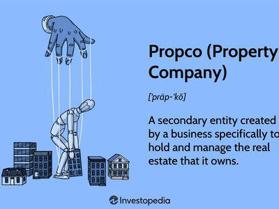

Propco and Opco business structures are increasingly significant in contemporary business environments. These terms, short for "property company" (Propco) and "operating company" (Opco), refer to a strategic division within a business where asset ownership and operational management are separated. A Propco typically handles asset ownership, which could include real estate, intellectual property, or equipment, whereas an Opco is responsible for the daily operations of the business, such as sales, services, and overall management tasks. This separation can allow businesses to manage risks more effectively, optimize tax strategies, and enhance operational efficiency.

In the context of algorithmic trading, these structures are uniquely advantageous. Algorithmic trading, the use of computers to execute trades at speeds and frequencies surpassing those possible for human traders, has become a cornerstone of modern financial markets. By employing Propco/Opco structures, trading firms can segregate their financial assets from trading strategies and operations, leading to improved focus and insulated risk management. For instance, the Propco might own data centers and trading technologies, while the Opco executes trading strategies utilizing these assets. This separation ensures that each entity operates with specialized knowledge and expertise, thereby enhancing overall efficiency and effectiveness.

The financial markets have seen a growing interest in the Propco/Opco model, as firms leverage this structure to balance complex trading operations with robust asset protection mechanisms. This model's increasing popularity is attributed to its potential to reduce liability, minimize tax burdens, and improve business agility. However, it also presents distinct challenges, including the necessity for clear strategic alignment between the Propco and Opco and the potential complexity of regulatory compliance in different jurisdictions.

This article aims to provide a comprehensive analysis of the Propco and Opco business structures, specifically in their integration with algorithmic trading. Readers will gain insights into the foundational concepts, benefits, and limitations of these models in financial markets. Additionally, the article will discuss the practical implications and future trends of utilizing Propco/Opco structures in trading, equipping financial professionals with the knowledge to consider this strategic approach in their operations.

## Table of Contents

## Understanding Propco/Opco Structures

Propco and Opco are integral elements in certain corporate structures, allowing businesses to optimize efficiency and manage liabilities effectively. At its core, a Propco (Property Company) serves as the entity that holds ownership of the physical and intangible assets, such as real estate, intellectual property, or financial instruments. The Opco (Operating Company), on the other hand, is responsible for managing the business operations, using the assets provided by the Propco to generate revenue.

The segregated structure of Propco and Opco facilitates the separation of asset ownership from business operations. This structure is advantageous primarily for two reasons: operational efficiency and liability reduction. By isolating the assets and operations, companies can protect assets from operational liabilities, such as legal claims or financial losses incurred by the Opco. Additionally, this separation enables each entity to focus on its core competencies—Propco on asset management and Opco on operational efficiency—thus enhancing the overall performance of the business.

Industries frequently adopting the Propco/Opco structure include real estate, hospitality, healthcare, and retail. For instance, many hotel chains utilize this model to manage their properties through a Propco while the operational aspects like guest services and management fall under an Opco. Similarly, in the healthcare sector, a Propco may own hospitals and clinics, whereas the Opco handles patient care and staffing.

The potential benefits of Propco/Opco structures are clear, yet they are not devoid of drawbacks. On the positive side, companies can achieve better risk management, potential tax benefits, and improved asset protection. The structure also allows for scalable growth as each entity can independently seek investment or expansion opportunities. However, challenges include the risk of misaligned objectives between the Propco and Opco, which can lead to operational inefficiencies and strategic discord. Additionally, the complexities in legal and tax frameworks can present hurdles and may require substantial resources to navigate effectively.

In summary, while the Propco/Opco model offers strategic advantages through asset protection and operational focus, it requires careful consideration of potential misalignments and regulatory obligations to ensure its successful implementation.

## The Intersection of Propco/Opco with Algo Trading

Algorithmic trading, often referred to as algo trading, is a method of executing trades using pre-programmed sequences that account for variables such as timing, price, and [volume](/wiki/volume-trading-strategy). The use of algorithms in trading is paramount in today's finance industry due to its efficiency, speed, and ability to scrutinize large datasets for decision-making. Algorithmic trading minimizes human intervention, reducing the risks associated with psychological biases and errors in manual trading.

The Propco/Opco (Property Company/Operating Company) model can significantly enhance the applicability and efficiency of [algorithmic trading](/wiki/algorithmic-trading) operations by delineating asset ownership from day-to-[day trading](/wiki/day-trading-spy) activities. In this intermediary structure, the Propco is responsible for owning and managing assets—such as intellectual property, licenses, or software platforms—while the Opco focuses on leveraging these resources for executing trading strategies.

Separating assets from operations in algo trading can lead to notable improvements in trading strategies. With distinct entities, the Propco can concentrate on optimizing the technological and infrastructural components, reducing the liability burden on the trading operations. The use of advanced, proprietary trading platforms can be streamlined and maintained by the Propco, allowing the Opco to operate with fewer disruptions and greater agility in responding to market changes. This separation also facilitates enhanced risk management, as potential operational failures do not directly impact asset ownership.

Numerous companies have integrated Propco/Opco frameworks into their algorithmic trading operations, leveraging the separation to specialize and adapt more quickly to market dynamics. For instance, some hedge funds and financial institutions allocate asset management and technological resources to a Propco while allowing a distinct Opco to conduct trading activities. This compartmentalization not only provides operational flexibility but also enhances compliance management and limits regulatory exposure across different jurisdictions.

The role of technology is crucial in managing the Propco and Opco divisions effectively. Modern software solutions and cloud-based platforms improve communication and data sharing between these two arms of the business. Advanced data analytics and [machine learning](/wiki/machine-learning) systems are increasingly being utilized to bolster the predictive capabilities of trading algorithms managed by the Opco, while the Propco can focus on software and hardware optimization to support these operations.

In summary, leveraging the Propco/Opco model in algorithmic trading environments holds promise for improving operational efficiencies, risk management, and strategic agility. By clearly separating ownership from operational execution, companies can better adapt to technological advancements and market demands, ensuring a sustainable competitive edge in the rapidly evolving financial landscape.

## Benefits of Propco/Opco Structure in Algo Trading

The Propco/Opco business structure offers several notable benefits in the context of algorithmic trading, where the separation of asset ownership (Propco) from operational management (Opco) can enhance various aspects of trading operations.

**Enhanced Risk Management**: By segregating assets and operational responsibilities, this model inherently reduces risk. The Propco retains ownership of strategic assets while insulating them from operational liabilities. This separation allows each entity to focus on its core functions, with Propco safeguarding its real estate, intellectual property, or technological infrastructure, while Opco concentrates on trading activities. Such compartmentalization minimizes the risk of financial losses from operational setbacks affecting long-term asset value.

**Increased Focus and Efficiency**: Opco’s dedication to managing and executing trading operations without the burden of asset ownership leads to heightened focus and efficiency. Opco can streamline its processes, leverage real-time data, and employ sophisticated algorithms to optimize trading results. This efficiency is further bolstered by Propco, which ensures that essential resources and infrastructure are available without operational distractions.

**Potential Tax Advantages and Asset Protection**: The division between Propco and Opco can yield significant tax benefits. By separating revenue-generating activities from asset management, companies can take advantage of different tax treatments available to property and operational entities. Additionally, this separation offers enhanced asset protection, safeguarding critical assets from potential claims related to trading activities.

**Facilitation of Scalability and Adaptability**: The modular nature of Propco/Opco structures allows for easy scalability. As trading operations expand, the Opco can rapidly adapt its strategies and technologies without necessitating major adjustments to asset management protocols. This flexibility is crucial for algorithmic trading, which thrives on adapting to market changes and technological advancements.

**Real-World Cases Demonstrating the Advantages**: Companies in various sectors, including finance, real estate, and retail, have successfully adopted Propco/Opco structures. For instance, in the real estate industry, large firms divide their operations to manage properties efficiently while pursuing aggressive acquisition strategies. Similarly, in finance, firms utilizing algorithmic trading have employed this model to safeguard their proprietary algorithms and technology from market-related risks. These cases attest to the operational and financial advantages inherent in this business model.

In summary, the Propco/Opco structure provides a robust framework for managing risks, enhancing operational efficiency, and optimizing asset management in algorithmic trading. Through enhanced focus, potential tax benefits, and increased scalability, businesses can better adapt to the competitive dynamics of financial markets.

## Challenges and Considerations

Propco/Opco structures, while offering numerous advantages in the financial sector, particularly in algorithmic trading, present several challenges and considerations that can impact their successful implementation and management. These challenges stem from regulatory, strategic, and operational complexities inherent in maintaining a dual-entity system.

One of the primary challenges faced by Propco/Opco structures is regulatory compliance. Financial markets are heavily regulated, and the separation of asset ownership (Propco) from operational management (Opco) can create intricate compliance issues. Regulatory authorities may scrutinize such setups to ensure compliance with financial reporting standards, anti-money laundering (AML) requirements, and other market-specific regulations. Failure to align both Propco and Opco with regulatory expectations can lead to significant legal and financial repercussions.

Misalignment between the objectives of the Propco and Opco entities poses another risk. The Propco's primary focus is asset protection and optimization, whereas the Opco is concerned with operational efficiency and innovation. A lack of strategic alignment can lead to conflicts of interest, inefficiencies, and reduced organizational effectiveness. Ensuring that both entities share common goals and measurement metrics is crucial to mitigate these risks.

The complexity of establishing and managing Propco/Opco structures in trading environments cannot be understated. These structures require significant expertise in legal and financial matters to design and implement effectively. For instance, evaluating which assets should reside within Propco and the operational responsibilities of Opco necessitates careful planning and expert input. Poorly executed setups may lead to operational redundancies or inefficient utilization of assets.

Robust technological and management systems are essential for the successful operation of Propco/Opco models in algorithmic trading. These systems must facilitate seamless communication and coordination between both entities, ensuring swift data sharing and decision-making processes. Advanced IT infrastructure and cutting-edge algorithmic platforms are often required to support the complex operations of Opco while safeguarding the assets managed by Propco.

There have been several case studies of failed Propco/Opco setups that provide valuable lessons. In some instances, inadequate risk management protocols and poor strategic alignment have led to the unraveling of these structures. One notable example is the collapse of certain financial institutions where the disconnect between asset management and operational execution resulted in vulnerabilities exploited during market downturns. These failures underscore the necessity for continuous oversight, strategic alignment, and integration of technological solutions to manage Propco/Opco structures effectively.

In conclusion, while the Propco/Opco model offers a promising framework for specialized trading operations, participants must navigate a landscape fraught with regulatory, strategic, and operational challenges. By anticipating these challenges and deploying robust systems and strategies, financial entities can leverage the potential of this business structure to its fullest extent.

## Future of Propco/Opco Structures in Algo Trading

Trends within the financial industry are significantly reshaping business structures, particularly the Propco/Opco model's application to algorithmic trading. As the digitalization of trading escalates, [artificial intelligence](/wiki/ai-artificial-intelligence) (AI) and machine learning (ML) are becoming central to these transformations. AI and ML's integration into trading practices offers substantial potential to drive efficiencies and refine strategies, enabling companies to better manage risk and maximize returns. These technologies allow for the development of advanced algorithms that can process vast volumes of data quickly, identifying patterns and executing trades with precision.

Predictions for the evolution of Propco/Opco structures indicate a trend towards even greater specialization. Companies are likely to further delineate asset ownership (Propco) from trading operations (Opco) to focus on core competencies and optimize performance. This segregation facilitates a more flexible operational framework, allowing each division to leverage technological advancements without constraints. As a result, firms can adapt more swiftly to market changes, enhancing their competitive edge.

Opportunities for innovation are abundant within current practices. With AI and ML, firms can design bespoke algorithms tailored to specific market conditions, further refining Propco/Opco business structures. These customized solutions enable the adjustment of trading strategies on-the-fly, improving responsiveness to market fluctuations. Additionally, there are opportunities to enhance data integration between Propco and Opco, ensuring seamless information flow and coordination.

Expert opinions on the sustainability of Propco/Opco models highlight the need for continuous adaptation. Maintaining alignment between Propco and Opco objectives is crucial; any misalignment can lead to inefficiency and operational discord. Experts suggest that robust technological frameworks and clear communication channels are essential for sustaining a cohesive strategy. As business models evolve, it is anticipated that Propco/Opco structures will increasingly incorporate AI and ML capabilities to enhance decision-making, drive innovation, and remain viable in a rapidly changing trading environment.

Overall, the future of Propco/Opco structures in algorithmic trading is likely to be characterized by increased technological integration. The ongoing evolution in AI and ML will not only transform trading strategies but also redefine business operations within this dual-structured framework. Companies that effectively harness these technologies stand to benefit substantially, realizing improved performance and greater adaptability in the financial markets.

## Conclusion

Throughout this article, we examined the intricate dynamics of Propco/Opco structures and their integration with algorithmic trading. The separation of asset ownership by the Propco from operational management by the Opco offers several benefits, such as enhanced risk management, operational focus, and strategic adaptability. In the context of algorithmic trading, this model can provide a framework for more efficient asset allocation and potentially improved trading outcomes.

The viability of Propco/Opco structures in trading hinges on their ability to mitigate risks through asset segregation and their potential for operational efficiency. However, businesses must be mindful of regulatory challenges and the complexities involved in aligning organizational objectives. The continued evolution of technology, particularly in artificial intelligence and machine learning, may further revolutionize these structures, offering new opportunities for innovation and growth.

For traders and businesses considering this model, a thorough analysis of their specific needs and careful implementation is crucial. It is recommended to consult relevant literature and case studies to gain deeper insights. Resources such as "Adaptive Markets" by Andrew Lo and industry reports on algorithmic trading could be beneficial for further exploration.

The trading industry and its business structures are inherently dynamic, continuously shaped by technological advancements and market demands. The adaptability and resilience offered by Propco/Opco structures have the potential to influence future developments in trading strategies, enabling organizations to navigate an ever-evolving financial landscape.

## References & Further Reading

[1]: ["Adaptive Markets: Financial Evolution at the Speed of Thought"](https://www.jstor.org/stable/j.ctvc7778k) by Andrew W. Lo

[2]: ["Advances in Financial Machine Learning"](https://www.amazon.com/Advances-Financial-Machine-Learning-Marcos/dp/1119482089) by Marcos Lopez de Prado

[3]: ["Quantitative Trading: How to Build Your Own Algorithmic Trading Business"](https://github.com/LucindaYa/quant-resources/blob/master/Quantitative%20Trading%20How%20to%20Build%20Your%20Own%20Algorithmic%20Trading%20Business.pdf) by Ernest P. Chan

[4]: ["Machine Learning for Algorithmic Trading"](https://github.com/stefan-jansen/machine-learning-for-trading) by Stefan Jansen

[5]: ["Evidence-Based Technical Analysis: Applying the Scientific Method and Statistical Inference to Trading Signals"](https://www.amazon.com/Evidence-Based-Technical-Analysis-Scientific-Statistical/dp/0470008741) by David Aronson