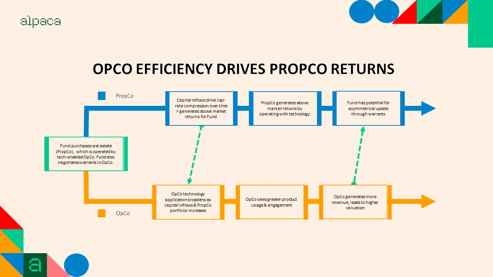

## Table of Contents

## What is an Opco?

An Opco, short for Operating Company, is a type of business that focuses on running the day-to-day operations of a company. This means they handle things like making products, providing services, and managing employees. Opcos are important because they are the part of a business that actually does the work to earn money.

Sometimes, a company might have both an Opco and a Propco, which stands for Property Company. The Propco owns the buildings and land that the Opco uses. This setup can help a business manage its operations and property separately, which can be useful for financial and legal reasons. For example, if the Opco needs to borrow money, it can do so without putting the property at risk.

## What is a Propco?

A Propco, short for Property Company, is a type of business that owns and manages real estate. This can include buildings, land, and other properties. The main job of a Propco is to take care of these properties, make sure they are in good condition, and sometimes rent them out to other businesses or people.

Sometimes, a company will have both an Opco and a Propco. The Opco, or Operating Company, runs the day-to-day business operations, like making products or providing services. By separating the property ownership into a Propco, the company can manage its real estate separately from its main business activities. This can be helpful for financial and legal reasons, like protecting the property if the Opco has financial problems.

## How do Opco and Propco structures differ?

An Opco, or Operating Company, is all about running the daily business activities. This means they make products, provide services, and manage employees. The Opco is the part of the business that actually does the work to make money. For example, if a company makes cars, the Opco would be in charge of building the cars and selling them to customers.

A Propco, or Property Company, is different because it focuses on owning and managing real estate. This includes buildings, land, and other properties. The Propco's job is to take care of these properties, keep them in good shape, and sometimes rent them out. If the same car company has a Propco, it would own the factories and offices where the cars are made and the business is run.

The main difference between an Opco and a Propco is what they do. The Opco handles the business operations, while the Propco deals with the property. This separation can help a company manage its money and legal issues better. For example, if the Opco needs a loan, it can do so without risking the property owned by the Propco.

## What are the primary benefits of using an Opco structure?

Using an Opco structure can help a business in many ways. One big benefit is that it keeps the day-to-day operations separate from the property. This means if the business needs money, it can borrow without putting the property at risk. This can make it easier to get loans and can protect the company's buildings and land if things go wrong with the business.

Another benefit is that it can make taxes and finances easier to manage. By keeping the operations and property separate, the company can use different tax strategies for each part. This can save money and make it simpler to understand the financial health of the business. Plus, it can make the company look more attractive to investors because they can see exactly how the business is doing without the property affecting the numbers.

## What are the advantages of a Propco structure?

A Propco structure helps a business by keeping the property separate from the day-to-day operations. This means if the business has money problems, the property is safe. It's like having a safety net for the buildings and land. If the business needs to borrow money, it can do so without risking the property. This makes it easier to get loans and can protect the company's assets.

Another advantage of a Propco structure is that it can make taxes and finances easier to handle. By keeping the property separate, the company can use different tax strategies for the property part of the business. This can save money and make it simpler to understand how the property is doing financially. It also makes the company look better to investors because they can see the value of the property clearly, without it being mixed up with the business operations.

## In what industries are Opco and Propco structures commonly used?

Opco and Propco structures are often used in industries where businesses own a lot of property, like real estate, hotels, and retail. For example, a hotel chain might use an Opco to run the hotels and a Propco to own the buildings. This way, if the hotel business has money problems, the buildings are safe. It's also common in retail, where a company might own many stores. The Opco runs the stores, while the Propco owns the buildings.

These structures are also used in manufacturing and healthcare. In manufacturing, a company might use an Opco to make products and a Propco to own the factories. This helps keep the property safe if the business has financial issues. In healthcare, hospitals might use an Opco to run the medical services and a Propco to own the hospital buildings. This separation can help with taxes and make it easier to get loans.

## How does an Opco-Propco model affect financial reporting?

An Opco-Propco model changes how a company reports its finances. When a business uses this model, it splits its financial reports into two parts: one for the Opco, which runs the day-to-day business, and one for the Propco, which owns the property. This makes it easier to see how each part of the business is doing. For example, if the Opco is making a lot of money but the Propco is losing money because of high property costs, you can see that clearly in the financial reports.

This separation can also help with taxes and loans. By keeping the property and operations separate, the company can use different tax strategies for each part. This can save money and make the financial reports simpler to understand. Plus, if the Opco needs a loan, it can do so without putting the property at risk, which can make the company look more attractive to lenders and investors.

## What are the tax implications of operating an Opco versus a Propco?

When a business uses an Opco and a Propco, it can affect how much tax they pay. The Opco, which runs the day-to-day business, might have different tax rules than the Propco, which owns the property. For example, the Opco might be able to deduct business expenses like salaries and supplies, which can lower its taxes. The Propco, on the other hand, might be able to take advantage of tax breaks for owning property, like depreciation, which can also lower its taxes. By keeping these two parts separate, the business can use different tax strategies for each part, which can save money overall.

Another thing to think about is how the Opco and Propco are set up. If the Opco pays rent to the Propco for using the property, this can be a way to move money between the two parts of the business. The rent payments can be a tax-deductible expense for the Opco, which lowers its taxes. At the same time, the Propco gets income from the rent, which it has to pay taxes on. But, the Propco might have other ways to lower its taxes, like through depreciation. So, by setting up the Opco and Propco in the right way, the business can manage its taxes better and save money.

## How can an Opco-Propco structure impact business strategy and operations?

An Opco-Propco structure can change how a business makes plans and runs its day-to-day work. By splitting the business into an Opco, which does the daily work, and a Propco, which owns the property, the company can focus on different goals for each part. The Opco can work on making the business better, like improving products or services, while the Propco can focus on taking care of the buildings and land. This split can help the business grow in different ways. For example, the Opco might want to open new stores or factories, and the Propco can help by buying or building the right properties.

This structure also affects how the business makes big decisions. If the Opco needs money to grow, it can borrow without risking the property owned by the Propco. This can make it easier to get loans and can help the business expand faster. Plus, the Opco and Propco can use different strategies to save money on taxes. The Opco might focus on cutting costs in its operations, while the Propco can use tax breaks for owning property. This can make the whole business more efficient and help it make more money in the long run.

## What are the legal considerations when setting up an Opco and Propco?

When setting up an Opco and a Propco, there are some important legal things to think about. First, you need to make sure that the Opco and Propco are set up as separate legal entities. This means they need to have their own business licenses, tax IDs, and other legal documents. It's also important to have clear agreements between the Opco and Propco, like a lease agreement if the Opco is renting property from the Propco. These agreements need to be written carefully to make sure they follow the law and protect both parts of the business.

Another thing to consider is how the Opco and Propco will work together. There might be rules about how they can share money, like the Opco paying rent to the Propco. You also need to think about how decisions are made for each part of the business. Sometimes, the same people might run both the Opco and Propco, but they need to be careful to keep the two separate. This can help avoid legal problems and make sure that the business is following all the rules. It's a good idea to talk to a lawyer to make sure everything is set up the right way.

## How do Opco and Propco structures influence investment and financing decisions?

An Opco-Propco structure can change how a business gets money and makes investment choices. By splitting the business into an Opco that runs the daily work and a Propco that owns the property, the company can borrow money more easily. The Opco can take out loans without risking the property owned by the Propco. This can make lenders feel safer about giving money to the business. Also, investors might like this setup because they can see clearly how the business is doing without the property affecting the numbers. This can make the business look more attractive for investment.

This structure also affects how the business decides to grow. The Opco can focus on making the business better, like improving products or opening new locations, while the Propco can work on buying or building new properties. This split can help the business plan its growth in different ways. For example, if the Opco wants to expand, it can do so without worrying about the cost of new property, since the Propco can handle that. This can make the business more flexible and able to grow faster.

## What are some case studies or real-world examples of successful Opco-Propco implementations?

One good example of an Opco-Propco structure is the hotel chain Marriott. Marriott uses an Opco to run its hotels and a Propco to own the buildings. This helps them manage their business better. If the hotel business has money problems, the buildings are safe. It also makes it easier for Marriott to get loans because the property is not at risk. This setup has helped Marriott grow and open new hotels around the world.

Another example is the retail company Walmart. Walmart uses an Opco to run its stores and a Propco to own the buildings. This split helps Walmart manage its taxes and finances better. The Opco can focus on selling products and making money, while the Propco takes care of the properties. This has helped Walmart expand and open new stores without worrying about the cost of the buildings. It also makes Walmart look good to investors because they can see how the business is doing without the property affecting the numbers.

## References & Further Reading

[1]: ["Adaptive Markets: Financial Evolution at the Speed of Thought"](https://www.jstor.org/stable/j.ctvc7778k) by Andrew W. Lo

[2]: ["Advances in Financial Machine Learning"](https://www.amazon.com/Advances-Financial-Machine-Learning-Marcos/dp/1119482089) by Marcos Lopez de Prado

[3]: ["Quantitative Trading: How to Build Your Own Algorithmic Trading Business"](https://github.com/LucindaYa/quant-resources/blob/master/Quantitative%20Trading%20How%20to%20Build%20Your%20Own%20Algorithmic%20Trading%20Business.pdf) by Ernest P. Chan

[4]: ["Machine Learning for Algorithmic Trading"](https://github.com/stefan-jansen/machine-learning-for-trading) by Stefan Jansen

[5]: ["Evidence-Based Technical Analysis: Applying the Scientific Method and Statistical Inference to Trading Signals"](https://www.amazon.com/Evidence-Based-Technical-Analysis-Scientific-Statistical/dp/0470008741) by David Aronson