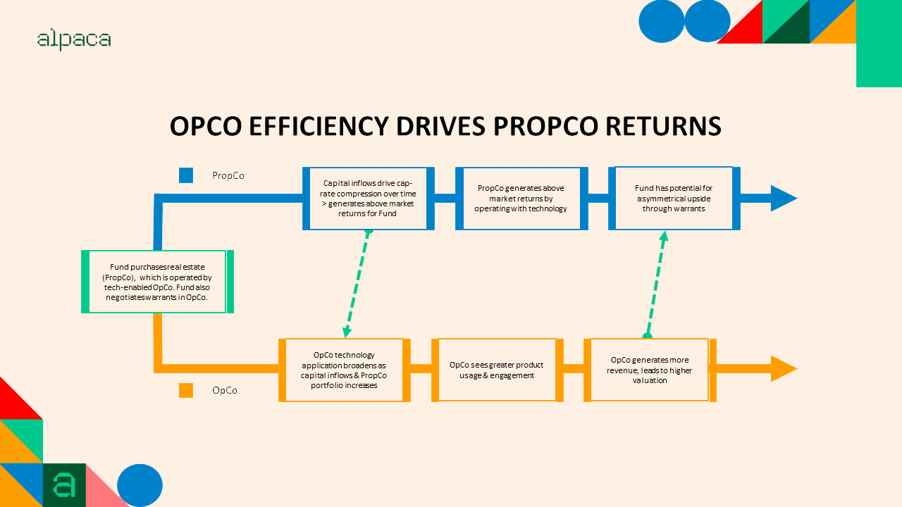

## Table of Contents

## What is an Opco/Propco deal?

An Opco/Propco deal is a type of business arrangement where a company splits into two separate entities: the operating company (Opco) and the property company (Propco). The operating company focuses on running the business, like managing stores or services, while the property company owns and manages the real estate assets, like buildings and land. This separation allows the business to operate more efficiently because each part can focus on what it does best.

This type of deal is often used in industries like retail, hospitality, and healthcare. It can help a company raise money by selling or leasing its real estate to the Propco, which can then manage and possibly develop the properties. This can also make it easier to get loans or investments because the real estate can serve as valuable collateral. Overall, an Opco/Propco structure can provide more flexibility and financial benefits for a business.

## Why would a company choose to structure a deal as Opco/Propco?

A company might choose an Opco/Propco structure to make its business run better and to get more money. By splitting the business into two parts, the operating company can focus on running the day-to-day operations like managing stores or services. At the same time, the property company can take care of the buildings and land. This way, each part can do what it's good at without distractions, which can make the whole business more efficient.

Another reason is that it can help the company raise money. The property company can sell or lease the real estate to investors, which gives the operating company cash to use for growing the business. Also, because the real estate is separate, it can be used as collateral for loans, making it easier for the company to borrow money. This structure can give the company more financial flexibility and help it grow.

## What are the key components of an Opco/Propco structure?

The key components of an Opco/Propco structure are the operating company, or Opco, and the property company, or Propco. The Opco is responsible for running the day-to-day business operations. This means it manages things like stores, services, or any other activities that make the business work. The Opco focuses on what the business does, not on owning buildings or land.

The Propco, on the other hand, owns and manages all the real estate assets. This includes buildings, land, and any other property the business uses. The Propco can lease these properties back to the Opco, which allows the Opco to use the space without having to own it. This separation helps each part of the business focus on what it does best and can make the whole business run more smoothly.

By splitting the business into these two parts, the company can also raise money more easily. The Propco can sell or lease the real estate to investors, giving the Opco cash to use for growing the business. The real estate can also be used as collateral for loans, making it easier for the company to borrow money. This structure gives the company more financial flexibility and can help it grow.

## How does an Opco/Propco deal affect a company's financial statements?

When a company splits into an Opco and a Propco, it changes how the company's money is shown on its financial statements. The Opco's financial statements will show the money it makes from running the business, like sales and services. It won't show the value of the buildings or land because those are now owned by the Propco. The Opco will have to pay rent to the Propco for using the properties, so its expenses will include these rent payments. This can make the Opco's profits look different because it's paying rent instead of owning the properties.

The Propco's financial statements will show the value of the real estate it owns. It will also show the money it makes from renting out these properties to the Opco or other tenants. The Propco might also have debts if it borrowed money to buy the real estate. So, its financial statements will show both the income from rent and the costs of any loans. By splitting the company this way, the financial statements of both the Opco and the Propco will be simpler and clearer, showing exactly what each part of the business is doing with its money.

## What are the tax implications of an Opco/Propco structure?

An Opco/Propco structure can change how a company pays taxes. When a company splits into an Opco and a Propco, the Opco will pay taxes on its profits from running the business. It won't own the buildings or land anymore, so it won't pay taxes on those. Instead, the Opco will pay rent to the Propco, and this rent can be deducted from the Opco's taxable income. This can lower the Opco's tax bill because it's spending money on rent.

The Propco, on the other hand, will pay taxes on the money it makes from renting out the properties. This includes the rent it gets from the Opco and any other tenants. The Propco might also have to pay taxes on any money it makes from selling the properties. If the Propco borrowed money to buy the real estate, it can deduct the interest on those loans from its taxable income, which can lower its taxes. Overall, splitting into an Opco and a Propco can help a company manage its taxes better by allowing each part to take advantage of different tax benefits.

## How does an Opco/Propco deal impact operational control and management?

When a company splits into an Opco and a Propco, it changes how the business is managed and controlled. The Opco takes care of running the business, like managing stores or services. This means the people in charge of the Opco can focus on making the business run smoothly without worrying about the buildings or land. They can make decisions about how to improve the business without the added complexity of managing real estate.

The Propco, on the other hand, manages the buildings and land. The people in charge of the Propco focus on keeping the properties in good shape, making sure they're rented out, and maybe even buying or selling properties. This split allows each part of the business to have clear roles and responsibilities. However, it also means that the Opco and Propco need to work closely together to make sure the business as a whole runs well, especially since the Opco needs the properties from the Propco to operate.

## What are the potential risks and benefits of an Opco/Propco deal?

An Opco/Propco deal can bring many benefits to a company. By splitting the business into two parts, the operating company can focus on running the business without worrying about the buildings or land. This can make the business more efficient because each part can do what it's good at. The property company can also help the business raise money by selling or leasing the real estate to investors. This gives the operating company cash to use for growing the business. Plus, the real estate can be used as collateral for loans, making it easier for the company to borrow money. This structure can give the company more financial flexibility and help it grow.

However, there are also risks to consider. One big risk is that the operating company now has to pay rent to the property company, which can make its profits smaller. If the rent is too high, it could hurt the operating company's ability to make money. Another risk is that the two companies need to work closely together. If they don't communicate well, it could cause problems for the whole business. Also, if the property company borrows a lot of money to buy the real estate, it could be in trouble if it can't pay back the loans. So, while an Opco/Propco deal can help a company in many ways, it's important to think about these risks too.

## Can you provide examples of successful Opco/Propco deals?

One example of a successful Opco/Propco deal is the one done by the retail company, Sears. In 2015, Sears Holdings Corporation split its business into an operating company and a property company. The property company, called Seritage Growth Properties, took over the ownership of many Sears stores and other real estate. This allowed Sears to get money from selling or leasing these properties, which it could use to keep the business running. The deal helped Sears manage its finances better and focus on improving its stores and services.

Another example is the deal made by the hotel company, Marriott International. In 1993, Marriott split its business into an operating company and a property company. The property company, called Host Marriott Corporation, owned the hotels, while the operating company managed them. This split allowed Marriott to raise money by selling or leasing its hotels to investors. It also made it easier for Marriott to focus on running its hotels well and growing its business. The deal was successful because it helped Marriott become more efficient and financially stable.

## How do you evaluate the feasibility of an Opco/Propco deal for a specific company?

To evaluate if an Opco/Propco deal is a good idea for a specific company, you need to look at the company's current situation and goals. First, check if the company owns a lot of real estate that could be managed separately. If it does, splitting into an Opco and a Propco might help the company raise money by selling or leasing these properties. Also, think about the company's financial health. If the company needs cash to grow or pay off debts, an Opco/Propco deal could provide that. Finally, consider the company's management structure. If the people in charge think they can run the business better by focusing only on operations, then this deal might be a good fit.

Another important thing to look at is the potential risks and benefits for the company. On the benefit side, the deal can make the business more efficient by letting each part focus on what it does best. It can also give the company more financial flexibility by using the real estate as collateral for loans. However, there are risks too. The operating company will have to pay rent to the property company, which could make its profits smaller. Also, if the two companies don't work well together, it could cause problems. So, it's important to weigh these risks against the benefits to see if an Opco/Propco deal is the right move for the company.

## What legal considerations should be taken into account when setting up an Opco/Propco structure?

When setting up an Opco/Propco structure, it's important to think about the legal side of things. First, you need to make sure that the split between the operating company and the property company is done the right way. This means following the rules about how to transfer the real estate from the operating company to the property company. You'll need to look at local laws and maybe get help from lawyers to make sure everything is legal. Also, you need to think about any contracts the company already has, like leases or loans, and how they might need to change because of the split.

Another thing to consider is how the new structure will affect taxes. The operating company and the property company will be taxed differently, so you need to understand how this will work. You might need to talk to a tax expert to make sure you're doing everything right and taking advantage of any tax benefits. Lastly, think about how the two companies will work together. You'll need to have clear agreements about things like rent and how decisions are made, so there are no legal problems later on.

## How do Opco/Propco deals vary across different industries?

Opco/Propco deals can be different depending on the industry the company is in. For example, in the retail industry, a company might split into an operating company that runs the stores and a property company that owns the shopping centers or malls. This can help the retail company raise money by selling or leasing the shopping centers to investors, which can then be used to improve the stores or expand the business. In the hospitality industry, like hotels, the operating company might focus on running the hotels while the property company owns the buildings. This can make it easier for the hotel company to get loans because the real estate can be used as collateral.

In the healthcare industry, an Opco/Propco deal might involve the operating company managing the hospitals or clinics, while the property company owns the buildings and land. This can help healthcare companies manage their finances better by separating the costs of running the business from the costs of owning the real estate. Each industry has its own unique needs and challenges, so the way an Opco/Propco deal is set up can be tailored to fit those specific needs. For example, in the manufacturing industry, the operating company might focus on production while the property company owns the factories, allowing the company to raise money by selling or leasing the factory buildings.

## What are the latest trends and future outlook for Opco/Propco deals?

The latest trends in Opco/Propco deals show that more companies are using this structure to manage their businesses better. One big trend is that companies in industries like retail and hospitality are using Opco/Propco deals to raise money by selling or leasing their real estate. This gives them cash to grow their business or pay off debts. Another trend is that companies are using technology to make the split between the operating company and the property company smoother. For example, they use software to manage the properties and keep track of the rent payments, which makes everything more efficient.

Looking to the future, Opco/Propco deals are likely to become even more popular. As more companies see the benefits of splitting their business into two parts, they will want to try this structure. The future outlook also suggests that these deals will become more complex as companies find new ways to use them. For example, companies might start using Opco/Propco deals to enter new markets or to partner with other businesses. Overall, the trend is moving towards more companies using Opco/Propco deals to improve their operations and finances.

## References & Further Reading

[1]: Barth, James R. & Lea, Michael J. (2005). ["Real Estate Bubbles and the Financial Crisis."](https://www.semanticscholar.org/paper/China%27s-Housing-Market%3A-Is-a-Bubble-About-to-Burst-Barth-Lea/39eead0b3b3c421d46f29fa83a63975179bb3351) Federal Reserve Bank of San Francisco.

[2]: Beracha, Eli & Skiba, Hilla (2014). ["Real Estate Investment Trusts and Property Companies: A Comparison."](https://discovery.fiu.edu/display/pub228899) Journal of Real Estate Portfolio Management.

[3]: Baxter, R. T. A. (2018). ["Financial Engineering and Real Estate Investment Trust Structure Design."](https://www.researchgate.net/publication/227466824_Real_estate_investment_trusts_Structure_performance_and_investment_opportunities) Real Estate Economics.

[4]: Lopez de Prado, Marcos. ["Advances in Financial Machine Learning."](https://www.amazon.com/Advances-Financial-Machine-Learning-Marcos/dp/1119482089) Wiley, 2018.

[5]: NAREIT (National Association of Real Estate Investment Trusts). ["Reit Basics."](https://www.reit.com/nareit) 

[6]: Chan, Ernest P. ["Quantitative Trading: How to Build Your Own Algorithmic Trading Business."](https://github.com/ftvision/quant_trading_echan_book) Wiley, 2008.

[7]: Voigtländer, Michael. (2018). ["Real Estate Cycles in the Economically Advanced Countries."](https://www.researchgate.net/profile/Michael-Voigtlaender) In: Ifo Institute's Contributions to Economic Research. 

[8]: Young, Michael S., Carn, Neil G., & Wiley, W. K. (2006). ["The Impact of REITs on Real Estate Investment Methods: A Portfolio Approach."](https://onlinelibrary.wiley.com/doi/abs/10.1111/ejed.12105) Journal of Real Estate Finance and Economics.