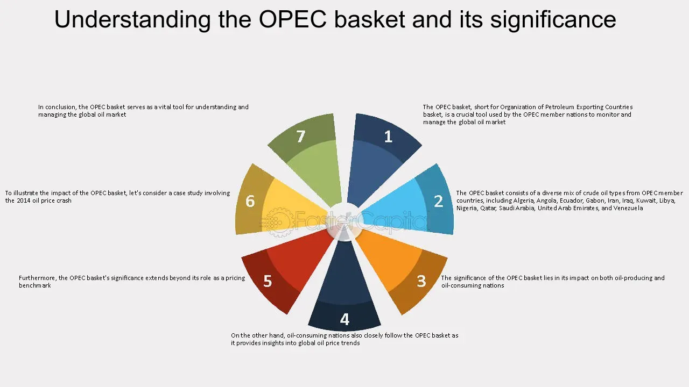

## Table of Contents

## What is the OPEC Basket?

The OPEC Basket is a collection of oil types from different countries that are part of the OPEC group. OPEC stands for Organization of the Petroleum Exporting Countries. The basket helps to show the average price of oil from these countries. It includes oil from places like Saudi Arabia, Nigeria, and Venezuela. By looking at the OPEC Basket, people can understand how much oil costs on average from these important oil-producing countries.

The OPEC Basket is important because it gives a clear picture of the oil market. When the price of the basket goes up or down, it can affect the world's economy. Many countries and companies watch the OPEC Basket to make decisions about buying and selling oil. It helps them know if oil is getting more expensive or cheaper. This way, the OPEC Basket is a useful tool for understanding the global oil market.

## How is the OPEC Basket price calculated?

The OPEC Basket price is figured out by taking the average price of different kinds of oil from OPEC countries. Each day, the prices of these oils are checked in places like the U.S. and Europe. The basket includes oil from countries like Saudi Arabia, Nigeria, and Venezuela. Each type of oil in the basket has its own price, and these prices are added up and then divided by the number of oils to get the average price.

This average price is important because it shows how much oil from OPEC countries costs overall. If the price of the OPEC Basket goes up, it means oil is getting more expensive. If it goes down, oil is getting cheaper. People and companies all over the world watch this price to help them make decisions about buying and selling oil. It's a helpful way to understand what's happening in the oil market.

## Which countries contribute to the OPEC Basket?

The OPEC Basket includes oil from several countries that are part of OPEC. These countries are Algeria, Angola, Congo, Ecuador, Gabon, Iran, Iraq, Kuwait, Libya, Nigeria, Saudi Arabia, United Arab Emirates, and Venezuela. Each of these countries adds a specific type of oil to the basket.

The basket helps to show the average price of oil from these OPEC countries. By looking at the prices of oil from Algeria, Angola, Congo, Ecuador, Gabon, Iran, Iraq, Kuwait, Libya, Nigeria, Saudi Arabia, United Arab Emirates, and Venezuela, people can understand how much oil costs overall. This average price is important for making decisions about buying and selling oil around the world.

## What are the different types of crude oil included in the OPEC Basket?

The OPEC Basket includes different types of crude oil from various countries. From Algeria, it's Saharan Blend; Angola contributes Girassol; Congo adds Djeno; Ecuador includes Oriente; Gabon has Rabi Light; Iran offers Iran Heavy; Iraq provides Basrah Medium; Kuwait adds Kuwait Export; Libya contributes Es Sider; Nigeria includes Bonny Light; Saudi Arabia offers Arab Light; United Arab Emirates adds Murban; and Venezuela includes Merey.

Each type of crude oil in the basket has its own characteristics, like how heavy or light it is, and how much sulfur it contains. These differences affect the price and how the oil is used. By looking at the average price of all these different oils, the OPEC Basket helps people understand the overall cost of oil from OPEC countries. This is important for making decisions about buying and selling oil around the world.

## How often is the OPEC Basket price updated?

The OPEC Basket price is updated every day. This means that every day, people check the prices of the different types of oil in the basket and then figure out the average price. This daily update helps everyone know the most recent price of oil from OPEC countries.

Having a daily update is important because the price of oil can change quickly. People and companies all over the world watch these daily prices to make decisions about buying and selling oil. By knowing the current price, they can plan better and react to changes in the oil market.

## What is the significance of the OPEC Basket in the global oil market?

The OPEC Basket is very important in the global oil market because it shows the average price of oil from OPEC countries. OPEC is a group of countries that produce a lot of the world's oil. By looking at the OPEC Basket, people can understand how much oil costs overall from these countries. This average price helps everyone know if oil is getting more expensive or cheaper. When the price of the OPEC Basket goes up or down, it can affect the whole world's economy.

Many countries and companies watch the OPEC Basket to make decisions about buying and selling oil. For example, if the price of the OPEC Basket is high, countries might decide to use less oil or look for other kinds of energy. On the other hand, if the price is low, they might buy more oil. The OPEC Basket is updated every day, so people always have the most recent information. This helps them plan better and react quickly to changes in the oil market.

## What are the advantages of using the OPEC Basket as a benchmark?

The OPEC Basket is a good benchmark because it shows the average price of oil from many different countries. This helps people understand the overall cost of oil from OPEC, which is a big group of oil-producing countries. When people use the OPEC Basket as a benchmark, they can see if oil prices are going up or down. This information is useful for making decisions about buying and selling oil. It's also updated every day, so people always have the latest information.

Another advantage of the OPEC Basket is that it helps everyone around the world know what's happening in the oil market. When the price of the OPEC Basket changes, it can affect the whole world's economy. Countries and companies watch the OPEC Basket to plan their oil use. If the price is high, they might decide to use less oil or find other energy sources. If the price is low, they might buy more oil. This way, the OPEC Basket helps people make smart choices about oil.

## How does the OPEC Basket influence oil pricing strategies?

The OPEC Basket helps countries and companies decide how to price oil. It shows the average price of oil from OPEC countries. When the OPEC Basket price goes up, oil companies might raise their prices too. If the price goes down, they might lower their prices to stay competitive. This way, the OPEC Basket acts like a guide for oil pricing. Companies look at it to see if they need to change their prices to match what's happening in the market.

The OPEC Basket also helps countries plan their oil use. If the price is high, countries might decide to use less oil or look for other energy sources. This can affect how much oil they buy and how they price it. If the price is low, they might buy more oil and keep their prices low too. By watching the OPEC Basket, countries and companies can make smart choices about oil. It helps them stay ready for changes in the oil market and set their prices in a way that makes sense.

## What criticisms are commonly leveled against the OPEC Basket?

Some people think the OPEC Basket has problems. One big problem is that it only includes oil from OPEC countries. This means it doesn't show the whole picture of the world's oil market. There are other important oil-producing countries outside of OPEC, like the United States and Russia, that the basket doesn't include. So, the OPEC Basket might not give a complete view of oil prices everywhere.

Another criticism is that the OPEC Basket can be affected by what OPEC countries decide to do. If OPEC decides to change how much oil they produce, it can change the price of the basket. This might not always show what's really happening in the market. Some people think this makes the OPEC Basket less reliable as a benchmark for oil prices. They say it's better to look at other benchmarks that include more types of oil from around the world.

## How does the OPEC Basket compare to other oil benchmarks like Brent and WTI?

The OPEC Basket, Brent, and WTI are all important ways to measure oil prices, but they are different in some ways. The OPEC Basket is made up of oil from OPEC countries only. It shows the average price of oil from these countries and is updated every day. Brent and WTI, on the other hand, are types of oil that come from specific places. Brent comes from the North Sea, and WTI comes from the United States. These benchmarks are often used to set prices for oil around the world, and they are watched closely by people in the oil industry.

One big difference is that the OPEC Basket only shows prices from OPEC countries, while Brent and WTI include oil from other places too. This means the OPEC Basket might not give a complete picture of the global oil market. Brent and WTI are seen as more reliable benchmarks because they are less likely to be affected by what OPEC decides to do. For example, if OPEC changes how much oil they produce, it can change the price of the OPEC Basket, but it might not affect Brent or WTI as much. So, people often use Brent and WTI to get a better idea of what's happening in the whole oil market.

## What impact does the OPEC Basket have on member countries' economies?

The OPEC Basket affects the economies of member countries a lot. When the price of the OPEC Basket goes up, it means the oil from these countries is more expensive. This can be good for countries that sell oil because they make more money. They can use this money to help their people, build roads, or make their country better. But if the price goes down, it can be hard for these countries. They might not make as much money from selling oil, and this can make it tough for them to pay for things they need.

The OPEC Basket also helps member countries plan their oil production. If the price is high, countries might decide to produce more oil to make more money. But if the price is low, they might produce less oil to try to make the price go up again. This can affect how much money they have and how their economy grows. So, the OPEC Basket is very important for these countries because it helps them know how much money they might make from oil and how to plan for the future.

## How have changes in the OPEC Basket composition affected its reliability and acceptance?

Changes in the OPEC Basket composition have affected how reliable and accepted it is. Over time, OPEC has added or taken away different types of oil from the basket. For example, they might add oil from a new country that joins OPEC or take away oil from a country that leaves. These changes can make it hard for people to trust the OPEC Basket as a good measure of oil prices. If the basket keeps changing, it might not show a clear picture of what's happening in the oil market.

When the OPEC Basket changes, some people might not want to use it anymore. They might think other benchmarks like Brent or WTI are better because they don't change as much. These other benchmarks include oil from more places around the world, so they might give a more complete view of the oil market. But even with these changes, the OPEC Basket is still important for OPEC countries. They use it to help plan their oil production and understand how much money they might make from selling oil.

## What is the OPEC Basket and how is it understood?

The OPEC Basket, officially known as the OPEC Reference Basket of Crude Oils, represents a critical indicator in the global oil market. This basket is a weighted average of oil prices from different OPEC (Organization of the Petroleum Exporting Countries) member nations, encapsulating a variety of crude oil types that each have unique pricing characteristics. Comprising a broad spectrum of crude oils ranging from light sweet to heavy sour blends, the OPEC Basket offers a comprehensive view of the price trends of oils traded on the global market.

The strategic importance of the OPEC Basket lies in its role as a key benchmark for monitoring global oil prices. OPEC utilizes this basket to set internal price targets and to influence overall market pricing. The diversity in the OPEC Basket reflects the varied sulfur content and API gravity of the crudes from member countries—properties that affect both the quality and pricing of each blend. Higher sulfur content generally reduces the price of crude oil due to the increased need for refinement, while light crudes with higher API gravity usually command higher prices.

OPEC's ability to use the basket as a tool for setting price targets is central to its market strategy, enabling the organization to make informed decisions on production quotas that can stabilize or influence market conditions. By adjusting output levels, OPEC aims to balance supply and demand to meet its price objectives, using the basket price as a guiding metric.

Mathematically, the price of the OPEC Basket can be expressed as:

$$
P_{\text{Basket}} = \frac{\sum_{i=1}^{n} (p_i \times w_i)}{\sum_{i=1}^{n} w_i}
$$

where $P_{\text{Basket}}$ is the price of the OPEC Basket, $p_i$ is the price of the $i^{th}$ crude type, $w_i$ is the weight assigned to the $i^{th}$ crude type, and $n$ is the total number of crude types in the basket. This formula illustrates how the weighted average is calculated, accentuating the significance of both the price and the proportion of each crude type in determining the overall basket price.

Through its role as a pricing benchmark, the OPEC Basket exerts profound influence on the global oil economy, impacting not only the member nations but also consumers and producers worldwide. This amalgamated price standard supports OPEC in maintaining a cohesive internal strategy while providing market participants with a crucial point of reference in understanding broader price trends.

## References & Further Reading

[1]: Al-Hajji, A. F. (2015). ["OPEC's Pricing Power: The Need for a Comprehensive Review."](https://link.springer.com/article/10.1057/s41264-024-00297-1) Middle East Institute Policy Brief.

[2]: Fattouh, B. (2007). ["OPEC Pricing Power: The Need for a New Perspective."](https://www.oxfordenergy.org/publications/opec-pricing-power-the-need-for-a-new-perspective/) Oxford Institute for Energy Studies.

[3]: Alden, C. L. (2018). ["Algorithmic trading and regulation in financial markets"](https://www.researchgate.net/publication/378548435_Algorithmic_Trading_and_AI_A_Review_of_Strategies_and_Market_Impact) University of Miami Law Review.

[4]: Dempster, M.A.H., & Leemans, V. (2006). ["An automated FX trading system using adaptive reinforcement learning"](https://www.sciencedirect.com/science/article/pii/S0957417405003015) in Expert Systems with Applications.

[5]: Filimonov, V., Bicchetti, D., Maystre, N., & Bouchaud, J.P. (2014). ["Quantification of the High Level of Endogeneity and of Structural Regime Shifts in Commodity Markets"](https://www.semanticscholar.org/paper/Quantification-of-the-High-Level-of-Endogeneity-and-Filimonov-Bicchetti/de75ac26ca624e21c7f7234f73308255d072b9b9) in The European Physical Journal B.