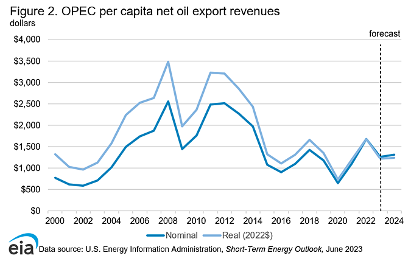

## Table of Contents

## What is OPEC and what does it stand for?

OPEC stands for Organization of the Petroleum Exporting Countries. It is a group of countries that work together to control the amount of oil they produce and sell. This helps them to keep oil prices stable and fair for everyone. OPEC was started in 1960 by five countries: Iran, Iraq, Kuwait, Saudi Arabia, and Venezuela.

Today, OPEC has 13 member countries. These countries meet regularly to talk about how much oil they should produce. By working together, they can make sure there is enough oil for the world and that the price of oil does not go too high or too low. This is important because oil is used for many things, like fuel for cars and heating homes.

## How many countries are members of OPEC and which are they?

OPEC has 13 member countries. These countries work together to manage the amount of oil they produce and sell.

The member countries are Algeria, Angola, Congo, Equatorial Guinea, Gabon, Iran, Iraq, Kuwait, Libya, Nigeria, Saudi Arabia, United Arab Emirates, and Venezuela. By working together, these countries help keep oil prices stable for everyone around the world.

## What is the primary goal of OPEC?

The main goal of OPEC is to keep oil prices stable and fair. They do this by controlling how much oil their member countries produce and sell. If there is too much oil, the price can go down, and if there is not enough oil, the price can go up. By working together, OPEC helps make sure there is just the right amount of oil for everyone.

OPEC also wants to make sure that the countries that produce oil get a good price for it. This is important because oil is a big part of their economy. When oil prices are stable, it helps these countries plan for the future and invest in things like schools and hospitals. So, OPEC's work is not just about oil, but also about helping its member countries grow and develop.

## How does OPEC influence global oil prices?

OPEC influences global oil prices by deciding how much oil its member countries should produce. If OPEC decides to produce less oil, there will be less oil available in the world. When there is less oil, the price goes up because people are still trying to buy the same amount of oil, but there is not enough to go around. On the other hand, if OPEC decides to produce more oil, there will be more oil available, and the price can go down because there is more than enough for everyone.

OPEC's decisions are important because many countries around the world depend on oil for things like fuel for cars, heating homes, and making electricity. When OPEC changes how much oil they produce, it can affect the price of oil everywhere. This is why OPEC's meetings are watched closely by people all over the world. They want to know if the price of oil is going to go up or down, so they can plan for the future.

## What are the mechanisms OPEC uses to manage oil production?

OPEC manages oil production mainly by setting production quotas for its member countries. This means they decide how much oil each country is allowed to produce. They do this by having meetings where all the member countries come together and talk about how much oil the world needs. If they think there is too much oil and the price is going down, they might tell everyone to produce less. If they think there is not enough oil and the price is going up too much, they might tell everyone to produce more.

To make sure everyone follows the rules, OPEC keeps track of how much oil each country is producing. They use reports and data to see if everyone is sticking to their quotas. If a country produces more oil than they are supposed to, it can cause problems because it might make the price of oil go down. So, OPEC tries to make sure everyone works together and follows the plan. This helps keep the oil market stable and fair for everyone.

## How do OPEC decisions impact member countries' economies?

OPEC decisions can have a big impact on the economies of its member countries. When OPEC decides to produce less oil, the price of oil usually goes up. This is good for member countries because they can sell their oil for more money. More money from oil sales means these countries can spend more on things like schools, hospitals, and roads. It also helps them save money for the future. But if the price goes up too much, it can make it hard for other countries to buy oil, which might hurt the global economy.

On the other hand, if OPEC decides to produce more oil, the price of oil usually goes down. This can be bad for member countries because they get less money for their oil. When they get less money, they might have to cut back on spending for important things. But a lower oil price can be good for countries that buy oil because they have to spend less money on it. So, OPEC has to balance what is good for its members with what is good for the rest of the world.

## What role does OPEC play in managing oil wealth within its member countries?

OPEC helps its member countries manage their oil wealth by setting rules on how much oil they can produce. This helps keep oil prices stable, which is important because oil is a big part of these countries' economies. When oil prices are high, member countries can earn more money from selling oil. They can use this money to build schools, hospitals, and roads, and to save for the future. OPEC's decisions help make sure that these countries get a fair price for their oil, which is important for their economic growth.

But managing oil wealth is not just about making money. OPEC also helps its member countries plan for the future. When oil prices are stable, it's easier for these countries to make long-term plans. They can invest in other parts of their economy, like farming or technology, so they are not just relying on oil. This helps them build a stronger and more diverse economy, which is good for everyone in the country. By working together, OPEC helps its members use their oil wealth wisely.

## How does OPEC address the challenge of oil revenue volatility?

OPEC tries to keep oil prices steady to help its member countries deal with the ups and downs of oil revenue. They do this by deciding how much oil each country should produce. If the price of oil starts to drop because there's too much oil, OPEC might tell everyone to produce less. This makes the price go back up. If the price goes up too much because there's not enough oil, OPEC might tell everyone to produce more, which brings the price down. By doing this, OPEC helps make sure that the money its member countries get from selling oil doesn't change too much.

Even with these efforts, oil prices can still go up and down because of things OPEC can't control, like wars, natural disasters, or changes in how much oil people want to buy. To handle this, OPEC's member countries often save some of their oil money in special funds. These funds can be used when oil prices drop, so the countries can still pay for important things like schools and hospitals. By saving money when times are good, these countries can be ready for times when oil prices are not so good.

## What are the strategies OPEC countries use to diversify their economies away from oil?

OPEC countries know that depending too much on oil can be risky. So, they are trying to make money from other things too. They are investing in things like farming, making things, and tourism. For example, some countries are building factories to make cars or electronics. Others are trying to grow more food so they don't have to buy it from other places. By doing this, they hope to have more ways to make money and not just rely on oil.

Another way OPEC countries are trying to diversify is by focusing on services and technology. They are building better schools and universities to teach people new skills. This helps them start businesses in areas like computer programming, health care, and finance. Some countries are also trying to attract tourists by building nice hotels and showing off their culture and history. By having a mix of different ways to make money, these countries can be more stable and grow even if oil prices go down.

## How does OPEC coordinate with non-OPEC oil-producing countries?

OPEC works with countries that are not part of OPEC to help keep oil prices stable. They do this by talking to these countries and making agreements about how much oil everyone should produce. For example, in 2016, OPEC and some non-OPEC countries, like Russia, made a deal to cut back on how much oil they were producing. This helped make sure there was not too much oil and the price did not go down too much.

These agreements are important because they help everyone work together to keep the oil market balanced. When OPEC and non-OPEC countries work together, they can make sure there is enough oil for everyone without the price going too high or too low. This is good for both the countries that produce oil and the countries that buy it. By working together, they can make the oil market more stable and fair for everyone.

## What are the geopolitical implications of OPEC's oil management policies?

OPEC's oil management policies can affect how countries get along with each other. When OPEC decides to produce less oil, the price of oil goes up. This can make countries that need to buy oil unhappy because they have to pay more. Sometimes, these countries might blame OPEC and try to find other ways to get oil, like making friends with other oil-producing countries that are not in OPEC. This can lead to tension and disagreements between countries.

On the other hand, when OPEC works with countries outside of the group, like Russia, to manage oil production, it can help keep the peace. By working together, they can make sure there is enough oil for everyone and the price stays fair. This can make countries feel more secure and less likely to fight over oil. But if OPEC's decisions seem unfair to some countries, it can still cause problems and make it harder for countries to work together.

## How has OPEC's role and effectiveness evolved in response to global energy transitions?

OPEC's role has changed a lot because of new ways to get energy, like wind, solar, and electric cars. These new energy sources mean that countries don't need as much oil as before. This makes it harder for OPEC to control oil prices because there are other choices. But OPEC is still important because many places around the world still use a lot of oil. So, OPEC has to think about how to keep oil prices stable while more and more people use different kinds of energy.

OPEC is trying to stay important by working with other countries that produce oil, even if they are not part of OPEC. They make deals to control how much oil everyone produces so the price stays fair. OPEC also knows that oil won't be the only energy source forever, so they are helping their member countries find other ways to make money. They are investing in things like farming, making things, and tourism. This way, if people use less oil in the future, these countries can still have strong economies.

## References & Further Reading

Colgan, J. D. (2014). *Oil, Domestic Politics, and International Conflict*. Energy Studies Review. This study examines the relationship between oil wealth and political stability, highlighting how domestic politics within oil-producing nations affect international relations and market dynamics. 

Adelman, M. A. (1982). *OPEC as a Cartel*. Energy Economics. Adelman's analysis explores the cartel-like behavior of OPEC, evaluating its strategies to control oil prices and production levels, and its implications for global markets.

Lopez, H., & Arnaut, D. (2017). *The Effect of OPEC Announcements and Related News on World Oil Prices*. SSRN Electronic Journal. This paper investigates the immediate effects of OPEC's public statements on oil price [volatility](/wiki/volatility-trading-strategies), using a data-driven approach to quantify market reactions.

Pichler, P., & Selvan, S. (2019). *Impact of OPEC's Competitive Strategic Behavior on Oil Market Prices and Market Conditions*. Journal of Energy & Natural Resources Law. The authors assess how competitive strategies within OPEC influence oil price stability and market conditions, providing insights into the ripple effects of OPEC's policy decisions.

