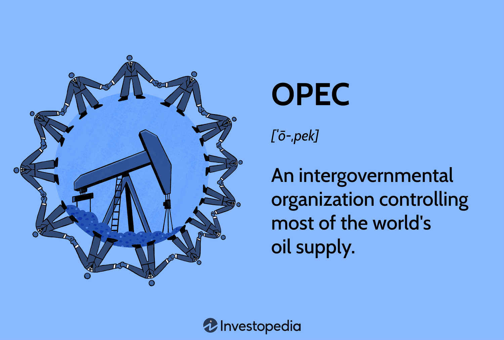

The global oil market operates as a multifaceted ecosystem influenced by diverse factors such as geopolitical tensions, technological advancements, and economic policies. Pooling these factors together is the Organization of Petroleum Exporting Countries (OPEC) along with its allies, known collectively as OPEC+. This coalition plays a pivotal role in influencing global oil dynamics through coordinated efforts in production and pricing strategies.

Understanding the impact of OPEC's petroleum exporting decisions is crucial in grasping the function of the oil market today. OPEC's policy directives notably affect crude oil prices and supply chain intricacies, often causing ripple effects across global markets. The organization's capacity to manage oil output levels enables it to exert significant control over the crude oil supply, which, in turn, influences the market's pricing mechanisms.



Interwoven with these geopolitical maneuvers, algorithmic trading has introduced a layer of sophistication to market operations. This method of trading uses automated systems to conduct transactions at unparalleled speeds, based on complex algorithms that process market data. Algorithmic trading amplifies the effects of OPEC's policy decisions by quickly reacting to and speculating on market changes, thereby increasing market volatility.

This article will explore the intersection between OPEC's policy decisions and algorithmic trading, examining the profound influence OPEC wields over oil prices, and how algorithmic trading escalates these impacts. The interaction between these factors is complex and offers both opportunities and hurdles for investors navigating this volatile market. Identifying and understanding these nuances is vital for developing a strategic approach to investment in the oil sector. 

By entwining the roles of OPEC and algorithmic trading, market participants can gain an advanced understanding of the oil market's inner workings and the various elements that drive its fluctuations. Such knowledge is indispensable for crafting strategies that not only mitigate risks but also maximize potential returns within this dynamic field.

## Table of Contents

## Understanding OPEC and its Influence

OPEC, the Organization of Petroleum Exporting Countries, was founded in 1960 by five major oil-producing nations: Iran, Iraq, Kuwait, Saudi Arabia, and Venezuela. The establishment of OPEC marked a significant shift in global oil politics, aimed at unifying and coordinating petroleum policies among member nations to secure fair and stable prices for petroleum producers. This collaborative effort also aimed to ensure an efficient, economic, and regular supply of petroleum to consuming nations while securing a fair return on capital to investors in the oil industry.

As of today, OPEC comprises 13 member countries, which collectively hold about 79.4% of the world's proven oil reserves, according to the latest data from OPEC's annual report. The member nations include Algeria, Angola, the Republic of the Congo, Equatorial Guinea, Gabon, Iran, Iraq, Kuwait, Libya, Nigeria, Saudi Arabia, the United Arab Emirates, and Venezuela. This concentration of reserves gives OPEC a significant influence over global oil prices and market dynamics.

OPEC's primary mission is centered around the stabilization of the oil market. Through coordinated production decisions, the organization seeks to manage the balance between supply and demand, thereby ensuring that fluctuations in oil prices are minimized. This is achieved by adjusting the collective output of member countries to respond to major economic or geopolitical events, natural disasters, or shifts in energy demand.

The organization plays a pivotal role in the oil market by making decisions that often lead to substantial price shifts. These decisions are closely watched by governments, financial markets, and analysts worldwide. For instance, decisions to cut production quotas generally lead to a tightening of supply, which in turn can drive up oil prices if demand remains constant or increases. Conversely, decisions to increase production can lead to an oversupply situation, potentially causing prices to fall. The price-setting power of OPEC is further complicated by the interests of individual member nations, each with its own economic requirements and political agendas.

OPEC's capacity to influence global oil markets extends beyond the mere setting of production targets. The organization's strategies and policies can lead to significant economic impacts worldwide. For instance, fluctuations in oil prices can affect inflation rates, currency values, and the balance of trade for both oil-importing and oil-exporting countries. In some instances, they have resulted in substantial shifts in national economic policies, especially in nations heavily reliant on oil imports or exports.

Historically, OPEC's influence has been seen during events such as the 1973 oil crisis, where an embargo led to soaring oil prices and significant economic challenges across the world. More recently, the challenges posed by COVID-19 have seen OPEC adjusting production targets in response to unprecedented fluctuations in oil demand. The recent dynamics within OPEC and its ability to adapt its strategy in collaboration with non-OPEC oil-producing nations (known collectively as OPEC+) further highlight the organization's continued significance in the global oil market. 

Overall, OPEC’s influence is an integral [factor](/wiki/factor-investing) in the structure of the global oil market, affecting countries economically and politically worldwide.

## Algorithmic Trading in the Oil Market

Algorithmic trading employs automated systems that execute trades based on predefined criteria, and it significantly impacts the dynamics of the oil market. These trading systems utilize complex algorithms to analyze vast datasets, allowing traders to make rapid decisions and capitalize on short-term price fluctuations. The oil market, with its intrinsic [volatility](/wiki/volatility-trading-strategies), becomes even more complex with the advent of these automated systems.

In the oil market, [algorithmic trading](/wiki/algorithmic-trading) adds another layer of complexity to price movements. Algorithms are designed to respond swiftly to a variety of market signals, including political events, supply disruptions, and particularly announcements from the Organization of Petroleum Exporting Countries (OPEC). This rapid response capability often results in amplified volatility, as algorithms trigger trades based on predetermined strategies without human intervention. For instance, when OPEC announces changes in production quotas, algorithmic trading platforms can execute a large number of trades almost instantaneously, reacting to the anticipated changes in supply and demand dynamics.

Moreover, these algorithms typically rely on technical indicators rather than underlying market fundamentals, which can intensify price swings. Technical indicators may include moving averages, price [momentum](/wiki/momentum), and [liquidity](/wiki/liquidity-risk-premium) metrics, among others. The lack of consideration for fundamental factors such as geopolitical stability, economic outlook, and actual changes in oil inventories can result in exaggerated market movements. This disconnect from fundamentals means that algorithmic systems may interpret a slight shift in OPEC policy as a significant market event, leading to disproportionately large reactions in oil prices.

The formula for a simple moving average (SMA), which might be used by algorithmic trading systems, is:

$$
\text{SMA} = \frac{P_1 + P_2 + \cdots + P_n}{n}
$$

where $P_1, P_2, \ldots, P_n$ are the prices over the period of interest, and $n$ is the number of observations. Such calculations allow algorithms to predict trends and execute corresponding trades.

Additionally, algorithmic trading can involve more complex models, such as [machine learning](/wiki/machine-learning) algorithms, which continually learn and adapt from previous trade outcomes. These models can process a vast array of input variables, ensuring they remain responsive to the highly dynamic conditions of the oil market. Below is an example of a simple algorithm using Python to simulate trading based on moving averages:

```python
import pandas as pd

# Simulated oil price data
prices = pd.Series([50, 51, 52, 53, 54, 55, 56, 57, 55, 54, 53, 52, 51])

# Calculate simple moving average
def simple_moving_average(data, window):
    return data.rolling(window=window, min_periods=1).mean()

# Trading strategy based on moving average
def trading_strategy(prices, window=3):
    sma = simple_moving_average(prices, window)
    signals = []

    for i in range(1, len(prices)):
        if prices[i] > sma[i] and prices[i-1] <= sma[i-1]:  # Buy signal
            signals.append('Buy')
        elif prices[i] < sma[i] and prices[i-1] >= sma[i-1]:  # Sell signal
            signals.append('Sell')
        else:
            signals.append('Hold')

    return signals

# Execute the strategy
signals = trading_strategy(prices)
print(signals)
```

In this context, it becomes evident that algorithmic trading, while offering opportunities for profitable trades, can also pose risks due to its potential to exacerbate market volatility. Traders must navigate these challenges by continuously updating their algorithmic models to account for both market dynamics and potential OPEC policy changes.

## OPEC's Impact on Oil Prices through Algorithmic Trading

OPEC's decisions on oil production have a direct and significant effect on global [crude oil](/wiki/crude-oil) prices. The fluctuating production levels set by OPEC dictate the supply side of the equation, which, when combined with global demand, determines the price of oil. Algorithmic trading, which leverages models and automated systems to execute trades, further impacts these price movements by adding a layer of complexity and speed that can result in exaggerated market reactions.

Algorithmic traders act swiftly following OPEC announcements, using market signals to execute high-frequency trades. This rapid response can amplify price volatility, as algorithms are designed to react to market conditions rather than evaluate underlying economic fundamentals. This often leads to significant price swings, which may not reflect the actual state of supply and demand.

Market sentiment, driven heavily by algorithms, can lead to trends that are either bullish or bearish. In bullish trends, algorithms may trigger buying sprees, enhancing upward prices, whereas in bearish scenarios they might catalyze sell-offs, driving prices down. These exaggerated price movements cause instability in the oil market, posing challenges for both oil producers, who may face unpredictable revenue streams, and consumers, who experience fluctuating costs.

Recent scenarios illustrate these dynamics where algorithm-driven trades have intensified market reactions following OPEC's production announcements. For instance, when OPEC decides to cut production to stabilize prices, algorithms might interpret this as a bullish signal, driving prices higher at a faster rate than anticipated. Conversely, announcements of increased production may be rapidly perceived as bearish, with algorithms accelerating price declines.

In summary, while OPEC plays a crucial role in setting oil prices through its production policies, the presence of algorithmic trading can magnify the effects of these decisions, leading to increased market volatility and added complexity for participants seeking to navigate this intricate landscape.

## Opportunities and Challenges for Investors

Understanding the dual influence of OPEC's strategic decisions and the role of algorithmic trading is crucial for investors who seek to navigate and capitalize on the global oil market volatility. OPEC's announcements regarding oil production quotas can lead to immediate and significant impacts on crude oil prices. Algorithmic trading systems, which execute trades based on pre-designed criteria without human intervention, can exacerbate these price dynamics by reacting swiftly to OPEC's market signals.

For investors, the key opportunity lies in harnessing the market volatility that arises from the interaction between OPEC's policy decisions and algorithmic trading. This volatility can present substantial profit opportunities. For instance, algorithmic models often respond to OPEC's policy announcements by quickly buying or selling oil futures, potentially creating short-term price trends. Savvy investors who predict these movements, perhaps using advanced market analysis tools like sentiment analysis or predictive algorithms, can position themselves to benefit financially from short-lived price oscillations.

However, this same volatility introduces significant challenges. The unpredictable nature of algorithm-driven market behavior can generate sharp price swings that are not necessarily reflective of underlying market fundamentals. This increased volatility can result in market instability, posing risks to both short-term traders and long-term investors. A sophisticated understanding of these patterns, coupled with a calculated risk management strategy, is essential to mitigate potential losses.

Staying updated on OPEC's policies and announcements is critical for anticipating changes in oil market dynamics. Investors can employ tools such as automated alerts or specialized news feeds to receive timely updates. Furthermore, algorithmic prediction models rooted in machine learning and statistical analysis can enhance an investor's ability to react appropriately to OPEC's policies and ensuing market responses.

In balancing these factors, investors can leverage the combined knowledge of OPEC's strategies and the predictable patterns of algorithmic trading. Engaging with quantitative analysis methods, such as those performed in Python using libraries like NumPy for data manipulation and Scikit-learn for predictive modeling, may afford a competitive advantage.

Here is a basic Python code snippet for setting up a model to predict market responses to OPEC's announcements:

```python
import numpy as np
from sklearn.model_selection import train_test_split
from sklearn.ensemble import RandomForestRegressor

# Dummy dataset with historical oil prices and OPEC announcements
data = np.array([[...], [...]])  # Placeholder for actual data
prices = data[:, 0]
features = data[:, 1:]

# Split into training and test datasets
X_train, X_test, y_train, y_test = train_test_split(features, prices, test_size=0.2, random_state=42)

# Initialize and train a RandomForest model
model = RandomForestRegressor(n_estimators=100, random_state=42)
model.fit(X_train, y_train)

# Predict future prices based on test data
predicted_prices = model.predict(X_test)

# Evaluate model accuracy
accuracy = model.score(X_test, y_test)
print(f"Model accuracy: {accuracy:.2f}")
```

Such predictive modeling can offer insights into potential market movements following OPEC announcements, presenting investors with refined strategies for optimizing their market positions.

By carefully balancing the opportunities with the inherent risks, investors can navigate the complexities of the global oil market landscape more effectively, thereby realizing lucrative opportunities while mitigating potential downsides.

## Conclusion

The interplay between the influence of the Organization of the Petroleum Exporting Countries (OPEC) and the intricacies of algorithmic trading is fundamentally reshaping the global oil market. As OPEC continues to assert its pivotal role in establishing oil prices, its decisions reverberate more powerfully across markets due to the amplification effects of algorithmic trading. This phenomenon underscores the necessity for investors and market participants to adapt to the evolving landscape, seizing emerging opportunities while being mindful of potential pitfalls. 

In this dynamically shifting market environment, a deep and cohesive understanding of OPEC strategies in conjunction with algorithmic trading patterns is crucial for achieving market success. The unpredictable nature of algorithmic trading, characterized by its rapid response to market stimuli and propensity to disregard underlying fundamentals, magnifies price fluctuations initiated by OPEC's policy announcements. This magnification can result in market instability, which poses both challenges and opportunities for strategic investors.

As the oil industry gradually transitions towards more sustainable and environmentally friendly practices, these dynamics will inevitably continue to evolve. The transition introduces additional variables, such as regulatory changes and technology-driven efficiencies, requiring constant vigilance and strategic adaptability from all market participants. By anticipating and reacting to these changes with informed strategies, investors can position themselves advantageously in a landscape that, though volatile, promises substantial opportunities for those adept at navigating its complexities.

## References & Further Reading

[1]: Colgan, J. D. (2014). ["Oil, Domestic Politics, and International Conflict."](https://www.sciencedirect.com/science/article/pii/S221462961400019X) Energy Studies Review.

[2]: Adelman, M. A. (1982). ["OPEC as a Cartel."](https://www.taylorfrancis.com/chapters/edit/10.4324/9781315627359-2/opec-cartel-adelman) Energy Economics.

[3]: Lopez, H., & Arnaut, D. (2017). ["The Effect of OPEC Announcements and Related News on World Oil Prices."](https://pubmed.ncbi.nlm.nih.gov/28943267/) SSRN Electronic Journal.

[4]: Pichler, P., & Selvan, S. (2019). ["Impact of OPEC's Competitive Strategic Behavior on Oil Market Prices and Market Conditions."](https://iopscience.iop.org/article/10.1088/1748-9326/ab19e1) Journal of Energy & Natural Resources Law.

[5]: Gomber, P., Arndt, B., Lutat, M., & Uhle, T. (2011). ["High-Frequency Trading."](https://papers.ssrn.com/sol3/papers.cfm?abstract_id=1858626) Business & Information Systems Engineering.

[6]: Parsons, J. E. (2015). ["The Power of Oil: How Oil Fueled Foreign Policy in the Twentieth Century."](https://www.tandfonline.com/doi/full/10.1080/2158379X.2011.555960) Cambridge University Press.

[7]: Ullal, A., & Carr, I. (2019). ["Quantitative Analysis, Derivatives Modeling, and Trading Strategies in the Presence of Counterparty Credit Risk for the Fixed-Income Market."](https://worldscientific.com/worldscibooks/10.1142/4228) Palgrave Macmillan.