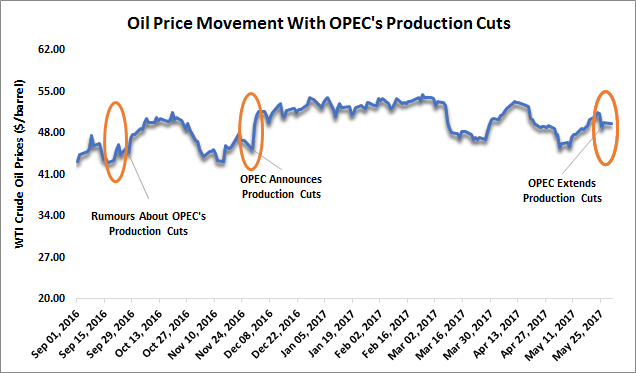

The global oil market represents a highly intricate and evolving domain, substantially influenced by pivotal entities such as the Organization of the Petroleum Exporting Countries (OPEC) and the United States. This market's complexity arises not only from the traditional supply and demand dynamics but also from the interplay of geopolitical, economic, and technological variables. In recent years, algorithmic trading has emerged as a powerful force impacting oil prices. This development has led to a growing discourse on whether algorithmic trading provides the United States with a mechanism to potentially influence OPEC-driven oil prices.

Algorithmic trading involves using sophisticated mathematical models and computer algorithms to automate and optimize trading decisions, a practice that can introduce rapid price shifts and volatility into the market. The rise of this technology indicates a shift towards a more technology-centric trading environment, where traditional factors governing market price movements may be influenced or even supplanted by algorithmic strategies. This leads to a significant conversation regarding the extent of control any single player, including the US, might exert over global oil prices through these technological advancements.

Within the context of evolving oil markets, it is imperative to understand how technological innovations like algorithmic trading intersect with geopolitical strategies. The strategic actions of both OPEC and the United States continue to be central to oil price determination on a global scale. Nevertheless, the introduction of algorithmic mechanisms highlights the changing nature of market influence and control.

This article investigates into the influence of algorithmic trading on oil pricing, the pivotal roles that the US and OPEC play in this domain, and the broader implications of these developments on discussions about market control. Through a detailed examination of these elements, the article sheds light on the future of oil price control and the critical intersection of technology and strategy in shaping the energy landscape.

## Table of Contents

## Understanding the Role of OPEC

Founded in 1960, the Organization of the Petroleum Exporting Countries (OPEC) has played a pivotal role in shaping the global oil markets. OPEC's primary mechanism for influencing oil prices has been its ability to adjust production levels to align with its economic and political objectives. By regulating their member countries' oil production, OPEC can exert considerable influence on global oil supply and, consequently, prices.

OPEC's influence was most prominently demonstrated during the oil embargo of 1973. In response to geopolitical tensions, particularly the support of Western countries for Israel during the Yom Kippur War, OPEC countries significantly reduced their oil exports. This strategic reduction led to a dramatic increase in oil prices, exemplifying OPEC's capacity to cause global economic disruption. The embargo marked a turning point, highlighting the vulnerabilities and dependencies of oil-consuming nations on OPEC-controlled production.

Saudi Arabia stands out as a key player within OPEC, not only due to its vast oil reserves but also because of its pivotal role in the organization's decision-making processes. As the largest oil producer within OPEC, Saudi Arabia often steers the strategic direction and policy decisions of the organization. This influential position allows Saudi Arabia to balance the interests of OPEC member states while addressing its own economic and political considerations.

Despite accusations of OPEC operating as a cartel to manipulate oil prices, the organization's internal dynamics present competitive pressures that challenge its unified front. Member countries often have differing economic needs and production capabilities, leading to tensions regarding output levels and pricing policies. These internal challenges necessitate continuous negotiations to maintain group cohesion and the effectiveness of coordinated actions.

The establishment of OPEC+ marked a significant evolution in the organization's strategy. OPEC+ includes additional major non-OPEC oil-producing countries, such as Russia, which participate in coordinated oil production agreements. This expansion has further consolidated OPEC's influence on the global stage by incorporating the production capabilities of critical non-member states, thereby enhancing its collective ability to influence global oil prices. By collaborating with these countries, OPEC+ can achieve a broader impact, extending its reach beyond its original membership to shape global oil market dynamics more effectively.

## The Influence of the United States on Oil Prices

The United States has historically been a significant player in the global oil market, serving as both a leading producer and a substantial consumer. This dual role has allowed the US to exert considerable influence over global oil prices. A transformative [factor](/wiki/factor-investing) in recent years has been the advancement of hydraulic fracturing, commonly known as fracking. This technology has significantly boosted domestic oil production, propelling the US to become one of the largest oil producers globally, and thus altering global supply dynamics.

Hydraulic fracturing involves injecting high-pressure fluid into subterranean rock formations to release oil and gas. This technology has unlocked vast reserves of shale oil in the United States, which were previously considered uneconomical to extract. As a consequence, the US has reduced its dependency on oil imports, fostering a degree of energy independence. This surge in domestic production has disrupted traditional oil trade flows and contributed to changes in international oil pricing structures.

In parallel, the United States government has occasionally undertaken legislative efforts targeting OPEC. One notable example is the introduction of various proposals aimed at applying antitrust laws to OPEC, which is often perceived as a cartel due to its coordinated production decisions among member countries. These legislative maneuvers, though not yet realized into law, underscore the strategic importance the US places on maintaining leverage over global oil markets.

Domestic policies within the US continue to navigate the balance between reliance on imported oil and achieving energy autonomy. This balance is influenced by factors such as environmental considerations, economic priorities, and technological advancements. Policies promoting renewable energy sources and stricter environmental regulations can affect domestic oil production levels and consumption patterns, further influencing global oil dynamics.

The dynamics described shape the interactions and rivalry between the US and OPEC, impacting global oil price trends. As US production capabilities grow, they challenge OPEC's traditional role in setting oil prices through supply control. However, OPEC's influence persists due to its substantial share of global oil reserves and production. The interaction between US domestic policies, technological advancements, and geopolitical strategies contributes to the complex landscape of the global oil market, where the US plays a pivotal but not unilateral role in influencing oil prices.

## The Rise of Algorithmic Trading in Oil Markets

Algorithmic trading in oil markets represents a significant evolution in the way trading operations are conducted, leveraging computational power and complex algorithms to execute and manage trades automatically. This approach enables traders to process vast amounts of data and efficiently deploy trading strategies, which can lead to intensified market movements. The deployment of these technologies is increasingly defining the dynamics of modern oil markets.

Commodity trading advisors (CTAs) play an essential role in this scene by utilizing trend-following algorithms. These algorithms are designed to identify and capitalize on market trends, employing strategies that often involve buying or selling futures contracts based on predetermined indicators or statistical models. As a result, CTAs can contribute to amplified price swings, particularly in response to significant market events or announcements. For example, a strategic production cut announcement by the Organization of the Petroleum Exporting Countries (OPEC) might trigger programmed trading actions from CTAs, leading to rapid price escalations or declines.

Recent studies have highlighted that [algorithmic trading](/wiki/algorithmic-trading) can increase market [volatility](/wiki/volatility-trading-strategies) following OPEC's announcements. This volatility is often characterized by sharp sell-offs or price surges as algorithms react to the new information. The automated nature of these systems allows them to respond far more quickly than human traders, often exacerbating short-term fluctuations. Such volatility can pose challenges to traditional market actors and requires a reevaluation of risk management strategies.

The prevalence of algorithmic trading marks a shift towards a technology-driven trading landscape where traditional market fundamentals, such as physical supply and demand metrics, may play a secondary role. Instead, market dynamics are increasingly shaped by quantitative factors and the speed of data processing, which can disconnect market prices from underlying physical realities. This shift compels market participants to incorporate advanced technological competencies into their operations to remain competitive.

Analyzing trends within algorithmic trading is crucial to comprehending its impact on the manipulation or stabilization of market prices. By modeling the behavior of algorithms and understanding their triggers and thresholds, traders and policymakers can gain insights into potential price movements and market stability. Moreover, regulatory bodies and exchanges must consider the implications of algorithmic trading on market integrity and fairness, ensuring that technological advancement does not undermine market confidence.

In summary, the rise of algorithmic trading in the oil markets introduces both opportunities and challenges. While it enables greater efficiency and the potential for improved [liquidity](/wiki/liquidity-risk-premium), it also necessitates an awareness of the risks associated with increased volatility and the potential disconnect from market fundamentals. As technology continues to advance, adapting to its influence on oil trading is essential for both market participants and regulators.

## Analyzing the Debate: Can the US Control OPEC Oil Prices?

The debate on whether the United States can control OPEC oil prices hinges significantly on several interrelated factors, including technological leverage, market position, and policy. While direct control over OPEC's decision-making remains outside US capabilities, its influence is palpable through advancements in technology and shifts in domestic production. The rise of hydraulic fracturing has notably altered the supply-demand dynamics, propelling the US into a position where it can indirectly sway market trends by altering the global oil supply landscape.

Technological innovations such as algorithmic trading have introduced sophisticated mechanisms that can impact oil price movements. However, it's essential to recognize that such technological tools primarily induce short-term volatility rather than overriding long-term economic and geopolitical forces. Algorithmic trading systems, often designed to respond rapidly to market signals, can cause rapid price fluctuations, particularly after major announcements by OPEC. While these can lead to significant swings, they do not fundamentally change market equilibrium which is determined by broader supply and demand dynamics.

The relationship between US energy policies and market regulations further compounds the complexity of influencing OPEC oil prices. Legislative efforts within the US, such as proposals to apply antitrust laws to OPEC, reflect ongoing tensions but have yet to manifest in substantial control over OPEC's pricing strategies. The strategic interplay between these policies and OPEC's responses highlights the intricate balance of power that characterizes the global oil market.

Understanding these multifaceted relationships is indispensable for stakeholders seeking to predict future trends in oil markets. Investment decisions are increasingly dependent on an appreciation of how technological advancements interact with policy and market dynamics. While the US can exert influence, the extent of its control is inherently limited by the geopolitical and economic realities underpinning global oil supply and demand.

In conclusion, while the US holds tools that can affect immediate pricing environments, enduring control over OPEC oil prices remains elusive. The interplay of factors involved requires a nuanced understanding of both market mechanics and international relations, urging stakeholders to continuously adapt their strategies in response to an ever-evolving economic landscape.

## Conclusion

The intricate dynamic between the United States, OPEC, and algorithmic trading continues to shape the complexities of the oil markets. Algorithmic trading, characterized by its ability to rapidly execute trades via sophisticated algorithms, can lead to significant short-term price volatility. However, the broader and more enduring control over oil prices is still largely influenced by OPEC’s strategic policies and the overarching global demand factors. 

The balance between technological advancements and geopolitical strategies will be essential in ensuring future market stability and effective price control. Technological tools such as algorithmic trading offer tactical advantages but must be harmonized with the geopolitical maneuvers of key players like OPEC and the US. 

Both investors and policymakers face the challenge of navigating this intricate landscape, with the dual aim of capitalizing on arising opportunities and mitigating associated risks. As technology becomes more deeply embedded in market activities, there is an increasing need for a flexible and informed approach to understanding and influencing oil prices. This adaptability is paramount as traditional market dynamics intersect with rapid technological innovation, creating a continuously evolving oil market landscape.

## References & Further Reading

[1]: ["The Prize: The Epic Quest for Oil, Money, and Power"](https://www.amazon.com/Prize-Epic-Quest-Money-Power/dp/1439110123) by Daniel Yergin

[2]: ["Oil, Power, and War: A Dark History"](https://www.amazon.com/Oil-Power-War-Dark-History/dp/1603587438) by Matthieu Auzanneau

[3]: Fattouh, B., & Economou, A. (2018). ["OPEC at 60: Evolution and Change."](https://onlinelibrary.wiley.com/doi/full/10.1111/opec.12205) Oxford Institute for Energy Studies.

[4]: ["Oil and the Economy of Russia: From the Late-Tsarist to the Post-Soviet Period"](https://www.taylorfrancis.com/books/mono/10.4324/9781315277509/oil-economy-russia-nat-moser) by Nat Moser

[5]: Carney, M. (2020). ["The impact of algorithmic trading on financial markets: A literature review."](https://www.researchgate.net/publication/378548435_Algorithmic_Trading_and_AI_A_Review_of_Strategies_and_Market_Impact) Bank of England Working Paper.

[6]: Grinblatt, M., & Titman, S. (1989). ["Mutual Fund Performance: An Analysis of Quarterly Portfolio Holdings."](https://www.jstor.org/stable/2353353) Journal of Business, 62(3), 393-416.

[7]: ["OPEC: History and Strategies of an Oil Cartel"](https://www.cfr.org/backgrounder/opec-changing-world) by Dag Harald Claes

[8]: Bergstra, J., Bardenet, R., Bengio, Y., & Kégl, B. (2011). ["Algorithms for Hyper-Parameter Optimization."](https://proceedings.neurips.cc/paper/2011/file/86e8f7ab32cfd12577bc2619bc635690-Paper.pdf) Advances in Neural Information Processing Systems 24.