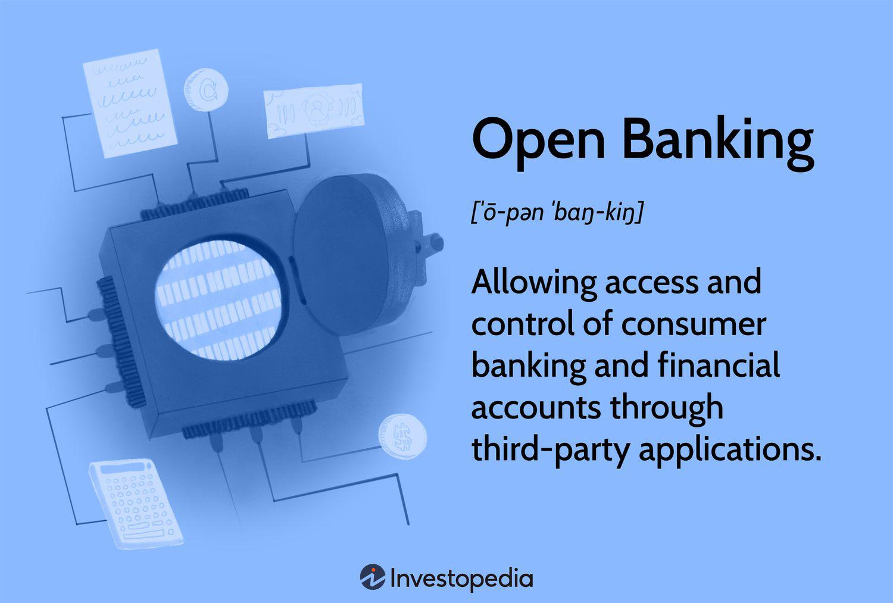

Open Banking is fundamentally transforming the financial sector by enabling a seamless connection between banks, third-party providers, and consumers through the utilization of Application Programming Interfaces (APIs). This innovative framework allows financial data to be shared more freely and securely than ever before, fostering a new wave of personalized and competitive financial services. By providing third-party financial service providers access to consumer banking and transaction data, Open Banking encourages a broad spectrum of financial innovations that have the potential to benefit both consumers and the financial industry.

However, alongside these promising advancements, Open Banking introduces significant risks related to financial data security and privacy. As banking data becomes more interconnected and accessible, safeguarding sensitive information becomes increasingly complex. This complexity is exacerbated by the introduction of algorithmic trading—a form of trading that leverages computer algorithms to make high-speed trading decisions based on real-time market data. The intersection of Open Banking and algorithmic trading intensifies the challenge of managing data integrity, confidentiality, and security.

This article will explore these complexities, focusing on the potential risks posed by Open Banking and algorithmic trading. By examining the current landscape of financial technology, we aim to inform stakeholders—be they consumers, financial institutions, or regulatory bodies—of the challenges and necessary safeguards that must be implemented to protect financial data. Understanding these dynamics is critical for ensuring that the benefits of Open Banking are realized without compromising the security and privacy of consumers' financial information.

## Table of Contents

## Understanding Open Banking

Open Banking is a groundbreaking initiative that allows third-party financial service providers to access consumers' banking and transaction data. This access is facilitated through the use of Application Programming Interfaces (APIs), a set of tools that enable different software applications to communicate with each other. By integrating with APIs, consumers can securely share their financial information with authorized third-party developers, leading to the creation of innovative financial services and products.

The implementation of Open Banking facilitates a more dynamic and competitive financial landscape. It empowers consumers with more personalized financial services tailored to their individual needs and circumstances. For instance, users can benefit from customized financial advice, easier comparisons between banking products, and more efficient management of personal finances. This increased access to data allows for unprecedented personalization, enabling consumers to receive precisely targeted financial solutions that align with their spending habits, savings goals, and investment strategies.

Moreover, Open Banking propels the banking industry toward technological advancement. Traditional banks are compelled to enhance their digital offerings and improve customer service to remain competitive against tech-savvy challenger banks and fintech firms. This trend encourages continuous innovation within the sector, leading to the development of more efficient processes and user-friendly banking applications.

However, while Open Banking provides considerable benefits, it simultaneously raises significant concerns regarding data privacy and security. With multiple entities involved in accessing and processing sensitive consumer data, the potential for data breaches and unauthorized access increases. Ensuring the confidentiality, integrity, and availability of financial data becomes paramount to protecting consumers and maintaining their trust in the financial system. Effective security measures must be implemented to mitigate these risks, such as robust authentication protocols, encryption, and secure data storage practices.

In summary, Open Banking establishes a transformative framework in the financial industry by facilitating data sharing and innovation. Although it holds the promise of enhanced, personalized services, it also necessitates meticulous attention to data security and privacy concerns to safeguard consumer trust.

## Promises and Potentials of Open Banking

Open Banking is poised to transform the financial industry by offering consumer-centric services that promise significant benefits. One of its primary advantages is facilitating personalized financial services. By granting third-party providers access to consumer banking data through secure APIs, Open Banking enables the creation of bespoke financial advice and management tools. This level of personalization can help consumers better manage their finances, optimize investments, and achieve financial goals more efficiently.

Another potential benefit of Open Banking is the simplification of bank switching. Traditionally, transferring accounts or services between banks involved cumbersome processes and potential financial disruptions. Open Banking streamlines this process by allowing seamless data sharing between institutions, significantly reducing the barriers for consumers wishing to explore better banking options. This increased ease of switching is likely to compel banks to offer more competitive services to retain their customers.

Furthermore, Open Banking encourages the development of enhanced financial products. By utilizing shared consumer data, banks and fintech companies can design services that offer better interest rates and lending options tailored to individual financial profiles. For instance, a bank could analyze a consumer's spending patterns and credit history to offer a personalized loan with favorable terms, thereby improving the borrower's financial health while minimizing risk for the lender.

Lenders particularly stand to gain from the insights provided by Open Banking. With access to comprehensive financial data, lenders can more accurately assess a consumer's financial situation, leading to improved risk assessment and loan terms. This capability not only benefits consumers through potentially lower interest rates but also helps financial institutions minimize default risks.

Additionally, Open Banking is catalyzing a technological evolution among traditional banks. The pressure to innovate in response to fintech competition is pushing these institutions to adopt new technologies and upgrade their digital offerings. As a result, banks are investing in more robust digital platforms and enhancing cybersecurity measures, ultimately delivering superior service to consumers.

In summary, Open Banking holds the promise of revolutionizing the financial sector by enhancing consumer services, fostering competitive markets, and driving necessary technological advancements in traditional banking practices. These developments are expected to significantly benefit both consumers and financial institutions, provided that data security and privacy are adequately managed.

## Risks of Open Banking

Open Banking, while offering numerous benefits, presents distinct challenges concerning data security and privacy. The interoperability of systems in Open Banking heightens the risk of data breaches. The integration of multiple entities—banks, third-party providers, and consumer interfaces—can create vulnerabilities within the network. These points of entry, if not adequately secured, may be exploited by hackers to access sensitive financial information. Such breaches can result in significant financial and reputational damage, both for consumers and financial institutions.

In addition to external threats, the potential for insider threats exists due to the increased access to sensitive information by various service providers. Employees or contractors with privileged access might intentionally or unintentionally misuse or expose financial data, making robust internal controls and monitoring essential.

Market consolidation is another risk arising from the Open Banking paradigm. The aggregation of vast amounts of data by a few large entities could lead to anti-competitive behavior, ultimately driving up costs for consumers. The consolidation can reduce the diversity of financial service providers, limiting consumer choice and leading to scenarios where a few large players dominate the market. Furthermore, powerful players might leverage network effects and big data analytics to offer targeted pricing that could disadvantage specific consumer segments.

The use of third-party applications, essential to the Open Banking ecosystem, also poses inherent risks. These apps often connect directly to users’ bank accounts and require high levels of security to prevent unauthorized access and data misuse. Should these applications lack stringent security protocols, they can become a weak link in the data security chain, making consumers susceptible to fraud. Consequently, it is imperative that third-party providers adhere to stringent cybersecurity measures and undergo regular security audits to ensure data integrity and consumer trust. 

Securing Open Banking environments is a complex task that requires diligent oversight, regulatory compliance, and continuous technological advancement to protect against these multifaceted risks.

## Algorithmic Trading and Open Banking

Algorithmic trading, a cornerstone of modern financial markets, leverages computer algorithms to execute trading strategies at high speeds and volumes, often based on real-time data inputs. The advent of Open Banking enhances this paradigm by providing a vast repository of financial data through secure and standardized Application Programming Interfaces (APIs). This open access to financial data enables more robust and comprehensive financial analysis, allowing algorithmic traders to develop models that incorporate a wider array of data points, thus potentially increasing the accuracy and profitability of trading strategies.

However, the integration of Open Banking into [algorithmic trading](/wiki/algorithmic-trading) systems is not without its risks. The increased accessibility to sensitive financial data heightens the potential for data misuse, both by malicious actors and through unintended algorithmic errors. These risks are exacerbated by the complexity of financial data and the speed at which algorithmic trading operates, where even minor errors in data interpretation or algorithm design can lead to significant financial consequences.

For instance, an algorithm designed based on erroneous data inputs can trigger a cascade of incorrect trades, resulting in substantial financial losses. Furthermore, the reliance on automated systems also introduces risks of 'black box' scenarios, where the decision-making processes of complex algorithms become opaque even to their developers, complicating efforts to diagnose and rectify errors. 

Balancing the innovation brought by Open Banking with necessary security measures is critical to mitigate such inherent risks. Financial institutions and trading platforms must invest in advanced data analytics and cybersecurity technologies to protect against data breaches and ensure the integrity of algorithmic trading systems. This includes developing robust algorithms that incorporate error-checking and redundancy measures, as well as implementing continuous monitoring systems capable of detecting and responding to anomalies in real-time.

Furthermore, ethical considerations and regulatory compliance must be emphasized to safeguard consumer data. The use of financial data must be transparent and consensual, adhering to privacy standards that protect consumer interests. Open Banking initiatives must continue to evolve, aligning technological advancements with comprehensive security frameworks to ensure that the potential benefits for algorithmic trading are realized without compromising data integrity or consumer trust.

## Regulatory Framework and Safety Measures

Regulatory bodies worldwide are actively developing and enforcing guidelines to ensure that Open Banking systems are secure, reliable, and protect consumer interests. These regulations are essential for fostering trust and enabling the safe advancement of financial technologies.

One critical element of the regulatory framework is Strong Customer Authentication (SCA), which is designed to enhance the security of electronic payments. SCA typically requires multi-[factor](/wiki/factor-investing) authentication, which uses two or more independent factors from the following categories: knowledge (something the user knows), possession (something the user has), and inherence (something the user is). This reduces the risk of unauthorized access to financial accounts and data.

Another fundamental measure is the encryption of data transfers. Encrypted data ensures that sensitive financial information remains secure when shared between banks, third-party providers, and consumers. Encryption works by converting data into a code, which can only be decrypted by authorized parties possessing the correct key. This makes it significantly more difficult for cybercriminals to intercept and read the data.

Explicit consent from consumers is also mandated by regulatory guidelines. Consumers must have clear options and controls regarding which data they choose to share and with whom. This consent mechanism not only protects consumer privacy but also empowers them to have greater control over their personal data.

Furthermore, continuous monitoring and regular security audits are vital for maintaining the integrity of Open Banking systems. Continuous monitoring involves real-time analysis of system activities to detect and respond to anomalies or security threats swiftly. Security audits, on the other hand, involve comprehensive reviews and tests of the systems to identify and rectify vulnerabilities. These audits can be conducted by internal teams or independent third-party organizations to ensure unbiased evaluations.

These regulatory measures collectively uphold the security and trustworthiness of Open Banking ecosystems, paving the way for a secure and innovative financial future.

## Balancing Innovation with Security

Open Banking's future success depends significantly on the delicate balance between data privacy management and technological advancement. This balance is pivotal in establishing a robust framework that not only safeguards sensitive financial information but also encourages innovation, thereby maintaining consumer confidence and trust.

One of the primary responsibilities of financial institutions within the Open Banking ecosystem is to implement comprehensive security measures. These measures are crucial in protecting against the array of evolving threats that accompany increased data accessibility and sharing. Institutions must stay ahead of potential breaches by adopting advanced encryption technologies and secure authentication processes. Additionally, continuous monitoring and vulnerability assessments are essential to identify and mitigate security risks proactively.

Ethical data use and responsible integration of [artificial intelligence](/wiki/ai-artificial-intelligence) (AI) are crucial for sustaining consumer trust. As AI becomes increasingly integral to delivering personalized financial services, it is vital to ensure that AI systems are transparent and that their decision-making processes comply with ethical guidelines. This includes avoiding algorithmic biases that could lead to unfair treatment of consumers and ensuring consumer data is used solely for its intended purposes with explicit consent.

Furthermore, the development of innovative financial products should occur within the confines of stringent compliance measures. This involves adhering to established regulatory standards and fostering a culture of accountability within organizations. By doing so, financial institutions can promote secure innovation and protect consumer interests, ensuring that technological advancements translate to tangible benefits for all stakeholders.

As Open Banking continues to evolve, it is imperative for all participants within the ecosystem to prioritize security measures that protect user data while simultaneously championing innovation. By doing so, the financial industry can effectively leverage the benefits of Open Banking, promoting an environment that is both secure and conducive to technological progress.

## Conclusion

Open Banking is poised to fundamentally transform the financial landscape by significantly enhancing competition and offering more tailored services to consumers. This transformation is driven by the ability of Open Banking systems to seamlessly connect banks, third-party providers, and consumers through APIs, facilitating an unprecedented level of transparency and efficiency in financial transactions. However, as this shift unfolds, it is crucial for stakeholders across the financial ecosystem to remain acutely aware of the data security risks inherent to such an open framework. 

Emphasizing robust privacy measures, adhering to stringent regulatory compliance, and implementing technological safeguards are essential for mitigating these risks and maximizing the benefits of Open Banking. The ecosystem must prioritize strong data protection protocols, including encryption and authentication processes, to safeguard consumer information against potential breaches and misuse. This vigilance in protecting personal and financial data will be vital in maintaining consumer trust and confidence in the Open Banking model.

Moreover, financial institutions have a unique opportunity to leverage this transformative stage by adopting a responsible and innovative approach. By aligning with regulatory standards and embracing protective technologies, they can create an environment where innovation and security coexist, fostering a progressive financial landscape. Through responsible data usage and continuing to develop cutting-edge financial products, institutions can build a future that not only caters to the growing demands of consumers but also enhances the resilience of the financial sector as a whole. This balanced approach can ensure that the benefits of Open Banking are realized sustainably, benefiting both consumers and the industry at large.

## References & Further Reading

[1]: ["Open Banking: Preparing for Lift-Off"](https://www.retailinsiders.nl/docs/f0796323-0ccf-49c7-a63c-e4cb13bc7f2f.pdf) by Deloitte

[2]: Zopa, M. M., & Kumar, P. (2021). ["Open Banking: Risk and Opportunities for Banks."](https://www.researchgate.net/publication/368794312_Open_Banking_Opportunities_and_Risks) Econstor.

[3]: ["PSD2 and Open Banking Regulation: A Compliance Guide"](https://blog.finexer.com/guide-to-psd2-regulation-for-open-banking/) by Agile Payments

[4]: Harris, L. (2003). ["Trading & Exchanges: Market Microstructure for Practitioners."](https://www.amazon.com/Trading-Exchanges-Market-Microstructure-Practitioners/dp/0195144708) Oxford University Press.

[5]: Allen, H., & Hawkins, J. (2013). ["The Role of Regulatory Frameworks in Financial Stability"](https://www.semanticscholar.org/paper/E-Finance%3A-An-Introduction-Allen-McAndrews/80635409379c95f0b9a2cac39b2b45b5ac5c01e7) International Journal of Central Banking.