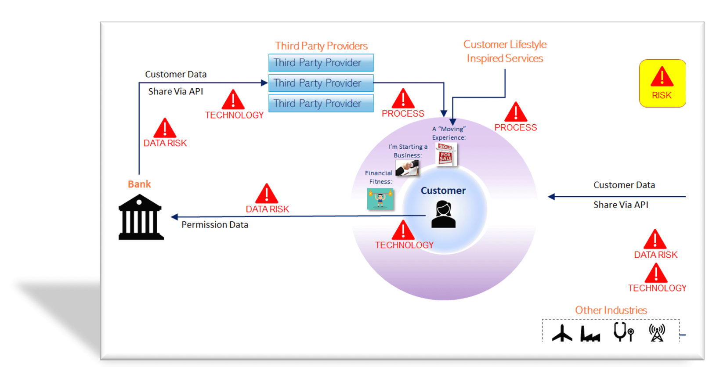

## Table of Contents

## What is open banking and how does it work?

Open banking is a system where banks and other financial institutions let other companies access their customers' financial data. This is done with the customer's permission. The idea is to help customers manage their money better by allowing other companies to create new apps and services. These services can help with things like budgeting, saving money, and even getting loans.

Open banking works by using special technology called APIs, which stands for Application Programming Interfaces. When a customer wants to use a new financial app, they give permission for the app to connect to their bank account through an API. The app can then see the customer's financial information, like their spending habits and account balances. This information helps the app provide personalized services to the customer. The whole process is safe and secure because the customer has to approve the connection, and the data is protected by strict rules.

## What are the main benefits of open banking for consumers?

Open banking offers several key benefits for consumers. One major advantage is that it gives people more control over their finances. With open banking, consumers can use different apps and services to see all their bank accounts in one place. This makes it easier to track spending, set budgets, and save money. For example, a budgeting app can show you how much you spend on groceries each month and help you plan better.

Another benefit is that open banking can help consumers find better deals on financial products. By sharing their financial data with other companies, people can get personalized offers on things like loans, credit cards, and savings accounts. This means they might find a loan with a lower interest rate or a savings account that offers a higher return. Overall, open banking helps consumers make smarter financial decisions and potentially save money.

## How does open banking improve financial services for businesses?

Open banking helps businesses by giving them a better way to manage their money. With open banking, businesses can use special apps and tools to see all their bank accounts in one place. This makes it easier for them to keep track of their cash flow, plan their budgets, and make sure they have enough money to pay their bills on time. For example, a small business owner can use an app to see how much money is coming in and going out each month, which helps them make smart decisions about spending and saving.

Another way open banking helps businesses is by making it easier for them to get loans and other financial products. When businesses share their financial data with banks and other lenders, they can get personalized offers that fit their needs. This means they might find a loan with better terms or a credit card with a lower interest rate. Open banking also helps businesses save time and money because they can handle all their banking needs through one app instead of having to visit different banks or fill out lots of paperwork.

## What are the key components of an open banking system?

The main parts of an open banking system are APIs, which let different apps and services talk to each other. APIs help banks share customer data with other companies safely. When a customer wants to use a new app, they give permission for the app to connect to their bank account through an API. This lets the app see the customer's financial information, like how much money they have and what they spend it on. The whole process is secure because the customer has to approve the connection, and the data is protected by strict rules.

Another important part of open banking is the customer's permission. Customers have to agree to let other companies see their financial data. This is called consent, and it's a big part of making sure open banking is safe and fair. Without the customer's permission, no one can access their data. This helps keep the customer's information private and secure. Open banking also needs strong security measures to protect the data that is shared between banks and other companies. These measures include things like encryption and secure connections to make sure the data stays safe.

## What are the most common APIs used in open banking?

In open banking, the most common APIs are the ones that help with getting account information and making payments. The Account Information API lets other companies see a customer's bank details, like how much money they have and what they spend it on. This API is useful for apps that help with budgeting and tracking spending. The Payment Initiation API lets customers make payments directly from their bank account to another account without using a card. This can be handy for paying bills or sending money to friends.

Another important API is the Confirmation of Funds API. This one checks if a customer has enough money in their account before they make a payment. It's often used by businesses to make sure they can get paid before they send out goods or services. All these APIs work together to make banking easier and more convenient for customers. They help share information safely and securely, with the customer's permission.

## How do banks ensure security and privacy in open banking?

Banks take several steps to make sure open banking is safe and private. They use strong security measures like encryption to protect the data that is shared between banks and other companies. Encryption scrambles the data so that only people with the right key can see it. Banks also use secure connections, like HTTPS, to make sure the data stays safe while it's being sent from one place to another. They follow strict rules, called regulations, that tell them how to handle customer data and keep it private.

Another important way banks ensure security and privacy is by making sure customers have to give permission before their data is shared. This is called consent, and it's a big part of open banking. Customers can choose which apps or companies can see their financial information, and they can change their mind at any time. Banks also keep a close eye on who is accessing the data and how it's being used. If something seems wrong, they can stop the access right away. This helps make sure that only trusted companies can use the data, and it keeps the customer's information safe and private.

## What are the potential risks associated with open banking?

Open banking can be really helpful, but it also comes with some risks. One big risk is that your personal financial information might get into the wrong hands. If a hacker breaks into a bank's system or an app that you use, they could see your bank details and use them to steal your money. Even though banks use strong security measures, there's always a chance that something could go wrong.

Another risk is that you might not fully understand what you're agreeing to when you give permission for an app to use your data. Sometimes, the terms and conditions can be long and hard to understand. If you don't read them carefully, you might accidentally give an app more access to your information than you meant to. This could lead to your data being used in ways you don't like or shared with other companies without your knowledge.

Lastly, there's a risk that the apps and services you use might not be as good as they seem. Some apps might promise to help you save money or get better deals, but they might not actually work well. If you rely on these apps for important financial decisions, you could end up making choices that aren't good for you. It's important to be careful and do your research before you start using any new financial app.

## How can consumers protect themselves from fraud in an open banking environment?

Consumers can protect themselves from fraud in open banking by being careful about which apps they use and what information they share. Always check if the app is from a trusted company and read the terms and conditions carefully before giving permission. Make sure you understand what data the app will use and how it will be used. If something seems off or too good to be true, it's better to not use that app. Also, use strong, unique passwords for your bank accounts and any apps you use, and change them regularly to keep your information safe.

Another way to stay safe is to keep an eye on your bank accounts and watch for any strange activity. If you see something you don't recognize, like a payment you didn't make, tell your bank right away. They can help you stop any fraud and get your money back. It's also a good idea to use two-factor authentication whenever you can. This adds an extra layer of security by making you enter a code sent to your phone or email before you can log in. By being careful and staying alert, you can enjoy the benefits of open banking without worrying too much about fraud.

## What regulatory frameworks govern open banking in different countries?

In the United Kingdom, open banking is governed by the Competition and Markets Authority (CMA). They made rules in 2017 that say big banks have to share customer data with other companies if the customer says it's okay. This helps make banking better for everyone. The rules also say that the data has to be kept safe and private. The UK also follows the Revised Payment Services Directive (PSD2), which is a European Union rule that helps make payments safer and easier.

In the United States, there isn't one big rule for open banking like in the UK. Instead, different rules from different places work together. The Consumer Financial Protection Bureau (CFPB) has rules about how banks can share data. There are also rules from the Federal Trade Commission (FTC) about keeping data private. Some states, like California, have their own rules too. All these rules help make sure that open banking is safe and fair for everyone.

In Australia, the government made the Consumer Data Right (CDR) law. This law says that banks have to share customer data with other companies if the customer agrees. The CDR started with banking but will also include other things like energy and telecoms. The Australian Competition and Consumer Commission (ACCC) makes sure that everyone follows the rules and that the data is kept safe.

## How does open banking impact traditional banking models?

Open banking changes the way traditional banks work by making them share customer data with other companies. Before open banking, banks kept all the customer information to themselves. Now, if a customer says it's okay, banks have to let other companies see that data too. This means banks can't be the only ones offering financial services anymore. Other companies can use the data to make new apps and services that help people manage their money better. This makes banks have to work harder to keep their customers happy and offer better services.

Because of open banking, traditional banks also have to deal with more competition. New companies can come in and offer things like budgeting apps, better loan deals, and easier ways to pay bills. This can make it harder for banks to keep their customers. But it also gives banks a chance to work with these new companies. By teaming up, banks can offer their customers even more services and stay ahead in the market. So, open banking pushes banks to change and improve, which can be good for everyone in the end.

## What are the future trends and developments expected in open banking?

In the future, open banking is expected to grow even more. More and more people will use it to manage their money better. We might see new apps and services that help with things like saving for a big purchase or finding the best deals on loans. These apps will use the data from banks to give personalized advice and make it easier for people to reach their financial goals. As more countries make rules about open banking, it will become a normal part of how we handle our money everywhere.

Another big change will be how banks and other companies work together. Banks will team up with tech companies to offer new services that they couldn't do alone. This could mean things like using your phone to pay for things without needing a card or getting instant loans based on your spending habits. The focus will be on making banking easier and more convenient for everyone. As open banking keeps growing, it will change the way we think about money and how we use it.

## How can financial institutions prepare for and adapt to the challenges of open banking?

Financial institutions can prepare for open banking by making sure they have strong technology in place. They need to use good APIs that let them share customer data safely with other companies. It's important for banks to follow the rules about open banking and keep customer data private and secure. Banks should also train their staff to understand open banking and how it works. This way, they can help customers use new apps and services without any problems. By being ready with the right technology and knowledge, banks can handle the changes that come with open banking.

To adapt to the challenges of open banking, banks need to think about working with other companies. They can team up with tech companies to offer new services that make banking easier and better for customers. This could mean creating apps that help people save money or find the best deals on loans. Banks should also listen to what their customers want and keep improving their services. By staying flexible and open to new ideas, banks can stay ahead in the market and keep their customers happy. Open banking might bring challenges, but it also gives banks a chance to grow and do better.

## References & Further Reading

[1]: ["Open Banking: Preparing for Lift-Off"](https://www.retailinsiders.nl/docs/f0796323-0ccf-49c7-a63c-e4cb13bc7f2f.pdf) by Deloitte

[2]: Zopa, M. M., & Kumar, P. (2021). ["Open Banking: Risk and Opportunities for Banks."](https://www.researchgate.net/publication/368794312_Open_Banking_Opportunities_and_Risks) Econstor.

[3]: ["PSD2 and Open Banking Regulation: A Compliance Guide"](https://blog.finexer.com/guide-to-psd2-regulation-for-open-banking/) by Agile Payments

[4]: Harris, L. (2003). ["Trading & Exchanges: Market Microstructure for Practitioners."](https://www.amazon.com/Trading-Exchanges-Market-Microstructure-Practitioners/dp/0195144708) Oxford University Press.

[5]: Allen, H., & Hawkins, J. (2013). ["The Role of Regulatory Frameworks in Financial Stability"](https://www.semanticscholar.org/paper/E-Finance%3A-An-Introduction-Allen-McAndrews/80635409379c95f0b9a2cac39b2b45b5ac5c01e7) International Journal of Central Banking.