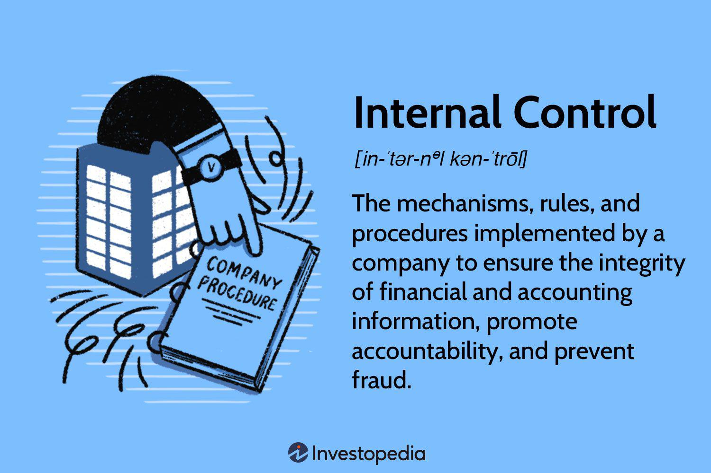

Algorithmic trading is the use of computer algorithms to automatically execute trades in financial markets. These algorithms follow predefined sets of rules and parameters, allowing trades to be executed at speeds and frequencies that would be impossible for a human trader. The significance of algorithmic trading today is profound, as it accounts for a substantial percentage of global trading volume. Its efficiency, speed, and ability to analyze vast amounts of market data enable traders and institutions to capitalize on small price fluctuations across various asset classes. This capability has drastically reduced transaction costs, increased market liquidity, and enhanced price discovery processes.

In financial markets, the term "open" can refer to multiple concepts. For instance, the "market open" signifies the commencement of trading activities for the day, wherein the opening price is determined based on orders accumulated after the previous market close. Similarly, "open orders" are those that have been placed but not yet executed, and "open positions" refer to active trades that have not been closed by the trader. Understanding these concepts is crucial since they directly affect trading strategies and market dynamics, especially at the start of trading sessions.



Open algo trading, or open algorithmic trading, introduces a paradigm shift by leveraging the transparency and accessibility of open systems. This approach aims to democratize trading by making algorithmic strategies available to a broader range of market participants beyond institutional investors. By utilizing open-source platforms and collaborative frameworks, open algo trading empowers retail traders and smaller financial institutions to develop and implement sophisticated trading strategies that were previously accessible only to those with significant resources. The potential of open algo trading to revolutionize trading strategies lies in its ability to provide real-time data analysis, rapid execution, and adaptability, which can fundamentally transform how traders interact with and respond to market fluctuations.

## Table of Contents

## Understanding Open in Trading

### Understanding Open in Trading

In financial markets, the concept of "open" encompasses several distinct meanings, each integral to the operation of markets and the strategies employed by traders. Understanding these definitions is crucial for navigating the trading environment effectively.

**Definition of 'Open' in Financial Contexts:**

1. **Market Open:** This term refers to the start of the trading session when a securities exchange opens for trading for the day. Market opens are pre-scheduled and mark the beginning of the period within which investors can buy and sell securities. For instance, the New York Stock Exchange opens at 9:30 AM Eastern Time.

2. **Open Orders:** These are buy or sell orders that a trader has placed but have not yet been executed or cancelled. An open order is waiting to be filled as it sits in the market either at a specific price set by the trader or at the best available rate when certain conditions are met.

3. **Open Positions:** This refers to any trading position that is currently active and has not yet been closed by a trader. An open position can reflect a trader's exposure to a particular market risk until it is closed.

**Usage of 'Open' in Trading:**

The usage of "open" particularly shines during the initial phases of the trading day. The market open represents a crucial period characterized by increased [volatility](/wiki/volatility-trading-strategies) and trading [volume](/wiki/volume-trading-strategy). As traders and institutional investors react to news and overnight developments, opening prices are established through a process of price discovery, where buyers and sellers settle on a price at which they are willing to transact.

The initial trades of the day can significantly influence market dynamics. Traders often monitor the opening tick — the very first price at which a security trades — to draw insights for their strategies. The opening typically has a cascading effect, potentially setting the tone for the entire trading session.

**Role of Opening Prices:**

Opening prices play a pivotal role in setting market trends and influencing trader strategies. These prices serve as a benchmark and reflect the aggregated sentiment and expectations of market participants at the start of the day. For technical analysts, the opening price is one of the key parameters included in candlestick charts, helping to predict future price movements based on historical data patterns.

Moreover, gaps between previous closing prices and new opening prices can indicate potential market trends. For instance, if a stock opens significantly higher than its previous close, it might suggest bullish investor sentiment. Conversely, a lower opening could signal bearish perspectives. Consequently, traders often modify their strategies based on these gaps, adjusting their positions accordingly.

In summary, the notion of "open" encompasses a variety of meanings in trading. From market openings that set the initial pace of trade, to open orders representing potential future transactions, and open positions illustrating existing market exposure, "open" remains a foundational concept within trading activities. Understanding these facets is crucial for developing informed and effective trading strategies.

## Mechanisms of Open Algo Trading

Open [algorithmic trading](/wiki/algorithmic-trading), or algo trading, relies on a robust infrastructure composed of specialized software and platforms designed to automate trading activities. The infrastructure includes a combination of advanced technologies and algorithms tailored to handle complex tasks such as market analysis, order execution, and risk management.

### Infrastructure Supporting Open Algo Trading

At the heart of open algo trading are trading platforms that offer APIs (Application Programming Interfaces) allowing traders to implement custom algorithms. Popular platforms include MetaTrader, [Interactive Brokers](/wiki/interactive-brokers-api), and the FIX protocol, which facilitate high-frequency trading and real-time data analysis. These platforms often provide historical and live market data, execution engines, and risk management tools.

Software development kits (SDKs) and libraries such as QuantLib or numpy (in Python) enable the creation of trading algorithms by providing essential tools for statistical analysis and mathematical computations. These libraries simplify complex calculations required for developing sophisticated trading strategies.

### Interaction of Algorithms with Market Opens

Algorithms are designed to automatically interact with market opens by executing trades based on pre-set criteria. These criteria can include technical indicators, price movements, and market signals detected at the start of the trading day. For example, parameters might be set to execute a buy order if a particular stock opens above a specified price. Algorithms operate by:

1. **Data Collection:** Gathering real-time data as the market opens, using APIs to access information on price, volume, and market depth.

2. **Analysis and Decision-Making:** Utilizing analytical models to interpret market conditions and determine whether the execution of a trade aligns with the predefined strategy. 

3. **Trade Execution:** Automatically sending orders to the market when conditions meet the algorithm's criteria. 

For instance, a simplified algorithm in Python might look like:

```python
import numpy as np

# Sample data input, usually pulled from a live data feed
open_prices = np.array([100, 102, 101, 103])
parameter_price = 102

# Determine trade action based on market open
trades = ["Buy" if price > parameter_price else "Hold" for price in open_prices]
print(trades)
```

### Application of Open Algo Trading

Open algo trading can be adapted to various market conditions and asset classes. In volatile markets, algorithms can manage the high-frequency trading of derivatives or equities by leveraging volatility to capture price discrepancies quickly. Such conditions may favor market-making strategies, wherein algorithms consistently provide [liquidity](/wiki/liquidity-risk-premium) by offering to buy and sell at competitive prices.

In stable markets, algorithms might execute [arbitrage](/wiki/arbitrage) strategies by identifying and exploiting price inefficiencies across different exchanges or asset classes. Algorithms precisely calculate the spread and execute trades in seconds, realizing small but consistent profits over a large volume of transactions.

The flexibility of open algo trading also extends to trading across diverse asset classes such as currencies, commodities, or cryptocurrencies. For each asset class, algorithms can be adjusted to consider specific market factors, such as currency exchange rates for [forex](/wiki/forex-system) trading or supply-demand dynamics in commodity markets.

In conclusion, the mechanisms of open algo trading lie in the integration of advanced software and platforms, which enable algorithms to efficiently interact with market openings, making decisions that optimize trade execution across various market conditions and asset classes.

## Types of Open Algo Trading Strategies

Algorithmic trading utilizes predefined rules and automated processes to execute trades, thus capitalizing on the speed and efficiency provided by computer algorithms. Within this landscape, various strategies are employed to optimize returns and minimize risks. These strategies, enhanced by open algorithmic trading, allow for real-time execution and precise data analysis, offering traders significant advantages.

**Market-Making Strategy**

Market-making involves providing liquidity to the market by simultaneously buying and selling a security to profit from the bid-ask spread. In open algo trading, this strategy can leverage real-time data analysis to make rapid decisions that balance inventory risk with profit maximization. Algorithms assess current market conditions and dynamically adjust quotes to maintain consistent order flow. This capability reduces slippage and increases the likelihood of favorable trade execution. Through Python, a simplistic representation of such a strategy could involve:

```python
def market_make(symbol, spread):
    bid_price = get_market_bid(symbol) - (spread / 2)
    ask_price = get_market_ask(symbol) + (spread / 2)
    place_order('buy', symbol, bid_price, quantity=desired_amount)
    place_order('sell', symbol, ask_price, quantity=desired_amount)
```

**Arbitrage Strategy**

Arbitrage opportunities arise when price discrepancies exist between different markets or instruments. Open algo trading enhances arbitrage strategies by processing vast amounts of data across multiple venues, swiftly detecting and executing trades to exploit these inefficiencies. Algorithms can identify price disparities within milliseconds, submit orders, and lock in profits before the market corrects itself. A notable instance is [statistical arbitrage](/wiki/statistical-arbitrage), where equities are evaluated through models to predict pricing anomalies.

**Trend-Following Strategy**

Trend-following focuses on identifying and capitalizing on asset price movements. By utilizing historical data, algorithms discern emerging trends and dynamically adjust positions to ride these trends for profit. Open algo trading compounds this strategy by employing real-time data feeds, adapting to the latest market signals, and executing trades automatically without manual intervention. Moving averages or [momentum](/wiki/momentum) indicators might form the backbone of these algorithms as they identify and exploit directional moves.

```python
def trend_follow(symbol, window):
    prices = get_historical_prices(symbol, window=window)
    moving_average = sum(prices) / window
    current_price = get_current_price(symbol)
    if current_price > moving_average:
        buy(symbol, quantity)
    elif current_price < moving_average:
        sell(symbol, quantity)
```

**Case Studies in Open Algo Trading**

Case studies underscore the success of open algo trading strategies across different contexts:

1. **Renaissance Technologies**: Known for their Medallion Fund, they utilize complex statistical models—a sophisticated form of arbitrage—that contribute to their outperforming returns.

2. **Jump Trading**: As a proprietary trading firm, they employ advanced market-making strategies and data-driven decision-making to ensure liquidity and minimal market impact, showcasing the utility of open algo trading in diverse asset classes.

In these instances, the implementation of open algo trading strategies has led to enhanced trading efficiency, reduced operational latency, and increased profitability, highlighting the transformative potential of technology-driven trading approaches.

## Challenges and Considerations

Open algorithmic trading, while transformative, presents several challenges that must be addressed to achieve optimal performance and mitigate risks. 

Data accuracy is a fundamental element in open algo trading. Algorithms rely heavily on historical and real-time data to make informed decisions, and any discrepancies or inaccuracies can lead to erroneous trades. Traders need to implement robust data validation processes to ensure the integrity of the data being fed into their systems. Additionally, the quality of data sources and the timeliness of data updates are crucial for maintaining high decision-making accuracy.

Latency, the delay between data occurrence and processing, poses another significant challenge. Even slight delays can affect the execution of trades, especially in high-frequency trading scenarios where milliseconds can determine the success or failure of a strategy. To mitigate this, traders can invest in high-speed networks and co-located servers, which minimize the physical distance to exchanges and reduce latency.

Market volatility can dramatically impact open algo trading strategies. Rapid price fluctuations may trigger unanticipated algorithmic behavior, potentially leading to losses. Traders must design adaptive algorithms capable of handling volatility without compromising stability. One way to manage this is through the implementation of volatility filters within trading systems to adjust strategy parameters dynamically based on current market conditions.

Effective risk management is paramount in open algo trading. Rigorous [backtesting](/wiki/backtesting) is essential to ensure that algorithms perform as intended under various market conditions. Backtesting involves simulating a trading strategy using historical data to evaluate its performance and identify potential weaknesses. This process helps in optimizing parameters, reducing risk exposure, and increasing confidence in the strategy's robustness.

Regulatory considerations play a critical role in the deployment of open algo trading systems. Regulators require that trading practices adhere to guidelines designed to maintain market integrity and transparency. Traders must ensure compliance with regulations such as the Markets in Financial Instruments Directive (MiFID II) in Europe or the Dodd-Frank Act in the United States. Compliance involves thorough documentation of trading strategies, regular audits of algorithms, and the establishment of safeguards against errant behaviors, such as circuit breakers to halt trading in times of market stress.

In summary, while open algo trading offers significant advantages, it also necessitates meticulous attention to data accuracy, latency management, risk control, and regulatory adherence. Properly addressing these challenges is key to leveraging the full potential of algorithmic trading in modern financial markets.

## Future of Open Algo Trading

Open algo trading is evolving rapidly, with emerging trends such as AI and [machine learning](/wiki/machine-learning) significantly enhancing its capabilities. These technologies are enabling more sophisticated trading strategies by analyzing vast datasets in real-time, identifying patterns that would be impossible for human traders to discern. Machine learning algorithms can adapt to new information and changing market conditions, thus improving predictive accuracy and execution speed. This adaptability allows traders to harness strategies such as sentiment analysis, where algorithms assess social media and news sentiment to predict market movements.

One notable trend is the democratization of trading through open algo platforms. As these technologies become more accessible, retail investors are gaining opportunities traditionally reserved for institutional players. Platforms offering user-friendly interfaces allow individuals to deploy complex algorithms without needing advanced programming skills. This shift opens the door for increased market participation from a diverse range of traders, potentially leading to a more balanced trading environment.

The future evolution of open algo trading is likely to involve further integration of AI technologies, improving the efficiency and accuracy of trading strategies. Moreover, blockchain technology may enhance transparency and reduce fraud risks, fostering greater trust in automated trading systems.

Predicting the impact of open algo trading on global financial markets involves considering both opportunities and challenges. On one hand, increased market efficiency, liquidity, and reduced transaction costs are likely outcomes. On the other, there is a possibility of amplified market volatility due to mass algorithmic responses to market events. As these trading platforms continue to evolve, regulatory frameworks will need to adapt to ensure market stability and protect against systemic risks. This balance between innovation and regulation will play a crucial role in shaping the future of open algo trading.

## Conclusion

Open algorithmic trading represents a transformative shift in how trading strategies are developed and executed. This approach leverages algorithms that operate on open source or accessible platforms, allowing traders greater flexibility and adaptability. Open algo trading increases efficiency through automatic execution of trades based on real-time data, thereby minimizing human error and optimizing decision-making processes. Key components include the integration of diverse data sources and advanced analytics to inform strategy formulation.

Adopting open algo strategies is crucial for traders and financial institutions aiming to maintain competitiveness. Understanding these strategies not only enables more accurate predictions and interventions in market dynamics but also facilitates the development of bespoke solutions tailored to specific investment goals.

To capitalize on these benefits, traders and institutions must embrace ongoing innovation in trading technologies. This involves investing in infrastructure, acquiring the necessary technical skills, and remaining compliant with regulatory requirements. By doing so, they can effectively navigate the complexities of modern markets and leverage the potential of open algo trading to enhance profitability.

Understanding and adopting these strategies positions traders and financial institutions advantageously in an increasingly digitized financial landscape. The advancement of open algorithmic solutions offers a promising future where trading is more accessible, efficient, and informed. Traders are encouraged to explore open algo technologies actively, integrating them into their practices to better adapt to the dynamic nature of global financial markets and seize new opportunities for growth.

## References & Further Reading

[1]: Bergstra, J., Bardenet, R., Bengio, Y., & Kégl, B. (2011). ["Algorithms for Hyper-Parameter Optimization."](https://dl.acm.org/doi/10.5555/2986459.2986743) Advances in Neural Information Processing Systems 24.

[2]: ["Advances in Financial Machine Learning"](https://www.amazon.com/Advances-Financial-Machine-Learning-Marcos/dp/1119482089) by Marcos Lopez de Prado

[3]: ["Evidence-Based Technical Analysis: Applying the Scientific Method and Statistical Inference to Trading Signals"](https://www.amazon.com/Evidence-Based-Technical-Analysis-Scientific-Statistical/dp/0470008741) by David Aronson

[4]: ["Machine Learning for Algorithmic Trading"](https://github.com/stefan-jansen/machine-learning-for-trading) by Stefan Jansen

[5]: ["Quantitative Trading: How to Build Your Own Algorithmic Trading Business"](https://github.com/LucindaYa/quant-resources/blob/master/Quantitative%20Trading%20How%20to%20Build%20Your%20Own%20Algorithmic%20Trading%20Business.pdf) by Ernest P. Chan