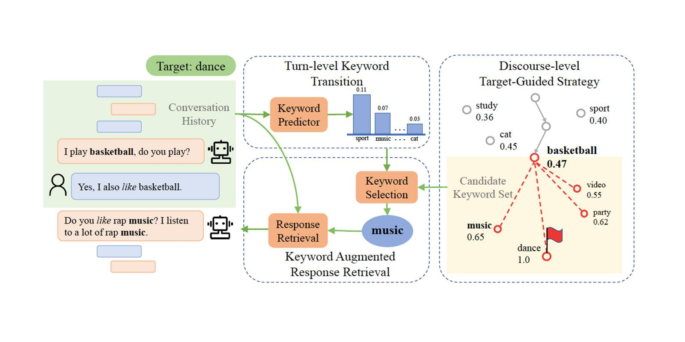

## Table of Contents

## What is an open-domain chatbot?

An open-domain chatbot is a type of conversational AI that can talk about almost any topic. Unlike chatbots designed for specific tasks, like booking flights or answering customer service questions, open-domain chatbots can have more general conversations. They use a wide range of knowledge to respond to users, making them good for casual chats or when you want to talk about different things.

These chatbots work by using large amounts of data to learn how to respond in a way that feels natural. They often use advanced language models that help them understand and generate human-like text. This makes them versatile, but it also means they might sometimes give wrong or strange answers because they are trying to cover so many topics.

## How does an open-domain chatbot differ from a closed-domain chatbot?

An open-domain chatbot is like a friend who can chat about anything. It uses a lot of information to talk about many different topics. You can ask it about the weather, movies, or even what it thinks about life. It tries to sound like a real person by using big language models that help it understand and make up answers that seem natural. But because it tries to know everything, sometimes it might say something wrong or weird.

A closed-domain chatbot, on the other hand, is more like a helpful worker at a store. It's made to do a specific job, like helping you book a flight or answering questions about a product. It knows a lot about one thing but not much about others. If you ask it something outside its job, it might not know what to say or will tell you it can't help with that. This makes it very good at its job but not so good for just chatting about anything.

Both types of chatbots use different kinds of technology to do their work. Open-domain chatbots need a lot of data and powerful computers to handle all the different topics they can talk about. Closed-domain chatbots can work well with less data because they focus on one area. This makes them easier to build and keep running, but they can't have the same kind of wide-ranging conversations as open-domain chatbots.

## What is the role of machine learning in open-domain chatbots?

Machine learning plays a big role in making open-domain chatbots work well. It helps the chatbot learn from a lot of text data to understand what people are saying and to come up with good answers. By using [machine learning](/wiki/machine-learning), the chatbot can figure out patterns in language and learn how to have a conversation that feels natural. This is done through something called a language model, which is like a smart guesser that predicts what words should come next in a sentence.

To make the chatbot even better, machine learning can be used to train it on lots of different topics. This way, it can talk about almost anything, from the weather to history. The more data the chatbot learns from, the better it gets at understanding and responding to new questions. But, because it tries to know everything, sometimes it might get things wrong or give strange answers. Still, machine learning helps the chatbot keep learning and getting better over time.

## Can you explain the basic architecture of an open-domain chatbot?

The basic architecture of an open-domain chatbot starts with a large language model. This model is trained on a huge amount of text data from the internet, [books](/wiki/algo-trading-books), and other sources. The goal is to make the chatbot understand and generate human-like text. When you talk to the chatbot, it uses this model to figure out what you're saying and to come up with a good answer. The model looks at the words you use and tries to predict what words should come next to make a sensible reply. This process is called natural language processing, and it's what makes the chatbot able to have a conversation about almost any topic.

To make the chatbot even better, it often includes other parts like a dialogue manager and a knowledge base. The dialogue manager helps keep the conversation going smoothly by remembering what was said before and figuring out what to say next. The knowledge base is like a big library of information that the chatbot can use to answer questions more accurately. For example, if you ask about the weather, the chatbot might look up the latest weather data to give you a correct answer. Together, these parts help the chatbot sound more like a real person and make the conversation more interesting and useful.

## What are some common datasets used to train open-domain chatbots?

Open-domain chatbots are trained on huge collections of text called datasets. One popular dataset is the Common Crawl, which is a big collection of web pages. This helps the chatbot learn about many different topics because it includes text from all over the internet. Another commonly used dataset is Wikipedia, which provides a lot of detailed information on many subjects. By training on Wikipedia, the chatbot can learn to answer questions more accurately and with more depth.

Other datasets that are often used include books and news articles. For example, the BookCorpus dataset contains text from thousands of books, which helps the chatbot understand longer pieces of writing and different writing styles. News articles, like those from the CNN/Daily Mail dataset, help the chatbot stay up-to-date with current events and learn how to summarize information. By using these different kinds of datasets, open-domain chatbots can become better at understanding and talking about a wide range of topics.

## How does the training process work for an open-domain chatbot like Meena?

Training an open-domain chatbot like Meena involves feeding it a lot of text data. This data comes from places like the internet, books, and other sources. The chatbot uses this data to learn how people talk and what they say. It does this by using a big language model, which is like a smart guesser that tries to predict what words should come next in a sentence. The more data the chatbot sees, the better it gets at guessing and making conversations that sound natural.

During training, the chatbot keeps trying to get better. It looks at the text it's given and tries to make its guesses more accurate. If it makes a mistake, it learns from that mistake so it can do better next time. This process is called machine learning. It's like how a person might learn from their mistakes. Over time, with lots of practice, the chatbot becomes good at understanding what people are saying and giving helpful answers. This makes it able to talk about almost any topic, just like a real person.

## What are the key performance metrics for evaluating open-domain chatbots?

Key performance metrics for evaluating open-domain chatbots include how well they understand and respond to user inputs. One important metric is the chatbot's ability to generate coherent and relevant responses. This is often measured using human evaluations, where people rate the chatbot's responses for how well they fit the conversation. Another metric is perplexity, which shows how well the chatbot can predict the next word in a sentence. A lower perplexity means the chatbot is better at guessing what comes next, making its responses more natural. 

Another key metric is the chatbot's engagement level, which looks at how long users stay in conversation with it. If users keep talking to the chatbot, it means they find the conversation interesting and useful. This can be measured by average session length or the number of turns in a conversation. Additionally, metrics like BLEU score, which compares the chatbot's responses to human responses, help measure the chatbot's language generation quality. Overall, these metrics help developers understand how well their chatbot performs and where it can be improved.

## How do techniques like transfer learning and fine-tuning apply to open-domain chatbots?

Transfer learning and fine-tuning are important techniques that help open-domain chatbots get better at understanding and talking to people. Transfer learning is like giving the chatbot a head start by using a model that's already been trained on a lot of data. Imagine if you were learning to cook, and someone gave you a bunch of recipes to start with. That's what transfer learning does for the chatbot. It uses a big language model that has learned from tons of text, so the chatbot doesn't have to start from scratch. This makes it easier and faster to train the chatbot to understand and respond to new things.

Fine-tuning then takes this a step further by adjusting the model to be even better at the specific job of being a chatbot. It's like if you took those recipes and practiced making them until you got really good at cooking. The chatbot is given more specific conversations to learn from, so it can get better at understanding what people are saying and giving helpful answers. By using transfer learning and then fine-tuning, the chatbot can become very good at having natural and useful conversations with people.

## What challenges are faced when scaling open-domain chatbots to handle diverse topics?

Scaling open-domain chatbots to handle diverse topics is tough because they need to know about a lot of different things. The more topics a chatbot can talk about, the more data it needs to learn from. This means using huge datasets like the internet, books, and news articles. But gathering and processing all this data takes a lot of time and powerful computers. Also, the chatbot has to understand and remember what it learned so it can use that knowledge to answer questions correctly. If it doesn't have enough data or if the data is not good enough, the chatbot might give wrong or strange answers.

Another challenge is making sure the chatbot can understand and respond to people in a way that feels natural. As the number of topics grows, it gets harder to keep the conversation smooth and on track. The chatbot needs to be good at figuring out what people mean, even when they use different words or ask about things it hasn't seen before. This means the chatbot has to be smart about guessing what comes next in a conversation. If it can't do this well, people might get frustrated and stop talking to it. So, developers need to keep working on making the chatbot better at understanding and talking about all kinds of topics.

## How do advanced models like Meena handle context and generate coherent responses?

Advanced models like Meena use a big language model to understand and keep track of what's being said in a conversation. This model looks at all the words that have been said before and tries to guess what words should come next. By doing this, Meena can remember what the conversation is about and make sure its answers fit well with what was said earlier. It's like how you remember what your friend said in a chat and use that to keep the conversation going smoothly.

To make its answers sound natural and make sense, Meena uses something called a transformer architecture. This helps the model look at all the words in a sentence at the same time and figure out how they relate to each other. By understanding these relationships, Meena can create responses that not only answer the question but also sound like something a real person would say. This makes the conversation feel more like talking to a friend who knows what you're talking about.

## What are the ethical considerations and potential biases in open-domain chatbots?

Open-domain chatbots can have ethical issues because they learn from a lot of text data, which can include biases. For example, if the data has more information about one group of people than another, the chatbot might treat those groups differently. This can lead to unfair answers or even harmful suggestions. Also, chatbots might say things that are not true or spread false information because they try to answer everything, even if they don't know the right answer. It's important for people who make chatbots to check the data they use and try to fix any biases they find.

Another big ethical worry is privacy. When people talk to chatbots, they might share personal information. If the chatbot doesn't keep this information safe, it could be a big problem. Also, chatbots need to be clear about what they can and can't do. If they pretend to be human or give advice on serious topics without saying they're just a machine, it can be misleading. People working on chatbots should think about these issues and try to make sure their chatbots are fair, honest, and safe for everyone to use.

## What future developments are expected in the field of open-domain chatbots?

In the future, open-domain chatbots are expected to become even better at understanding and talking like real people. They will use bigger and smarter language models that can learn from even more data. This will help them know about more topics and give more accurate and helpful answers. Also, chatbots might start to understand things like emotions and body language better, making conversations feel more natural and personal. Developers are working on ways to make chatbots learn faster and use less computer power, so they can be used on more devices and by more people.

Another big change coming for open-domain chatbots is dealing with ethical issues and biases. People are working on ways to make sure chatbots are fair and don't spread false information. They are also trying to make chatbots more private and secure, so people can trust them with personal information. In the future, chatbots might be able to explain their answers better, so users know why the chatbot said what it did. All these improvements will make open-domain chatbots more useful and trusted by everyone.

## References & Further Reading

[1]: Radford, A., Wu, J., Child, R., Luan, D., Amodei, D., & Sutskever, I. (2019). ["Language Models are Unsupervised Multitask Learners."](https://cdn.openai.com/better-language-models/language_models_are_unsupervised_multitask_learners.pdf) OpenAI.

[2]: Devlin, J., Chang, M. W., Lee, K., & Toutanova, K. (2019). ["BERT: Pre-training of Deep Bidirectional Transformers for Language Understanding."](https://aclanthology.org/N19-1423/) arXiv preprint arXiv:1810.04805.

[3]: Brown, T., Mann, B., Ryder, N., Subbiah, M., Kaplan, J., Dhariwal, P., ... & Amodei, D. (2020). ["Language Models are Few-Shot Learners."](https://arxiv.org/abs/2005.14165) arXiv preprint arXiv:2005.14165.

[4]: Zhang, Y., Sun, S., Galley, M., Chen, Y. C., Brockett, C., Gao, X., ... & Dolan, B. (2020). ["DialogPT: Large-Scale Generative Pre-training for Conversational Response Generation."](https://arxiv.org/abs/1911.00536) arXiv preprint arXiv:1911.00536.

[5]: Adiwardana, D., Luong, M. T., So, D. R., Hall, J., Fiedel, N., Thoppilan, R., ... & Le, Q. V. (2020). ["Towards a Human-like Open-Domain Chatbot."](https://arxiv.org/abs/2001.09977) arXiv preprint arXiv:2001.09977.

[6]: Vaswani, A., Shazeer, N., Parmar, N., Uszkoreit, J., Jones, L., Gomez, A. N., ... & Polosukhin, I. (2017). ["Attention is All You Need."](https://arxiv.org/abs/1706.03762) Advances in neural information processing systems.