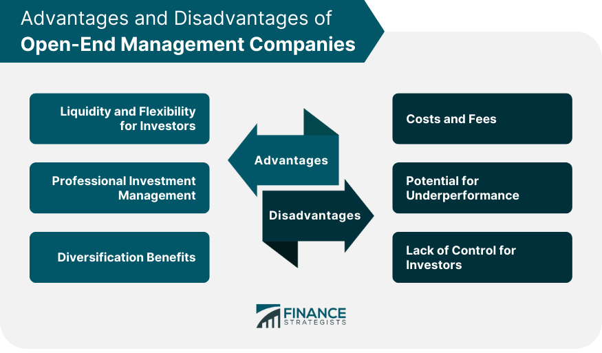

## Table of Contents

## What is an Open-End Management Company?

An Open-End Management Company is a type of investment company that manages funds, like mutual funds. It is called "open-end" because it can issue new shares and buy back old shares from investors at any time. This means the total number of shares can change based on what investors want. People like these companies because they can easily buy or sell their shares, usually at the net asset value of the fund.

These companies are managed by professionals who decide where to invest the money from all the shareholders. They might invest in stocks, bonds, or other assets. The goal is to grow the value of the fund over time. Because the number of shares can change, the price of each share is calculated daily based on the total value of all the investments in the fund. This makes open-end management companies a popular choice for people looking to invest in a managed fund.

## How does an Open-End Management Company differ from a closed-end company?

An Open-End Management Company and a closed-end company are both types of investment companies, but they work differently. An Open-End Management Company can create new shares whenever someone wants to invest. It can also buy back shares from investors who want to sell. This means the number of shares can go up or down, depending on what people want to do. The price of each share is based on the total value of all the investments in the fund, and it's calculated every day.

A closed-end company, on the other hand, has a fixed number of shares. Once it's set up, it doesn't usually create new shares or buy back old ones. The shares of a closed-end company are traded on a stock exchange, just like regular stocks. Because of this, the price of the shares can be different from the total value of the investments in the fund. It can be higher or lower, depending on what people are willing to pay for the shares.

In simple terms, the main difference is that an Open-End Management Company can change the number of shares it has, while a closed-end company keeps its shares the same. This makes open-end companies more flexible for investors who want to buy or sell shares easily, while closed-end companies might be better for investors who are okay with less flexibility but want to trade on a stock exchange.

## What are the primary functions of an Open-End Management Company?

An Open-End Management Company's main job is to manage a fund where people can invest their money. This fund is made up of different investments like stocks, bonds, or other assets. The company's professionals decide where to put the money to try to make the fund grow over time. They keep an eye on the market and make changes to the investments when needed. This way, they aim to give the best return to the people who have put their money into the fund.

Another important function is to handle the buying and selling of shares in the fund. Since it's an open-end company, it can create new shares when someone wants to invest and buy back shares when someone wants to sell. This means the number of shares can change every day. The price of each share is calculated daily based on the total value of all the investments in the fund. This makes it easy for people to get in and out of the fund whenever they want.

## Who can invest in an Open-End Management Company?

Anyone can invest in an Open-End Management Company. You don't need to be rich or have a lot of money to start. As long as you have some money to invest, you can buy shares in the fund. This makes it a good choice for many different kinds of people, from those just starting to invest to those who have been doing it for a long time.

These companies are popular because they are easy to get into and out of. If you want to invest more money, you can buy more shares. If you need your money back, you can sell your shares back to the company. This flexibility makes it a good option for people who want to manage their investments without too much hassle.

## What are the benefits of investing in an Open-End Management Company?

Investing in an Open-End Management Company has many benefits. One big advantage is that it's easy to buy and sell shares. You can put more money into the fund whenever you want by buying more shares. If you need your money back, you can sell your shares back to the company at any time. This makes it a good choice for people who want to manage their investments without too much hassle.

Another benefit is that these companies are managed by professionals. They know a lot about investing and make decisions about where to put the money to try to make the fund grow. This can be a big help if you don't have the time or knowledge to manage your investments yourself. Plus, because the price of each share is based on the total value of all the investments in the fund and is calculated every day, you know you're getting a fair price when you buy or sell.

## What are the risks associated with Open-End Management Companies?

Investing in an Open-End Management Company comes with some risks. One big risk is that the value of the fund can go up and down. This happens because the fund is made up of different investments like stocks and bonds, and their prices can change a lot. If the market goes down, the value of your shares in the fund can go down too. This means you might lose money if you need to sell your shares when the market is not doing well.

Another risk is that the professionals managing the fund might not make good choices. They decide where to invest the money, and if they pick investments that don't do well, the whole fund can suffer. This can lead to lower returns for everyone who has put money into the fund. It's important to remember that even though these professionals are experts, they can still make mistakes.

Lastly, there are fees to think about. Open-End Management Companies charge fees for managing the fund, and these fees can eat into your returns. The more fees you pay, the less money you keep from your investments. It's a good idea to look at how much the fees are before you decide to invest, so you know what you're getting into.

## How is the pricing of shares determined in an Open-End Management Company?

In an Open-End Management Company, the price of each share is figured out every day. This price is called the net asset value (NAV). To find the NAV, the company adds up the value of all the investments in the fund and then divides that total by the number of shares that people own. This way, the price of each share shows what the fund is worth at that moment.

The number of shares in an Open-End Management Company can change every day. When someone wants to invest, the company makes new shares and sells them at the current NAV. If someone wants to sell their shares, the company buys them back at the NAV too. This makes it easy for people to get in and out of the fund, but it also means the total number of shares can go up or down, which changes the NAV every day.

## What role does the management team play in an Open-End Management Company?

The management team in an Open-End Management Company is really important. They are the ones who decide where to put the money that people invest in the fund. They look at different investments like stocks, bonds, and other assets, and choose the ones they think will make the fund grow. They keep an eye on the market all the time and make changes to the investments when they think it's needed. This way, they try to make sure the fund does well and gives good returns to the people who have put their money in it.

The management team also handles the buying and selling of shares in the fund. When someone wants to invest, the team creates new shares and sells them. If someone wants to sell their shares, the team buys them back. They do all this at the net asset value (NAV), which they calculate every day. This makes it easy for people to get in and out of the fund whenever they want. The management team's job is to make sure everything runs smoothly and that the fund stays a good place for people to invest their money.

## How do Open-End Management Companies handle liquidity and redemption?

Open-End Management Companies handle liquidity and redemption by allowing investors to buy and sell shares at any time. When someone wants to invest, the company creates new shares and sells them at the current net asset value (NAV). This means the company always has enough shares to meet the demand from new investors. If the market for the fund's investments is doing well, the company can easily sell some of those investments to get cash to pay for the new shares.

When someone wants to sell their shares, the company buys them back at the current NAV. This is called redemption. The company needs to have enough cash on hand to pay for these redemptions. If too many people want to sell their shares at once, the company might need to sell some of its investments to get the cash it needs. This can be tricky if the market is not doing well, because selling investments at a bad time can hurt the value of the fund. But usually, the company manages this well to make sure it can handle both buying and selling shares smoothly.

## What regulatory requirements must Open-End Management Companies comply with?

Open-End Management Companies have to follow a lot of rules to make sure they are doing things the right way. In the United States, they are mainly regulated by the Securities and Exchange Commission (SEC). The SEC makes sure these companies follow the Investment Company Act of 1940, which sets out rules about how they can operate, what they can invest in, and how they need to report their activities. They also have to follow the rules in the Investment Advisers Act of 1940, which focuses on the people who manage the fund and make sure they are acting in the best interest of the investors.

Besides the SEC, these companies also have to follow rules from the Financial Industry Regulatory Authority (FINRA) if they are selling their shares through brokers. FINRA makes sure that the sales practices are fair and that investors are given all the information they need to make good choices. Open-End Management Companies also need to be careful about how they handle money and make sure they are not breaking any anti-money laundering laws. All these rules are there to protect investors and make sure the companies are running their funds in a safe and honest way.

## How do Open-End Management Companies manage their portfolios?

Open-End Management Companies manage their portfolios by having a team of professionals who decide where to invest the money that people put into the fund. These professionals look at different investments like stocks, bonds, and other assets. They choose the ones they think will help the fund grow and give good returns to the investors. They keep a close eye on the market and the performance of their investments. If they see that some investments are not doing well, they might sell them and buy new ones that they think will do better. This way, they try to make the best choices to keep the fund's value growing over time.

The management team also needs to make sure the portfolio stays balanced. This means they have to think about how much risk they are taking and try to spread the investments out so that if one type of investment does badly, the whole fund doesn't suffer too much. They might decide to put more money into stocks if they think the stock market will do well, or they might put more into bonds if they think the stock market is too risky. By constantly adjusting the portfolio, they aim to protect the fund from big losses and help it perform well for the people who have invested in it.

## What advanced strategies can Open-End Management Companies employ to enhance performance?

Open-End Management Companies can use some smart strategies to make their funds do better. One way is by using something called "sector rotation." This means they move money from one part of the market to another, depending on which part they think will do well next. For example, if they think technology stocks will go up, they might put more money into those. If they think energy stocks will do better, they might switch some money over to those. By doing this, they try to stay ahead of market trends and make more money for the people who invest in the fund.

Another strategy is called "active management." This means the people running the fund are always looking for the best investments. They don't just follow a set list of stocks or bonds; they pick and choose based on what they think will do well. They might use a lot of research and special tools to find good investments that others might miss. This can help the fund beat the market and give better returns to investors. But it also means the fund might cost more to run because of all the work the managers are doing.

## References & Further Reading

[1]: ["The Regulation of Open-End Management Companies under the Investment Company Act of 1940"](https://www.sec.gov/about/divisions-offices/division-investment-management/investment-company-registration-regulation-package) by the U.S. Securities and Exchange Commission

[2]: ["Algorithmic Trading: Winning Strategies and Their Rationale"](https://www.wiley.com/en-us/Algorithmic+Trading%3A+Winning+Strategies+and+Their+Rationale-p-9781118746912) by Ernest P. Chan

[3]: ["The Great Mutual Fund Trap: An Investment Recovery Plan"](https://www.amazon.com/Great-Mutual-Fund-Trap-Investment/dp/0767910729) by Gregory Baer and Gary Gensler

[4]: ["Inside the Black Box: A Simple Guide to Quantitative and High-Frequency Trading"](https://www.amazon.com/Inside-Black-Box-Quantitative-Frequency/dp/1118362411) by Rishi K. Narang

[5]: Statman, M. (2000). ["Behavioral Finance: Past Battles and Future Engagements."](https://www.researchgate.net/publication/245583234_Behaviorial_Finance_Past_Battles_and_Future_Engagements) Financial Analysts Journal, 27-44.