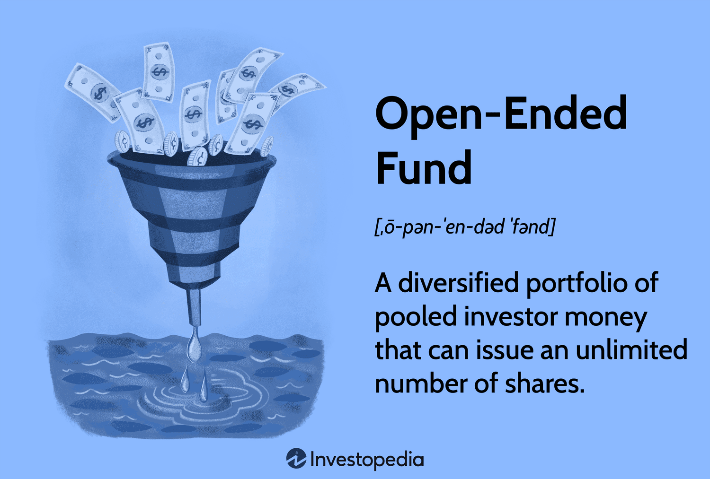

Investing in funds offers investors a streamlined approach to achieve portfolio diversification, providing exposure to a range of asset classes and markets without directly purchasing individual securities. Among the different types of funds available, open-ended funds are particularly notable for their inherent flexibility and accessibility. These funds are structured to continually issue new shares to investors and redeem them as needed, allowing for a dynamic adjustment of the fund's size according to investor demand. This characteristic not only facilitates easier entry and exit for investors but also ensures the fund's investment strategy aligns with current market conditions.

Moreover, open-ended funds play a significant role in providing liquidity and professional management, which are critical for both novice and seasoned investors aiming to optimize their portfolio performance. The adaptability of open-ended funds contrasts with the constraints of closed-ended funds, which typically have a fixed number of shares that are traded on stock exchanges. This article addresses the fundamental differences between these fund types, highlights the advantages proffered by open-ended funds, and examines the integration of algorithmic trading in fund management to enhance decision-making processes. By embracing algorithmic trading strategies, fund managers can leverage quantitative data to execute trades with greater precision, potentially improving the overall performance of the fund. As the financial landscape continues to evolve, understanding these aspects becomes increasingly crucial for making informed investment choices.



## Table of Contents

## What is an Open-Ended Fund?

An open-ended fund is a type of investment vehicle that comprises a portfolio of pooled assets, allowing continuous transactions of buying and selling shares in response to investor demand. The fundamental characteristic of open-ended funds is their ability to issue an unlimited number of shares, making them especially flexible. This feature distinguishes open-ended funds from closed-ended funds, which launch with a fixed number of shares.

The pricing of shares in an open-ended fund is based on the net asset value (NAV), calculated at the end of each trading day. NAV represents the total value of the fund's assets minus its liabilities, divided by the number of outstanding shares. This calculation ensures that investors transact at a price reflective of the fund's actual market value. Mathematically, the NAV per share can be expressed as:

$$
\text{NAV per share} = \frac{\text{Total Assets} - \text{Total Liabilities}}{\text{Number of Outstanding Shares}}
$$

This structure facilitates a fluid investment environment, as investors can seamlessly enter or exit the fund at the NAV determined at the close of each business day. As a result, open-ended funds provide broad market access and are popular for their adaptability and liquidity.

## Advantages of Open-Ended Fund Investments

Open-ended funds offer several distinct advantages that make them a compelling option for investors seeking flexibility, professional management, and [liquidity](/wiki/liquidity-risk-premium).

One of the primary benefits of investing in open-ended funds is the flexibility they offer in buying and selling shares. Investors can purchase or redeem shares directly from the fund at any time. The fund continually issues new shares and buys back existing ones based on investor demand, allowing for easy adjustments to an individual's investment strategy. This structure contrasts with closed-ended funds, which have a fixed number of shares that are traded on stock exchanges, potentially limiting the ease and timing with which investors can enter or [exit](/wiki/exit-strategy) their positions.

Moreover, open-ended funds provide professional management and diversification across various asset types, which is particularly beneficial for investors who may not have the time or expertise to manage their own portfolios. Fund managers are responsible for making investment decisions aimed at achieving the fund's objectives, leveraging their expertise and research capabilities to optimize portfolio performance. Diversification is a key aspect, as these funds typically invest in a broad range of securities, such as stocks, bonds, and other assets, thereby reducing risk by spreading investments across multiple asset classes and sectors.

Highly liquidity is another significant advantage of open-ended funds. Since investors can buy and sell shares at the net asset value (NAV) at the end of each trading day, they have the ability to access their money with relative ease compared to other investment options. This liquidity is advantageous during times of market [volatility](/wiki/volatility-trading-strategies) or personal financial need, as it provides a straightforward mechanism for investors to convert their investments into cash without the uncertainties of secondary market trading.

In summary, open-ended funds present a versatile and accessible investment vehicle through their flexible structure, expert management, and inherent liquidity, making them suitable for both new and seasoned investors looking to diversify and manage their portfolios effectively.

## Differences Between Open-Ended and Closed-Ended Funds

Closed-ended funds and open-ended funds represent two primary categories of pooled investment vehicles, each exhibiting distinct characteristics primarily related to their structure, liquidity, pricing, and investor accessibility.

Closed-ended funds are launched with a fixed number of shares and are subsequently traded on stock exchanges. This characteristic introduces a unique dynamic in comparison to open-ended funds. The fixed share structure necessitates that investors buy and sell shares through the stock market, where share prices are subject to fluctuation based on supply and demand forces, rather than strictly reflecting the net asset value (NAV) of the fund's holdings. As a result, closed-ended fund shares often trade at a premium or discount relative to their NAV.

In stark contrast, open-ended funds offer more adaptability by adjusting the number of shares in circulation according to investor demand. Investors purchase shares directly from the fund itself, and these shares are redeemed by the fund at the current NAV upon the investor's request. This results in share prices that directly correspond to the value of the fund's underlying assets, providing a more stable pricing mechanism compared to closed-ended funds.

Liquidity is another significant differentiator between these two fund types. Open-ended funds are inherently more liquid, as investors can readily buy or redeem shares at the NAV at the end of each trading day. The open-ended structure seamlessly accommodates investor withdrawals, thereby enhancing liquidity. Conversely, closed-ended funds are generally less liquid due to their reliance on secondary market transactions, which may not always align with immediate liquidity needs.

Investor access also varies between these fund structures. Open-ended funds facilitate direct participation from both retail and institutional investors without requiring an intermediary, offering broader market access. Closed-ended funds, however, often engage investment advisors or brokers for trading in secondary markets, which may pose an additional barrier for some retail investors.

In summary, while closed-ended funds are characterized by a fixed share count, exchange-based trading, and variable pricing influenced by market conditions, open-ended funds offer flexibility with share issuance and redemption based on demand, NAV-based pricing, and heightened liquidity, thus serving different investment preferences and goals.

## The Role of Algorithmic Trading in Fund Investments

Algorithmic trading has revolutionized the fund management landscape by allowing for automated decision-making based on quantitative data. This technological advancement enhances investment efficiency through rapid trade execution, reduced transaction costs, and improved accuracy. In open-ended fund management, [algorithmic trading](/wiki/algorithmic-trading) is instrumental in optimizing trading strategies and improving fund performance.

Algorithmic trading automates buying and selling decisions, capitalizing on market opportunities that would be impossible for manual processes to exploit within such short timescales. This is achieved using complex algorithms that analyze vast datasets at high speed, executing trades based on predefined criteria and market signals. Algorithms can process information such as price movements, economic indicators, and news releases, allowing them to react to market changes almost instantaneously.

An example of a basic algorithmic trading strategy might involve moving averages. For example, a simple moving average crossover strategy might involve buying when the short-term moving average exceeds the long-term moving average and selling when the opposite is true. This can be coded in Python as follows:

```python
import numpy as np
import pandas as pd

def moving_average_crossover_strategy(prices, short_window=50, long_window=200):
    signals = pd.DataFrame(index=prices.index)
    signals['price'] = prices
    signals['short_mavg'] = prices.rolling(window=short_window).mean()
    signals['long_mavg'] = prices.rolling(window=long_window).mean()
    signals['signal'] = 0.0
    signals['signal'][short_window:] = np.where(signals['short_mavg'][short_window:] > signals['long_mavg'][short_window:], 1.0, 0.0)   
    signals['positions'] = signals['signal'].diff()
    return signals

# Example usage
# prices = pd.Series(...) # your price data here
# strategy_signals = moving_average_crossover_strategy(prices)
```

The integration of [artificial intelligence](/wiki/ai-artificial-intelligence) (AI) and [machine learning](/wiki/machine-learning) further refines these strategies, enabling predictive forecasting and adaptive learning from historical and real-time data. Machine learning models can identify complex patterns and relationships in financial data, adjusting portfolios dynamically to align with predicted market trends.

For instance, machine learning models, such as neural networks or ensemble learning techniques, can be employed to forecast asset prices or volatility. These predictions help in making informed decisions on asset allocation, risk management, and timing.

Moreover, algorithmic trading enhances liquidity and transparency in open-ended funds by automating trades, thus facilitating efficient market entry and exit. However, it's essential for fund managers to continuously back-test and validate algorithms to ensure robustness and adapt to market changes, preventing algorithmic pitfalls such as overfitting data.

In conclusion, the role of algorithmic trading in fund investments is profound, contributing significantly to the enhancement of trading strategies and fund performance. Its application in open-ended funds leverages automation, AI, and machine learning to achieve superior investment outcomes.

## Real World Examples and Case Studies

The Fidelity Magellan Fund is one of the most iconic examples of an open-ended fund in the investment world. Launched in 1963, it gained significant recognition under the management of Peter Lynch from 1977 to 1990. During Lynch's tenure, the fund achieved an average annual return of 29.2%, significantly outperforming the S&P 500 index [1]. This success is attributed to Lynch’s investment philosophy, which emphasized a thorough understanding of individual companies, a strategy he famously coined as "invest in what you know” [1]. The Magellan Fund's performance exemplifies the potential of professionally managed open-ended funds to deliver substantial returns when guided by an effective investment strategy.

Algorithmic trading has become an essential component of many modern investment funds, including open-ended funds, providing a mechanism for enhancing returns and managing risk through automated processes. Leading funds employ algorithmic trading to execute large-[volume](/wiki/volume-trading-strategy) trades efficiently, reduce transaction costs, and capitalize on market trends. For example, Renaissance Technologies, known for its Medallion Fund, uses complex mathematical models and machine learning to inform trading decisions. This fund has realized an annualized return of 66% before fees between 1988 and 2018, demonstrating the potential of algorithmic strategies to outperform traditional investment methodologies [2].

Algorithmic trading employs quantitative models to analyze historical data, identify patterns, and predict future price movements. By leveraging advanced technologies such as artificial intelligence (AI) and machine learning, funds can swiftly adapt to changing market conditions and execute trades at optimal times. This agility is crucial in maintaining competitive advantages and achieving superior returns. For instance, machine learning algorithms can analyze large datasets to detect non-linear relationships and patterns that might not be apparent through conventional analyses. These insights help fund managers create more resilient and diversified portfolios [3]. 

Furthermore, algorithmic trading systems can be programmed to implement stop-loss orders, dynamically adjust leverage, and balance portfolios automatically. Python is a popular programming language used for developing these algorithms due to its libraries like NumPy, pandas, and scikit-learn, which facilitate data manipulation and predictive modeling. Here is an example of a simple Python code snippet that uses the pandas library to calculate moving averages, an essential component in trading algorithms:

```python
import pandas as pd

# Load data
data = pd.read_csv('stock_data.csv')

# Calculate moving averages
data['SMA_50'] = data['Close'].rolling(window=50).mean()
data['SMA_200'] = data['Close'].rolling(window=200).mean()

# Generate trading signals
data['Signal'] = 0
data.loc[data['SMA_50'] > data['SMA_200'], 'Signal'] = 1
data.loc[data['SMA_50'] < data['SMA_200'], 'Signal'] = -1
```

Algorithmic trading continues to reshape the strategies of open-ended funds, aiding them in navigating increasingly complex financial markets. By combining human expertise with technological innovation, open-ended funds can enhance efficiency, hedge risks, and optimize returns.

### References
1. Lynch, P., & Rothchild, J. (2000). *One Up On Wall Street: How To Use What You Already Know To Make Money In The Market*. Simon & Schuster.
2. Zuckerman, G. (2019). *The Man Who Solved the Market: How Jim Simons Launched the Quant Revolution*. Penguin Random House.
3. Narang, R. K. (2013). *Inside the Black Box: A Simple Guide to Quantitative and High-Frequency Trading*. John Wiley & Sons.

## Potential Drawbacks and Considerations

Investing in open-ended funds comes with several considerations and potential drawbacks that investors must carefully evaluate. One of the primary concerns is the management fees and expenses associated with actively managed funds. These fees can be significant and may erode overall returns over time. On average, actively managed funds tend to have higher expense ratios compared to passive funds, as they require intensive research and active portfolio management. Investors should consider these costs relative to the potential benefits of active management.

Another critical consideration is the impact of large-scale redemptions on portfolio composition and performance. Since open-ended funds can issue and redeem shares at any time, significant redemptions can force the fund manager to liquidate assets quickly to meet the cash demand. This can lead to unfavorable selling conditions and impact the overall portfolio balance, potentially leading to a lower net asset value (NAV) for remaining investors. Furthermore, during periods of market stress or volatility, redemptions might be higher, putting additional pressure on the fund's liquidity.

Understanding the underlying assets within a fund is paramount for investors. Open-ended funds often comprise a variety of asset types, such as equities, bonds, and money market instruments. Knowledge of these assets' risk and return characteristics is essential for aligning fund investments with an investor's financial goals and risk tolerance. A thorough evaluation of the fund’s holdings and strategy can help mitigate the risks associated with sector concentration or exposure to volatile market segments.

Investors must also be mindful of the fund's investment strategy and management style. The proficiency and integrity of the fund management team play a crucial role in the fund's performance. Conducting due diligence and assessing the historical performance and reputation of the management team can provide insights into the potential success of the fund.

In conclusion, while open-ended funds offer substantial benefits, such as liquidity and professional management, they are not without disadvantages. Costs, potential asset liquidation under redemption pressure, and the necessity to comprehend underlying investments highlight the importance of informed investment decisions. Investors should weigh these factors carefully in the context of their overall investment strategy.

## Conclusion

Open-ended funds offer investors a versatile and professionally managed approach to building their investment portfolios. The core benefit of such funds lies in their flexibility; they allow investors to buy and sell shares according to their financial needs, adapting to market conditions without the constraints inherent in closed-ended funds.

Algorithmic trading plays a significant role in modern investment strategies, especially within open-ended fund management. By leveraging data-driven automated decision-making processes, algorithmic trading can enhance efficiency and optimize fund performance, ensuring that investment decisions are grounded in quantitative analysis. The integration of artificial intelligence (AI) and machine learning further refines these strategies, providing insights into market trends and enabling timely adjustments to portfolios.

However, investors should carefully consider both the advantages and disadvantages associated with open-ended funds. While the potential for professional management and liquidity is attractive, the associated management fees and the impact of large-scale redemptions on fund performance cannot be overlooked. Additionally, understanding the composition of a fund's assets is essential for informed investment decisions.

Ultimately, investing in open-ended funds requires a balanced approach. By weighing the pros and cons, and aligning investment choices with their financial objectives and risk tolerance, investors can effectively leverage these funds to achieve their desired outcomes. This strategic assessment is pivotal in navigating the complexities of the investment landscape.

## References & Further Reading

[1]: Lynch, P., & Rothchild, J. (2000). *One Up On Wall Street: How To Use What You Already Know To Make Money In The Market*. Simon & Schuster.

[2]: Zuckerman, G. (2019). *The Man Who Solved the Market: How Jim Simons Launched the Quant Revolution*. Penguin Random House.

[3]: Narang, R. K. (2013). *Inside the Black Box: A Simple Guide to Quantitative and High-Frequency Trading*. John Wiley & Sons.

[4]: ["Advances in Financial Machine Learning"](https://www.amazon.com/Advances-Financial-Machine-Learning-Marcos/dp/1119482089) by Marcos Lopez de Prado

[5]: ["Quantitative Trading: How to Build Your Own Algorithmic Trading Business"](https://www.amazon.com/Quantitative-Trading-Build-Algorithmic-Business/dp/1119800064) by Ernest P. Chan

[6]: ["Evidence-Based Technical Analysis: Applying the Scientific Method and Statistical Inference to Trading Signals"](https://www.amazon.com/Evidence-Based-Technical-Analysis-Scientific-Statistical/dp/0470008741) by David Aronson

[7]: ["Machine Learning for Algorithmic Trading"](https://github.com/stefan-jansen/machine-learning-for-trading) by Stefan Jansen