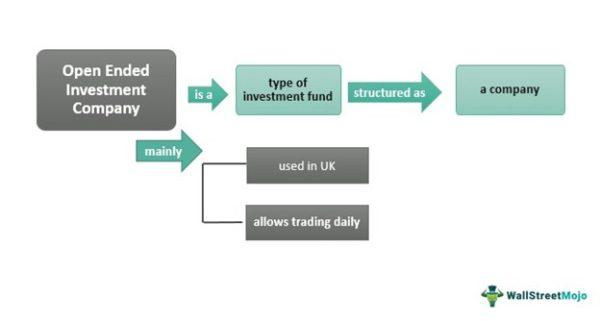

Open-Ended Investment Companies (OEICs) play a pivotal role in the UK investment landscape, offering investors flexibility paired with diverse investment opportunities. As a type of investment fund domiciled in the UK, OEICs are structured to allow the creation and redemption of shares according to investor demand, providing a high degree of liquidity. This contrasts with closed-ended funds, where shares are fixed and traded on stock exchanges, potentially leading to discrepancies between the market price and the underlying asset value. OEICs are regulated by the Financial Conduct Authority (FCA), ensuring a level of investor protection and transparency. The daily calculation of an OEIC's net asset value (NAV) further guarantees that the share price accurately reflects the value of its underlying assets.

Parallel to the rise of OEICs, algorithmic trading, commonly referred to as algo trading, has reshaped financial markets. This method employs computer algorithms to execute trading decisions at speeds and frequencies impossible for human traders. The advancement of big data, artificial intelligence, and machine learning has significantly enhanced the capabilities of algorithmic trading, making it an increasingly integral component in investment management. By leveraging data-driven insights and complex mathematical models, algorithmic trading has the potential to optimize investment strategies, reduce costs, and improve execution speeds.



The potential intersection of OEICs and algorithmic trading presents both opportunities and challenges. On one hand, integrating advanced technologies into OEIC management can streamline operations and enable more responsive and informed decision-making. Enhanced computational capabilities can support fund managers in executing strategies with precision, potentially leading to higher returns and more effective risk management. On the other hand, implementing algorithmic trading within OEICs requires navigating financial regulations and managing the risks associated with technological failures and market volatility.

As the financial landscape evolves, the convergence of traditional investment funds like OEICs with cutting-edge technology highlights the dynamic nature of modern finance. This synthesis not only impacts how funds are managed but also shapes the broader market environment in which they operate. Understanding OEICs and algorithmic trading is imperative for investors and fund managers who seek to harness these advancements for improved investment outcomes.

## Table of Contents

## What is an OEIC?

An Open-Ended Investment Company (OEIC) is an investment fund domiciled in the United Kingdom, characterized by its ability to provide investors with a diversified investment portfolio managed by professional fund managers. These investment vehicles are designed to be flexible, allowing the issuance and redemption of shares based on investor demand. This feature distinguishes OEICs from closed-ended funds, where shares are traded on the stock exchange, and the number of shares is fixed. As a result, OEICs are highly liquid, enabling investors to enter and [exit](/wiki/exit-strategy) their investment positions with relative ease.

OEICs offer a wide range of investment strategies tailored to meet the diverse needs of investors. These strategies can range from conservative approaches focused on income generation to more aggressive tactics aimed at capital growth. By offering this variety, OEICs cater to investors with different risk tolerances and financial goals.

The regulation of OEICs is overseen by the Financial Conduct Authority (FCA) in the UK, which ensures that these funds operate with a level of investor protection and reliability. FCA regulation mandates transparency and accountability, providing investors with confidence in their investment choices.

One of the key features of OEICs is the calculation of their Net Asset Value (NAV). The NAV is determined daily by dividing the total value of the fund's assets, less any liabilities, by the number of shares outstanding. This calculation provides a transparent basis for share pricing and enables investors to assess the value of their holdings accurately. The NAV can be expressed mathematically as:

$$
\text{NAV} = \frac{\text{Total Assets - Liabilities}}{\text{Number of Shares Outstanding}}
$$

This daily evaluation ensures that investors have up-to-date information regarding the performance and value of their investments, thus facilitating informed decision-making.

## Understanding Algorithmic Trading

Algorithmic trading utilizes computer algorithms to execute trading orders at remarkable speeds with minimal human intervention. These algorithms analyze vast amounts of data to make precise and efficient trading decisions. This method of trading optimizes investment strategies by employing factors such as cost reduction and enhanced execution speeds across multiple financial markets. Through its ability to process and analyze data at a high velocity, [algorithmic trading](/wiki/algorithmic-trading) allows for the execution of trades that would be unfeasible for human traders to handle efficiently.

At the core of algorithmic trading are data-driven analysis and complex mathematical models. These models can include statistical analyses, such as mean reversion strategies, which rely on the assumption that securities’ prices will revert to the mean over time. Algorithms might also incorporate [machine learning](/wiki/machine-learning) techniques, enabling the model to improve its decision-making capabilities based on historical data. The basic structure of an algorithmic trading strategy can often be represented in Python as follows:

```python
def trading_strategy(data):
    # Implement your trading logic here
    # data could be a DataFrame with historical price data

    signals = []  # To store buy/sell signals
    for index, row in data.iterrows():
        # Example: Simple moving average crossover strategy
        if row['short_moving_average'] > row['long_moving_average']:
            signals.append('buy')
        elif row['short_moving_average'] < row['long_moving_average']:
            signals.append('sell')
        else:
            signals.append('hold')
    return signals
```

Advancements in big data technologies, machine learning, and [artificial intelligence](/wiki/ai-artificial-intelligence) have propelled algorithmic trading to become more sophisticated and accessible. These technologies allow for more refined data processing, pattern recognition, and prediction capabilities, crucial for formulating effective trading strategies. Consequently, algorithmic trading not only adapts to evolving market conditions but also anticipates potential market trends and disruptions.

For Open-Ended Investment Companies (OEICs), the integration of algorithmic trading offers potential enhancements in performance, particularly in managing diversified investment portfolios. By leveraging algorithmic trading, fund managers can align investment strategies more closely with dynamic market conditions, efficiently meet their investors' financial goals, and achieve higher investment returns. The use of algorithms ensures faster trade execution and enables OEICs to capitalize on fleeting market opportunities that can significantly influence overall fund performance.

## Benefits of Combining OEICs and Algorithmic Trading

The integration of algorithmic trading into the management of Open-Ended Investment Companies (OEICs) offers numerous advantages, significantly enhancing decision-making efficiency. Algorithmic trading systems, through the use of sophisticated computer programs, can process vast amounts of data at high speeds, providing OEIC managers with the ability to manage diversified portfolios more effectively. This capability allows for rapid adjustments in response to changing market conditions, optimizing the investment strategies employed by the fund.

One of the primary benefits of algo trading within OEICs is the reduction of human errors during trade execution. By automating processes that would otherwise require human intervention, the potential for mistakes during trading is minimized. This automation also leads to improved transaction speeds, which are critical in ensuring that trades are executed at the most advantageous prices, thereby enhancing the overall performance of the fund.

Moreover, algorithmic trading can contribute to lowering the trading costs for OEICs. By efficiently managing order flow and implementing cost-effective execution strategies, algo trading systems can reduce slippage and transaction fees. This is particularly crucial for OEICs, where cost management can have a direct impact on the net asset value and, consequently, on investor returns.

Access to real-time market data and predictive analytics further empowers fund managers to make informed investment decisions. By harnessing the capabilities of big data, algo trading solutions can analyze market trends and forecast future price movements with greater accuracy. Predictive analytics, powered by machine learning and artificial intelligence, provide insights that enhance risk management frameworks and align investment strategies more closely with investor objectives.

For investors, the integration of algorithmic trading within OEICs translates to potentially higher returns. This is achieved by exploiting market inefficiencies more effectively and implementing robust risk management practices. By maintaining an optimal balance between risk and return, algo trading enhances the resilience of the portfolio against market uncertainties, providing a more secure investment environment.

In conclusion, the symbiotic relationship between OEICs and algorithmic trading systems presents a compelling proposition for both fund managers and investors. The technological advancements embedded in algo trading not only streamline operations but also create a more responsive and cost-effective investment vehicle, ultimately delivering enhanced outcomes in the competitive landscape of financial markets.

## Challenges and Considerations

Algorithmic trading, while offering notable efficiencies and potential returns, presents several challenges and considerations that fund managers must navigate, especially when applied in the context of Open-Ended Investment Companies (OEICs). 

Firstly, the technological infrastructure required for algorithmic trading is inherently complex and often carries significant setup and maintenance costs. Establishing this infrastructure involves not only acquiring sophisticated hardware and software but also ensuring that these systems can handle large volumes of data and execute trades with minimal latency. This demands continuous investment in technological upgrades and cybersecurity measures to protect sensitive financial data and maintain competitive advantage.

Another critical consideration is the increased regulatory scrutiny that accompanies algorithmic trading. Regulatory bodies, such as the Financial Conduct Authority (FCA) in the UK, impose strict guidelines to ensure that the use of algorithms in trading remains fair, transparent, and does not disrupt market stability. Fund managers must stay abreast of these regulations and enforce compliance to avoid penalties and reputational damage. This includes implementing rigorous back-testing of algorithms, maintaining audit trails, and ensuring that the algorithms are free from biases that could lead to market manipulation.

Market [volatility](/wiki/volatility-trading-strategies) introduces additional layers of risk, as rapid fluctuations can lead to significant losses if algorithms fail to react appropriately. For instance, an algorithm designed to trade based on historical patterns might not perform well under unexpected market conditions, leading to potential financial discrepancies. Thus, robust risk management protocols are indispensable. These protocols could involve setting strict limits on trading volumes or using stop-loss orders to limit potential financial damage.

Staying updated with technological trends is another crucial challenge. The landscape of algorithmic trading is evolving rapidly, with advances in artificial intelligence and machine learning continually enhancing its capabilities. Fund managers must therefore invest in ongoing education and training to leverage these technologies effectively and remain competitive. Understanding the capabilities and limitations of these advancements is essential to maximizing their potential while mitigating associated risks.

Finally, it is vital that the algorithmic strategies employed align with the investment objectives of the OEIC. An algorithmic model focused on high-frequency trading might not align well with a fund's long-term growth strategy. Therefore, algorithms must be carefully tailored to ensure they support the unique goals and risk profiles of the OEICs they serve. This may involve customizing algorithms to prioritize factors such as [liquidity](/wiki/liquidity-risk-premium), sector preference, or ethical considerations, particularly for funds focusing on sustainable or socially responsible investing. 

In conclusion, while algorithmic trading offers substantial opportunities for enhancing investment strategies within OEICs, it also presents significant challenges. By effectively addressing these considerations, fund managers can better harness the potential of algorithmic trading to achieve superior outcomes for investors.

## Case Studies: Successful Integration

Open-Ended Investment Companies (OEICs) are increasingly incorporating algorithmic trading to enhance returns and manage risks more effectively. Several case studies highlight their successful integration within these investment vehicles.

One notable example involves a UK-based OEIC that employs algorithmic trading strategies to manage the complexities of volatile currency markets. This fund leverages predictive analytics and real-time data processing to execute trades with speed and precision, outperforming traditional methods. By programmatically responding to currency fluctuations, the fund minimizes losses and capitalizes on favorable movements, thereby maximizing its return on investment.

Another significant case is a fund focused on sustainable investments, which uses algorithms to align its asset selection with Environmental, Social, and Governance ([ESG](/wiki/esg-investing)) criteria. This OEIC utilizes machine learning models to assess and score potential investment opportunities against ESG benchmarks. Such a strategy not only ensures compliance with ethical investment standards but also identifies high-potential assets that contribute to long-term sustainability goals.

A critical success [factor](/wiki/factor-investing) in these examples is robust technology infrastructure. Efficient algorithmic trading requires high-speed data processing systems and secure, reliable networks to handle large volumes of transactions. Additionally, seasoned management teams proficient in both finance and advanced technology enable these OEICs to design and implement sophisticated algorithmic strategies.

These case studies demonstrate the competitive advantage gained by incorporating algorithmic trading into OEIC operations. Enhanced decision-making capabilities, improved risk management, and the ability to swiftly adapt to market conditions are clear benefits, inviting other funds to consider similar technological integrations. As algorithmic trading technologies evolve, OEICs can continue to refine their strategies for superior performance and investor satisfaction.

## Future Trends

Advancements in technology continue to redefine how Open-Ended Investment Companies (OEICs) operate, particularly through the integration of more sophisticated algorithmic trading techniques. Artificial intelligence (AI) and machine learning (ML) are playing increasingly pivotal roles in enhancing the effectiveness and precision of algorithmic strategies used by OEICs. These advancements enable the processing of vast amounts of data to uncover patterns and generate insights that were previously inaccessible, resulting in potentially more effective and informed investment decisions.

A significant development in the future landscape of OEICs involves the personalization of investment strategies. Driven by advances in AI and ML, investment approaches can be tailored to cater to individual investor preferences and financial goals. By employing algorithms that can adjust strategies based on real-time data and personal investor profiles, OEICs could offer more customized solutions, potentially leading to improved investor satisfaction and outcomes.

Collaboration between technology firms and financial institutions is set to accelerate, fostering an environment where innovation thrives. This partnership is crucial for the development of cutting-edge tools and platforms that OEICs can leverage to stay competitive. As digital technologies advance, such collaborations may lead to the emergence of integrated systems that optimize investment processes and execution.

Staying informed on emerging technologies and regulatory changes will be vital for the sustained success of OEICs. Regulatory bodies are increasingly scrutinizing the use of automated trading systems to ensure market integrity and protect investors. Therefore, fund managers must be proactive in understanding new regulatory mandates to ensure compliance while taking advantage of technological advancements. 

To effectively navigate this evolving landscape, ongoing education and adaptation are essential for fund managers and investors alike. Embracing technological change and integrating it strategically into investment operations can provide a competitive edge and align with the dynamic shifts in financial markets.

## Conclusion

The convergence of Open-Ended Investment Companies (OEICs) and algorithmic trading presents both substantial opportunities and inherent challenges for investors and fund managers. By embracing advanced technologies, OEICs can enhance their investment strategies and potentially achieve superior returns. Algorithmic trading facilitates real-time data analysis and swift execution of trades, which can optimize investment decisions and improve portfolio management. This technological integration can lead to more competitive investment outcomes, allowing OEICs to better cater to investor demands.

However, fund managers must carefully balance these algorithmic advantages with the inherent risks. Algorithmic trading systems demand robust risk management frameworks to mitigate the dangers associated with market volatility and potential system failures. Furthermore, the transparency and ethical considerations required by regulatory bodies necessitate continual vigilance.

As technological advancements in artificial intelligence and machine learning progress, they will increasingly influence the functionality of OEICs. This evolution calls for continuous learning and adaptation from fund managers to fully leverage these innovations.

Understanding the intricate dynamics of both OEICs and algorithmic trading is essential for making informed investment decisions. Investors and fund managers who stay updated on emerging technologies and regulatory changes will be well-equipped to navigate the shifting financial landscape, maximizing the gains from this synergistic convergence.

## References & Further Reading

[1]: ["Intelligent Algorithmic Trading Systems: Develop and Implement Cutting-edge AI for Algorithmic Trading Strategies"](https://www.researchgate.net/publication/378548435_Algorithmic_Trading_and_AI_A_Review_of_Strategies_and_Market_Impact) by Sourav Ghosh

[2]: Jones, C. M. (2013). ["What Do We Know About High-Frequency Trading?"](https://papers.ssrn.com/sol3/papers.cfm?abstract_id=2236201) The Review of Financial Studies, Volume 26, Issue 8, pp. 2221-2236.

[3]: ["The UK Open-Ended Investment Company Guide"](https://finbold.com/guide/the-rise-of-uks-open-ended-investment-companies/) by Deloitte

[4]: Narang, R. K. (2013). ["Inside the Black Box: The Simple Truth About Quantitative Trading"](https://www.amazon.com/Inside-Black-Box-Quantitative-Trading/dp/0470432063) Wiley Finance Series.

[5]: Kissell, R. (2013). ["The Science of Algorithmic Trading and Portfolio Management"](https://www.sciencedirect.com/book/9780124016897/the-science-of-algorithmic-trading-and-portfolio-management) Academic Press.